# Technical Specification

# 1. Introduction

## 1.1 EXECUTIVE SUMMARY

### 1.1.1 Project Overview

The repository under specification, identified as **Artifact6**, is hosted at `https://github.com/shalini690/Artifact6.git` and is owned by the GitHub user `shalini690`. At the time this Technical Specification was prepared, the repository exists in a pre-implementation initialization state: it contains a single tracked file (`README.md`, 11 bytes in size) whose entire content is the single Markdown heading `# Artifact6`. There is no source code, no package manifest, no build configuration, no test harness, no continuous integration workflow, and no architectural documentation of any kind within the repository.

The repository was created with exactly one commit — `a3789fc Initial commit` authored by `shalini690` on `2026-05-28` — on a single branch (`main`) with no tags and no stashes. Consequently, the "system" referenced throughout this Technical Specification is, at present, a named artifact without a defined feature surface, technology stack, or business charter. This Introduction therefore documents the verified facts about the repository as it currently exists, while explicitly flagging every area for which no evidentiary basis is available. The intent is to provide a truthful baseline against which future specification cycles — once project intent is articulated — can be measured.

### 1.1.2 Core Business Problem

The repository contains no problem statement, no motivation document, no business case, no domain artifacts, and no prose beyond the project's literal name. As such, no core business problem can be authoritatively documented at this time.

| Aspect | Status in Repository |
|---|---|
| Business problem statement | Not yet defined in the repository |
| Domain or industry context | Not yet defined in the repository |
| Target customer pain point | Not yet defined in the repository |
| Quantified problem indicators | Not yet defined in the repository |

### 1.1.3 Key Stakeholders and Users

The only stakeholder evidenced by the repository is the GitHub account that created and currently maintains it. There is no `CODEOWNERS` file, no `CONTRIBUTORS` registry, no `MAINTAINERS` document, and no persona or end-user documentation to suggest additional stakeholders.

| Stakeholder Category | Identity / Description |
|---|---|
| Repository Owner | GitHub user `shalini690` (sole committer of `Initial commit a3789fc`) |
| Contributors | None beyond the repository owner; commit history contains exactly one commit |
| End Users / Target Audience | Not yet defined in the repository |
| Operational / Governance Stakeholders | Not yet defined in the repository |

### 1.1.4 Expected Business Impact and Value Proposition

No value proposition, success narrative, business case, return-on-investment model, or strategic objective is documented anywhere in the repository. Expected business impact cannot be derived from the artifacts currently available, and any concrete claim regarding impact would be speculative. Definition of value proposition and business impact is a prerequisite that must be satisfied during a subsequent specification cycle once the project's intent is articulated by its owner.

## 1.2 SYSTEM OVERVIEW

### 1.2.1 Project Context

#### Business Context and Market Positioning

No business context, market analysis, competitive positioning, or product strategy material is present in the repository. The project name "Artifact6" is the only identifying signal available, and it does not, on its own, denote a domain, industry vertical, or market segment.

#### Current System Limitations

No predecessor system, legacy application, or upgrade context is referenced in the repository. There are no migration notes, no deprecation markers, no historical changelogs, and no references to systems being replaced. On the basis of available evidence, the Artifact6 repository is not replacing or upgrading any existing system; it is a new initialization.

#### Integration with Existing Enterprise Landscape

No integration manifest, no API specification, no service descriptor, no environment configuration, and no infrastructure-as-code asset exists in the repository to evidence any enterprise integration.

| Integration Dimension | Documented Evidence |
|---|---|
| Upstream system integrations | None present in repository |
| Downstream system integrations | None present in repository |
| Shared services or platforms | None present in repository |
| External APIs or data sources | None present in repository |

### 1.2.2 High-Level Description

#### Primary System Capabilities

The repository declares no system capabilities. No functional requirements, use cases, user stories, behavior specifications, feature lists, or acceptance scenarios are present in any file or in the repository's metadata.

#### Major System Components

The complete component inventory of the repository — as enumerated by `git ls-tree -r HEAD` — consists of exactly one file. There are no subdirectories, no source-code modules, no service definitions, no shared libraries, and no infrastructure components defined.

| Component | Path / Location | Status |
|---|---|---|
| `README.md` | Repository root | Placeholder containing only the heading `# Artifact6` |

#### Core Technical Approach

No technical approach can be characterized at this time. The repository contains no build manifests, no dependency declarations, no containerization assets, no CI/CD workflow definitions, and no architectural diagrams that would permit identification of programming languages, frameworks, runtimes, or architectural patterns.

| Technical Element | Evidence in Repository |
|---|---|
| Programming language(s) | None declared |
| Framework(s) or runtime(s) | None declared |
| Build / package manifest | Absent (no `package.json`, `requirements.txt`, `pyproject.toml`, `pom.xml`, `Cargo.toml`, `go.mod`) |
| Architectural pattern | Not yet defined in the repository |

### 1.2.3 Success Criteria

No success metrics, target thresholds, measurement instrumentation, or acceptance criteria are described in the repository. These artifacts must be authored as part of a subsequent specification activity before they can be incorporated into this document.

| Criterion Type | Defined? | Notes |
|---|---|---|
| Measurable objectives | No | Not yet defined in the repository |
| Critical success factors | No | Not yet defined in the repository |
| Key performance indicators (KPIs) | No | Not yet defined in the repository |
| Acceptance criteria | No | Not yet defined in the repository |

## 1.3 SCOPE

### 1.3.1 In-Scope Elements

#### Core Features and Functionalities

No feature roadmap, requirements document, backlog, or capability registry is present in the repository. By available evidence, the in-scope feature set is empty.

| Feature Category | In-Scope Items |
|---|---|
| Must-have capabilities | None declared in the repository |
| Primary user workflows | None declared in the repository |
| Essential integrations | None declared in the repository |
| Key technical requirements | None declared in the repository |

#### Implementation Boundaries

No architecture definition, persona document, market/regional scope statement, data schema, or data dictionary is present in the repository. Implementation boundaries cannot be enumerated from current artifacts.

| Boundary Dimension | Defined? | Evidence |
|---|---|---|
| System boundaries | No | No architecture definition exists |
| User groups covered | No | No persona or user-group documentation exists |
| Geographic / market coverage | No | No localization, region, or market documentation exists |
| Data domains included | No | No schema, data model, or data-dictionary artifacts exist |

### 1.3.2 Out-of-Scope Elements

Because no in-scope surface has been declared, an exhaustive out-of-scope enumeration is not feasible. However, the following high-level exclusions are verifiable directly from the current state of the repository.

| Exclusion Category | Out-of-Scope (from Current Repository State) |
|---|---|
| Implementation artifacts | All source code, configuration, and tests — none currently exist |
| Operational tooling | CI/CD pipelines, container images, deployment manifests — none currently exist |
| Documentation deliverables | Architecture diagrams, API specs, runbooks, user guides — none currently exist |
| Future-phase considerations | Cannot be enumerated until the project's intent is defined |

### 1.3.3 Repository State Snapshot

To provide an unambiguous reference for downstream sections of this Technical Specification, the verified state of the repository at the time of authoring is summarized below. The diagram visualizes the minimal current footprint alongside the categories of artifacts that are confirmed absent.

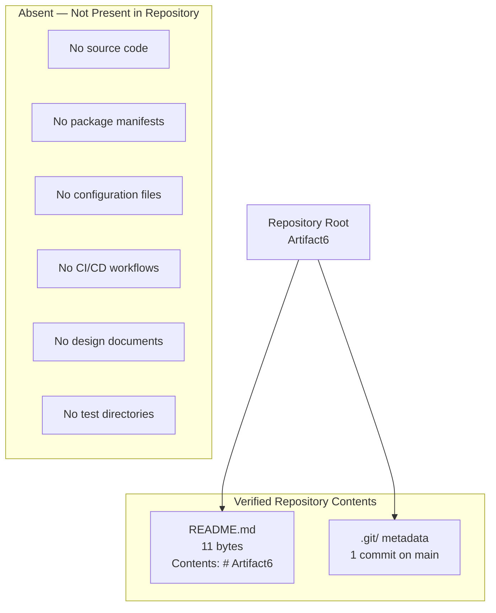

| Attribute | Value |
|---|---|
| Repository name | `Artifact6` |
| Remote origin | `https://github.com/shalini690/Artifact6.git` |
| Owner / sole contributor | GitHub user `shalini690` |
| Default branch | `main` (single branch; no other branches, no tags) |
| Total commits | 1 (`a3789fc Initial commit`, dated `2026-05-28`) |
| Total tracked files | 1 (`README.md`, 11 bytes) |
| Subdirectories | None |
| `.gitignore` | Absent |
| `.blitzyignore` | Absent |
| `.git/description` | Default placeholder text (unmodified) |

### 1.3.4 Authoring Caveat

This Introduction has been authored under conditions where the repository provides no business charter, no technical artifacts, and no scope-defining material beyond its name. Each subsection above is therefore constrained to verifiable facts about the repository's current state, with explicit "Not yet defined in the repository" markers wherever the section prompt requested content that the repository cannot evidence. Sections of the Technical Specification that follow are expected to inherit and expand upon this baseline as project intent and implementation evolve.

## 1.4 REFERENCES

### 1.4.1 Repository Files Examined

- `README.md` — The repository's sole tracked file (11 bytes). Contains only the literal text `# Artifact6` and provides no description, scope statement, or technical content. Used as the primary evidentiary source for confirming the absence of any project documentation, feature description, stakeholder list, or technical specification within the repository.

### 1.4.2 Repository Folders Examined

- `` (repository root, depth 0) — Confirmed via folder-contents inspection to contain only `README.md` as a tracked file. No subdirectories exist; no deeper traversal was possible because no nested structure is present in the repository.

### 1.4.3 Repository Metadata Inspected

- `.git/` — Inspected for branches, tags, commit history, remote configuration, repository description, and exclusion patterns. Verified a single-commit history (`a3789fc Initial commit`, 2026-05-28) on a single `main` branch with remote pointing to `github.com/shalini690/Artifact6.git`, no tags, no stashes, and default unmodified `.git/description` and `.git/info/exclude`.
- `.gitignore` — Verified absent at the repository root.
- `.blitzyignore` — Verified absent via filesystem-wide search.

### 1.4.4 Cross-Referenced Specification Sections

No other sections of this Technical Specification were available for cross-reference at the time of authoring; the section directory provided to the author was empty (`[]`). When subsequent sections are added to the specification, this Introduction should be revisited so that its forward references and scope statements can be aligned with the broader document.

# 2. Product Requirements

## 2.1 Section Authoring Basis

### 2.1.1 Evidentiary Status of Product Requirements

This Product Requirements section is authored under the same evidentiary constraints documented in Section 1.3.4 (Authoring Caveat) of this Technical Specification. As established by the verified Repository State Snapshot in Section 1.3.3, the **Artifact6** repository contains exactly one tracked file (`README.md`, 11 bytes, whose entire content is the single Markdown heading `# Artifact6`) and exhibits no source code, no package manifests, no configuration files, no test directories, no CI/CD workflows, and no design documentation.

In direct consequence of these verified absences, the repository declares no features, no functional requirements, no acceptance criteria, no user workflows, no integration points, and no implementation constraints. Therefore, this section preserves the canonical structural skeleton expected of a Product Requirements specification — to provide a stable, forward-compatible target for future enrichment — while transparently recording that each catalog, table, matrix, and relationship is empty at the time of authoring.

### 2.1.2 Documentation Approach

Each subsection below mirrors the structure prescribed by the Product Requirements section prompt and inherits the "Not yet defined in the repository" marker convention established in Sections 1.1 through 1.3. Wherever the prompt requested a populated catalog, table, or diagram, this section instead documents the verified absence of source material and identifies the schema fields that must be populated when product intent is articulated in subsequent specification cycles.

### 2.1.3 Identifier Reservation Policy

No `F-XXX` (feature) or `F-XXX-RQ-YYY` (requirement) identifiers are issued in this specification cycle. Identifier issuance is deferred until at least one feature is declared in a repository artifact (e.g., a committed requirements document, design note, or product backlog file). This policy prevents the creation of dangling identifiers that would otherwise need to be retired in a later cycle.

## 2.2 Feature Catalog

### 2.2.1 Catalog Inventory

The Artifact6 repository defines no features. No feature roadmap, requirements document, backlog, capability registry, user story collection, or behavior specification is present in any tracked file, in `.git/` metadata, or in repository configuration (verified in Sections 1.2.2 and 1.3.1). The feature catalog for this Technical Specification cycle is therefore empty.

| Feature ID | Feature Name | Feature Category | Status |
|---|---|---|---|
| Not yet defined in the repository | Not yet defined in the repository | Not yet defined in the repository | Not yet defined in the repository |

### 2.2.2 Feature Metadata Schema

The following metadata fields are reserved for population once features are introduced into the repository.

| Metadata Field | Format / Allowed Values | Current Population |
|---|---|---|
| Unique ID | `F-XXX` (three-digit zero-padded sequence) | None issued |
| Feature Name | Free-text identifier of the feature | None recorded |
| Feature Category | Free-text categorical label | None recorded |
| Priority Level | `Critical` / `High` / `Medium` / `Low` | None assigned |
| Status | `Proposed` / `Approved` / `In Development` / `Completed` | None assigned |

### 2.2.3 Feature Description Schema

Each feature, when introduced, is expected to provide an Overview, Business Value, User Benefits, and Technical Context narrative. Because the repository contains no business charter (per Section 1.1.2), no value proposition (per Section 1.1.4), no end-user or persona documentation (per Section 1.1.3), and no technical approach (per Section 1.2.2), none of these narratives can be drafted in this cycle.

| Description Field | Source Section Confirming Absence | Current Content |
|---|---|---|
| Overview | Section 1.2.2 (Primary System Capabilities) | Not yet defined in the repository |
| Business Value | Section 1.1.4 (Value Proposition) | Not yet defined in the repository |
| User Benefits | Section 1.1.3 (Key Stakeholders and Users) | Not yet defined in the repository |
| Technical Context | Section 1.2.2 (Core Technical Approach) | Not yet defined in the repository |

### 2.2.4 Feature Dependencies Schema

Feature-level dependencies (prerequisite features, system dependencies, external dependencies, and integration requirements) are reserved for population once a feature surface is declared. No package manifest, integration manifest, API specification, service descriptor, or environment configuration is present in the repository (verified in Section 1.2.1), so all dependency dimensions remain empty.

| Dependency Dimension | Source Section Confirming Absence | Current Population |
|---|---|---|
| Prerequisite Features | Section 1.3.1 (In-Scope Elements) | None — no features exist |
| System Dependencies | Section 1.2.2 (Major System Components) | None — no components declared |
| External Dependencies | Section 1.1.1 (Project Overview) | None — no package manifests present |
| Integration Requirements | Section 1.2.1 (Integration with Enterprise Landscape) | None present in repository |

## 2.3 Functional Requirements Table

### 2.3.1 Requirements Inventory

The repository defines no functional requirements. No requirement identifiers of the form `F-XXX-RQ-YYY` are issued in this cycle because no features exist from which requirements could be derived. Section 1.2.3 confirms that no acceptance criteria, KPIs, or measurable objectives are documented anywhere in the repository.

| Requirement ID | Description | Priority | Complexity |
|---|---|---|---|
| Not yet defined in the repository | Not yet defined in the repository | Not yet defined in the repository | Not yet defined in the repository |

### 2.3.2 Requirement Identification Schema

The following identifiers and classification fields are reserved for population once functional requirements are authored against a declared feature surface.

| Requirement Field | Format / Allowed Values | Current Population |
|---|---|---|
| Requirement ID | `F-XXX-RQ-YYY` (feature identifier + `-RQ-` + 3-digit sequence) | None issued |
| Description | Free-text statement of a testable requirement | None recorded |
| Acceptance Criteria | Verifiable, observable success conditions | None recorded (per Section 1.2.3) |
| Priority | `Must-Have` / `Should-Have` / `Could-Have` | None assigned |
| Complexity | `High` / `Medium` / `Low` | None assigned |

### 2.3.3 Technical Specification Schema

For each functional requirement (once authored), input parameters, output/response payloads, performance criteria, and data requirements are expected to be documented. None can be specified at this time because the repository contains no APIs, no functions, no data models, and no performance targets.

| Technical Field | Source Section Confirming Absence | Current Population |
|---|---|---|
| Input Parameters | Section 1.2.2 (Major System Components) | No APIs or functions declared |
| Output / Response | Section 1.2.2 (Major System Components) | No APIs or functions declared |
| Performance Criteria | Section 1.2.3 (Success Criteria) | No KPIs or thresholds documented |
| Data Requirements | Section 1.3.1 (Implementation Boundaries) | No schema or data dictionary exists |

### 2.3.4 Validation Rules Schema

Validation rules (business rules, data validation, security requirements, compliance requirements) are reserved for population. The repository contains no business charter, no data model, no security artifacts, and no compliance documentation.

| Validation Field | Source Section Confirming Absence | Current Population |
|---|---|---|
| Business Rules | Section 1.1.2 (Core Business Problem) | None — no business charter |
| Data Validation | Section 1.3.1 (Implementation Boundaries) | None — no data model |
| Security Requirements | Section 1.4.1 (Repository Files Examined) | None — no security artifacts |
| Compliance Requirements | Section 1.4.1 (Repository Files Examined) | None — no compliance documentation |

## 2.4 Feature Relationships

### 2.4.1 Feature Dependency Map

No feature dependency map can be constructed in this specification cycle. A dependency map presupposes a non-empty feature catalog, and Section 2.2.1 of this document verifies that the catalog is empty. The canonical visual representation of the repository's current state — including the explicit list of artifacts confirmed absent — is the Repository State Snapshot in Section 1.3.3 of this Technical Specification.

The diagram below illustrates the structural skeleton of this Product Requirements section together with the verified emptiness of each constituent collection. It is a navigational aid for this section, not a feature-level dependency graph (no such graph can yet be drawn).

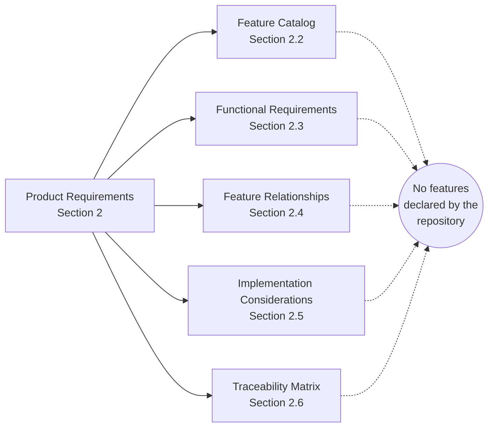

### 2.4.2 Integration Points

No integration points exist. Section 1.2.1 of this Technical Specification verifies that the repository contains no upstream integrations, no downstream integrations, no shared services or platforms, and no external APIs or data sources.

| Integration Dimension | Status in Repository |
|---|---|
| Upstream system integrations | None present in repository |
| Downstream system integrations | None present in repository |
| Shared services or platforms | None present in repository |
| External APIs or data sources | None present in repository |

### 2.4.3 Shared Components and Common Services

No shared components or common services are declared. Section 1.2.2 of this Technical Specification verifies that the repository's complete component inventory consists of a single placeholder `README.md` file with no source-code modules, service definitions, shared libraries, or infrastructure components.

| Component Class | Documented Inventory |
|---|---|
| Shared libraries | None — no source code present |
| Common services | None — no service definitions present |
| Infrastructure components | None — no infrastructure assets present |
| Cross-cutting concerns | None — no architectural artifacts present |

## 2.5 Implementation Considerations

### 2.5.1 Pre-Implementation State

Implementation considerations cannot be derived from the Artifact6 repository in this specification cycle because no implementation exists, no implementation intent is documented, and no constraints have been recorded. Section 1.1.1 establishes that the repository is in a pre-implementation initialization state with a single `Initial commit` (`a3789fc`, dated `2026-05-28`) authored by GitHub user `shalini690`.

### 2.5.2 Consideration Dimensions Reserved for Future Authoring

| Consideration Dimension | Source Section Confirming Absence | Current Population |
|---|---|---|
| Technical constraints | Section 1.2.2 (Core Technical Approach) | None — no technical approach defined |
| Performance requirements | Section 1.2.3 (Success Criteria) | None — no KPIs defined |
| Scalability considerations | Section 1.2.2 (Major System Components) | None — no components to scale |
| Security implications | Section 1.4.1 (Repository Files Examined) | None — no security artifacts |
| Maintenance requirements | Section 1.1.3 (Key Stakeholders and Users) | None — only repository owner identified |

### 2.5.3 Re-Authoring Trigger

This subsection should be revisited and populated when, at a minimum, the following preconditions have been satisfied by future commits to the repository:

- A technology stack or runtime is declared (for example, a package manifest such as `package.json`, `requirements.txt`, `pyproject.toml`, `pom.xml`, `Cargo.toml`, or `go.mod` committed to the root).
- One or more feature specifications are committed to the repository (for example, as Markdown design documents, user stories, or formal requirements files under a `docs/` or `specs/` tree).
- Quantified performance, scalability, or security targets are documented in a verifiable form (for example, SLA tables, threat models, or non-functional requirement matrices).

## 2.6 Traceability Matrix

### 2.6.1 Traceability Status

A traceability matrix maps requirements to features, to design decisions, to implementation artifacts, and to tests. Because the Artifact6 repository contains no requirements, no design decisions, no implementation, and no tests, a populated traceability matrix cannot be produced in this specification cycle.

| Traceability Axis | Identifiers Present |
|---|---|
| Feature IDs (`F-XXX`) | None issued |
| Requirement IDs (`F-XXX-RQ-YYY`) | None issued |
| Design references | None present |
| Implementation references | None present |

### 2.6.2 Matrix Template Reserved for Future Population

The following template defines the matrix structure to be populated once features and requirements are authored. It is included to fix a forward-compatible schema, not because populated rows are available.

| Requirement ID | Parent Feature ID | Implementation Reference | Test Reference |
|---|---|---|---|
| Not yet defined in the repository | Not yet defined in the repository | Not yet defined in the repository | Not yet defined in the repository |

### 2.6.3 Requirement Version Tracking

No requirements exist; consequently, no requirement versions are tracked in this specification cycle. When requirements are introduced, version tracking is expected to be performed via the git commit history of this Technical Specification document together with versioned requirement identifiers (with monotonically increasing sequence numbers under each feature).

## 2.7 Assumptions and Constraints

### 2.7.1 Documented Assumptions

| Assumption Category | Assumption | Evidentiary Basis |
|---|---|---|
| Repository state | The Artifact6 repository accurately reflects the current state of product intent | Verified via `.git/` metadata and single-file inventory (Section 1.4) |
| Authoring scope | This section documents verified absence rather than inferring requirements | Inherited from Section 1.3.4 (Authoring Caveat) |
| Future enrichment | This Technical Specification will be revised once project intent is articulated | Stated in Section 1.1.4 |
| Identifier stability | No `F-XXX` or `F-XXX-RQ-YYY` identifiers will be retroactively reassigned | Section 2.1.3 (Identifier Reservation Policy) |

### 2.7.2 Documented Constraints

| Constraint | Description | Source Section |
|---|---|---|
| Empty repository | The repository contains exactly one tracked file (`README.md`, 11 bytes) | Section 1.3.3 (Repository State Snapshot) |
| No business charter | No problem statement, value proposition, or domain context is documented | Section 1.1.2 |
| No technical baseline | No language, framework, or build manifest is declared | Section 1.2.2 |
| Single contributor | Only GitHub user `shalini690` has committed to the repository | Section 1.1.3 |

### 2.7.3 Cross-Reference to Repository State Snapshot

The canonical visual representation of the verified repository state — including the explicit list of artifacts confirmed absent — is the mermaid Repository State Snapshot in Section 1.3.3. Readers seeking the evidentiary basis for the empty catalogs, tables, matrices, and relationships in this Section 2 should refer to that snapshot together with Section 1.4 (References) for the verification methodology that confirmed the absences enumerated throughout this section.

## 2.8 References

### 2.8.1 Repository Files Examined for This Section

- `README.md` — The sole tracked file in the Artifact6 repository (11 bytes). Verified to contain only the heading `# Artifact6`. Used as the primary evidentiary source to confirm the absence of feature catalogs, requirements, acceptance criteria, business rules, validation rules, and integration manifests.
- `` (repository root, depth 0) — Verified to contain no subdirectories. Used to confirm the absence of source-code modules, configuration trees, test suites, documentation hierarchies, and CI/CD workflow files that would otherwise have anchored feature definitions and functional requirements.

### 2.8.2 Cross-Referenced Specification Sections

- **Section 1.1 EXECUTIVE SUMMARY** — Source for confirmed absence of business problem statement (1.1.2), stakeholder list beyond the repository owner (1.1.3), and value proposition (1.1.4). Anchors the Business Value and User Benefits dimensions in Section 2.2.3.
- **Section 1.2 SYSTEM OVERVIEW** — Source for confirmed absence of system capabilities, components, integration landscape, and technical approach (1.2.1, 1.2.2). Anchors the Technical Context, Integration Points, and Shared Components subsections in 2.2.3, 2.4.2, and 2.4.3.
- **Section 1.3 SCOPE** — Source for the verified empty in-scope feature set (1.3.1), out-of-scope categories (1.3.2), and canonical Repository State Snapshot diagram (1.3.3). Provides the Authoring Caveat pattern (1.3.4) mirrored in Section 2.1.
- **Section 1.4 REFERENCES** — Source for the verification methodology and the formal record of examined files, folders, and `.git/` metadata that underpins every absence documented in this section.

# 3. Technology Stack

## 3.1 SECTION AUTHORING BASIS

### 3.1.1 Evidentiary Status of the Technology Stack

This Technology Stack section is authored under the same evidentiary constraints documented in Section 1.3.4 (Authoring Caveat) and applied by Section 2.1.1 (Evidentiary Status of Product Requirements) of this Technical Specification. As established by the verified Repository State Snapshot in Section 1.3.3, the **Artifact6** repository contains exactly one tracked file (`README.md`, 11 bytes, whose entire content is the single Markdown heading `# Artifact6`) committed via a single commit (`a3789fc Initial commit`, dated `2026-05-28`) by GitHub user `shalini690` on a single branch (`main`).

The verified consequence of this state is that the repository declares **no technology stack of any kind**. Per the documented constraint enumerated in Section 2.7.2: *"No language, framework, or build manifest is declared"* (source: Section 1.2.2). Per the explicit findings in Section 1.2.2 (Core Technical Approach):

| Technical Element | Verified Evidence in Repository |
|---|---|
| Programming language(s) | None declared |
| Framework(s) or runtime(s) | None declared |
| Build / package manifest | Absent (no `package.json`, `requirements.txt`, `pyproject.toml`, `pom.xml`, `Cargo.toml`, `go.mod`) |
| Architectural pattern | Not yet defined in the repository |

In direct consequence of these verified absences, this Section 3 preserves the canonical structural skeleton expected of a Technology Stack specification — to provide a stable, forward-compatible target for future enrichment — while transparently recording that each language, framework, dependency, service, storage component, and tooling category is undeclared at the time of authoring.

### 3.1.2 Documentation Approach

Each subsection below mirrors the structure prescribed by the Section 3 prompt and inherits the **"Not yet defined in the repository"** marker convention established in Sections 1.1 through 2.8. Wherever the prompt requested a populated catalog, version table, justification narrative, or compatibility matrix, this section instead documents the verified absence of source material and identifies the schema fields that must be populated when a technology stack is declared in subsequent specification cycles.

The following authoring principles govern this section:

| Principle | Source / Justification |
|---|---|
| Verified-evidence-only declarations | Section 1.3.4 Authoring Caveat |
| No forward-issuance of technical commitments | Section 2.1.3 Identifier Reservation Policy |
| Preserve canonical structural skeleton | Section 2.1.1 Evidentiary Status |
| Use "Not yet defined in the repository" marker | Established in Sections 1.1.2, 1.1.3, 1.2.2, 1.2.3 |
| Cross-reference rather than duplicate evidence | Section 2.7.3 Cross-Reference to Repository State Snapshot |

### 3.1.3 Applicability of the Default Technology Stack

The Section 3 authoring prompt provides a Default Technology Stack enumerating candidate technologies (AWS, Docker, Terraform, GitHub Actions, Python, Flask, Auth0, MongoDB, Langchain, React with TypeScript, TailwindCSS, React-Native with TypeScript, Swift, Kotlin, Objective-C, ElectronJS). The same prompt qualifies this list with the explicit injunction: *"Only include sections and items that are actually relevant to this system, based on your analysis of its requirements. Don't add any items that aren't clearly applicable."*

Applying this qualifier against the documented state of the Artifact6 repository produces an unambiguous result: **no item from the Default Technology Stack is "clearly applicable"** because the repository declares no requirements, no features, no architecture, and no constraints against which any candidate technology could be evaluated. Specifically:

| Decision Input | Source Section | Documented State |
|---|---|---|
| Functional requirements that would constrain language/framework selection | Section 2.3 | None — no functional requirements exist |
| Feature catalog that would constrain runtime selection | Section 2.2 | None — feature catalog is empty |
| Business charter that would constrain platform selection | Section 1.1.2 | None — no business problem statement |
| Integration manifest that would constrain third-party service selection | Section 1.2.1 | None — no integrations evidenced |
| Data domains that would constrain database selection | Section 1.3.1 | None — no schema, model, or dictionary |
| Operational tooling baseline that would constrain CI/CD selection | Section 1.3.2 | None — no pipelines, images, or manifests |

Importing any item from the Default Technology Stack into this section would therefore contradict (a) the prompt's own applicability qualifier, (b) the Authoring Caveat established in Section 1.3.4, (c) the Identifier Reservation Policy in Section 2.1.3, and (d) the documented constraint in Section 2.7.2 that *"No language, framework, or build manifest is declared."* This section consequently records the verified absence of each technology category and defers actual stack selection to a future specification cycle triggered by the conditions enumerated in Section 3.9 below.

---

## 3.2 PROGRAMMING LANGUAGES

### 3.2.1 Verified Absence of Language Declarations

The Artifact6 repository contains no source code files in any programming language. The complete file inventory enumerated by `git ls-tree -r HEAD` consists of exactly one Markdown file (`README.md`), which is documentation rather than executable source. As documented in Section 1.2.2 under "Core Technical Approach," the verified state for the programming-language dimension is **"None declared."**

### 3.2.2 Language Categories Reserved for Future Authoring

The following table preserves the canonical schema expected of a Programming Languages subsection and records the verified-absence state for each category that the Section 3 prompt enumerates by platform/component. No entries are populated because no platform or component has been declared by the repository (see Section 1.2.2, Major System Components).

| Platform / Component Category | Language | Version | Selection Justification |
|---|---|---|---|
| Backend / server-side runtime | Not yet defined in the repository | Not yet defined in the repository | Not yet defined in the repository |
| Frontend / web client | Not yet defined in the repository | Not yet defined in the repository | Not yet defined in the repository |
| Mobile / cross-platform client | Not yet defined in the repository | Not yet defined in the repository | Not yet defined in the repository |
| Native iOS application | Not yet defined in the repository | Not yet defined in the repository | Not yet defined in the repository |
| Native Android application | Not yet defined in the repository | Not yet defined in the repository | Not yet defined in the repository |
| Native macOS / desktop application | Not yet defined in the repository | Not yet defined in the repository | Not yet defined in the repository |
| Data engineering / ML pipeline | Not yet defined in the repository | Not yet defined in the repository | Not yet defined in the repository |
| Infrastructure scripting | Not yet defined in the repository | Not yet defined in the repository | Not yet defined in the repository |
| Build/automation scripting | Not yet defined in the repository | Not yet defined in the repository | Not yet defined in the repository |

### 3.2.3 Language Selection Constraints and Dependencies

No language selection constraints, version-floor requirements, ABI dependencies, or runtime-compatibility obligations have been recorded in the repository. The "Selection Criteria" and "Constraints or Dependencies" content requested by the Section 3 prompt cannot be authored until at least one source file in a recognizable language is committed to the repository or until a written language-selection rationale is committed as a design document.

| Selection Criterion | Documented in Repository? |
|---|---|
| Performance / latency targets driving language choice | Not yet defined in the repository |
| Team-skill / hiring-pool considerations | Not yet defined in the repository |
| Ecosystem / library availability requirements | Not yet defined in the repository |
| Interoperability with existing systems | Not yet defined in the repository |
| Regulatory / compliance constraints | Not yet defined in the repository |

---

## 3.3 FRAMEWORKS & LIBRARIES

### 3.3.1 Verified Absence of Framework Declarations

No framework, runtime, or first-party library declaration is present in the repository. Section 1.2.2 (Core Technical Approach) explicitly records *"Framework(s) or runtime(s): None declared"* and *"Architectural pattern: Not yet defined in the repository."* Because no source code exists (Section 1.3.2, Out-of-Scope Elements), there is no `import`, `require`, `using`, or `include` statement from which a framework could be inferred indirectly.

### 3.3.2 Framework Categories Reserved for Future Authoring

| Framework Category | Selection | Version | Compatibility Requirements | Justification |
|---|---|---|---|---|
| Core backend web framework | Not yet defined in the repository | — | — | — |
| Frontend UI framework | Not yet defined in the repository | — | — | — |
| Mobile / cross-platform UI framework | Not yet defined in the repository | — | — | — |
| ORM / data-access library | Not yet defined in the repository | — | — | — |
| Authentication / authorization library | Not yet defined in the repository | — | — | — |
| Testing framework | Not yet defined in the repository | — | — | — |
| Logging / observability library | Not yet defined in the repository | — | — | — |
| AI / ML orchestration framework | Not yet defined in the repository | — | — | — |
| CSS / styling framework | Not yet defined in the repository | — | — | — |

### 3.3.3 Supporting Library Inventory

No supporting libraries, polyfills, utility packages, or first-party shared modules are present in the repository. The "Supporting libraries" content requested by the Section 3 prompt cannot be populated until a package manifest (see Section 3.4) is committed.

| Supporting Library Category | Documented? |
|---|---|
| Utility / helper libraries | Not yet defined in the repository |
| Validation libraries | Not yet defined in the repository |
| Date/time libraries | Not yet defined in the repository |
| HTTP client libraries | Not yet defined in the repository |
| Serialization libraries | Not yet defined in the repository |

---

## 3.4 OPEN SOURCE DEPENDENCIES

### 3.4.1 Verified Absence of Package Manifests

No package manifest of any ecosystem is present in the repository. This finding is explicitly recorded in Section 1.2.2 (Core Technical Approach) and reiterated by Section 2.2.4 of the Feature Catalog, which records *"None — no package manifests present"* under External Dependencies. Because the repository contains no manifest, no lockfile, no vendored directory (e.g., `node_modules/`, `vendor/`, `target/`), and no language-ecosystem cache, **zero open-source dependencies** can be enumerated.

### 3.4.2 Manifest Inventory

The following table enumerates the package-management manifests that were searched for and confirmed absent in the repository root. This table is preserved to make explicit which ecosystems would, in a future specification cycle, trigger re-authoring of this subsection (see Section 3.9).

| Manifest File | Ecosystem / Registry | Present in Repository? |
|---|---|---|
| `package.json` | npm / Node.js (npmjs.com) | No |
| `package-lock.json` | npm lockfile | No |
| `yarn.lock` | Yarn lockfile | No |
| `pnpm-lock.yaml` | pnpm lockfile | No |
| `requirements.txt` | Python pip (PyPI) | No |
| `pyproject.toml` | Python (PEP 517/518, PyPI) | No |
| `Pipfile` / `Pipfile.lock` | Python pipenv | No |
| `poetry.lock` | Python Poetry | No |
| `pom.xml` | Java / Maven Central | No |
| `build.gradle` / `build.gradle.kts` | Java / Kotlin Gradle | No |
| `Cargo.toml` / `Cargo.lock` | Rust (crates.io) | No |
| `go.mod` / `go.sum` | Go modules | No |
| `Gemfile` / `Gemfile.lock` | Ruby (RubyGems) | No |
| `composer.json` | PHP (Packagist) | No |
| `Podfile` | iOS CocoaPods | No |
| `Package.swift` | Swift Package Manager | No |
| `*.csproj` / `*.sln` | .NET / NuGet | No |

### 3.4.3 Registry, Version, and License Posture

Because no manifest exists, no registry endpoints, version pins, transitive-dependency graphs, or license obligations have been declared by the repository.

| Open-Source Dependency Attribute | Documented State |
|---|---|
| Direct dependency count | Not yet defined in the repository |
| Transitive dependency graph | Not yet defined in the repository |
| Registry endpoints used | Not yet defined in the repository |
| Version-pinning strategy | Not yet defined in the repository |
| License compliance matrix | Not yet defined in the repository |
| Vulnerability scanning policy | Not yet defined in the repository |

---

## 3.5 THIRD-PARTY SERVICES

### 3.5.1 Verified Absence of External Integrations

No external service integration is evidenced by the repository. Section 1.2.1 (Integration with Existing Enterprise Landscape) records the verified state for each integration dimension. Reproduced here for direct reference within this section:

| Integration Dimension | Documented Evidence (per Section 1.2.1) |
|---|---|
| Upstream system integrations | None present in repository |
| Downstream system integrations | None present in repository |
| Shared services or platforms | None present in repository |
| External APIs or data sources | None present in repository |

No OpenAPI/Swagger specification, no API client SDK, no service-broker configuration, no webhook handler, and no message-broker descriptor exists in the repository. As confirmed by Section 1.2.1: *"No integration manifest, no API specification, no service descriptor, no environment configuration, and no infrastructure-as-code asset exists in the repository to evidence any enterprise integration."*

### 3.5.2 Third-Party Service Categories Reserved for Future Authoring

| Service Category | Provider | Integration Pattern | Authentication / Credential Strategy |
|---|---|---|---|
| External REST / GraphQL APIs | Not yet defined in the repository | — | — |
| Authentication / identity provider | Not yet defined in the repository | — | — |
| Logging / log aggregation service | Not yet defined in the repository | — | — |
| Monitoring / APM service | Not yet defined in the repository | — | — |
| Error tracking service | Not yet defined in the repository | — | — |
| Email / notification service | Not yet defined in the repository | — | — |
| Payment processing service | Not yet defined in the repository | — | — |
| Cloud infrastructure provider | Not yet defined in the repository | — | — |
| Object / blob storage service | Not yet defined in the repository | — | — |
| Content delivery network | Not yet defined in the repository | — | — |
| AI / ML inference service | Not yet defined in the repository | — | — |

### 3.5.3 Security and Credential-Handling Posture

No credential management strategy, secrets vault configuration, OAuth client registration, or API-key handling convention is documented in the repository. Section 2.5.2 (Consideration Dimensions Reserved for Future Authoring) confirms *"None — no security artifacts"* under the Security implications row. The security implications of third-party service selection cannot therefore be analyzed at this time; analysis is deferred to the specification cycle in which the first service integration is committed.

---

## 3.6 DATABASES & STORAGE

### 3.6.1 Verified Absence of Data Persistence Artifacts

No database schema, ORM model, migration directory, seed data file, or storage configuration is present in the repository. Section 1.3.1 (Implementation Boundaries) explicitly records *"Data domains included: No — No schema, data model, or data-dictionary artifacts exist."* No `.sql` file, no Mongoose/SQLAlchemy/Hibernate/Prisma schema declaration, no `migrations/` or `alembic/` directory, no `seeds/` directory, no database connection string, and no data-source configuration is present.

### 3.6.2 Storage Categories Reserved for Future Authoring

| Storage Component | Selected Technology | Version | Persistence Strategy |
|---|---|---|---|
| Primary relational database | Not yet defined in the repository | — | — |
| Primary document / NoSQL database | Not yet defined in the repository | — | — |
| Secondary / read-replica database | Not yet defined in the repository | — | — |
| In-memory cache | Not yet defined in the repository | — | — |
| Distributed cache / session store | Not yet defined in the repository | — | — |
| Object / blob storage | Not yet defined in the repository | — | — |
| File / network storage | Not yet defined in the repository | — | — |
| Search index | Not yet defined in the repository | — | — |
| Time-series / metrics store | Not yet defined in the repository | — | — |
| Message queue / streaming platform | Not yet defined in the repository | — | — |
| Data warehouse / analytics store | Not yet defined in the repository | — | — |

### 3.6.3 Data Persistence Strategy

No data persistence strategy, backup/restore policy, disaster-recovery posture, retention schedule, or data-residency obligation has been documented. The "Data persistence strategies" content requested by the Section 3 prompt cannot be authored until at least one data-bearing artifact (schema, model, migration) is committed to the repository.

| Persistence Strategy Element | Documented? |
|---|---|
| Read/write consistency model | Not yet defined in the repository |
| Backup frequency / RPO target | Not yet defined in the repository |
| Recovery time objective (RTO) | Not yet defined in the repository |
| Data retention period | Not yet defined in the repository |
| Data residency / region constraints | Not yet defined in the repository |
| Encryption-at-rest configuration | Not yet defined in the repository |

---

## 3.7 DEVELOPMENT & DEPLOYMENT

### 3.7.1 Verified Absence of Development and Deployment Tooling

No development, build, containerization, infrastructure-as-code, or CI/CD tooling is present in the repository. Section 1.3.2 (Out-of-Scope Elements) explicitly records *"Operational tooling: CI/CD pipelines, container images, deployment manifests — none currently exist."* Section 1.1.1 reaffirms *"no continuous integration workflow, and no architectural documentation of any kind within the repository."*

### 3.7.2 Tooling Inventory

The following table enumerates the development and deployment tooling categories searched for and confirmed absent in the repository.

| Tooling Category | Representative File(s) Searched | Present in Repository? |
|---|---|---|
| Containerization — image build | `Dockerfile`, `Containerfile` | No |
| Containerization — orchestration | `docker-compose.yml`, `docker-compose.yaml` | No |
| Containerization — ignore rules | `.dockerignore` | No |
| Infrastructure as Code — Terraform | `*.tf`, `*.tfvars` | No |
| Infrastructure as Code — CloudFormation | `*.yaml`, `*.yml` templates | No |
| Infrastructure as Code — Ansible | `playbook.yml`, `inventory` | No |
| Infrastructure as Code — Helm | `Chart.yaml`, `values.yaml` | No |
| CI/CD — GitHub Actions | `.github/workflows/*.yml` | No |
| CI/CD — GitLab | `.gitlab-ci.yml` | No |
| CI/CD — Jenkins | `Jenkinsfile` | No |
| CI/CD — CircleCI | `.circleci/config.yml` | No |
| CI/CD — Azure Pipelines | `azure-pipelines.yml` | No |
| Build automation | `Makefile`, `Taskfile.yml`, `justfile`, `build.sh` | No |
| Pre-commit / linting | `.pre-commit-config.yaml`, `.eslintrc.*`, `.prettierrc` | No |
| Editor / IDE configuration | `.vscode/`, `.idea/`, `.editorconfig` | No |
| Environment configuration | `.env*`, `env.sample`, `config/` | No |
| Repository ignore rules | `.gitignore` | No (confirmed absent per Section 1.3.3) |

### 3.7.3 Categories Reserved for Future Authoring

| Development & Deployment Category | Documented State |
|---|---|
| Source control workflow / branching strategy | Single `main` branch only; no branching strategy documented (Section 1.3.3) |
| Code review / approval policy | No `CODEOWNERS` file (per Section 1.1.3) |
| Build pipeline definition | Not yet defined in the repository |
| Artifact registry / image registry | Not yet defined in the repository |
| Deployment environment topology (dev/stage/prod) | Not yet defined in the repository |
| Release / versioning strategy | No tags exist (Section 1.3.3) |
| Rollback / blue-green / canary strategy | Not yet defined in the repository |
| Observability / monitoring pipeline | Not yet defined in the repository |
| Secret management workflow | Not yet defined in the repository |
| Local development bootstrap procedure | Not yet defined in the repository |

---

## 3.8 TECHNOLOGY STACK STRUCTURAL SKELETON

### 3.8.1 Skeleton Diagram

The following diagram preserves the canonical structural skeleton of the Section 3 technology stack categories, with each category terminating at the shared "Not yet defined in the repository" sentinel node. The diagram follows the same authorial pattern established by Section 1.3.3 (Repository State Snapshot, `flowchart TD` with `subgraph` blocks distinguishing Verified vs. Absent content) and by Section 2.4.1 (use of an `Empty((...))` terminal node connected via dashed arrows to indicate verified absence).

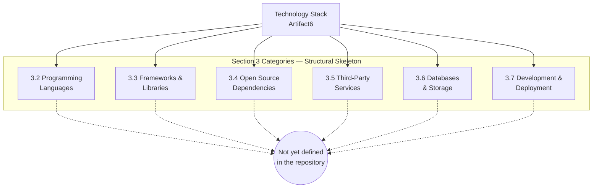

The diagram intentionally uses the same restricted mermaid syntax (`flowchart`, `subgraph`, `-->`, `-.->`, `[...]`, `((...))`, `<br/>` for line breaks) employed by the previously validated diagrams in Sections 1.3.3 and 2.4.1, to ensure compilation consistency across the Technical Specification.

### 3.8.2 Cross-Reference to Canonical Repository State

Readers seeking the underlying evidence for the absences depicted in Section 3.8.1 should consult the canonical Repository State Snapshot in Section 1.3.3, which enumerates the verified contents of the repository (`README.md`, `.git/` metadata) alongside the categories of artifacts confirmed absent (no source code, no package manifests, no configuration files, no CI/CD workflows, no design documents, no test directories). Per Section 2.7.3, that snapshot is the canonical visual representation for all empty catalogs, tables, matrices, and relationships in this Technical Specification; this Section 3 deliberately does not reproduce that diagram to avoid evidentiary duplication.

---

## 3.9 RE-AUTHORING TRIGGER

### 3.9.1 Trigger Preconditions

This Section 3 inherits and elaborates the Re-Authoring Trigger established in Section 2.5.3. Section 2.5.3 directly identifies the declaration of a technology stack as a primary trigger, specifically stating that this material should be revisited when *"A technology stack or runtime is declared (for example, a package manifest such as `package.json`, `requirements.txt`, `pyproject.toml`, `pom.xml`, `Cargo.toml`, or `go.mod` committed to the root)."*

For Section 3 specifically, the following commit-level events constitute re-authoring triggers:

| Trigger Event | Section 3 Subsection(s) Requiring Update |
|---|---|
| Source file in any declared language committed | 3.2 Programming Languages |
| Framework configuration (e.g., `next.config.js`, `vite.config.ts`, `wsgi.py`, `manage.py`, `application.properties`) committed | 3.3 Frameworks & Libraries |
| Any package manifest from the inventory in Section 3.4.2 committed | 3.4 Open Source Dependencies |
| API client SDK, OpenAPI specification, or service-broker configuration committed | 3.5 Third-Party Services |
| Database schema, ORM model, migration, or data-source configuration committed | 3.6 Databases & Storage |
| `Dockerfile`, IaC file, CI/CD workflow, or build script from the inventory in Section 3.7.2 committed | 3.7 Development & Deployment |

### 3.9.2 Section Update Cadence

Per the assumption documented in Section 2.7.1 (*"This Technical Specification will be revised once project intent is articulated"*), Section 3 will be regenerated end-to-end on the first specification cycle following the commit of any of the trigger events above. Until such an event occurs, Section 3 remains in its current verified-absence state, and the Default Technology Stack enumerated in the Section 3 prompt remains explicitly inapplicable per the analysis in Section 3.1.3.

### 3.9.3 Identifier Reservation for Technology Stack Items

Consistent with Section 2.1.3 (Identifier Reservation Policy), this section issues no version identifiers, no component identifiers, and no integration identifiers for any technology stack element. Issuance is deferred until at least one declarative artifact (manifest, source file, configuration, IaC asset) is committed to the repository. This prevents the creation of dangling stack-component identifiers that would otherwise need to be retired in a later cycle.

---

## 3.10 REFERENCES

### 3.10.1 Repository Files Examined

| Path | Bytes | Relevance to Section 3 |
|---|---|---|
| `README.md` | 11 | Sole tracked file; verified to contain only the heading `# Artifact6`. Used as the primary evidentiary source for the absence of any technology stack declaration. |

### 3.10.2 Repository Folders Examined

| Path | Contents | Relevance to Section 3 |
|---|---|---|
| `/` (repository root) | `README.md` only; no subdirectories | Confirmed absence of all language source-tree roots, all package-manifest locations, all configuration directories, all IaC asset locations, and all CI/CD workflow directories. |

### 3.10.3 Technical Specification Sections Cross-Referenced

| Section | Purpose Within Section 3 |
|---|---|
| Section 1.1.1 (Project Overview) | Establishes pre-implementation initialization state and single-commit history |
| Section 1.2.1 (Integration with Existing Enterprise Landscape) | Evidentiary source for Section 3.5 (Third-Party Services) absences |
| Section 1.2.2 (Core Technical Approach) | Primary evidentiary source for Section 3.2 (Programming Languages), Section 3.3 (Frameworks & Libraries), and Section 3.4 (Open Source Dependencies) absences |
| Section 1.3.1 (Implementation Boundaries) | Evidentiary source for Section 3.6 (Databases & Storage) absences |
| Section 1.3.2 (Out-of-Scope Elements) | Evidentiary source for Section 3.7 (Development & Deployment) absences |
| Section 1.3.3 (Repository State Snapshot) | Canonical visualization of verified repository state; cross-referenced by Section 3.8.2 |
| Section 1.3.4 (Authoring Caveat) | Establishes the canonical "Not yet defined in the repository" marker convention adopted by Section 3 |
| Section 2.1.1 (Evidentiary Status of Product Requirements) | Establishes the "preserve canonical structural skeleton" authoring pattern adopted by Section 3.1.2 |
| Section 2.1.3 (Identifier Reservation Policy) | Justification for Section 3.9.3 (no identifier issuance) |
| Section 2.2.4 (External Dependencies) | Corroborates Section 3.4 verified absence of package manifests |
| Section 2.5.2 (Consideration Dimensions Reserved for Future Authoring) | Source for the "no security artifacts" finding cited in Section 3.5.3 |
| Section 2.5.3 (Re-Authoring Trigger) | Source for the technology-stack-specific trigger conditions adopted by Section 3.9.1 |
| Section 2.7.1 (Documented Assumptions) | Source for the Section 3.9.2 update-cadence statement |
| Section 2.7.2 (Documented Constraints) | Source for the "No technical baseline" constraint cited throughout Section 3 |
| Section 2.7.3 (Cross-Reference to Repository State Snapshot) | Justification for non-duplication of the canonical snapshot in Section 3.8.2 |

### 3.10.4 Verification Methodology

The verified-absence findings throughout this Section 3 derive from the same verification methodology documented in Section 1.4 and Section 2.8 of this Technical Specification: exhaustive enumeration of tracked files via `git ls-tree -r HEAD`, inspection of `.git/` metadata (commits, branches, tags, refs), and filesystem-level confirmation of the absence of `.gitignore` and `.blitzyignore` files. The Artifact6 repository's minimal footprint (1 commit, 1 tree object, 1 blob, 11 total bytes of tracked content) permits exhaustive verification rather than sampled inference.

# 4. Process Flowchart

## 4.1 Section Authoring Basis

### 4.1.1 Evidentiary Status of Process Workflows

This Process Flowchart section has been authored under the same verified-absence convention established by Sections 1.3.4, 2.1.1, and 3.1.2 of this Technical Specification. The Artifact6 repository is in a pre-implementation initialization state: the complete tracked footprint consists of a single `README.md` file (11 bytes, content `# Artifact6`) under a single `Initial commit` (`a3789fc`, dated `2026-05-28`) on the `main` branch authored by GitHub user `shalini690`. The canonical visual representation of this state is the **Repository State Snapshot in Section 1.3.3**, which is cross-referenced rather than duplicated here in accordance with Section 2.7.3.

Because no source code, no service definitions, no integration manifests, no API specifications, no workflow orchestration assets, no state-machine descriptors, no error-handling middleware, no validation rule sets, and no SLA/KPI documentation exist in the repository, the Process Flowchart section cannot enumerate concrete workflows, decision diamonds, swim lanes, sequence flows, or state transitions. Each subsection below preserves the canonical schema requested by the Section 4 prompt and explicitly records the verified absence of content under that schema. This approach provides a stable, forward-compatible target for enrichment once the repository declares its process model.

| Required Element (per Section 4 Prompt) | Evidence Source | Documented State |
|---|---|---|
| End-to-end user journeys | Section 1.1.2 (Core Business Problem); Section 2.2.1 (Catalog Inventory) | No business problem statement; feature catalog empty |
| System interactions | Section 1.2.2 (Major System Components) | Component inventory consists only of `README.md` placeholder |
| Decision points | Section 2.3.1 (Requirements Inventory) | No functional requirements declared |
| Error handling paths | Section 2.3.4 (Validation Rules Schema) | No business rules; no validation rules |
| Data flow between systems | Section 1.2.1 (Integration with Enterprise Landscape) | "No integration manifest, no API specification, no service descriptor, no environment configuration, and no infrastructure-as-code asset exists in the repository to evidence any enterprise integration" |
| API interactions | Section 3.5.1 (Verified Absence of External Integrations) | No OpenAPI/Swagger spec, no API client SDK, no service-broker configuration, no webhook handler, no message-broker descriptor |
| Event processing flows | Section 2.4.2 (Integration Points) | All integration dimensions: None present in repository |
| Batch processing sequences | Section 3.5.2 (Third-Party Service Categories) | All third-party service categories: Not yet defined in the repository |
| State transitions | Section 1.2.2 (Major System Components) | No source-code modules; no service definitions |
| Data persistence points | Section 3.6.1 (Verified Absence of Data Persistence Artifacts) | No schema, no ORM model, no migrations, no seed data |
| Caching requirements | Section 3.6.2 (Storage Categories) | In-memory cache and distributed cache: Not yet defined in the repository |
| Transaction boundaries | Section 3.6.3 (Data Persistence Strategy) | Read/write consistency model: Not yet defined in the repository |
| Timing and SLA considerations | Section 1.2.3 (Success Criteria) | "No success metrics, target thresholds, measurement instrumentation, or acceptance criteria are described in the repository" |

### 4.1.2 Documentation Approach

The Section 4 prompt requests five Mermaid.js diagrams (high-level system workflow, detailed process flows for each core feature, error handling flowcharts, integration sequence diagrams, and state transition diagrams). Following the authorial precedent established by Sections 1.3.3, 2.4.1, and 3.8.1 of this Technical Specification, each diagram is rendered as a **structural-skeleton diagram with an Empty sentinel terminus** that depicts the canonical schema while transparently recording that the corresponding content collection is empty at the time of authoring.

All diagrams in this section deliberately employ the restricted Mermaid syntax already validated by Sections 1.3.3, 2.4.1, and 3.8.1 — `flowchart TD` or `flowchart LR`; `subgraph ... end` blocks; square-bracket `[...]` node labels; double-parenthesis `((...))` terminal sentinel nodes; solid `-->` arrows for present structural relationships; dashed `-.->` arrows for the connection to the Empty sentinel; and `<br/>` for in-node line breaks. Sequence-style and state-style requested diagrams are also rendered as `flowchart` skeletons because the absence of any sequence participants, actors, or state-bearing components in the repository makes the use of `sequenceDiagram` or `stateDiagram` semantically unjustified and visually misleading.

Per the Section 4 prompt's request for **swim lanes for different actors/systems**, no swim lanes can be drawn: the repository identifies a single actor (the repository owner `shalini690`, per Section 1.1.3), and that actor has contributed only a single initial commit. No system, service, subsystem, downstream consumer, or upstream provider is identified that would constitute a separate lane.

### 4.1.3 Identifier Reservation for Process Artifacts

Consistent with the Identifier Reservation Policy established in Section 2.1.3 and reaffirmed in Section 3.9.3, this section issues **no** process identifiers, workflow identifiers, state identifiers, transition identifiers, sequence identifiers, decision-point identifiers, validation-rule identifiers, error-state identifiers, or SLA identifiers. Issuance of any such identifier is deferred until at least one declarative process-defining artifact is committed to the repository (see Section 4.9.1 for the enumerated trigger events). This policy prevents the creation of dangling process identifiers that would otherwise need to be retired in a later specification cycle.

---

## 4.2 System Workflows

### 4.2.1 Core Business Processes

No core business processes are declared by the repository. The complete evidence for this absence is documented in upstream sections of this Technical Specification and is reproduced here in tabular form for direct reference:

| Process Dimension Requested by Prompt | Evidence Source | Documented State |
|---|---|---|
| End-to-end user journeys | Section 2.2.1 (Catalog Inventory) | Feature catalog empty; no journey can be traced |
| System interactions | Section 1.2.2 (Major System Components) | Sole component is the `README.md` placeholder |
| Decision points | Section 2.3.1 (Requirements Inventory) | No functional requirements declared |
| Error handling paths | Section 2.3.4 (Validation Rules Schema) | No validation or error-handling rules declared |
| Process steps | Section 1.3.1 (In-Scope Elements) | "Primary user workflows: None declared in the repository" |
| Start and end points | Section 1.2.3 (Success Criteria) | No acceptance criteria — start/end states cannot be characterized |
| User touchpoints | Section 1.1.3 (Key Stakeholders and Users) | Only the repository owner is identified; no end-user persona declared |

No business problem statement is articulated in the repository, no user persona is documented, no use-case narrative exists, and no story- or scenario-driven specification artifact has been committed. The "core business processes" portion of this section will therefore remain unpopulated until at least one of the trigger events enumerated in Section 4.9.1 occurs.

### 4.2.2 Integration Workflows

No integration workflows are declared by the repository. Section 1.2.1 of this Technical Specification verifies — and Section 3.5.1 reaffirms — that no integration manifest, no API specification, no service descriptor, no environment configuration, and no infrastructure-as-code asset exists in the repository to evidence any enterprise integration.

| Integration Workflow Dimension | Evidence Source | Documented State |
|---|---|---|
| Data flow between systems | Section 1.2.1 (Integration with Enterprise Landscape) | None present in repository |
| API interactions | Section 3.5.1 (Verified Absence of External Integrations) | No OpenAPI/Swagger specification, no API client SDK, no service-broker configuration, no webhook handler, no message-broker descriptor |
| Event processing flows | Section 2.4.2 (Integration Points) | No upstream, downstream, shared services, or external APIs |
| Batch processing sequences | Section 3.5.2 (Service Categories) | No scheduling, orchestration, or queue technology declared |

### 4.2.3 High-Level System Workflow — Structural Skeleton Diagram

The following diagram preserves the canonical structural skeleton of the System Workflows section, with each workflow category terminating at the shared Empty sentinel. It follows the authorial pattern established by Sections 1.3.3, 2.4.1, and 3.8.1, and uses the same restricted Mermaid syntax to ensure compilation consistency across this Technical Specification.

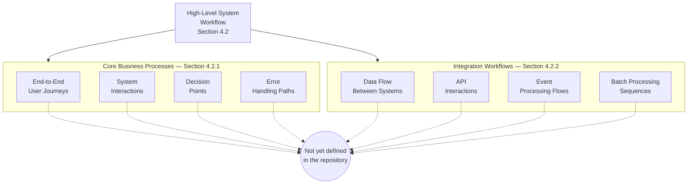

---

## 4.3 Detailed Process Flows for Core Features

### 4.3.1 Feature-Level Process Inventory

No detailed process flows can be authored at the feature level because Section 2.2.1 of this Technical Specification verifies that the Feature Catalog is empty and that no `F-XXX` feature identifiers have been issued. The Section 4 prompt's request for "detailed process flows for each core feature" therefore resolves to an empty set: there are no features against which detailed flows could be drawn.

| Required Per-Feature Element (per Section 4 prompt) | Documented State |
|---|---|
| Start point per feature | No features declared — no start point definable |
| End point per feature | No features declared — no end point definable |
| Process steps per feature | No features declared — no steps definable |
| Decision diamonds per feature | No features declared — no decisions definable |
| System boundaries per feature | No system architecture declared (Section 1.3.1) |
| User touchpoints per feature | No personas declared (Section 1.1.3) |
| Error states and recovery paths per feature | No error semantics declared (Section 2.3.4) |
| Timing and SLA per feature | No KPIs or thresholds declared (Section 1.2.3) |

### 4.3.2 Detailed Process Flow — Structural Skeleton Diagram

The following diagram acknowledges the empty feature catalog and preserves the canonical structural relationship between Section 4 and the Feature Catalog defined in Section 2.2.

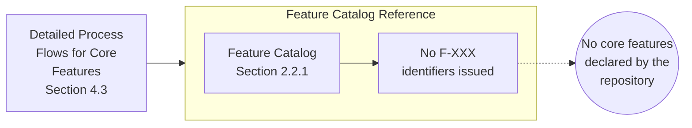

---

## 4.4 Validation Rules

### 4.4.1 Business Rules at Each Step

No business rules are declared by the repository. Section 2.3.4 (Validation Rules Schema) and Section 2.5.2 (Consideration Dimensions Reserved for Future Authoring) of this Technical Specification confirm that no business charter, no rule registry, and no rule-enforcement points exist. Until at least one rule-bearing artifact is committed, business-rule documentation for this section remains unpopulated.

| Business Rule Category Requested by Prompt | Documented State |
|---|---|
| Step-level invariants | None — no process steps defined |
| Conditional gates | None — no decision diamonds defined |
| Domain-specific rules | None — no business domain articulated |
| Rule precedence and overrides | None — no rule set declared |

### 4.4.2 Data Validation Requirements

No data validation requirements are declared by the repository. Section 1.3.1 records *"Data domains included: No — No schema, data model, or data-dictionary artifacts exist."* Section 3.6.1 separately confirms no database schema, ORM model, migration directory, seed data file, or storage configuration is present. Field-level, record-level, and cross-record validation requirements therefore cannot be enumerated.

| Validation Layer | Documented State |
|---|---|
| Input format validation | Not yet defined in the repository |
| Type / range / enum constraints | Not yet defined in the repository |
| Referential integrity rules | Not yet defined in the repository |
| Cross-field business validations | Not yet defined in the repository |
| Idempotency and uniqueness rules | Not yet defined in the repository |

### 4.4.3 Authorization Checkpoints

No authorization checkpoints are declared by the repository. Section 2.5.2 of this Technical Specification records *"None — no security artifacts"* under the Security implications row. No authentication scheme, no authorization model, no role definition, no permission registry, and no policy file is present in the repository.

| Authorization Element | Documented State |
|---|---|
| Authentication scheme | Not yet defined in the repository |
| Authorization model (RBAC / ABAC / ReBAC / other) | Not yet defined in the repository |
| Role and permission registry | Not yet defined in the repository |
| Policy enforcement points | Not yet defined in the repository |
| Audit logging of authorization decisions | Not yet defined in the repository |

### 4.4.4 Regulatory Compliance Checks

No regulatory compliance checks are declared by the repository. No compliance framework reference (PCI-DSS, HIPAA, GDPR, SOC 2, ISO 27001, FedRAMP, or other), no data-residency declaration, no consent-management artifact, and no audit-trail specification is present.

| Compliance Dimension | Documented State |
|---|---|
| Applicable regulatory regime(s) | Not yet defined in the repository |
| Data classification and handling rules | Not yet defined in the repository |
| Consent and lawful-basis tracking | Not yet defined in the repository |
| Audit and evidence-retention requirements | Not yet defined in the repository |
| Geographic / residency constraints | Not yet defined in the repository |

---

## 4.5 Technical Implementation

### 4.5.1 State Management

No state management model is declared by the repository. Section 1.2.2 of this Technical Specification confirms there are no source-code modules and no service definitions, and Section 3.6.1 confirms no database schema, ORM model, migration directory, or storage configuration is present. State transitions, data persistence points, caching requirements, and transaction boundaries therefore cannot be characterized.

| State Management Element | Evidence Source | Documented State |
|---|---|---|
| State transitions | Section 1.2.2 (Major System Components) | None — no state-bearing components |
| Data persistence points | Section 3.6.1 (Verified Absence of Data Persistence Artifacts) | None — no schemas, models, migrations, or seed data |
| Caching requirements | Section 3.6.2 (Storage Categories) | In-memory cache and distributed cache: Not yet defined in the repository |
| Transaction boundaries | Section 3.6.3 (Data Persistence Strategy) | Read/write consistency model: Not yet defined in the repository |
| Optimistic / pessimistic locking strategy | Section 3.6.3 (Data Persistence Strategy) | Not yet defined in the repository |
| Eventual-consistency semantics | Section 3.6.3 (Data Persistence Strategy) | Not yet defined in the repository |

### 4.5.2 Error Handling

No error handling artifacts are declared by the repository. Section 1.2.2 confirms no source code exists; Section 3.5.2 confirms no logging, monitoring, or error tracking service is declared; and Section 3.6.3 confirms no recovery time objective (RTO) or recovery point objective (RPO) is documented.

| Error Handling Element | Evidence Source | Documented State |
|---|---|---|
| Retry mechanisms | Section 1.2.2 (Core Technical Approach) | Not yet defined in the repository |
| Fallback processes | Section 2.5.2 (Consideration Dimensions) | Not yet defined in the repository |
| Error notification flows | Section 3.5.2 (Service Categories) | Logging / monitoring / error tracking services: Not yet defined in the repository |
| Recovery procedures | Section 3.6.3 (Data Persistence Strategy) | RTO and RPO: Not yet defined in the repository |
| Circuit breaker policy | Section 3.3 (Frameworks & Libraries) | Not yet defined in the repository |
| Timeout and back-off configuration | Section 3.3 (Frameworks & Libraries) | Not yet defined in the repository |
| Dead-letter queue / poison-message handling | Section 3.6.2 (Message queue / streaming platform) | Not yet defined in the repository |

### 4.5.3 State Transition Diagram — Structural Skeleton

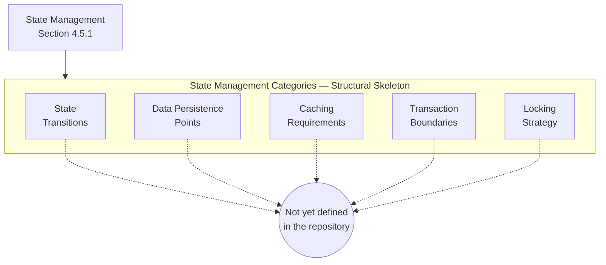

### 4.5.4 Error Handling Flowchart — Structural Skeleton

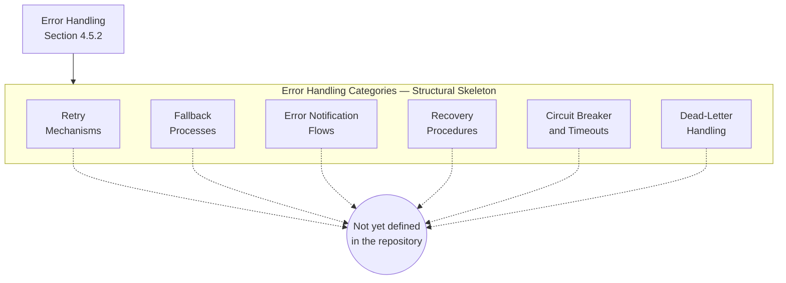

---

## 4.6 Integration Sequence Diagrams

### 4.6.1 Integration Sequence Inventory

No integration sequence diagrams can be authored because the repository contains no integration participants. Section 1.2.1, Section 2.4.2, and Section 3.5.1 of this Technical Specification each independently confirm that no upstream system integration, no downstream system integration, no shared service, and no external API or data source is present. A sequence diagram requires at least two participants and at least one inter-participant message; neither precondition is satisfied by the current repository state.

| Sequence Diagram Prerequisite | Documented State |
|---|---|
| Identified participants (actors / systems / services) | Only the repository owner `shalini690` is identified (Section 1.1.3); no system participants declared |
| Defined messages between participants | None present in repository (Section 2.4.2) |
| Defined activation lifelines / synchronicity | Not yet defined in the repository |
| Defined error / alt / opt branches | Not yet defined in the repository (Section 2.3.4) |
| Documented timing / SLA per message | Not yet defined in the repository (Section 1.2.3) |

### 4.6.2 Integration Sequence — Structural Skeleton Diagram

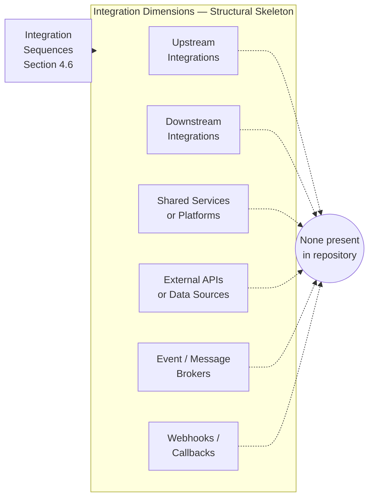

---

## 4.7 Timing and SLA Considerations

### 4.7.1 Service Level Agreement Inventory

No timing or SLA considerations are declared by the repository. Section 1.2.3 of this Technical Specification states verbatim that *"No success metrics, target thresholds, measurement instrumentation, or acceptance criteria are described in the repository."* Section 2.5.2 records *"None — no KPIs defined"* under the Performance requirements row.

| SLA / Timing Dimension Requested by Prompt | Documented State |
|---|---|
| Per-step time budgets | Not yet defined in the repository |
| End-to-end latency targets | Not yet defined in the repository |
| Throughput targets (requests/sec, events/sec, batch/hour) | Not yet defined in the repository |
| Availability targets (uptime, MTTR, MTBF) | Not yet defined in the repository |
| Recovery point objective (RPO) | Not yet defined in the repository (Section 3.6.3) |
| Recovery time objective (RTO) | Not yet defined in the repository (Section 3.6.3) |
| Service credit / penalty schedule | Not yet defined in the repository |

### 4.7.2 Performance and Throughput Considerations

No performance, scalability, or capacity considerations are documented in the repository. Section 2.5.2 of this Technical Specification confirms *"None — no components to scale"* under the Scalability considerations row. Performance budgets, load profiles, traffic shaping policies, queue depth thresholds, and back-pressure strategies are all deferred until a runtime component is committed.

---

## 4.8 Cross-Reference to Canonical Repository State

### 4.8.1 Repository State Snapshot Reference

Readers seeking the primary evidence underlying every "Not yet defined in the repository" entry throughout this Section 4 should consult the **Repository State Snapshot in Section 1.3.3**, which is the canonical visual representation of the verified contents of the repository (`README.md`, `.git/` metadata) alongside the categories of artifacts confirmed absent (no source code, no package manifests, no configuration files, no CI/CD workflows, no design documents, no test directories). Per the cross-reference policy established in Section 2.7.3, that snapshot is not duplicated here in order to avoid evidentiary duplication.

### 4.8.2 Related Specification Sections

The following sections of this Technical Specification provide the evidence base for the absences documented in Section 4. They are listed here for navigational convenience and as the basis for re-authoring this section once their content is enriched:

| Related Section | Evidentiary Role for Section 4 |
|---|---|
| Section 1.1.1 (Project Overview) | Establishes the pre-implementation initialization state |
| Section 1.1.2 (Core Business Problem) | Justifies the absence of business processes |
| Section 1.2.1 (Integration with Enterprise Landscape) | Primary evidence source for integration-workflow absences |
| Section 1.2.2 (Major System Components / Core Technical Approach) | Primary evidence source for system-interaction absences |
| Section 1.2.3 (Success Criteria) | Justifies the absence of SLA / KPI / timing considerations |
| Section 1.3.1 (In-Scope Elements / Implementation Boundaries) | Justifies the empty workflow inventory |
| Section 1.3.2 (Out-of-Scope Elements) | Justifies the absence of operational tooling |
| Section 1.3.3 (Repository State Snapshot) | Canonical visual cross-reference for Section 4 |
| Section 1.3.4 (Authoring Caveat) | Convention foundation for verified-absence authoring |
| Section 2.1.1 (Evidentiary Status of Product Requirements) | "Preserve canonical structural skeleton" pattern |
| Section 2.1.3 (Identifier Reservation Policy) | Justifies no process-identifier issuance in Section 4 |
| Section 2.2.1 (Catalog Inventory) | Justifies the absence of feature-specific process flows |
| Section 2.3.1 (Requirements Inventory) | Justifies the absence of decision points |
| Section 2.3.4 (Validation Rules Schema) | Justifies the absence of validation rules |
| Section 2.4.1 (Feature Dependency Map) | Pattern example for the navigational-skeleton diagram |
| Section 2.4.2 (Integration Points) | Justifies the absence of integration sequence diagrams |
| Section 2.5.2 (Consideration Dimensions) | Justifies the absence of security and authorization checkpoints |
| Section 2.5.3 (Re-Authoring Trigger) | Pattern foundation for Section 4 triggers |
| Section 2.7.3 (Cross-Reference to Repository State Snapshot) | Justifies non-duplication of the canonical snapshot |
| Section 3.5.1 (Verified Absence of External Integrations) | Direct evidence for integration-sequence-diagram absences |
| Section 3.6.1 (Verified Absence of Data Persistence Artifacts) | Direct evidence for state-transition-diagram absences |
| Section 3.6.3 (Data Persistence Strategy) | Direct evidence for absent RPO / RTO / transaction boundaries |
| Section 3.8.1 (Skeleton Diagram) | Pattern example for the Mermaid skeleton diagrams in Section 4 |
| Section 3.9.1 (Trigger Preconditions) | Pattern foundation for Section 4 triggers |

---

## 4.9 Re-Authoring Trigger

### 4.9.1 Trigger Preconditions

This Section 4 inherits and elaborates the Re-Authoring Trigger pattern established in Section 2.5.3 and refined in Section 3.9.1. The following commit-level events constitute re-authoring triggers for Section 4 and its subsections:

| Trigger Event | Section 4 Subsection(s) Requiring Update |
|---|---|
| Source file implementing a business process (controller, handler, domain service, use-case orchestrator) committed | 4.2.1 Core Business Processes; 4.3 Detailed Process Flows |
| Workflow definition committed (BPMN, state machine source, sequence diagram source, activity diagram source) | 4.2.1 Core Business Processes; 4.5.1 State Management |
| OpenAPI / Swagger / GraphQL schema or other API specification committed | 4.2.2 Integration Workflows; 4.6 Integration Sequence Diagrams |
| Integration manifest, webhook handler, or message-broker descriptor committed | 4.2.2 Integration Workflows; 4.6 Integration Sequence Diagrams |
| Workflow-orchestration configuration committed (for example, AWS Step Functions definition, Temporal workflow, Camunda BPMN, Airflow DAG) | 4.5.1 State Management; 4.2 System Workflows |
| Error-handling middleware, retry policy, circuit-breaker configuration, or dead-letter queue descriptor committed | 4.5.2 Error Handling; 4.5.4 Error Handling Flowchart |
| Database schema, ORM model, migration, or transactional boundary annotation committed | 4.5.1 State Management; 4.5.3 State Transition Diagram |
| Cache configuration (Redis, Memcached, in-process LRU policy) committed | 4.5.1 State Management |
| Authorization middleware, policy file, role/permission registry, or identity-provider integration committed | 4.4.3 Authorization Checkpoints |
| Validation library configuration, schema-validation file (JSON Schema, Joi, Zod, Pydantic, Bean Validation, etc.) committed | 4.4.1 Business Rules; 4.4.2 Data Validation Requirements |
| Regulatory compliance documentation or audit-trail specification committed | 4.4.4 Regulatory Compliance Checks |
| SLA / SLO / SLI definitions, performance budget documents, or load-test plans committed | 4.7.1 SLA Inventory; 4.7.2 Performance and Throughput |
| Event-streaming or messaging topology committed (Kafka topic config, RabbitMQ exchange config, SNS/SQS, EventBridge rule) | 4.2.2 Integration Workflows; 4.6 Integration Sequence Diagrams |

### 4.9.2 Section Update Cadence

Per the assumption documented in Section 2.7.1 (*"This Technical Specification will be revised once project intent is articulated"*), Section 4 will be regenerated end-to-end on the first specification cycle following the commit of any of the trigger events enumerated in Section 4.9.1. Until such an event occurs, Section 4 remains in its current verified-absence state. When re-authored, each placeholder skeleton diagram in Sections 4.2.3, 4.3.2, 4.5.3, 4.5.4, and 4.6.2 should be replaced with — or supplemented by — concrete process-flow, sequence, and state diagrams that reflect the committed artifacts. The Empty sentinel nodes should be removed from any category for which evidence has been committed.

### 4.9.3 Identifier Reservation for Process Items

Consistent with Section 2.1.3 and Section 3.9.3, this section issues no process identifiers, no workflow identifiers, no state identifiers, no transition identifiers, no sequence identifiers, no decision-point identifiers, no validation-rule identifiers, no error-state identifiers, and no SLA identifiers. Issuance is deferred until at least one declarative process-defining artifact is committed to the repository. This prevents the creation of dangling process-flow identifiers that would otherwise require retirement in a later specification cycle.

---

## 4.10 References

### 4.10.1 Files Examined

- `README.md` — Sole tracked file in the repository (11 bytes, content `# Artifact6`); source of the verified-absence finding for all process, integration, validation, state-management, and error-handling content in Section 4.

### 4.10.2 Folders Explored

- Repository root (`/`, depth 0) — Confirmed to contain only `README.md` as a tracked file; no subdirectories exist, so no deeper traversal is achievable. This reflects the genuine state of the repository, not a search limitation.

### 4.10.3 Technical Specification Sections Cross-Referenced

- Section 1.1 (Executive Summary) — Pre-implementation initialization state; sole-contributor identification
- Section 1.2 (System Overview) — Verified absence of system capabilities, components, integrations, and core technical approach
- Section 1.3 (Scope) — Repository State Snapshot diagram (canonical cross-reference), in-scope / out-of-scope inventories, authoring caveat
- Section 1.4 (References) — Verification methodology, files and folders examined
- Section 2.1 (Section Authoring Basis) — Evidentiary constraints, documentation approach, identifier reservation policy
- Section 2.2 (Feature Catalog) — Empty feature catalog (no `F-XXX` identifiers issued); justifies absent per-feature process flows
- Section 2.3 (Functional Requirements Table) — Empty requirements inventory; empty validation rules schema
- Section 2.4 (Feature Relationships) — Navigational-skeleton diagram pattern (Section 2.4.1); integration-points absence (Section 2.4.2)
- Section 2.5 (Implementation Considerations) — Pre-implementation state; consideration dimensions; re-authoring trigger pattern foundation
- Section 2.7 (Assumptions and Constraints) — Documented assumptions and constraints; non-duplication policy for the canonical snapshot
- Section 3.1 (Section Authoring Basis) — Default Technology Stack inapplicability analysis
- Section 3.5 (Third-Party Services) — Verified absence of external integrations; reserved service categories
- Section 3.6 (Databases & Storage) — Verified absence of data persistence artifacts; reserved storage categories; deferred data persistence strategy
- Section 3.8 (Technology Stack Structural Skeleton) — Mermaid pattern example (skeleton + Empty sentinel) reused throughout Section 4
- Section 3.9 (Re-Authoring Trigger) — Trigger pattern foundation reused in Section 4.9.1

### 4.10.4 Diagram Inventory for Section 4

| Diagram | Subsection | Type | Status |
|---|---|---|---|
| High-Level System Workflow — Structural Skeleton | 4.2.3 | Mermaid `flowchart TD` | Skeleton with Empty sentinel |
| Detailed Process Flow — Structural Skeleton | 4.3.2 | Mermaid `flowchart LR` | Skeleton with Empty sentinel |
| State Transition Diagram — Structural Skeleton | 4.5.3 | Mermaid `flowchart TD` | Skeleton with Empty sentinel |
| Error Handling Flowchart — Structural Skeleton | 4.5.4 | Mermaid `flowchart TD` | Skeleton with Empty sentinel |
| Integration Sequence — Structural Skeleton | 4.6.2 | Mermaid `flowchart LR` | Skeleton with Empty sentinel |
| Canonical Repository State Snapshot | Cross-referenced to Section 1.3.3 | Mermaid `flowchart TD` | Not duplicated; see Section 1.3.3 |

# 5. System Architecture

## 5.1 SECTION AUTHORING BASIS

### 5.1.1 Evidentiary Status of Architectural Content

This System Architecture section has been authored under the same verified-absence convention established by Sections 1.3.4, 2.1.1, 3.1.2, and 4.1.1 of this Technical Specification. The Artifact6 repository is in a pre-implementation initialization state: the complete tracked footprint consists of a single `README.md` file (11 bytes, content `# Artifact6`) under a single `Initial commit` (`a3789fc`, dated `2026-05-28`) on the `main` branch authored by GitHub user `shalini690`. The canonical visual representation of this state is the **Repository State Snapshot in Section 1.3.3**, which is cross-referenced rather than duplicated here in accordance with Section 2.7.3.

Because no source code, no service definitions, no integration manifests, no API specifications, no architectural diagrams, no architectural decision records (ADRs), no design documents, no data persistence artifacts, no security artifacts, and no SLA/KPI documentation exist in the repository, this section cannot enumerate concrete architectural styles, components, communication patterns, technical decisions, or cross-cutting concern implementations. Each subsection below preserves the canonical schema requested by the Section 5 prompt and explicitly records the verified absence of content under that schema. This approach provides a stable, forward-compatible target for enrichment once the repository declares its architectural model.

| Required Element (per Section 5 Prompt) | Evidence Source | Documented State |
|---|---|---|
| Overall system architecture style and rationale | Section 1.2.2 (Core Technical Approach) | "Architectural pattern: Not yet defined in the repository" |
| Key architectural principles and patterns | Section 1.2.2 (Core Technical Approach) | None declared |
| System boundaries and major interfaces | Section 1.3.1 (Implementation Boundaries) | "System boundaries: No — No architecture definition exists" |
| Core components | Section 1.2.2 (Major System Components) | Single `README.md` placeholder; no source-code modules |
| Data flows between components | Section 1.2.1 (Integration with Enterprise Landscape); Section 4.1.1 | "Data flow between systems: None present in repository" |
| Integration patterns and protocols | Section 3.5.1 (Verified Absence of External Integrations) | No OpenAPI/Swagger spec, no API client SDK, no broker config |
| Data stores and caches | Section 3.6.1 (Verified Absence of Data Persistence Artifacts); Section 3.6.2 | No schema, no ORM model, no migrations; cache categories not defined |
| External integration points | Section 1.2.1; Section 3.5.1 | All four integration dimensions: None present in repository |
| Technologies and frameworks | Section 3.2; Section 3.3 | No source code in any language; no framework declarations |
| Data persistence requirements | Section 3.6.1; Section 3.6.3 | No schema, no ORM model, no migrations, no seed data; RTO/RPO undefined |
| Scaling considerations | Section 2.5.2 (Consideration Dimensions) | "None — no components to scale" |
| Architecture style decisions and tradeoffs | Section 1.2.2 (Core Technical Approach) | "Architectural pattern: Not yet defined in the repository" |
| Caching strategy | Section 3.6.2 (Storage Categories) | In-memory cache and distributed cache: Not yet defined in the repository |
| Security mechanism selection | Section 2.5.2; Section 4.4.3 | "None — no security artifacts"; no auth scheme, no policy file |
| Monitoring and observability | Section 3.5.2 (Service Categories) | Logging / monitoring / APM / error tracking: Not yet defined |
| Authentication and authorization framework | Section 4.4.3 (Authorization Checkpoints) | No authentication scheme, no authorization model, no policy file |
| Performance requirements and SLAs | Section 1.2.3 (Success Criteria); Section 4.7.1 | "No success metrics, target thresholds, measurement instrumentation, or acceptance criteria" |
| Disaster recovery procedures | Section 3.6.3; Section 4.5.2 | RPO and RTO: Not yet defined in the repository |

### 5.1.2 Documentation Approach

The Section 5 prompt requests several Mermaid.js diagrams (detailed component interaction diagrams, state transition diagrams, sequence diagrams for key flows, decision tree diagrams, architecture decision records, and error handling flows). Following the authorial precedent established by Sections 1.3.3, 2.4.1, 3.8.1, 4.2.3, 4.3.2, 4.5.3, 4.5.4, and 4.6.2 of this Technical Specification, each diagram is rendered as a **structural-skeleton diagram with an Empty sentinel terminus** that depicts the canonical schema while transparently recording that the corresponding content collection is empty at the time of authoring.

All diagrams in this section deliberately employ the restricted Mermaid syntax already validated by prior sections — `flowchart TD` or `flowchart LR`; `subgraph ... end` blocks; square-bracket `[...]` node labels; double-parenthesis `((...))` terminal sentinel nodes; solid `-->` arrows for present structural relationships; dashed `-.->` arrows for the connection to the Empty sentinel; `<br/>` for in-node line breaks; and the HTML entity `&amp;` for ampersands. Per Section 4.1.2, sequence-style and state-style requested diagrams are also rendered as `flowchart` skeletons because the absence of any sequence participants, actors, or state-bearing components in the repository makes the use of `sequenceDiagram` or `stateDiagram` semantically unjustified and visually misleading.

### 5.1.3 Identifier Reservation for Architectural Artifacts

Consistent with the Identifier Reservation Policy established in Section 2.1.3 and reaffirmed in Sections 3.9.3 and 4.9.3, this section issues **no** component identifiers (`C-XXX`), **no** interface identifiers (`I-XXX`), **no** architecture decision record (ADR) identifiers, **no** service identifiers, **no** layer identifiers, **no** SLA / SLO / SLI identifiers, and **no** integration identifiers. Issuance of any such identifier is deferred until at least one declarative architectural artifact is committed to the repository (see Section 5.7.1 for the enumerated trigger events). This policy prevents the creation of dangling architectural identifiers that would otherwise need to be retired in a later specification cycle.

### 5.1.4 Default Architectural Style Inapplicability

The Section 5 prompt enumerates architectural concerns whose population customarily depends on a defaulted or assumed architectural style (for example, microservices, monolithic, layered, hexagonal, event-driven, serverless, CQRS, service-oriented). Following the precedent of Section 3.1.3 — which established that no Default Technology Stack could be applied because no requirements, no features, no architecture, and no constraints exist against which any candidate could be evaluated — this section concludes that no default architectural style can be applied for the equivalent reason.

| Decision Input Required to Select an Architectural Style | Source Section | Documented State |
|---|---|---|
| Functional requirements that would constrain architecture style | Section 2.3 (Functional Requirements Table) | None — no functional requirements declared |
| Feature catalog that would constrain component decomposition | Section 2.2 (Feature Catalog) | None — feature catalog is empty |
| Business charter that would constrain architectural rationale | Section 1.1.2 (Core Business Problem) | None — no business problem statement |
| Integration manifest that would constrain communication patterns | Section 1.2.1 (Integration with Enterprise Landscape) | None — no integrations evidenced |
| Data domains that would constrain data architecture | Section 1.3.1 (Implementation Boundaries) | None — no schema, model, or dictionary |
| Operational tooling baseline that would constrain deployment topology | Section 3.7 (Development & Deployment) | None — no pipelines, images, or manifests |
| Performance / SLA targets that would constrain non-functional design | Section 1.2.3 (Success Criteria); Section 4.7.1 | None — no KPIs or thresholds |

The structural skeletons that follow therefore intentionally avoid asserting any particular architectural style, communication pattern, persistence strategy, or deployment topology. They preserve the schema requested by the Section 5 prompt and route every category through the shared "Not yet defined in the repository" sentinel.

---

## 5.2 HIGH-LEVEL ARCHITECTURE

### 5.2.1 System Overview

#### Overall System Architecture Style and Rationale

No overall system architecture style is declared by the Artifact6 repository. Section 1.2.2 (Core Technical Approach) of this Technical Specification records verbatim that the *"Architectural pattern: Not yet defined in the repository"*, and no build manifest, no dependency declaration, no containerization asset, no CI/CD workflow definition, and no architectural diagram exists that would permit identification of programming languages, frameworks, runtimes, or architectural patterns. The rationale for any candidate style cannot be articulated because, per Section 5.1.4, none of the decision inputs (functional requirements, feature catalog, business charter, integration manifest, data domains, operational tooling, performance targets) is populated.

#### Key Architectural Principles and Patterns

No architectural principles (such as separation of concerns, single responsibility, dependency inversion, loose coupling, high cohesion), no design patterns (such as MVC, MVVM, repository, gateway, saga, CQRS, event sourcing), and no architectural styles (such as layered, hexagonal, clean, onion, microservices, monolithic, modular monolith, event-driven, pipe-and-filter, peer-to-peer, client-server) are evidenced anywhere in the repository. No design documents, no developer guidelines, no Architecture Decision Records, and no source files that would embody such principles are present.

#### System Boundaries and Major Interfaces

No system boundaries are documented. Section 1.3.1 of this Technical Specification records verbatim that *"System boundaries: No — No architecture definition exists."* No bounded contexts, no aggregate roots, no service boundaries, no module boundaries, no trust boundaries, no network segmentation, and no deployment boundaries are evidenced.

No major interfaces are documented. Section 1.2.1 confirms the verified absence of all integration dimensions — upstream system integrations, downstream system integrations, shared services or platforms, and external APIs or data sources are all *"None present in repository."* Section 3.5.1 separately confirms no OpenAPI/Swagger specification, no API client SDK, no service-broker configuration, no webhook handler, and no message-broker descriptor exists in the repository.

### 5.2.2 Core Components Table

The complete component inventory of the repository — as enumerated by `git ls-tree -r HEAD` per Section 1.2.2 — consists of exactly one file. There are no subdirectories, no source-code modules, no service definitions, no shared libraries, and no infrastructure components defined. The Core Components Table requested by the Section 5 prompt is therefore reduced to a single row representing the sole tracked artifact, with all architectural attributes marked unpopulated.

| Component Name | Primary Responsibility | Key Dependencies | Critical Considerations |
|---|---|---|---|
| `README.md` | Repository placeholder; declares the repository name via the heading `# Artifact6` | None — no transitive dependencies, no package manifest references the file | Single-purpose placeholder; carries no executable behavior; not a system component in the architectural sense |
| Application components | Not yet defined in the repository | Not yet defined in the repository | Not yet defined in the repository |
| Service components | Not yet defined in the repository | Not yet defined in the repository | Not yet defined in the repository |
| Infrastructure components | Not yet defined in the repository | Not yet defined in the repository | Not yet defined in the repository |
| Shared libraries | Not yet defined in the repository | Not yet defined in the repository | Not yet defined in the repository |
| Cross-cutting components | Not yet defined in the repository | Not yet defined in the repository | Not yet defined in the repository |

Integration Points are tracked as a separate dimension in Section 5.2.4 (External Integration Points) below, in order to maintain the four-column maximum prescribed by the Section 5 prompt while preserving the full evidentiary schema.

### 5.2.3 Data Flow Description

#### Primary Data Flows Between Components

No primary data flows between components exist in the repository. Section 4.1.1 of this Technical Specification confirms that *"Data flow between systems: None present in repository."* Because the component inventory consists of a single non-executable placeholder file (Section 1.2.2), there are no producers, no consumers, no sources, no sinks, no transformations, and no data conduits to characterize. No event bus, no message queue, no streaming platform, no REST endpoint, no GraphQL resolver, no gRPC service, and no shared database mediates any flow because none of these artifacts exists.

#### Integration Patterns and Protocols

No integration patterns and no wire protocols are declared. Section 3.5.1 (Verified Absence of External Integrations) and Section 1.2.1 (Integration with Existing Enterprise Landscape) jointly establish that no synchronous request-response interaction, no asynchronous publish-subscribe interaction, no point-to-point messaging, no fan-out/fan-in topology, no choreography, no orchestration, and no shared-database integration is evidenced. Protocol choices (HTTP, HTTPS, gRPC, AMQP, MQTT, Kafka wire protocol, JDBC, ODBC, file-based exchange) are correspondingly undefined.

#### Data Transformation Points

No data transformation points are evidenced. The repository contains no parser, no serializer, no mapper, no projector, no aggregator, no enricher, no filter, and no adapter that would constitute a transformation point. Section 2.4.2 (Integration Points) of this Technical Specification confirms the empty state of all integration dimensions.

#### Key Data Stores and Caches

No data stores and no caches exist. Section 3.6.1 of this Technical Specification confirms verbatim that *"No database schema, ORM model, migration directory, seed data file, or storage configuration is present."* Section 3.6.2 (Storage Categories) confirms that in-memory caches, distributed caches, relational databases, document databases, key-value stores, time-series databases, search indexes, object/blob stores, and message queues are all *"Not yet defined in the repository."*

| Data Flow Dimension | Evidence Source | Documented State |
|---|---|---|
| Primary data flows between components | Section 4.1.1; Section 1.2.1 | None present in repository |
| Integration patterns (sync, async, batch, streaming) | Section 3.5.1 | Not yet defined in the repository |
| Wire protocols (HTTP, gRPC, AMQP, Kafka, etc.) | Section 3.5.1 | Not yet defined in the repository |
| Data transformation points | Section 2.4.2 | None — no transformations present |
| Persistent data stores | Section 3.6.1 | None — no schemas, models, migrations |
| In-memory and distributed caches | Section 3.6.2 | Not yet defined in the repository |

### 5.2.4 External Integration Points

The External Integration Points table requested by the Section 5 prompt is anchored by the verified-absence findings in Section 1.2.1 and Section 3.5.1. Each integration category requested by the prompt is rendered with an explicit "Not yet defined in the repository" marker to preserve the canonical schema for future enrichment.

| System Name | Integration Type | Protocol / Format | SLA Requirements |
|---|---|---|---|
| Upstream system integrations | Not yet defined in the repository | Not yet defined in the repository | Not yet defined in the repository |
| Downstream system integrations | Not yet defined in the repository | Not yet defined in the repository | Not yet defined in the repository |
| Shared services or platforms | Not yet defined in the repository | Not yet defined in the repository | Not yet defined in the repository |
| External APIs or data sources | Not yet defined in the repository | Not yet defined in the repository | Not yet defined in the repository |
| Authentication / identity provider | Not yet defined in the repository | Not yet defined in the repository | Not yet defined in the repository |
| Logging / log aggregation service | Not yet defined in the repository | Not yet defined in the repository | Not yet defined in the repository |
| Monitoring / APM service | Not yet defined in the repository | Not yet defined in the repository | Not yet defined in the repository |
| Error tracking service | Not yet defined in the repository | Not yet defined in the repository | Not yet defined in the repository |
| Email / notification service | Not yet defined in the repository | Not yet defined in the repository | Not yet defined in the repository |
| Payment processing service | Not yet defined in the repository | Not yet defined in the repository | Not yet defined in the repository |
| Cloud infrastructure provider | Not yet defined in the repository | Not yet defined in the repository | Not yet defined in the repository |
| Object / blob storage service | Not yet defined in the repository | Not yet defined in the repository | Not yet defined in the repository |
| Content delivery network | Not yet defined in the repository | Not yet defined in the repository | Not yet defined in the repository |
| AI / ML inference service | Not yet defined in the repository | Not yet defined in the repository | Not yet defined in the repository |

The Data Exchange Pattern dimension requested by the Section 5 prompt is documented separately in Section 5.2.3 (Data Flow Description) above to preserve the four-column maximum prescribed by the prompt while retaining the complete evidentiary schema.

### 5.2.5 High-Level Architecture Skeleton Diagram

The following diagram preserves the canonical structural skeleton requested for the High-Level Architecture subsection, with each architectural concern terminating at the shared "Not yet defined in the repository" sentinel node. The diagram follows the authorial pattern established by Sections 1.3.3, 2.4.1, 3.8.1, 4.2.3, 4.3.2, 4.5.3, 4.5.4, and 4.6.2.

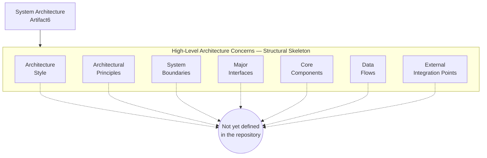

---

## 5.3 COMPONENT DETAILS

### 5.3.1 Component Inventory

No major components are declared by the Artifact6 repository. Section 1.2.2 of this Technical Specification records that the complete component inventory consists of a single `README.md` placeholder file at the repository root, containing only the heading `# Artifact6`. Per Section 2.4.3 (cross-referenced via the Section 5 context research report), the following component classes are all confirmed empty: shared libraries, common services, infrastructure components, and cross-cutting concerns. Because no component exists in the architectural sense, the per-component subsections requested by the Section 5 prompt (Purpose and responsibilities, Technologies and frameworks used, Key interfaces and APIs, Data persistence requirements, Scaling considerations) reduce to a uniform record of verified absence, presented below by dimension rather than by component.

### 5.3.2 Purpose and Responsibilities

No component purpose statements or responsibility assignments are evidenced. Section 1.2.2 confirms that there are no subdirectories, no source-code modules, no service definitions, no shared libraries, and no infrastructure components defined. The single tracked file (`README.md`) carries the descriptive purpose of "repository placeholder declaring the repository name" and bears no executable responsibility.

| Responsibility Dimension | Documented State |
|---|---|
| Component-level mission statements | Not yet defined in the repository |
| Domain-of-concern allocation | Not yet defined in the repository |
| Single-responsibility delineation | Not yet defined in the repository |
| Component ownership / stewardship | Not yet defined in the repository |

### 5.3.3 Technologies and Frameworks Used

No technologies or frameworks are declared by the repository. Section 3.2 (Programming Languages) confirms no source code in any language is present, and Section 3.3 (Frameworks & Libraries) confirms no framework or runtime declaration exists. Section 3.4 (Open Source Dependencies) confirms the absence of all package manifests (`package.json`, `requirements.txt`, `pyproject.toml`, `pom.xml`, `Cargo.toml`, `go.mod`).

| Technology Dimension | Documented State |
|---|---|
| Programming language(s) | None declared |
| Application framework(s) | None declared |
| Runtime(s) | None declared |
| Build / package manifest | Absent |
| Third-party libraries / dependencies | None declared |

### 5.3.4 Key Interfaces and APIs

No key interfaces or APIs are declared. Section 3.5.1 (Verified Absence of External Integrations) confirms that no OpenAPI/Swagger specification, no API client SDK, no service-broker configuration, no webhook handler, and no message-broker descriptor exists in the repository. Interface contracts (synchronous APIs, asynchronous events, batch interfaces, command/query contracts, GraphQL schemas, gRPC `.proto` definitions) are uniformly absent.

| Interface Dimension | Documented State |
|---|---|
| HTTP REST endpoints | Not yet defined in the repository |
| GraphQL schemas | Not yet defined in the repository |
| gRPC service definitions | Not yet defined in the repository |
| Asynchronous event contracts | Not yet defined in the repository |
| Command-line interface contracts | Not yet defined in the repository |
| Internal module / library APIs | Not yet defined in the repository |

### 5.3.5 Data Persistence Requirements

No data persistence requirements are declared. Section 3.6.1 of this Technical Specification confirms verbatim that *"No database schema, ORM model, migration directory, seed data file, or storage configuration is present."* Section 3.6.3 confirms that read/write consistency models, transactional boundaries, locking strategies, and eventual-consistency semantics are uniformly *"Not yet defined in the repository."*

| Persistence Dimension | Documented State |
|---|---|
| Database schema | None — no schema present |
| ORM model / data-mapping layer | None — no ORM model present |
| Migration directory / migration scripts | None — no migrations present |
| Seed data / fixture files | None — no seed data present |
| Read/write consistency model | Not yet defined in the repository |
| Transactional boundaries | Not yet defined in the repository |
| Locking strategy | Not yet defined in the repository |

### 5.3.6 Scaling Considerations

No scaling considerations are declared. Section 2.5.2 (Consideration Dimensions Reserved for Future Authoring) records verbatim *"None — no components to scale"* under the Scalability considerations row. Horizontal scaling models, vertical scaling profiles, partitioning strategies, sharding schemes, replication topologies, auto-scaling policies, and back-pressure controls cannot be characterized.

| Scaling Dimension | Documented State |
|---|---|
| Horizontal scaling model | Not yet defined in the repository |
| Vertical scaling profile | Not yet defined in the repository |
| Partitioning / sharding strategy | Not yet defined in the repository |
| Replication topology | Not yet defined in the repository |
| Auto-scaling policy | Not yet defined in the repository |
| Back-pressure and load shedding | Not yet defined in the repository |

### 5.3.7 Component Interaction Skeleton Diagram

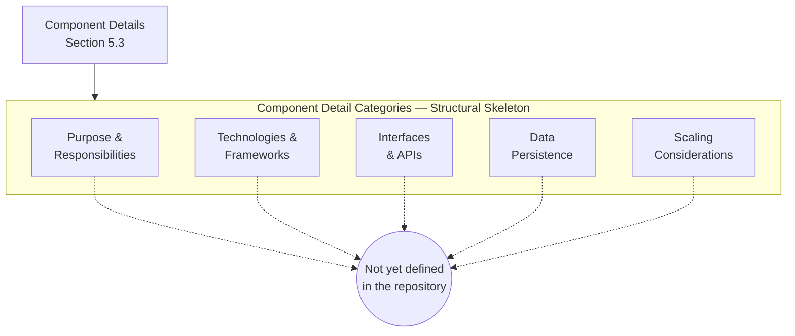

### 5.3.8 State Transition Skeleton Diagram

Per Section 4.1.2 of this Technical Specification, sequence-style and state-style diagrams are rendered as `flowchart` skeletons because the absence of any state-bearing components in the repository makes the use of `stateDiagram` semantically unjustified and visually misleading. The schema below mirrors the categories established in Section 4.5.3.

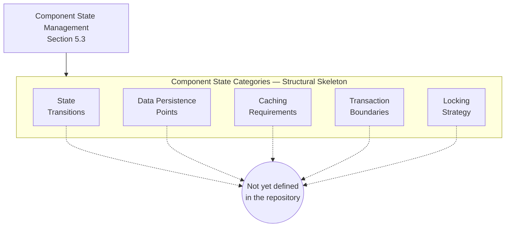

### 5.3.9 Sequence Skeleton Diagram for Key Flows

Per Section 4.6.1 of this Technical Specification, a sequence diagram requires at least two participants and at least one inter-participant message; neither precondition is satisfied by the current repository state. Consistent with the precedent established in Section 4.6.2, this diagram is rendered as a `flowchart LR` skeleton rather than as a `sequenceDiagram`.

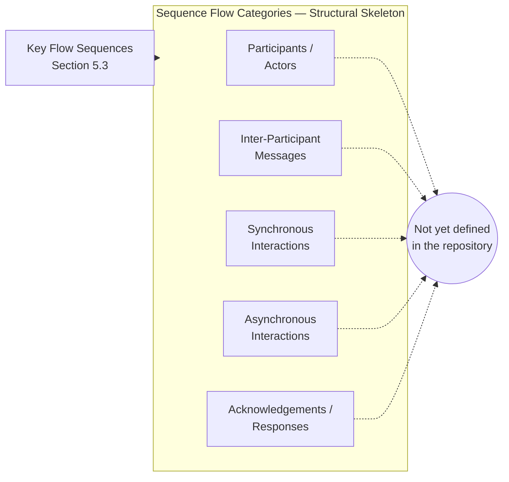

---

## 5.4 TECHNICAL DECISIONS

### 5.4.1 Architecture Style Decisions and Tradeoffs

No architecture style decisions are recorded. Section 1.2.2 of this Technical Specification records verbatim that the *"Architectural pattern: Not yet defined in the repository."* No ADR document, no design rationale memo, no tradeoff matrix, and no requirements-to-style mapping is present. The candidate styles enumerated in Section 5.1.4 (microservices, monolithic, layered, hexagonal, event-driven, serverless, CQRS, service-oriented) cannot be evaluated because none of the required decision inputs is populated.

| Architecture Style Decision Dimension | Documented State |
|---|---|
| Style selected (monolith, microservices, etc.) | Not yet defined in the repository |
| Drivers for the selection | Not yet defined in the repository |
| Alternatives considered | Not yet defined in the repository |
| Tradeoffs accepted | Not yet defined in the repository |

### 5.4.2 Communication Pattern Choices

No communication pattern choices are recorded. Section 1.2.1 of this Technical Specification confirms no integration manifest exists, and Section 3.5.1 confirms no OpenAPI/Swagger specification, no API client SDK, no service-broker configuration, no webhook handler, and no message-broker descriptor is present. Synchronous request-response, asynchronous messaging, event-driven, streaming, polling, push notification, and webhook patterns are uniformly undefined.

| Communication Pattern Dimension | Documented State |
|---|---|
| Synchronous request-response (REST, gRPC, RPC) | Not yet defined in the repository |
| Asynchronous messaging (queue, topic, broker) | Not yet defined in the repository |
| Event-driven / event streaming | Not yet defined in the repository |
| Webhook / callback | Not yet defined in the repository |
| Batch / file-based exchange | Not yet defined in the repository |

### 5.4.3 Data Storage Solution Rationale

No data storage solution rationale is recorded. Section 3.6.1 confirms verbatim that *"No database schema, ORM model, migration directory, seed data file, or storage configuration is present."* Selection criteria, candidate stores (relational, document, key-value, columnar, graph, time-series, search index, object store), and tradeoff analyses are uniformly absent.

| Data Storage Decision Dimension | Documented State |
|---|---|
| Primary storage engine selected | Not yet defined in the repository |
| Polyglot persistence policy | Not yet defined in the repository |
| Consistency vs. availability tradeoff (CAP positioning) | Not yet defined in the repository |
| Backup, retention, and archival policy | Not yet defined in the repository |

### 5.4.4 Caching Strategy Justification

No caching strategy is recorded. Section 3.6.2 (Storage Categories) of this Technical Specification confirms that in-memory cache and distributed cache categories are both *"Not yet defined in the repository."* Cache topologies (look-aside, read-through, write-through, write-behind, refresh-ahead), eviction policies (LRU, LFU, TTL, FIFO), invalidation strategies (event-driven, time-based, write-driven), and consistency guarantees are uniformly undefined.

| Caching Decision Dimension | Documented State |
|---|---|
| Cache topology (look-aside, read-through, etc.) | Not yet defined in the repository |
| Eviction policy (LRU, LFU, TTL) | Not yet defined in the repository |
| Invalidation strategy | Not yet defined in the repository |
| Cache coherence and consistency model | Not yet defined in the repository |

### 5.4.5 Security Mechanism Selection

No security mechanisms are selected. Section 2.5.2 (Consideration Dimensions) of this Technical Specification records verbatim *"None — no security artifacts"* under the Security implications row. Section 4.4.3 (Authorization Checkpoints) confirms that no authentication scheme, no authorization model (RBAC / ABAC / ReBAC / other), no role and permission registry, no policy enforcement points, and no audit logging of authorization decisions is present. Section 3.5.3 confirms no credential management strategy, no secrets vault configuration, no OAuth client registration, and no API-key handling convention is documented.

| Security Mechanism Dimension | Documented State |
|---|---|
| Authentication scheme | Not yet defined in the repository |
| Authorization model (RBAC, ABAC, ReBAC, other) | Not yet defined in the repository |
| Secrets / credential management | Not yet defined in the repository |
| Transport security (TLS, mTLS) | Not yet defined in the repository |
| Encryption at rest | Not yet defined in the repository |
| Audit and security logging | Not yet defined in the repository |

### 5.4.6 Decision Tree Skeleton Diagram

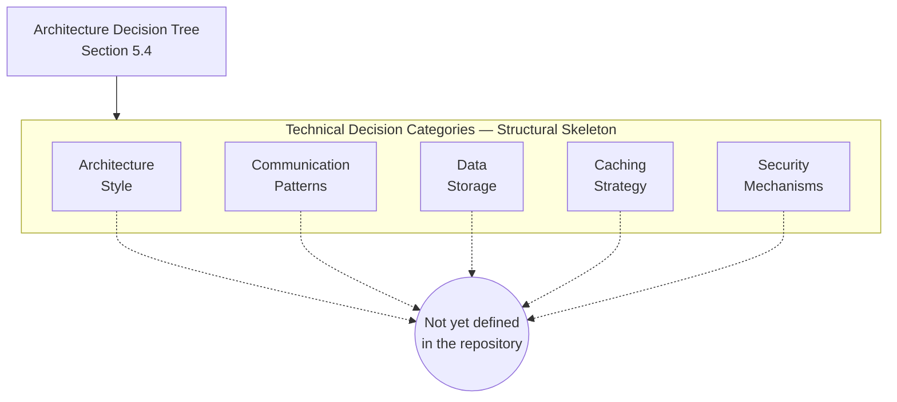

### 5.4.7 Architecture Decision Record Skeleton

No Architecture Decision Records (ADRs) are present in the repository. The repository contains no `docs/adr/`, no `adr/`, no `decisions/`, no `architecture/`, and no equivalent directory, and the sole tracked file (`README.md`) carries no decision content. The canonical ADR fields (Title, Status, Context, Decision, Consequences, Alternatives) are reserved for population in a future specification cycle.

| ADR Field | Documented State |
|---|---|
| Title | Not yet defined in the repository |
| Status (Proposed / Accepted / Deprecated / Superseded) | Not yet defined in the repository |
| Context (forces, drivers, constraints) | Not yet defined in the repository |
| Decision | Not yet defined in the repository |
| Consequences (positive, negative, neutral) | Not yet defined in the repository |
| Alternatives considered | Not yet defined in the repository |

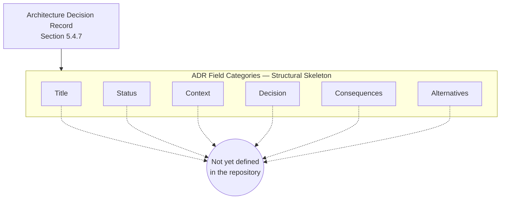

---

## 5.5 CROSS-CUTTING CONCERNS

### 5.5.1 Monitoring and Observability Approach

No monitoring or observability approach is declared. Section 3.5.2 (Third-Party Service Categories) of this Technical Specification confirms that logging / log aggregation services, monitoring / APM services, and error tracking services are all *"Not yet defined in the repository."* The three pillars of observability (metrics, logs, traces) are uniformly unanchored.

| Observability Dimension | Documented State |
|---|---|
| Metrics collection (push / pull, format) | Not yet defined in the repository |
| Log aggregation (sink, retention) | Not yet defined in the repository |
| Distributed tracing (propagation, backend) | Not yet defined in the repository |
| APM / synthetic monitoring | Not yet defined in the repository |
| Health checks (liveness, readiness, startup) | Not yet defined in the repository |
| Alerting and on-call policy | Not yet defined in the repository |

### 5.5.2 Logging and Tracing Strategy

No logging strategy and no tracing strategy are declared. The repository contains no logging configuration file, no logger factory definition, no log-level convention document, no trace-propagation header convention, no correlation-identifier convention, and no sampling policy. Section 4.5.2 of this Technical Specification confirms that error notification flows are *"Not yet defined in the repository"* and that logging / monitoring / error tracking services are likewise undefined.

| Logging / Tracing Dimension | Documented State |
|---|---|
| Log format (structured JSON, plain text, etc.) | Not yet defined in the repository |
| Log levels and verbosity policy | Not yet defined in the repository |
| Correlation identifier convention | Not yet defined in the repository |
| Trace context propagation (W3C Trace Context, B3, etc.) | Not yet defined in the repository |
| Sensitive-data redaction policy | Not yet defined in the repository |
| Sampling policy | Not yet defined in the repository |

### 5.5.3 Error Handling Patterns

No error handling patterns are declared. Section 4.5.2 (Error Handling) of this Technical Specification records that retry mechanisms, fallback processes, error notification flows, recovery procedures, circuit breaker policy, timeout and back-off configuration, and dead-letter queue / poison-message handling are all *"Not yet defined in the repository."* The skeleton diagram below mirrors Section 4.5.4 to preserve schema consistency across the Technical Specification.

| Error Handling Pattern | Documented State |
|---|---|
| Retry mechanisms (count, backoff) | Not yet defined in the repository |
| Fallback / graceful degradation | Not yet defined in the repository |
| Error notification flows | Not yet defined in the repository |
| Recovery procedures | Not yet defined in the repository |
| Circuit breaker policy | Not yet defined in the repository |
| Timeout and back-off configuration | Not yet defined in the repository |
| Dead-letter queue / poison-message handling | Not yet defined in the repository |

### 5.5.4 Authentication and Authorization Framework

No authentication or authorization framework is declared. Section 4.4.3 (Authorization Checkpoints) of this Technical Specification confirms that no authentication scheme, no authorization model (RBAC / ABAC / ReBAC / other), no role and permission registry, no policy enforcement points, and no audit logging of authorization decisions is present in the repository.

| Auth Dimension | Documented State |
|---|---|
| Authentication scheme (password, OAuth, OIDC, SAML, mTLS) | Not yet defined in the repository |
| Token / session management strategy | Not yet defined in the repository |
| Authorization model (RBAC / ABAC / ReBAC) | Not yet defined in the repository |
| Role and permission registry | Not yet defined in the repository |
| Policy enforcement points (gateway, middleware, service) | Not yet defined in the repository |
| Audit logging of authorization decisions | Not yet defined in the repository |

### 5.5.5 Performance Requirements and SLAs

No performance requirements and no SLAs are declared. Section 1.2.3 (Success Criteria) of this Technical Specification confirms verbatim that *"No success metrics, target thresholds, measurement instrumentation, or acceptance criteria are described in the repository."* Section 4.7.1 (Service Level Agreement Inventory) enumerates the complete absence inventory.

| Performance / SLA Dimension | Documented State |
|---|---|
| Per-step time budgets | Not yet defined in the repository |
| End-to-end latency targets | Not yet defined in the repository |
| Throughput targets (requests/sec, events/sec, batch/hour) | Not yet defined in the repository |
| Availability targets (uptime, MTTR, MTBF) | Not yet defined in the repository |
| Service credit / penalty schedule | Not yet defined in the repository |
| Capacity and load profile | Not yet defined in the repository |

### 5.5.6 Disaster Recovery Procedures

No disaster recovery procedures are declared. Section 3.6.3 of this Technical Specification confirms that recovery point objective (RPO) and recovery time objective (RTO) are both *"Not yet defined in the repository,"* and Section 4.5.2 confirms recovery procedures are likewise undefined. Backup schedules, restore drills, failover topologies, geographic redundancy strategies, data residency constraints, and business continuity playbooks are all absent.

| Disaster Recovery Dimension | Documented State |
|---|---|
| Recovery Point Objective (RPO) | Not yet defined in the repository |
| Recovery Time Objective (RTO) | Not yet defined in the repository |
| Backup schedule and retention | Not yet defined in the repository |
| Failover / failback topology | Not yet defined in the repository |
| Geographic redundancy / multi-region strategy | Not yet defined in the repository |
| Data residency / region constraints | Not yet defined in the repository |
| Business continuity playbook | Not yet defined in the repository |

### 5.5.7 Error Handling Flow Skeleton Diagram


---

## 5.6 CROSS-REFERENCE TO CANONICAL REPOSITORY STATE

### 5.6.1 Repository State Snapshot Reference

Readers seeking the primary evidence underlying every "Not yet defined in the repository" entry throughout this Section 5 should consult the **Repository State Snapshot in Section 1.3.3**, which is the canonical visual representation of the verified contents of the repository (`README.md`, `.git/` metadata) alongside the categories of artifacts confirmed absent (no source code, no package manifests, no configuration files, no CI/CD workflows, no design documents, no test directories). Per the cross-reference policy established in Section 2.7.3, that snapshot is not duplicated here in order to avoid evidentiary duplication.

### 5.6.2 Related Specification Sections

The following sections of this Technical Specification provide the evidence base for the absences documented throughout Section 5. They are listed here for navigational convenience and as the basis for re-authoring this section once their content is enriched.

| Related Section | Evidentiary Role for Section 5 |
|---|---|
| Section 1.1.1 (Project Overview) | Pre-implementation initialization state |
| Section 1.2.1 (Integration with Enterprise Landscape) | Primary evidence for external integration absences |
| Section 1.2.2 (Major System Components / Core Technical Approach) | Primary evidence for "no architectural pattern", "no components", "no technical approach" |
| Section 1.2.3 (Success Criteria) | Primary evidence for absent SLAs / KPIs / success criteria |
| Section 1.3.1 (In-Scope Elements / Implementation Boundaries) | Primary evidence for "No system boundaries" |
| Section 1.3.2 (Out-of-Scope Elements) | Primary evidence for absent operational / architectural artifacts |
| Section 1.3.3 (Repository State Snapshot) | Canonical visual cross-reference for Section 5 |
| Section 1.3.4 (Authoring Caveat) | Authoring caveat foundation |
| Section 2.1.1 (Evidentiary Status of Product Requirements) | "Preserve canonical structural skeleton" authoring pattern |
| Section 2.1.3 (Identifier Reservation Policy) | Identifier Reservation Policy basis |
| Section 2.4.2 (Integration Points) | Integration points absences |
| Section 2.4.3 (Shared Components and Common Services) | Shared components and common services absences |
| Section 2.5.2 (Consideration Dimensions) | "None — no components to scale"; "None — no KPIs defined"; "None — no security artifacts" |
| Section 2.7.3 (Cross-Reference to Repository State Snapshot) | Non-duplication policy for canonical snapshot |
| Section 3.1.3 (Default Technology Stack Inapplicability) | Inapplicability argument extended to architectural styles in Section 5.1.4 |
| Section 3.5.1 (Verified Absence of External Integrations) | Verified absence of external integrations |
| Section 3.5.2 (Third-Party Service Categories) | Service category schema (auth, logging, monitoring, error tracking) |
| Section 3.5.3 (Security and Credential-Handling Posture) | "No security artifacts" finding |
| Section 3.6.1 (Verified Absence of Data Persistence Artifacts) | Verified absence of data persistence artifacts |
| Section 3.6.2 (Storage Categories) | Storage category schema (cache, queue, object storage) |
| Section 3.6.3 (Data Persistence Strategy) | Absent RPO / RTO / encryption / residency |
| Section 3.7.1 (Verified Absence of Deployment Tooling) | Verified absence of deployment tooling |
| Section 3.8.1 (Skeleton Diagram) | Mermaid skeleton + Empty sentinel pattern exemplar |
| Section 4.1.2 (Documentation Approach) | Justification for `flowchart` substitution over `sequenceDiagram` / `stateDiagram` |
| Section 4.4.3 (Authorization Checkpoints) | Authorization Checkpoints absences |
| Section 4.5.1 (State Management) | State management absences (transitions, persistence, caching, transactions, locking) |
| Section 4.5.2 (Error Handling) | Error handling absences (retry, fallback, notify, recover, circuit breaker, DLQ) |
| Section 4.6.1 (Sequence-diagram preconditions) | Sequence diagram prerequisite absences |
| Section 4.7.1 (Service Level Agreement Inventory) | Complete SLA / timing absence inventory |
| Section 4.7.2 (Performance and Throughput Considerations) | Performance and throughput absences |
| Section 4.9.1 (Trigger Preconditions) | Re-Authoring Trigger pattern exemplar |

---

## 5.7 RE-AUTHORING TRIGGER

### 5.7.1 Trigger Preconditions

This Section 5 inherits and elaborates the Re-Authoring Trigger pattern established in Section 2.5.3 and refined in Sections 3.9.1 and 4.9.1. The following commit-level events constitute re-authoring triggers for Section 5 and its subsections:

| Trigger Event | Section 5 Subsection(s) Requiring Update |
|---|---|
| Source code committed in any language (any non-`README.md` file with executable or declarative content) | 5.2.1 System Overview; 5.2.2 Core Components Table; 5.3 Component Details |
| Architectural decision record (ADR) committed (e.g., `docs/adr/`, `adr/`, `decisions/`, `architecture/`) | 5.4.1 Architecture Style Decisions; 5.4.7 ADR Skeleton |
| Service definitions or module-boundary declarations committed (microservice manifests, monolithic module structure, package definitions) | 5.2.2 Core Components; 5.3 Component Details |
| API specification committed (OpenAPI / Swagger, GraphQL schema, gRPC `.proto` definitions) | 5.2.4 External Integration Points; 5.3.4 Interfaces and APIs; 5.4.2 Communication Pattern Choices |
| Integration manifest, webhook handler, or message-broker descriptor committed | 5.2.3 Data Flow; 5.2.4 External Integration Points |
| Database schema, ORM model, migration directory, or seed data committed | 5.3.5 Data Persistence Requirements; 5.4.3 Data Storage Solution Rationale |
| Cache configuration committed (Redis, Memcached, in-process LRU policy) | 5.4.4 Caching Strategy Justification |
| Authentication / authorization middleware, identity-provider integration, or policy file committed | 5.4.5 Security Mechanism Selection; 5.5.4 Authentication and Authorization Framework |
| Logging, monitoring, or distributed-tracing configuration committed | 5.5.1 Monitoring and Observability; 5.5.2 Logging and Tracing Strategy |
| Error-handling middleware, retry policy, circuit-breaker configuration, or dead-letter queue descriptor committed | 5.5.3 Error Handling Patterns; 5.5.7 Error Handling Flow Skeleton Diagram |
| SLA / SLO / SLI definitions, performance budget documents, or load-test plans committed | 5.5.5 Performance Requirements and SLAs |
| Disaster recovery procedure, RPO/RTO declaration, backup policy, or business continuity playbook committed | 5.5.6 Disaster Recovery Procedures |
| Infrastructure-as-Code asset or deployment topology committed (Terraform, CloudFormation, Pulumi, Kubernetes manifests, Helm charts, container build files) | 5.2.1 System Overview; 5.3.6 Scaling Considerations |
| Event-streaming or messaging topology committed (Kafka topic configuration, RabbitMQ exchange configuration, SNS/SQS, EventBridge rule) | 5.2.3 Data Flow; 5.4.2 Communication Pattern Choices |

### 5.7.2 Section Update Cadence

Per the assumption documented in Section 2.7.1 (*"This Technical Specification will be revised once project intent is articulated"*), Section 5 will be regenerated end-to-end on the first specification cycle following the commit of any of the trigger events enumerated in Section 5.7.1. Until such an event occurs, Section 5 remains in its current verified-absence state. When re-authored, each placeholder skeleton diagram in Sections 5.2.5, 5.3.7, 5.3.8, 5.3.9, 5.4.6, 5.4.7, and 5.5.7 should be replaced with — or supplemented by — concrete component-interaction, state-transition, sequence, decision-tree, ADR, and error-handling diagrams that reflect the committed artifacts. The Empty sentinel nodes should be removed from any category for which evidence has been committed.

### 5.7.3 Identifier Reservation for Architectural Items

Consistent with Section 2.1.3 (Identifier Reservation Policy) and reaffirmed in Sections 3.9.3 and 4.9.3, this section issues no component identifiers, no interface identifiers, no service identifiers, no layer identifiers, no ADR identifiers, no SLA / SLO / SLI identifiers, no integration identifiers, and no security control identifiers. Issuance is deferred until at least one declarative architectural artifact is committed to the repository (see Section 5.7.1 for the enumerated trigger events). This prevents the creation of dangling architectural identifiers that would otherwise require retirement in a later specification cycle.

---

## 5.8 References

### 5.8.1 Files Examined

- `README.md` — Sole tracked file in the repository (11 bytes, content `# Artifact6`); source of the verified-absence finding for all architectural, component, technical-decision, and cross-cutting-concern content in Section 5.

### 5.8.2 Folders Explored

- Repository root (`/`, depth 0) — Confirmed to contain only `README.md` as a tracked file; no subdirectories exist, so no deeper traversal is achievable. This reflects the genuine state of the repository, not a search limitation.

### 5.8.3 Technical Specification Sections Cross-Referenced

- Section 1.1 (Executive Summary) — Pre-implementation initialization state; sole-contributor identification
- Section 1.2 (System Overview) — Verified absence of system capabilities, components, integrations, core technical approach, and architectural pattern; primary evidence source for Section 5
- Section 1.3 (Scope) — Repository State Snapshot diagram (canonical cross-reference), in-scope / out-of-scope inventories, authoring caveat
- Section 1.4 (References) — Verification methodology, files and folders examined
- Section 2.1 (Section Authoring Basis) — Evidentiary constraints, "preserve canonical structural skeleton" pattern, Identifier Reservation Policy
- Section 2.2 (Feature Catalog) — Empty feature catalog (no `F-XXX` identifiers issued); justifies absent component decomposition
- Section 2.3 (Functional Requirements Table) — Empty requirements inventory; empty validation rules schema
- Section 2.4 (Feature Relationships) — Navigational-skeleton diagram pattern (Section 2.4.1); integration-points absence (Section 2.4.2); shared components absence (Section 2.4.3)
- Section 2.5 (Implementation Considerations) — Pre-implementation state; *"None — no components to scale"*; *"None — no KPIs defined"*; *"None — no security artifacts"*; re-authoring trigger pattern foundation
- Section 2.7 (Assumptions and Constraints) — Documented assumptions and constraints; non-duplication policy for the canonical snapshot
- Section 3.1 (Section Authoring Basis) — Default Technology Stack inapplicability analysis (transferred to architectural styles in Section 5.1.4)
- Section 3.2 (Programming Languages) — No source code in any language
- Section 3.3 (Frameworks & Libraries) — No framework or runtime declarations
- Section 3.4 (Open Source Dependencies) — No package manifests in any ecosystem
- Section 3.5 (Third-Party Services) — Verified absence of external integrations; third-party service category schema; security and credential-handling posture
- Section 3.6 (Databases & Storage) — Verified absence of data persistence artifacts; storage category schema; deferred data persistence strategy; absent RPO/RTO
- Section 3.7 (Development & Deployment) — Comprehensive tooling absence inventory
- Section 3.8 (Technology Stack Structural Skeleton) — Mermaid pattern exemplar (skeleton + Empty sentinel) reused throughout Section 5
- Section 3.9 (Re-Authoring Trigger) — Trigger pattern foundation reused in Section 5.7.1
- Section 4.1 (Section Authoring Basis) — Justification for substituting `flowchart` for `sequenceDiagram` / `stateDiagram`
- Section 4.2 (System Workflows) — No core business processes; no integration workflows; high-level workflow skeleton pattern
- Section 4.4 (Validation Rules) — Authorization Checkpoints absences; regulatory compliance absences
- Section 4.5 (Technical Implementation) — State management absences; error handling absences; state-transition / error-handling skeleton diagrams
- Section 4.6 (Integration Sequence Diagrams) — Sequence-diagram prerequisite absences (at least two participants and one inter-participant message required)
- Section 4.7 (Timing and SLA Considerations) — Complete SLA dimension absence inventory; performance and throughput absences
- Section 4.8 (Cross-Reference to Canonical Repository State) — Cross-reference policy template
- Section 4.9 (Re-Authoring Trigger) — Exhaustive trigger event inventory; section update cadence pattern; identifier reservation reaffirmation
- Section 4.10 (References) — References subsection pattern including diagram inventory table

### 5.8.4 Diagram Inventory for Section 5

| Diagram | Subsection | Type | Status |
|---|---|---|---|
| High-Level Architecture Skeleton | 5.2.5 | Mermaid `flowchart TD` | Skeleton with Empty sentinel |
| Component Interaction Skeleton | 5.3.7 | Mermaid `flowchart TD` | Skeleton with Empty sentinel |
| State Transition Skeleton | 5.3.8 | Mermaid `flowchart TD` | Skeleton with Empty sentinel |
| Sequence Skeleton for Key Flows | 5.3.9 | Mermaid `flowchart LR` | Skeleton with Empty sentinel |
| Decision Tree Skeleton | 5.4.6 | Mermaid `flowchart TD` | Skeleton with Empty sentinel |
| Architecture Decision Record Skeleton | 5.4.7 | Mermaid `flowchart TD` | Skeleton with Empty sentinel |
| Error Handling Flow Skeleton | 5.5.7 | Mermaid `flowchart TD` | Skeleton with Empty sentinel |
| Canonical Repository State Snapshot | Cross-referenced to Section 1.3.3 | Mermaid `flowchart TD` | Not duplicated; see Section 1.3.3 |

# 6. SYSTEM COMPONENTS DESIGN

## 6.1 Core Services Architecture

### 6.1.1 APPLICABILITY DETERMINATION

#### 6.1.1.1 Headline Determination

**Core Services Architecture is not applicable for this system in its current state.**

The Artifact6 repository is in a pre-implementation initialization state. Per the canonical Repository State Snapshot in Section 1.3.3, the complete tracked footprint consists of a single `README.md` file (11 bytes, content `# Artifact6`) under a single `Initial commit` (`a3789fc`, dated `2026-05-28`) on the `main` branch authored by GitHub user `shalini690`. No services, no microservices, no service-oriented modules, no distributed components, no inter-process communication endpoints, no service-discovery mechanisms, no load balancing configurations, no circuit-breaker policies, no retry/back-off configurations, no auto-scaling rules, no fault-tolerance mechanisms, no disaster-recovery procedures, no failover topologies, and no service-degradation policies exist anywhere in the repository.

The Section 6.1 prompt explicitly provides the "if the system does not require microservices, distributed architecture, or distinct service components" path. That path is the correct path to invoke here, because the necessary preconditions for declaring the system to *require* service-oriented decomposition are entirely absent: no functional requirements (Section 2.3), no feature catalog (Section 2.2), no business charter (Section 1.1.2), no integration manifest (Section 1.2.1), no data domains (Section 1.3.1), no operational tooling baseline (Section 3.7), and no performance/SLA targets (Section 1.2.3, Section 4.7.1) are populated. The architectural pattern is recorded verbatim in Section 1.2.2 as *"Not yet defined in the repository."*

#### 6.1.1.2 Authoring Approach (Verified-Absence Convention)

This section has been authored under the same verified-absence convention established by Sections 1.3.4, 2.1.1, 3.1.2, 4.1.1, and 5.1.1 of this Technical Specification. Following the precedent set by Section 5.1, each subcategory requested by the Section 6.1 prompt is preserved as a structural-schema placeholder with explicit "Not yet defined in the repository" markers under the canonical schema. This approach provides a stable, forward-compatible target for enrichment once the repository declares service definitions, communication contracts, scaling policies, and resilience artifacts.

Mermaid diagrams in this section employ the restricted syntax already validated by prior sections — `flowchart TD` or `flowchart LR`; `subgraph ... end` blocks; square-bracket `[...]` node labels; double-parenthesis `((...))` terminal sentinel nodes; solid `-->` arrows for structural relationships; dashed `-.->` arrows for connections to the Empty sentinel; `<br/>` for in-node line breaks; and the HTML entity `&amp;` for ampersands. Per Section 4.1.2, where service-interaction sequence semantics would normally be rendered as a `sequenceDiagram`, this section instead renders structural-skeleton `flowchart` diagrams because the absence of any service participants, actors, or message contracts makes the use of `sequenceDiagram` semantically unjustified and visually misleading.

#### 6.1.1.3 Identifier Reservation

Consistent with the Identifier Reservation Policy established in Section 2.1.3 and reaffirmed in Sections 3.9.3, 4.9.3, 5.1.3, and 5.7.3, this section issues **no** service identifiers, **no** component identifiers (`C-XXX`), **no** interface identifiers (`I-XXX`), **no** endpoint identifiers, **no** load-balancer identifiers, **no** circuit-breaker identifiers, **no** SLA / SLO / SLI identifiers, **no** scaling-policy identifiers, **no** failover-tier identifiers, and **no** disaster-recovery procedure identifiers. Issuance is deferred until at least one declarative service-architecture artifact is committed to the repository (see Section 6.1.6 for the enumerated trigger events).

#### 6.1.1.4 Inapplicability of Default Service Architecture

The Section 6.1 prompt enumerates architectural concerns whose population customarily depends on a defaulted or assumed service architecture style (for example, microservices, modular monolith, service-oriented, event-driven services, serverless functions, mesh-routed services). Following the precedent of Section 3.1.3 (Default Technology Stack Inapplicability) and Section 5.1.4 (Default Architectural Style Inapplicability), this section concludes that no default service architecture can be applied for the equivalent reason: every decision input that would constrain service decomposition is missing.

| Decision Input Required to Select a Service Architecture | Source Section | Documented State |
|---|---|---|
| Functional requirements that would scope individual services | Section 2.3 (Functional Requirements Table) | None — no functional requirements declared |
| Feature catalog that would constrain service-boundary mapping | Section 2.2 (Feature Catalog) | None — feature catalog is empty |
| Business capabilities / bounded contexts | Section 1.1.2 (Core Business Problem) | None — no business problem statement |
| Integration manifest defining external service consumers / producers | Section 1.2.1 (Integration with Enterprise Landscape) | None — no integrations evidenced |
| Data domains driving service ownership boundaries | Section 1.3.1 (Implementation Boundaries) | None — no schema, model, or dictionary |
| Operational tooling defining deployment topology | Section 3.7 (Development & Deployment) | None — no pipelines, images, or manifests |
| Performance / SLA targets driving scalability and resilience profiles | Section 1.2.3; Section 4.7.1 | None — no KPIs or thresholds |

Because none of these decision inputs is populated, no service-decomposition rationale, no inter-service communication pattern, no scaling profile, and no resilience profile can be evaluated against meaningful criteria. The structural skeletons that follow therefore deliberately avoid asserting any specific service topology, communication protocol, scaling policy, or resilience mechanism.

---

### 6.1.2 SERVICE COMPONENTS

#### 6.1.2.1 Service Boundaries and Responsibilities

No service boundaries are declared by the repository. Per Section 5.2.1, no bounded contexts, no aggregate roots, no service boundaries, no module boundaries, no trust boundaries, no network segmentation, and no deployment boundaries are evidenced. Per Section 5.2.2, the complete component inventory consists of a single `README.md` placeholder; the canonical Core Components Table records every architectural row (Application components, Service components, Infrastructure components, Shared libraries, Cross-cutting components) as "Not yet defined in the repository." The single tracked file carries no executable behavior and is not a system component in the architectural sense.

| Service Boundary Dimension | Documented State |
|---|---|
| Identified services / bounded contexts | Not yet defined in the repository |
| Per-service responsibility statements | Not yet defined in the repository |
| Service ownership / stewardship | Not yet defined in the repository |
| Service-to-domain mapping | Not yet defined in the repository |

#### 6.1.2.2 Inter-Service Communication Patterns

No inter-service communication patterns are declared. Per Section 5.2.3, no event bus, no message queue, no streaming platform, no REST endpoint, no GraphQL resolver, no gRPC service, and no shared database mediates any flow because none of these artifacts exists. Per Section 5.4.2, synchronous request-response, asynchronous messaging, event-driven streaming, webhook callback, and batch/file-based exchange patterns are uniformly undefined. Wire-protocol selections (HTTP, HTTPS, gRPC, AMQP, MQTT, Kafka wire protocol, JDBC, ODBC) are correspondingly undefined.

| Communication Pattern Dimension | Documented State |
|---|---|
| Synchronous request-response (REST, gRPC, RPC) | Not yet defined in the repository |
| Asynchronous messaging (queue, topic, broker) | Not yet defined in the repository |
| Event-driven / event streaming | Not yet defined in the repository |
| Webhook / callback | Not yet defined in the repository |

#### 6.1.2.3 Service Discovery Mechanisms

No service discovery mechanism is declared. The repository contains no service-registry configuration (such as Consul, etcd, Eureka, ZooKeeper), no Kubernetes Service / Endpoint manifest, no DNS-SRV record convention, no client-side discovery library declaration, no server-side discovery proxy configuration, and no service-mesh control-plane definition (such as Istio, Linkerd, Consul Connect). Per Section 3.5.1, no broker configuration, no API client SDK, and no service-broker descriptor exists in the repository.

| Service Discovery Dimension | Documented State |
|---|---|
| Service registry technology | Not yet defined in the repository |
| Registration model (self / sidecar / control-plane) | Not yet defined in the repository |
| Client-side vs. server-side discovery | Not yet defined in the repository |
| Health-check / liveness propagation | Not yet defined in the repository |

#### 6.1.2.4 Load Balancing Strategy

No load balancing strategy is declared. The repository contains no reverse-proxy configuration (such as NGINX, HAProxy, Envoy), no cloud load-balancer descriptor (such as AWS ELB/ALB/NLB, GCP Load Balancing, Azure Load Balancer), no Kubernetes Ingress definition, no service-mesh traffic-shifting policy, and no client-side load-balancer library declaration. Load-balancing algorithms (round-robin, least-connections, weighted, consistent hashing, latency-based), sticky-session / affinity policies, and traffic-splitting / canary rules are uniformly undefined.

| Load Balancing Dimension | Documented State |
|---|---|
| Load balancer placement (edge, internal, sidecar) | Not yet defined in the repository |
| Algorithm (round-robin, least-conn, hash, latency) | Not yet defined in the repository |
| Session affinity / sticky-session policy | Not yet defined in the repository |
| Health-check probe configuration | Not yet defined in the repository |

#### 6.1.2.5 Circuit Breaker Patterns

No circuit breaker patterns are declared. Per Section 5.5.3, circuit breaker policy is recorded as "Not yet defined in the repository." The repository contains no circuit-breaker library declaration (such as Resilience4j, Hystrix, Polly, gobreaker), no service-mesh outlier-detection rule, and no API-gateway fault-injection rule. Failure-threshold parameters, open / half-open / closed state transitions, recovery timeouts, and trip conditions are uniformly undefined.

| Circuit Breaker Dimension | Documented State |
|---|---|
| Circuit-breaker library / framework | Not yet defined in the repository |
| Failure threshold and trip condition | Not yet defined in the repository |
| Recovery timeout / half-open probing | Not yet defined in the repository |
| Fallback behavior on open state | Not yet defined in the repository |

#### 6.1.2.6 Retry and Fallback Mechanisms

No retry or fallback mechanisms are declared. Per Section 5.5.3 (Error Handling Patterns), retry mechanisms (count, backoff), fallback / graceful degradation, error notification flows, recovery procedures, timeout and back-off configuration, and dead-letter queue / poison-message handling are all recorded as "Not yet defined in the repository." Retry topologies (exponential back-off, jittered back-off, bounded retries, idempotency-key based retries) and fallback strategies (cached value, default response, queued deferral, degraded mode) are uniformly undefined.

| Retry / Fallback Dimension | Documented State |
|---|---|
| Retry count and back-off algorithm | Not yet defined in the repository |
| Jitter and bounded-retry policy | Not yet defined in the repository |
| Fallback / graceful degradation strategy | Not yet defined in the repository |
| Dead-letter queue / poison-message handling | Not yet defined in the repository |

#### 6.1.2.7 Service Interaction Skeleton Diagram

The following structural skeleton preserves the canonical schema requested by the Service Components subsection. Each service-component concern terminates at the shared "Not yet defined in the repository" sentinel node, following the authorial pattern established by Sections 1.3.3, 2.4.1, 3.8.1, 4.2.3, 4.3.2, 4.5.3, 4.5.4, 4.6.2, 5.2.5, 5.3.7, 5.3.8, 5.3.9, 5.4.6, 5.4.7, and 5.5.7.

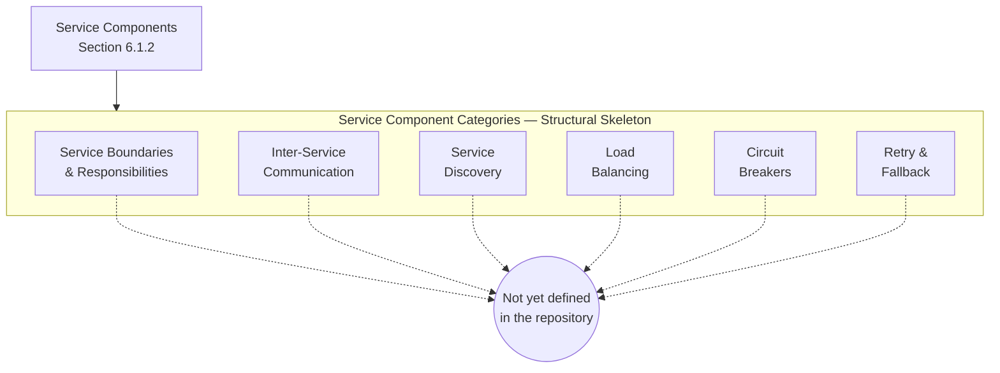

---

### 6.1.3 SCALABILITY DESIGN

#### 6.1.3.1 Horizontal and Vertical Scaling Approach

No horizontal or vertical scaling approach is declared. Per Section 5.3.6, horizontal scaling models, vertical scaling profiles, partitioning strategies, sharding schemes, replication topologies, and back-pressure controls are uniformly "Not yet defined in the repository." Per Section 2.5.2, the Scalability considerations row records verbatim *"None — no components to scale."* Per Section 3.7.1, no containerization asset, no infrastructure-as-code template, no Kubernetes manifest, no Helm chart, no deployment topology descriptor, and no cluster-sizing recommendation exists. Without committed application binaries, runtime images, or deployable units, the foundational preconditions for horizontal replication (stateless workload assumption, sticky-state migration plan, shared-nothing partitioning) and vertical scaling (resource baseline, ceiling, and step-up policy) cannot be characterized.

| Scaling Dimension | Documented State |
|---|---|
| Horizontal scaling model (replicas, partitions) | Not yet defined in the repository |
| Vertical scaling profile (CPU/memory ceilings) | Not yet defined in the repository |
| Partitioning / sharding strategy | Not yet defined in the repository |
| Replication topology (active-active, active-passive) | Not yet defined in the repository |

#### 6.1.3.2 Auto-Scaling Triggers and Rules

No auto-scaling triggers or rules are declared. Per Section 5.3.6, auto-scaling policy is recorded as "Not yet defined in the repository." The repository contains no cloud-platform auto-scaling group definition, no Kubernetes Horizontal Pod Autoscaler (HPA) / Vertical Pod Autoscaler (VPA) / Cluster Autoscaler manifest, no KEDA event-driven scaler configuration, no serverless concurrency policy, and no application-level scaling-decision metric definition. Trigger metrics (CPU, memory, request rate, queue depth, custom KPIs), scaling cooldowns, step-up / step-down rates, minimum / maximum replica bounds, and predictive vs. reactive scaling postures are uniformly undefined.

| Auto-Scaling Dimension | Documented State |
|---|---|
| Scaler technology / platform | Not yet defined in the repository |
| Trigger metric(s) (CPU, RPS, queue depth, custom) | Not yet defined in the repository |
| Cooldown and step-rate policy | Not yet defined in the repository |
| Min / max replica bounds | Not yet defined in the repository |

#### 6.1.3.3 Resource Allocation Strategy

No resource allocation strategy is declared. The repository contains no container resource-request / resource-limit specifications, no Kubernetes ResourceQuota / LimitRange manifests, no quality-of-service class assignments, no cgroup configuration, no node-affinity / anti-affinity rules, no taint / toleration policy, and no priority-class assignment. CPU pinning, NUMA topology preferences, memory huge-page configuration, ephemeral storage budgets, and GPU / accelerator allocation are uniformly undefined.

| Resource Allocation Dimension | Documented State |
|---|---|
| Compute requests / limits per workload | Not yet defined in the repository |
| Memory requests / limits per workload | Not yet defined in the repository |
| Storage and I/O bandwidth budgets | Not yet defined in the repository |
| Node affinity / anti-affinity policy | Not yet defined in the repository |

#### 6.1.3.4 Performance Optimization Techniques

No performance optimization techniques are declared. Per Section 5.4.4 (Caching Strategy Justification), cache topology, eviction policy, invalidation strategy, and cache coherence model are uniformly "Not yet defined in the repository." Per Section 3.6.2 (Storage Categories), in-memory cache, distributed cache, message queue, and streaming platform categories are likewise undefined. Connection pooling, request batching, query optimization, hot-path inlining, lazy initialization, asynchronous I/O, CDN edge caching, payload compression, and HTTP/2 / HTTP/3 multiplexing are uniformly undefined because no application surface exists against which to apply them.

| Performance Optimization Dimension | Documented State |
|---|---|
| Caching topology and policy | Not yet defined in the repository |
| Connection pooling / keep-alive | Not yet defined in the repository |
| Query / payload optimization | Not yet defined in the repository |
| CDN / edge acceleration | Not yet defined in the repository |

#### 6.1.3.5 Capacity Planning Guidelines

No capacity planning guidelines are declared. Per Section 5.5.5 (Performance Requirements and SLAs), per-step time budgets, end-to-end latency targets, throughput targets, availability targets, service-credit schedules, and capacity / load profiles are uniformly "Not yet defined in the repository." Per Section 4.7.1, no success metrics, target thresholds, measurement instrumentation, or acceptance criteria are described in the repository. Headroom factors, growth-rate assumptions, peak-to-average ratios, traffic-shaping profiles, and capacity-review cadence are uniformly undefined.

| Capacity Planning Dimension | Documented State |
|---|---|
| Baseline load profile (RPS, concurrent users, etc.) | Not yet defined in the repository |
| Peak-to-average ratio and burst headroom | Not yet defined in the repository |
| Growth-rate assumptions and horizon | Not yet defined in the repository |
| Capacity review cadence and ownership | Not yet defined in the repository |

#### 6.1.3.6 Scalability Architecture Skeleton Diagram

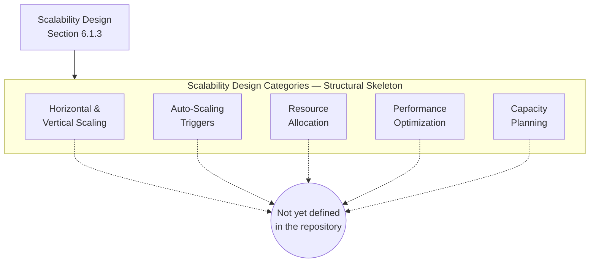

---

### 6.1.4 RESILIENCE PATTERNS

#### 6.1.4.1 Fault Tolerance Mechanisms

No fault tolerance mechanisms are declared. Per Section 5.5.3 (Error Handling Patterns), retry mechanisms, fallback / graceful degradation, error notification flows, recovery procedures, circuit breaker policy, timeout / back-off configuration, and dead-letter queue / poison-message handling are uniformly "Not yet defined in the repository." Bulkhead isolation, shed-load mechanisms, timeout budgets, idempotent-operation conventions, and supervisory restart strategies are uniformly undefined because no executable surface exists against which fault tolerance could be applied.

| Fault Tolerance Dimension | Documented State |
|---|---|
| Retry mechanism (count, back-off) | Not yet defined in the repository |
| Circuit breaker policy | Not yet defined in the repository |
| Bulkhead isolation / pool partitioning | Not yet defined in the repository |
| Timeout and dead-letter handling | Not yet defined in the repository |

#### 6.1.4.2 Disaster Recovery Procedures

No disaster recovery procedures are declared. Per Section 5.5.6, Recovery Point Objective (RPO), Recovery Time Objective (RTO), backup schedule and retention, failover / failback topology, geographic redundancy / multi-region strategy, data residency / region constraints, and business continuity playbooks are all recorded as "Not yet defined in the repository." Per Section 3.6.3, RPO and RTO are likewise undefined. No runbook, no chaos-engineering playbook, no restore-drill cadence, and no incident-classification matrix exists.

| Disaster Recovery Dimension | Documented State |
|---|---|
| Recovery Point Objective (RPO) | Not yet defined in the repository |
| Recovery Time Objective (RTO) | Not yet defined in the repository |
| Backup schedule and retention | Not yet defined in the repository |
| Business continuity playbook | Not yet defined in the repository |

#### 6.1.4.3 Data Redundancy Approach

No data redundancy approach is declared. Per Section 3.6.1, no database schema, ORM model, migration directory, seed data file, or storage configuration is present, leaving no data assets against which redundancy could be defined. Per Section 5.3.6, replication topology is recorded as "Not yet defined in the repository." Synchronous vs. asynchronous replication, multi-region replication lag tolerances, write-quorum policies, snapshotting schedules, and erasure-coded vs. mirrored storage selections are uniformly undefined.

| Data Redundancy Dimension | Documented State |
|---|---|
| Replication model (sync, async, semi-sync) | Not yet defined in the repository |
| Replication topology (cross-zone, cross-region) | Not yet defined in the repository |
| Snapshot / point-in-time recovery policy | Not yet defined in the repository |
| Quorum and consistency model | Not yet defined in the repository |

#### 6.1.4.4 Failover Configurations

No failover configurations are declared. Per Section 5.5.6, failover / failback topology and geographic redundancy / multi-region strategy are recorded as "Not yet defined in the repository." DNS-based failover (Route 53 health checks, weighted records), application-tier failover (warm-standby, hot-standby), database failover (managed primary-replica promotion, leader election), and traffic-redirection policies (BGP anycast, GSLB) are uniformly undefined.

| Failover Configuration Dimension | Documented State |
|---|---|
| Failover topology (active-active, active-passive) | Not yet defined in the repository |
| Failover triggering mechanism | Not yet defined in the repository |
| Failback procedure and verification | Not yet defined in the repository |
| Cross-region / cross-zone scope | Not yet defined in the repository |

#### 6.1.4.5 Service Degradation Policies

No service degradation policies are declared. The repository contains no graceful-degradation policy document, no feature-flag platform configuration, no read-only / maintenance-mode toggle, no shed-load priority matrix, and no critical-vs.-best-effort tiering of operations. Per Section 5.5.3, fallback / graceful degradation is recorded as "Not yet defined in the repository." Per Section 5.5.5, availability targets (uptime, MTTR, MTBF) and service-credit schedules are likewise undefined, meaning no degradation thresholds can be anchored to externally committed SLAs.

| Service Degradation Dimension | Documented State |
|---|---|
| Degraded-mode definition and triggers | Not yet defined in the repository |
| Feature-flag / kill-switch mechanism | Not yet defined in the repository |
| Read-only / maintenance-mode policy | Not yet defined in the repository |
| Critical vs. best-effort operation tiering | Not yet defined in the repository |

#### 6.1.4.6 Resilience Pattern Skeleton Diagram

The following structural skeleton mirrors and complements the Error Handling Flow Skeleton Diagram established in Section 5.5.7. It preserves the canonical resilience-pattern schema requested by the Section 6.1 prompt with each category routed to the shared "Not yet defined in the repository" sentinel.

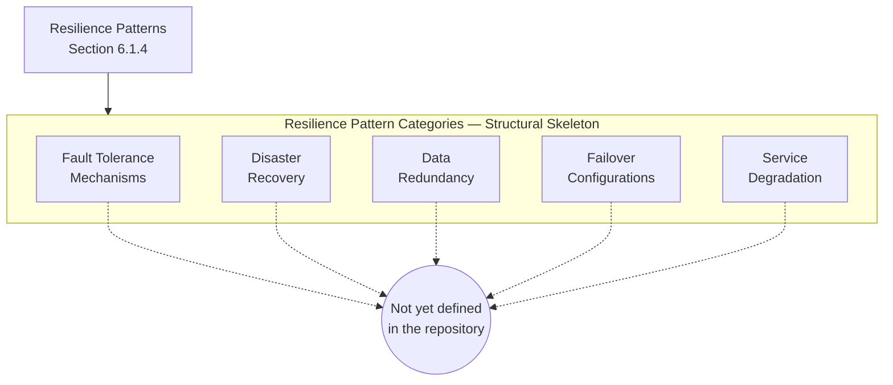

---

### 6.1.5 CROSS-REFERENCE TO CANONICAL REPOSITORY STATE

#### 6.1.5.1 Repository State Snapshot Reference

Readers seeking the primary evidence underlying every "Not yet defined in the repository" entry throughout Section 6.1 should consult the **Repository State Snapshot in Section 1.3.3**, which is the canonical visual representation of the verified contents of the repository (`README.md`, `.git/` metadata) alongside the categories of artifacts confirmed absent (no source code, no package manifests, no configuration files, no CI/CD workflows, no design documents, no test directories). Per the cross-reference policy established in Section 2.7.3, that snapshot is not duplicated here in order to avoid evidentiary duplication.

#### 6.1.5.2 Related Specification Sections

The following sections provide the evidence base for the verified absences documented throughout Section 6.1. They are listed here for navigational convenience and as the basis for re-authoring this section once their content is enriched.

| Related Section | Evidentiary Role for Section 6.1 |
|---|---|
| Section 1.2.1 (Integration with Enterprise Landscape) | All four integration dimensions documented "None present in repository" |
| Section 1.2.2 (Major System Components / Core Technical Approach) | "Architectural pattern: Not yet defined in the repository" |
| Section 1.2.3 (Success Criteria) | No KPIs, thresholds, or acceptance criteria |
| Section 1.3.1 (Implementation Boundaries) | "No architecture definition exists" |
| Section 1.3.3 (Repository State Snapshot) | Canonical visual cross-reference |
| Section 2.5.2 (Consideration Dimensions) | "None — no components to scale" |
| Section 3.5.1 (Verified Absence of External Integrations) | No broker, no SDK, no webhook handler |
| Section 3.6.1 (Verified Absence of Data Persistence Artifacts) | No schema, ORM, migration, seed |
| Section 3.6.2 (Storage Categories) | Cache and queue categories undefined |
| Section 3.6.3 (Data Persistence Strategy) | RPO / RTO / encryption undefined |
| Section 3.7.1 (Verified Absence of Deployment Tooling) | No containerization, no IaC, no CI/CD |
| Section 4.5.2 (Error Handling) | Retry, fallback, circuit breaker, DLQ undefined |
| Section 4.7.1 (Service Level Agreement Inventory) | Complete SLA / timing absence inventory |
| Section 5.1.4 (Default Architectural Style Inapplicability) | Inapplicability argument extended here |
| Section 5.2 (High-Level Architecture) | Empty component inventory; no data flows |
| Section 5.3 (Component Details) | Scaling considerations undefined |
| Section 5.4 (Technical Decisions) | Communication pattern choices undefined |
| Section 5.5 (Cross-Cutting Concerns) | Error handling, performance, DR undefined |
| Section 5.7 (Re-Authoring Trigger) | Trigger-event pattern exemplar |

---

### 6.1.6 RE-AUTHORING TRIGGER

#### 6.1.6.1 Trigger Preconditions

This Section 6.1 inherits and elaborates the Re-Authoring Trigger pattern established in Section 2.5.3 and refined in Sections 3.9.1, 4.9.1, and 5.7.1. The following commit-level events constitute re-authoring triggers for Section 6.1 and its subsections. Until any such trigger is satisfied, the applicability determination in Section 6.1.1.1 remains in force.

| Trigger Event | Section 6.1 Subsection(s) Requiring Update |
|---|---|
| Service definitions or module-boundary declarations committed (microservice manifests, monolithic module structure, package definitions) | 6.1.2.1 Service Boundaries; 6.1.2.2 Inter-Service Communication |
| API specification committed (OpenAPI / Swagger, GraphQL schema, gRPC `.proto`) | 6.1.2.2 Inter-Service Communication |
| Service registry, service-mesh, or DNS-SRV configuration committed | 6.1.2.3 Service Discovery |
| Load-balancer or reverse-proxy configuration committed (NGINX, HAProxy, Envoy, cloud LB, Ingress) | 6.1.2.4 Load Balancing |
| Circuit-breaker library declaration or outlier-detection policy committed | 6.1.2.5 Circuit Breakers |
| Retry policy, back-off configuration, or fallback handler committed | 6.1.2.6 Retry and Fallback |
| Container manifest, image build file, or orchestration descriptor (Kubernetes, Helm, container builds) committed | 6.1.3.1 Horizontal/Vertical Scaling; 6.1.3.3 Resource Allocation |
| Auto-scaling rule committed (HPA, VPA, KEDA, cloud ASG, serverless concurrency) | 6.1.3.2 Auto-Scaling Triggers |
| Cache configuration committed (Redis, Memcached, in-process LRU) | 6.1.3.4 Performance Optimization |
| SLA / SLO / SLI definitions, performance budgets, or load-test plans committed | 6.1.3.5 Capacity Planning |
| Disaster recovery procedure, RPO/RTO declaration, backup policy, or business continuity playbook committed | 6.1.4.2 Disaster Recovery |
| Replication, snapshot, or quorum policy committed for any data store | 6.1.4.3 Data Redundancy |
| Failover topology (DNS-failover, GSLB, primary-replica promotion) committed | 6.1.4.4 Failover Configurations |
| Feature-flag platform, kill-switch, or graceful-degradation policy committed | 6.1.4.5 Service Degradation |
| Infrastructure-as-Code asset committed (Terraform, CloudFormation, Pulumi) | 6.1.3.1 Horizontal/Vertical Scaling; 6.1.4.4 Failover |

#### 6.1.6.2 Section Update Cadence

Per the assumption documented in Section 2.7.1 (*"This Technical Specification will be revised once project intent is articulated"*), Section 6.1 will be regenerated end-to-end on the first specification cycle following the commit of any of the trigger events enumerated in Section 6.1.6.1. Until such an event occurs, Section 6.1 remains in its current "not applicable" state. When re-authored, each placeholder skeleton diagram in Sections 6.1.2.7, 6.1.3.6, and 6.1.4.6 should be replaced with — or supplemented by — concrete service-interaction, scalability-architecture, and resilience-pattern diagrams that reflect the committed artifacts. The Empty sentinel nodes should be removed from any category for which evidence has been committed, and the applicability determination in Section 6.1.1.1 should be re-evaluated against the committed service decomposition.

#### 6.1.6.3 Identifier Reservation Reaffirmed

Consistent with Section 2.1.3 (Identifier Reservation Policy) and reaffirmed in Sections 3.9.3, 4.9.3, 5.1.3, and 5.7.3, this section continues to issue no service identifiers, no component identifiers, no interface identifiers, no scaling-policy identifiers, no circuit-breaker identifiers, no failover-tier identifiers, and no disaster-recovery procedure identifiers. Issuance is deferred until at least one declarative service-architecture artifact is committed to the repository.

---

### 6.1.7 References

#### 6.1.7.1 Files Examined

- `README.md` — The sole tracked file in the repository (11 bytes, content `# Artifact6`). Confirms the pre-implementation initialization state that grounds the "not applicable" determination for Core Services Architecture.

#### 6.1.7.2 Folders Explored

- `` (repository root, depth: 0) — Confirmed to contain exactly one direct child (`README.md`). No subdirectories, no source code, no configuration, no service manifests, no infrastructure-as-code assets, no orchestration descriptors, no CI/CD definitions.

#### 6.1.7.3 Technical Specification Sections Retrieved

- **Section 1.3 SCOPE** — Canonical Repository State Snapshot (Section 1.3.3); in-scope and out-of-scope tables anchored in verified absence; authoring caveat (Section 1.3.4).
- **Section 5.1 SECTION AUTHORING BASIS** — Verified-absence convention; diagram style convention with Empty sentinel; identifier reservation policy; default-style-inapplicability argument.
- **Section 5.2 HIGH-LEVEL ARCHITECTURE** — Core Components Table pattern; integration-points pattern; data-flow pattern; structural-skeleton diagram exemplar.
- **Section 5.3 COMPONENT DETAILS** — Empty component inventory; scaling considerations table; component-interaction, state-transition, and sequence skeleton diagrams.
- **Section 5.4 TECHNICAL DECISIONS** — Communication pattern choices, data storage rationale, caching strategy, security mechanism — all undefined; ADR skeleton pattern.
- **Section 5.5 CROSS-CUTTING CONCERNS** — Error handling patterns (retry, fallback, circuit breaker, timeout, DLQ); disaster recovery procedures (RPO, RTO, backup, failover); error-handling skeleton diagram.
- **Section 5.6 CROSS-REFERENCE TO CANONICAL REPOSITORY STATE** — Repository-state cross-reference pattern; related-sections navigational table format.
- **Section 5.7 RE-AUTHORING TRIGGER** — Commit-level trigger event enumeration; section update cadence; identifier-reservation reaffirmation pattern.

## 6.2 Database Design

### 6.2.1 APPLICABILITY DETERMINATION

#### 6.2.1.1 Headline Determination

**Database Design is not applicable to this system in its current state.**

The Artifact6 repository is in a pre-implementation initialization state. Per the canonical Repository State Snapshot in Section 1.3.3, the complete tracked footprint consists of a single `README.md` file (11 bytes, content `# Artifact6`) under a single `Initial commit` (`a3789fc`, dated `2026-05-28`) on the `main` branch authored by GitHub user `shalini690`. No database schema, no ORM model, no migration directory, no seed data file, no storage configuration, no data-source descriptor, no connection-string declaration, no entity definition, no table declaration, no index specification, no constraint declaration, no partitioning rule, no sharding key, no replication topology, no backup schedule, no retention policy, no archival rule, no caching configuration, no connection-pool descriptor, and no query optimization artifact exist anywhere in the repository.

The Section 6.2 prompt explicitly provides the *"If the system does not require or direct database or persistent storage interactions are not clearly evident, clearly state 'Database Design is not applicable to this system'"* path. That path is the correct path to invoke here, because the foundational evidence for declaring a system to *require* persistent storage is entirely absent. Per Section 3.6.1, *"No database schema, ORM model, migration directory, seed data file, or storage configuration is present in the repository."* Per Section 1.3.1 (Implementation Boundaries), *"Data domains included: No — No schema, data model, or data-dictionary artifacts exist."* Per Section 5.3.5 (Data Persistence Requirements), no data persistence requirements are declared and the database schema, ORM model, migration directory, and seed data rows are uniformly recorded as *"None."* Per Section 5.4.3 (Data Storage Solution Rationale), no data storage solution rationale is recorded. Per Section 5.4.4 (Caching Strategy Justification), no caching strategy is recorded.

This applicability determination directly parallels — and is logically downstream of — the determination in Section 6.1.1.1 that *"Core Services Architecture is not applicable for this system in its current state,"* because the prerequisites for a database design (data domains, functional requirements, feature-driven entity catalog, integration manifest, performance/SLA targets, operational tooling baseline) are the same prerequisites whose absence drove the Section 6.1 determination.

#### 6.2.1.2 Authoring Approach (Verified-Absence Convention)

This section has been authored under the same verified-absence convention established by Sections 1.3.4, 2.1.1, 3.1.2, 4.1.1, 5.1.1, and 6.1.1.2 of this Technical Specification. Each subcategory requested by the Section 6.2 prompt — entity relationships, data models, indexing strategy, partitioning approach, replication configuration, backup architecture, migration procedures, versioning strategy, archival policies, data storage and retrieval mechanisms, caching policies, data retention rules, backup and fault tolerance policies, privacy controls, audit mechanisms, access controls, query optimization patterns, caching strategy, connection pooling, read/write splitting, and batch processing — is preserved as a structural-schema placeholder with explicit "Not yet defined in the repository" markers under the canonical schema. This approach provides a stable, forward-compatible target for enrichment once the repository declares schema definitions, ORM models, migration scripts, seed data, storage configurations, caching topologies, and access-control policies.

Mermaid diagrams in this section employ the restricted syntax already validated by prior sections — `flowchart TD` or `flowchart LR`; `subgraph ... end` blocks; square-bracket `[...]` node labels; double-parenthesis `((...))` terminal sentinel nodes for the Empty terminus; solid `-->` arrows for structural relationships; dashed `-.->` arrows for connections to the Empty sentinel; `<br/>` for in-node line breaks; and the HTML entity `&amp;` for ampersands. Per the convention established in Section 4.1.2 and reaffirmed in Sections 5.3.7, 5.3.8, 5.3.9, and 6.1.2.7, where the Section 6.2 prompt requests an Entity-Relationship Diagram (ERD), a Data Flow Diagram, and a Replication Architecture Diagram, this section instead renders structural-skeleton `flowchart` diagrams because the absence of any entities, data flows, or replication topologies in the repository makes the use of `erDiagram` semantically unjustified and visually misleading. The `erDiagram` Mermaid type requires at least one entity with at least one attribute and, in practice, at least one relationship between two entities; none of these preconditions can be satisfied by the current repository state.

#### 6.2.1.3 Identifier Reservation

Consistent with the Identifier Reservation Policy established in Section 2.1.3 and reaffirmed in Sections 3.9.3, 4.9.3, 5.1.3, 5.7.3, and 6.1.1.3, this section issues **no** entity identifiers, **no** table identifiers, **no** column identifiers, **no** primary-key identifiers, **no** foreign-key identifiers, **no** index identifiers, **no** constraint identifiers, **no** schema-namespace identifiers, **no** view identifiers, **no** stored-procedure identifiers, **no** trigger identifiers, **no** migration identifiers, **no** partition identifiers, **no** shard identifiers, **no** replication-tier identifiers, **no** cache-region identifiers, **no** connection-pool identifiers, **no** retention-policy identifiers, and **no** backup-job identifiers. Issuance is deferred until at least one declarative data-persistence artifact is committed to the repository (see Section 6.2.7 for the enumerated trigger events). This policy prevents the creation of dangling database identifiers that would otherwise need to be retired in a later specification cycle.

#### 6.2.1.4 Inapplicability of Default Database Design

The Section 6.2 prompt enumerates database-design concerns whose population customarily depends on a defaulted or assumed data architecture (for example, a relational store backed by PostgreSQL/MySQL, a document store backed by MongoDB, a key-value store backed by Redis/DynamoDB, a wide-column store backed by Cassandra, a graph store backed by Neo4j, a search index backed by Elasticsearch, or a hybrid polyglot persistence model). Following the precedent of Section 3.1.3 (Default Technology Stack Inapplicability), Section 5.1.4 (Default Architectural Style Inapplicability), and Section 6.1.1.4 (Inapplicability of Default Service Architecture), this section concludes that no default database design can be applied for the equivalent reason: every decision input that would constrain database selection, schema topology, indexing, partitioning, replication, and caching is missing.

| Decision Input Required to Design a Database | Source Section | Documented State |
|---|---|---|
| Data domains driving schema decomposition | Section 1.3.1 (Implementation Boundaries) | None — no schema, data model, or dictionary |
| Functional requirements defining entities and operations | Section 2.3 (Functional Requirements Table) | None — no functional requirements declared |
| Feature catalog defining data flows and CRUD surfaces | Section 2.2 (Feature Catalog) | None — feature catalog is empty |
| Business domain driving entity-relationship model | Section 1.1.2 (Core Business Problem) | None — no business problem statement |
| Integration manifest defining data exchanges | Section 1.2.1 (Integration with Enterprise Landscape) | None — no integrations evidenced |
| Performance / SLA targets driving indexing and partitioning | Section 1.2.3; Section 4.7.1 | None — no KPIs or thresholds |
| Operational tooling defining deployment topology | Section 3.7 (Development & Deployment) | None — no pipelines, images, or manifests |
| Read/write consistency model driving replication | Section 3.6.3 (Data Persistence Strategy) | Not yet defined in the repository |
| Encryption-at-rest and residency constraints | Section 3.6.3 (Data Persistence Strategy) | Not yet defined in the repository |

Because none of these decision inputs is populated, no schema-decomposition rationale, no indexing strategy, no partitioning rule, no replication topology, no caching policy, and no retention/archival policy can be evaluated against meaningful criteria. The structural skeletons that follow therefore deliberately avoid asserting any specific database engine, schema topology, indexing technique, partitioning scheme, replication tier, or caching strategy.

---

### 6.2.2 SCHEMA DESIGN

#### 6.2.2.1 Entity Relationships

No entity relationships are declared in the repository. Per Section 3.6.1, no Mongoose, SQLAlchemy, Hibernate, or Prisma schema declaration is present, and no `.sql` file is committed. Per Section 5.3.5, the database schema, ORM model, and seed data rows are recorded uniformly as *"None."* Entity sets, relationship sets, cardinality declarations (one-to-one, one-to-many, many-to-many), identifying-vs.-non-identifying relationships, optional-vs.-mandatory participation, and inheritance / specialization hierarchies are uniformly undefined. No ERD source artifact, no DBML file, no PlantUML schema diagram, and no draw.io / Visio schema export exists.

| Entity Relationship Dimension | Documented State |
|---|---|
| Entity catalog (named entities and their attributes) | Not yet defined in the repository |
| Relationship catalog (cardinality, participation) | Not yet defined in the repository |
| Primary-key and foreign-key declarations | Not yet defined in the repository |
| Inheritance / specialization hierarchies | Not yet defined in the repository |

#### 6.2.2.2 Data Models and Structures

No data models or data structures are declared. Per Section 3.6.2 (Storage Categories), every storage category — primary relational database, primary document / NoSQL database, secondary / read-replica database, in-memory cache, distributed cache / session store, object / blob storage, file / network storage, search index, time-series / metrics store, message queue / streaming platform, and data warehouse / analytics store — is recorded as *"Not yet defined in the repository."* Therefore the model paradigm (relational, document, key-value, wide-column, graph, time-series, vector, search) cannot be selected; logical and physical schema layers cannot be elaborated; normalization level (1NF / 2NF / 3NF / BCNF / 4NF / 5NF / 6NF) cannot be characterized; and denormalization or materialized-view strategies cannot be justified.

| Data Model Dimension | Documented State |
|---|---|
| Model paradigm (relational, document, K/V, columnar, graph) | Not yet defined in the repository |
| Logical schema | Not yet defined in the repository |
| Physical schema (storage layout, file groups, tablespaces) | Not yet defined in the repository |
| Normalization / denormalization posture | Not yet defined in the repository |

#### 6.2.2.3 Indexing Strategy

No indexing strategy is declared. The repository contains no index DDL statements, no `CREATE INDEX` declarations, no composite-index definitions, no functional-index expressions, no partial-index predicates, no covering-index specifications, no full-text-search index declarations, no spatial-index declarations, no GIN/GiST/BRIN/HASH index hints, no MongoDB index spec, no Elasticsearch mapping definition, and no DynamoDB Global / Local Secondary Index declarations. Per Section 6.1.3.4, *"Query / payload optimization"* is recorded as *"Not yet defined in the repository,"* further confirming that no index-driven query-optimization techniques have been documented. Index cardinality estimation, selectivity analysis, hot-path analysis, and read/write-amplification tradeoffs cannot be characterized because no query workload has been defined.

| Indexing Dimension | Documented State |
|---|---|
| Primary indexes (clustered, heap, B-tree, LSM) | Not yet defined in the repository |
| Secondary indexes (B-tree, hash, bitmap, GIN/GiST, BRIN) | Not yet defined in the repository |
| Composite, partial, functional, and covering indexes | Not yet defined in the repository |
| Full-text, spatial, vector, or specialized indexes | Not yet defined in the repository |

#### 6.2.2.4 Partitioning Approach

No partitioning approach is declared. Per Section 5.3.6, partitioning / sharding strategy is recorded as *"Not yet defined in the repository,"* and per Section 6.1.3.1, the partitioning / sharding strategy row is likewise undefined. Horizontal partitioning (range, list, hash, composite, sub-partitioning), vertical partitioning (column-group separation), table partitioning by tenant / region / time, sharding key selection, shard-routing logic, cross-shard query strategy, rebalancing procedures, and hotspot mitigation rules are uniformly undefined.

| Partitioning Dimension | Documented State |
|---|---|
| Partitioning model (horizontal, vertical, composite) | Not yet defined in the repository |
| Partition key / sharding key selection | Not yet defined in the repository |
| Cross-partition query / transaction strategy | Not yet defined in the repository |
| Rebalancing and hotspot mitigation policy | Not yet defined in the repository |

#### 6.2.2.5 Replication Configuration

No replication configuration is declared. Per Section 5.3.6 and Section 6.1.4.3, replication topology and the replication model (synchronous / asynchronous / semi-synchronous) are recorded as *"Not yet defined in the repository."* Per Section 3.6.2, secondary / read-replica database storage is *"Not yet defined in the repository."* Per Section 6.1.4.3 (Data Redundancy Approach), cross-zone, cross-region, snapshot, point-in-time recovery, quorum, and consistency-model dimensions are uniformly undefined. Primary-replica topologies, multi-primary topologies, conflict-resolution policies, replication lag tolerances, and write-quorum policies cannot be characterized.

| Replication Dimension | Documented State |
|---|---|
| Replication model (sync, async, semi-sync) | Not yet defined in the repository |
| Replication topology (primary-replica, multi-primary, mesh) | Not yet defined in the repository |
| Geographic scope (single-zone, multi-zone, multi-region) | Not yet defined in the repository |
| Quorum, conflict resolution, and consistency model | Not yet defined in the repository |

#### 6.2.2.6 Backup Architecture

No backup architecture is declared. Per Section 3.6.3, backup frequency / RPO target and recovery time objective (RTO) are recorded as *"Not yet defined in the repository."* Per Section 5.5.6 (Disaster Recovery Procedures), backup schedule and retention, failover / failback topology, geographic redundancy / multi-region strategy, data residency / region constraints, and business continuity playbooks are all *"Not yet defined in the repository."* Per Section 6.1.4.2, the backup schedule and retention dimension is likewise undefined. Backup methods (full, incremental, differential), snapshot strategy, write-ahead log shipping, binary-log archival, off-site backup replication, restore-test cadence, and cross-region backup vaulting cannot be characterized.

| Backup Dimension | Documented State |
|---|---|
| Backup method (full, incremental, differential, snapshot) | Not yet defined in the repository |
| Backup schedule and retention period | Not yet defined in the repository |
| Off-site / cross-region backup target | Not yet defined in the repository |
| Restore verification and drill cadence | Not yet defined in the repository |

#### 6.2.2.7 Schema Design Skeleton Diagram

Per Section 4.1.2 of this Technical Specification, an `erDiagram` rendering requires at least one entity with attributes and, in practice, at least one relationship between two entities; neither precondition is satisfied by the current repository state. Consistent with the precedent established in Sections 5.3.7, 5.3.8, 5.3.9, 6.1.2.7, 6.1.3.6, and 6.1.4.6, the requested ERD is rendered below as a structural-skeleton `flowchart` diagram with an Empty sentinel terminus that preserves the canonical schema-design schema while transparently recording that the corresponding content collection is empty at the time of authoring.

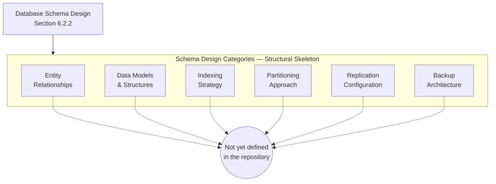

---

### 6.2.3 DATA MANAGEMENT

#### 6.2.3.1 Migration Procedures

No migration procedures are declared. Per Section 3.6.1, *"no `migrations/` or `alembic/` directory"* exists in the repository. The repository contains no Alembic, Flyway, Liquibase, Knex, Sequelize, TypeORM, Prisma Migrate, Django migrations, Rails ActiveRecord migrations, EF Core migrations, or golang-migrate artifacts. Migration ordering policy (timestamp-based, sequential, dependency-graph based), forward-migration scripts, backward / rollback scripts, idempotency conventions, transactional-migration boundaries, lock-acquisition strategy for online schema change (gh-ost, pt-online-schema-change), and zero-downtime migration patterns (expand-contract, parallel-change) are uniformly undefined.

| Migration Dimension | Documented State |
|---|---|
| Migration framework / tool | Not yet defined in the repository |
| Forward and rollback script convention | Not yet defined in the repository |
| Online schema change strategy | Not yet defined in the repository |
| Zero-downtime / expand-contract pattern | Not yet defined in the repository |

#### 6.2.3.2 Versioning Strategy

No schema versioning strategy is declared. The repository contains no schema-version table, no metadata-versioning convention, no semantic-versioning policy for migrations, no migration-history table, no schema-registry binding (for Avro/Protobuf schema evolution), and no compatibility-mode declaration (backward, forward, full, none). Schema-version pinning to application releases, blue/green deployment compatibility windows, and dual-write / dual-read transition strategies are uniformly undefined.

| Versioning Dimension | Documented State |
|---|---|
| Schema version tracking mechanism | Not yet defined in the repository |
| Migration ordering and numbering convention | Not yet defined in the repository |
| Backward / forward compatibility policy | Not yet defined in the repository |
| Schema registry binding (Avro, Protobuf, JSON Schema) | Not yet defined in the repository |

#### 6.2.3.3 Archival Policies

No archival policies are declared. Per Section 3.6.3, the data retention period and data residency / region constraints are recorded as *"Not yet defined in the repository."* Cold-storage tiering (hot / warm / cold / archive), time-based archival rules (e.g., move records older than N days to cold storage), legal-hold provisions, archive-format selection (Parquet, ORC, compressed JSON), object-store lifecycle policies (S3 Glacier transitions, GCS Coldline, Azure Cool / Archive), and archive-retrieval SLAs are uniformly undefined.

| Archival Dimension | Documented State |
|---|---|
| Archival trigger (age-based, size-based, event-based) | Not yet defined in the repository |
| Cold-storage tier and format | Not yet defined in the repository |
| Legal hold and litigation hold provisions | Not yet defined in the repository |
| Archive retrieval SLA and procedure | Not yet defined in the repository |

#### 6.2.3.4 Data Storage and Retrieval Mechanisms

No data storage or retrieval mechanisms are declared. Per Section 3.6.1, no database connection string and no data-source configuration is present. Per Section 5.3.4 (Key Interfaces and APIs), HTTP REST endpoints, GraphQL schemas, gRPC service definitions, asynchronous event contracts, command-line interface contracts, and internal module / library APIs are uniformly undefined — therefore no retrieval surface (DAO, repository pattern, active record, data-mapper, CQRS read-model, materialized view) can be enumerated. Object-relational mapping libraries, query builders, raw SQL conventions, and stored-procedure call conventions are uniformly absent.

| Storage / Retrieval Dimension | Documented State |
|---|---|
| Data access layer pattern (DAO, repository, active record) | Not yet defined in the repository |
| Query language / API (SQL, NoSQL query, GraphQL, ORM) | Not yet defined in the repository |
| Read-model / write-model separation (CQRS, projections) | Not yet defined in the repository |
| Connection / session lifecycle management | Not yet defined in the repository |

#### 6.2.3.5 Caching Policies

No caching policies are declared. Per Section 5.4.4 (Caching Strategy Justification), cache topology (look-aside, read-through, write-through, write-behind, refresh-ahead), eviction policy (LRU, LFU, TTL, FIFO), invalidation strategy (event-driven, time-based, write-driven), and cache coherence and consistency model are uniformly *"Not yet defined in the repository."* Per Section 3.6.2, the in-memory cache and distributed cache / session store categories are likewise undefined. Cache-key naming conventions, cache-stampede / dog-pile mitigation (request coalescing, lease-based filling, probabilistic early expiration), and negative-result caching are uniformly absent.

| Caching Policy Dimension | Documented State |
|---|---|
| Cache topology (look-aside, read-through, write-through) | Not yet defined in the repository |
| Eviction policy (LRU, LFU, TTL, FIFO) | Not yet defined in the repository |
| Invalidation strategy (event-driven, time-based, write-driven) | Not yet defined in the repository |
| Cache coherence and consistency model | Not yet defined in the repository |

#### 6.2.3.6 Data Flow Skeleton Diagram

Per Section 5.2.3 of this Technical Specification, no event bus, no message queue, no streaming platform, no REST endpoint, no GraphQL resolver, no gRPC service, and no shared database mediates any flow because none of these artifacts exists. Following the precedent established in Sections 4.2.3, 5.3.7, and 6.1.2.7, the requested Data Flow Diagram is rendered below as a structural-skeleton `flowchart` diagram with an Empty sentinel terminus.

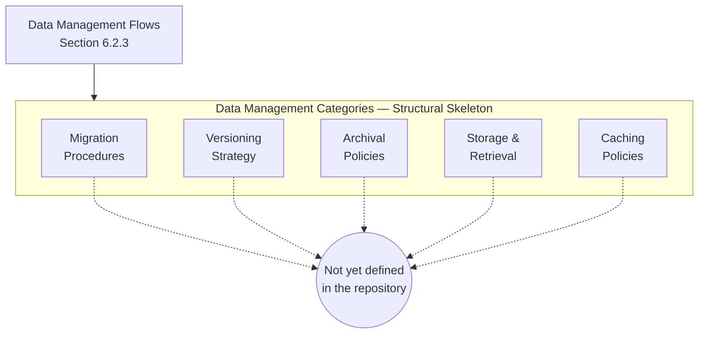

---

### 6.2.4 COMPLIANCE CONSIDERATIONS

#### 6.2.4.1 Data Retention Rules

No data retention rules are declared. Per Section 3.6.3, the data retention period dimension is recorded as *"Not yet defined in the repository."* Regulatory retention obligations (GDPR Article 5(1)(e) storage limitation, HIPAA 45 CFR §164.530(j) six-year minimum, SOX 17 CFR §240.17a-4(b) seven-year retention, PCI-DSS Requirement 3.1, CCPA Section 1798.105 deletion rights), tenant-scoped retention overrides, per-classification retention tiers (PII, PHI, PCI, public, internal), and right-to-be-forgotten workflows are uniformly undefined. No data classification taxonomy, no retention-policy document, no deletion-job descriptor, and no purge-audit log exists.

| Retention Dimension | Documented State |
|---|---|
| Retention period per data class | Not yet defined in the repository |
| Regulatory basis (GDPR, HIPAA, SOX, PCI, CCPA, other) | Not yet defined in the repository |
| Right-to-be-forgotten / deletion workflow | Not yet defined in the repository |
| Retention audit and purge verification | Not yet defined in the repository |

#### 6.2.4.2 Backup and Fault Tolerance Policies

No backup and fault tolerance policies are declared. Per Section 5.5.6 (Disaster Recovery Procedures) and Section 6.1.4.2 (Disaster Recovery Procedures), Recovery Point Objective (RPO), Recovery Time Objective (RTO), backup schedule and retention, failover / failback topology, geographic redundancy / multi-region strategy, data residency / region constraints, and business continuity playbook are uniformly recorded as *"Not yet defined in the repository."* Per Section 6.1.4.1, retry mechanisms, circuit-breaker policy, bulkhead isolation, and timeout / dead-letter handling are likewise undefined. The cross-section absence of any RPO/RTO declaration prevents specification of backup cadence, retention horizon, restore-drill cadence, or failover acceptance criteria.

| Backup / Fault Tolerance Dimension | Documented State |
|---|---|
| Recovery Point Objective (RPO) | Not yet defined in the repository |
| Recovery Time Objective (RTO) | Not yet defined in the repository |
| Backup frequency and retention | Not yet defined in the repository |
| Failover, failback, and restore-drill cadence | Not yet defined in the repository |

#### 6.2.4.3 Privacy Controls

No privacy controls are declared. Per Section 3.6.3, encryption-at-rest configuration is recorded as *"Not yet defined in the repository,"* and per Section 5.4.5 (Security Mechanism Selection), encryption at rest, transport security (TLS, mTLS), and audit and security logging dimensions are uniformly *"Not yet defined in the repository."* Per Section 2.5.2, the Security implications row is recorded verbatim as *"None — no security artifacts."* Data classification labels, field-level encryption, column-level masking, tokenization, pseudonymization, de-identification, differential-privacy noise injection, key-management service (KMS) binding, envelope encryption, and bring-your-own-key (BYOK) policies are uniformly undefined.

| Privacy Control Dimension | Documented State |
|---|---|
| Encryption at rest (engine-level, field-level, BYOK) | Not yet defined in the repository |
| Encryption in transit (TLS, mTLS, IPsec) | Not yet defined in the repository |
| Masking, tokenization, and pseudonymization | Not yet defined in the repository |
| Data classification and labelling taxonomy | Not yet defined in the repository |

#### 6.2.4.4 Audit Mechanisms

No audit mechanisms are declared. Per Section 5.4.5 and Section 5.5.4 (Authentication and Authorization Framework), audit logging of authorization decisions is recorded as *"Not yet defined in the repository."* Per Section 5.5.2 (Logging and Tracing Strategy), log format, log levels, correlation identifier convention, trace context propagation, sensitive-data redaction policy, and sampling policy are uniformly undefined. Database-level audit logging (PostgreSQL `pgaudit`, MySQL audit plugin, SQL Server Audit, Oracle Audit Vault, MongoDB audit logging), data-change-capture trails, immutable / append-only audit stores, tamper-evident hash-chained logs, and audit-log retention horizons are uniformly absent.

| Audit Mechanism Dimension | Documented State |
|---|---|
| Database-level audit logging | Not yet defined in the repository |
| Application-level audit trail (who, what, when, where) | Not yet defined in the repository |
| Tamper-evident / append-only audit storage | Not yet defined in the repository |
| Audit-log retention and access controls | Not yet defined in the repository |

#### 6.2.4.5 Access Controls

No access controls are declared. Per Section 5.5.4 (Authentication and Authorization Framework) and Section 4.4.3 (Authorization Checkpoints), no authentication scheme, no authorization model (RBAC / ABAC / ReBAC / other), no role and permission registry, and no policy enforcement points are present in the repository. Database-level account management, principle-of-least-privilege grants, schema-level / table-level / row-level / column-level access controls, dynamic row-level security policies, just-in-time access provisioning, privileged-access workstations, secrets-vault binding for database credentials, certificate-based authentication (`SCRAM`, `gssapi`, mTLS to database), and IP-allowlist / VPC-peering / private-endpoint controls are uniformly undefined.

| Access Control Dimension | Documented State |
|---|---|
| Database authentication scheme (password, IAM, mTLS, SCRAM) | Not yet defined in the repository |
| Authorization model (role, attribute, relationship-based) | Not yet defined in the repository |
| Row-level / column-level security policy | Not yet defined in the repository |
| Network-level access (VPC, private endpoint, allowlist) | Not yet defined in the repository |

---

### 6.2.5 PERFORMANCE OPTIMIZATION

#### 6.2.5.1 Query Optimization Patterns

No query optimization patterns are declared. Per Section 6.1.3.4 (Performance Optimization Techniques), the *"Query / payload optimization"* row is recorded as *"Not yet defined in the repository."* Query-plan analysis (EXPLAIN / EXPLAIN ANALYZE / query profiler), index tuning, statistics collection (ANALYZE / sp_updatestats), query rewrite rules, denormalization for read paths, materialized-view refresh policies, query-result caching, prepared-statement / parameterized-query conventions, and bind-parameter-vs.-literal injection-safety policies are uniformly undefined. Hot-path query catalogs, slow-query log thresholds, and N+1-query prevention patterns are likewise absent.

| Query Optimization Dimension | Documented State |
|---|---|
| Query plan analysis and tuning policy | Not yet defined in the repository |
| Statistics collection and refresh cadence | Not yet defined in the repository |
| Materialized views and read-model projections | Not yet defined in the repository |
| Prepared / parameterized query convention | Not yet defined in the repository |

#### 6.2.5.2 Caching Strategy

No caching strategy is declared. Per Section 5.4.4, cache topology, eviction policy, invalidation strategy, and cache coherence / consistency model are uniformly *"Not yet defined in the repository."* Per Section 6.1.3.4, the caching topology and policy row is likewise undefined. Multi-tier caching (in-process L1, distributed L2, CDN L3 / edge cache), cache-aside vs. read-through vs. write-through tradeoffs, time-to-live (TTL) strategy, cache-stampede mitigation (request coalescing, lease-based filling, probabilistic early expiration), and negative-cache (cache-of-misses) policies are uniformly undefined.

| Caching Strategy Dimension | Documented State |
|---|---|
| Cache tier (in-process L1, distributed L2, edge L3) | Not yet defined in the repository |
| Read-through / write-through / write-behind policy | Not yet defined in the repository |
| TTL, refresh-ahead, and stampede mitigation | Not yet defined in the repository |
| Distributed-cache technology (Redis, Memcached, Hazelcast) | Not yet defined in the repository |

#### 6.2.5.3 Connection Pooling

No connection pooling configuration is declared. The repository contains no HikariCP, c3p0, DBCP, pgbouncer, PgCat, RDS Proxy, ProxySQL, or Vitess descriptor; no JDBC pool sizing, no SQLAlchemy `pool_size` / `max_overflow`, no Node.js `mysql2` / `pg` pool config, no Django `CONN_MAX_AGE`, and no .NET pooling configuration. Per Section 6.1.3.4, *"Connection pooling / keep-alive"* is recorded as *"Not yet defined in the repository."* Pool sizing heuristics (per-worker, per-instance, per-cluster), connection-lifetime and idle-timeout policies, pool exhaustion / queue policies, leak-detection thresholds, and transaction-pooling vs. session-pooling vs. statement-pooling modes are uniformly undefined.

| Connection Pooling Dimension | Documented State |
|---|---|
| Pooling library / proxy (HikariCP, pgbouncer, RDS Proxy) | Not yet defined in the repository |
| Pool sizing (min, max, overflow) | Not yet defined in the repository |
| Idle / max-lifetime / acquisition timeout policy | Not yet defined in the repository |
| Pooling mode (session, transaction, statement) | Not yet defined in the repository |

#### 6.2.5.4 Read/Write Splitting

No read/write splitting policy is declared. Per Section 3.6.2, the secondary / read-replica database storage category is *"Not yet defined in the repository,"* meaning no read-replica fleet exists against which a splitter could route traffic. Per Section 6.1.4.3 (Data Redundancy Approach), the replication topology dimension is uniformly undefined, foreclosing specification of router behavior (DNS-based, client-driver-aware, proxy-mediated), replica-lag-aware routing, read-your-own-writes consistency guarantees, query-routing hints (`/* READ */` comments, `read_preference` in MongoDB drivers), and write-after-read pinning windows.

| Read/Write Split Dimension | Documented State |
|---|---|
| Router placement (client driver, proxy, gateway) | Not yet defined in the repository |
| Replica-lag-aware routing policy | Not yet defined in the repository |
| Read-your-own-writes / pinning convention | Not yet defined in the repository |
| Write quorum and read consistency level | Not yet defined in the repository |

#### 6.2.5.5 Batch Processing Approach

No batch processing approach is declared. Per Section 5.4.2 (Communication Pattern Choices), the *"Batch / file-based exchange"* row is recorded as *"Not yet defined in the repository."* Per Section 5.3.4, no command-line interface contracts and no internal module / library APIs exist — therefore no batch job, no cron / scheduler descriptor (cron, systemd timers, Kubernetes CronJob, Airflow DAG, Luigi, Prefect, Dagster, AWS Step Functions, Azure Data Factory), no ETL / ELT pipeline (dbt, Airbyte, Fivetran, Spark, Flink, Beam), no bulk-load convention (`COPY`, `LOAD DATA`, `mongoimport`, `bcp`, `pg_bulkload`), and no chunked-pagination pattern is committed. Idempotent re-run policy, checkpointing, watermarks, and backfill procedures are uniformly undefined.

| Batch Processing Dimension | Documented State |
|---|---|
| Scheduler / orchestrator (cron, Airflow, Step Functions) | Not yet defined in the repository |
| Bulk-load / bulk-export convention | Not yet defined in the repository |
| Idempotency, checkpointing, and watermark policy | Not yet defined in the repository |
| Backfill and reprocessing procedure | Not yet defined in the repository |

#### 6.2.5.6 Replication Architecture Skeleton Diagram

Per the convention established in Sections 4.1.2, 5.3.7, 5.3.9, 6.1.2.7, 6.1.3.6, and 6.1.4.6, the requested Replication Architecture Diagram is rendered below as a structural-skeleton `flowchart` diagram with an Empty sentinel terminus, because no replication participants (primary node, replica node, witness node, cache replica, search index replica) and no replication topology exist in the repository against which a meaningful diagram could be drawn.

```mermaid
flowchart LR
    PerfRoot["Performance Optimization<br/>&amp; Replication Architecture<br/>Section 6.2.5"]

    subgraph PerfCat["Performance Optimization Categories — Structural Skeleton"]
        QueryOpt["Query<br/>Optimization"]
        CacheStrat["Caching<br/>Strategy"]
        Pooling["Connection<br/>Pooling"]
        RWSplit["Read/Write<br/>Splitting"]
        Batch["Batch<br/>Processing"]
    end

    subgraph ReplCat["Replication Architecture Categories — Structural Skeleton"]
        PrimaryTier["Primary<br/>Tier"]
        ReplicaTier["Replica<br/>Tier"]
        Topology["Replication<br/>Topology"]
        Consistency["Consistency<br/>Model"]
    end

    Empty(("Not yet defined<br/>in the repository"))

    PerfRoot --> PerfCat
    PerfRoot --> ReplCat

    QueryOpt -.-> Empty
    CacheStrat -.-> Empty
    Pooling -.-> Empty
    RWSplit -.-> Empty
    Batch -.-> Empty

    PrimaryTier -.-> Empty
    ReplicaTier -.-> Empty
    Topology -.-> Empty
    Consistency -.-> Empty
```

---

### 6.2.6 CROSS-REFERENCE TO CANONICAL REPOSITORY STATE

#### 6.2.6.1 Repository State Snapshot Reference

Readers seeking the primary evidence underlying every "Not yet defined in the repository" entry throughout Section 6.2 should consult the **Repository State Snapshot in Section 1.3.3**, which is the canonical visual representation of the verified contents of the repository (`README.md`, `.git/` metadata) alongside the categories of artifacts confirmed absent (no source code, no package manifests, no configuration files, no CI/CD workflows, no design documents, no test directories). Per the cross-reference policy established in Section 2.7.3 and reaffirmed in Sections 5.6.1 and 6.1.5.1, that snapshot is not duplicated here in order to avoid evidentiary duplication.

#### 6.2.6.2 Related Specification Sections

The following sections provide the evidence base for the verified absences documented throughout Section 6.2. They are listed here for navigational convenience and as the basis for re-authoring this section once their content is enriched.

| Related Section | Evidentiary Role for Section 6.2 |
|---|---|
| Section 1.2.1 (Integration with Enterprise Landscape) | No data integration / exchange evidence |
| Section 1.2.2 (Major System Components / Core Technical Approach) | "Architectural pattern: Not yet defined in the repository" |
| Section 1.2.3 (Success Criteria) | No KPIs, thresholds, or acceptance criteria for storage |
| Section 1.3.1 (Implementation Boundaries) | "Data domains included: No" |
| Section 1.3.3 (Repository State Snapshot) | Canonical visual cross-reference |
| Section 2.3 (Functional Requirements Table) | No entity-driving requirements |
| Section 2.5.2 (Consideration Dimensions) | "None — no components to scale"; no security artifacts |
| Section 3.5.1 (Verified Absence of External Integrations) | No data-bearing integration evidence |
| Section 3.6.1 (Verified Absence of Data Persistence Artifacts) | Primary source: no schema, ORM, migration, seed |
| Section 3.6.2 (Storage Categories) | All eleven storage categories undefined |
| Section 3.6.3 (Data Persistence Strategy) | RPO / RTO / retention / residency / encryption undefined |
| Section 4.5 (Technical Implementation) | No transaction boundaries, no locking strategy, no persistence points |
| Section 5.3.5 (Data Persistence Requirements) | No schema, ORM model, migrations, seed data |
| Section 5.3.6 (Scaling Considerations) | No partitioning, sharding, or replication topology |
| Section 5.4.3 (Data Storage Solution Rationale) | No storage rationale or candidate selection |
| Section 5.4.4 (Caching Strategy Justification) | No cache topology, eviction, invalidation, coherence |
| Section 5.4.5 (Security Mechanism Selection) | No encryption-at-rest; no audit logging |
| Section 5.5.4 (Authentication and Authorization Framework) | No access control model; no policy enforcement |
| Section 5.5.6 (Disaster Recovery Procedures) | No backup schedule, retention, or failover |
| Section 6.1.3.1 (Horizontal and Vertical Scaling Approach) | Partitioning / replication topology undefined |
| Section 6.1.3.4 (Performance Optimization Techniques) | Caching, pooling, query optimization, CDN undefined |
| Section 6.1.4.3 (Data Redundancy Approach) | Replication model, topology, snapshots, quorum undefined |

---

### 6.2.7 RE-AUTHORING TRIGGER

#### 6.2.7.1 Trigger Preconditions

This Section 6.2 inherits and elaborates the Re-Authoring Trigger pattern established in Section 2.5.3 and refined in Sections 3.9.1, 4.9.1, 5.7.1, and 6.1.6.1. The following commit-level events constitute re-authoring triggers for Section 6.2 and its subsections. Until any such trigger is satisfied, the applicability determination in Section 6.2.1.1 remains in force.

| Trigger Event | Section 6.2 Subsection(s) Requiring Update |
|---|---|
| Database schema file committed (`.sql`, `.dbml`, schema declaration in any ORM) | 6.2.2.1 Entity Relationships; 6.2.2.2 Data Models |
| ORM model file committed (SQLAlchemy, Mongoose, Hibernate, Prisma, TypeORM, Django, ActiveRecord) | 6.2.2.1 Entity Relationships; 6.2.2.2 Data Models; 6.2.3.4 Storage and Retrieval |
| Migration directory or migration scripts committed (Alembic, Flyway, Liquibase, Knex, Prisma Migrate) | 6.2.3.1 Migration Procedures; 6.2.3.2 Versioning Strategy |
| Seed data, fixture, or sample dataset committed (`seeds/`, `fixtures/`, `sample_data/`) | 6.2.2.1 Entity Relationships; 6.2.3.4 Storage and Retrieval |
| Database connection string or data-source configuration committed | 6.2.3.4 Storage and Retrieval; 6.2.5.3 Connection Pooling |
| Index DDL or constraint declaration committed | 6.2.2.3 Indexing Strategy; 6.2.5.1 Query Optimization |
| Partitioning, sharding, or routing configuration committed | 6.2.2.4 Partitioning Approach; 6.2.5.4 Read/Write Splitting |
| Replication, snapshot, or quorum policy committed for any data store | 6.2.2.5 Replication Configuration; 6.2.4.2 Backup and Fault Tolerance |
| Backup policy, retention schedule, or recovery procedure committed | 6.2.2.6 Backup Architecture; 6.2.4.1 Data Retention; 6.2.4.2 Backup and Fault Tolerance |
| Cache configuration committed (Redis, Memcached, Hazelcast, in-process LRU) | 6.2.3.5 Caching Policies; 6.2.5.2 Caching Strategy |
| Connection pool descriptor committed (HikariCP, pgbouncer, RDS Proxy, PgCat) | 6.2.5.3 Connection Pooling |
| Read-replica routing configuration committed (driver-aware splitter, proxy, gateway) | 6.2.5.4 Read/Write Splitting |
| Batch job descriptor committed (cron, Kubernetes CronJob, Airflow DAG, Step Functions) | 6.2.5.5 Batch Processing |
| Data retention, deletion, or right-to-be-forgotten policy committed | 6.2.4.1 Data Retention Rules |
| Encryption-at-rest, KMS binding, or field-level encryption policy committed | 6.2.4.3 Privacy Controls |
| Database-level or application-level audit logging configuration committed | 6.2.4.4 Audit Mechanisms |
| Database access control, role grant, or row-level security policy committed | 6.2.4.5 Access Controls |
| Schema-registry binding committed (Confluent Schema Registry, AWS Glue Schema Registry) | 6.2.3.2 Versioning Strategy |
| Object-store lifecycle policy committed (S3 lifecycle, GCS lifecycle, Azure Blob lifecycle) | 6.2.3.3 Archival Policies |
| Infrastructure-as-Code asset committed that provisions any data store (Terraform, CloudFormation, Pulumi) | 6.2.2.5 Replication Configuration; 6.2.2.6 Backup Architecture |

#### 6.2.7.2 Section Update Cadence

Per the assumption documented in Section 2.7.1 (*"This Technical Specification will be revised once project intent is articulated"*), Section 6.2 will be regenerated end-to-end on the first specification cycle following the commit of any of the trigger events enumerated in Section 6.2.7.1. Until such an event occurs, Section 6.2 remains in its current "not applicable" state. When re-authored, each placeholder skeleton diagram in Sections 6.2.2.7, 6.2.3.6, and 6.2.5.6 should be replaced with — or supplemented by — concrete entity-relationship, data-flow, and replication-architecture diagrams that reflect the committed artifacts. Specifically, on the first cycle in which committed entities with attributes and relationships are evidenced, the schema-design skeleton diagram in Section 6.2.2.7 should be re-rendered as a Mermaid `erDiagram` rather than as a `flowchart` skeleton, in accordance with the Section 6.2 prompt requirement that "Include ERD diagrams." The Empty sentinel nodes should be removed from any category for which evidence has been committed, and the applicability determination in Section 6.2.1.1 should be re-evaluated against the committed persistence model.

#### 6.2.7.3 Identifier Reservation Reaffirmed

Consistent with Section 2.1.3 (Identifier Reservation Policy) and reaffirmed in Sections 3.9.3, 4.9.3, 5.1.3, 5.7.3, 6.1.1.3, and 6.1.6.3, this section continues to issue no entity identifiers, no table identifiers, no column identifiers, no primary-key identifiers, no foreign-key identifiers, no index identifiers, no constraint identifiers, no schema-namespace identifiers, no view identifiers, no migration identifiers, no partition identifiers, no shard identifiers, no replication-tier identifiers, no cache-region identifiers, no connection-pool identifiers, no retention-policy identifiers, and no backup-job identifiers. Issuance is deferred until at least one declarative data-persistence artifact is committed to the repository.

---

### 6.2.8 References

#### 6.2.8.1 Files Examined

- `README.md` — The sole tracked file in the repository (11 bytes, content `# Artifact6`). Confirms the pre-implementation initialization state that grounds the "not applicable" determination for Database Design. Contains no schema declarations, no data model, no migration content, and no storage configuration.

#### 6.2.8.2 Folders Explored

- `` (repository root, depth: 0) — Confirmed to contain exactly one direct child (`README.md`) and `.git/` metadata only. No subdirectories, no source code, no `migrations/` or `alembic/` directory, no `seeds/` or `fixtures/` directory, no `db/` or `database/` directory, no `models/` directory, no `schema/` directory, no `infra/` or `infrastructure/` directory, and no configuration directory. No SQL files, ORM schema files, DBML files, or data-source descriptors are present anywhere in the repository.

#### 6.2.8.3 Technical Specification Sections Retrieved

- **Section 1.3 SCOPE** — Canonical Repository State Snapshot (Section 1.3.3); in-scope and out-of-scope tables anchored in verified absence; authoring caveat (Section 1.3.4) inherited as the foundation for the verified-absence convention applied in Section 6.2.
- **Section 2.1 Section Authoring Basis** — Verified-absence convention; Identifier Reservation Policy (Section 2.1.3) extended to entity / table / index / migration / partition / replication-tier / cache-region / connection-pool / retention-policy / backup-job identifiers.
- **Section 2.7 Assumptions and Constraints** — Cross-reference policy (Section 2.7.3); empty-repository, no-business-charter, and no-technical-baseline constraints anchoring the inapplicability argument.
- **Section 3.6 DATABASES & STORAGE** — **Primary evidentiary source**: explicit verbatim verified absence of database schema, ORM model, migration directory, seed data, and storage configuration (Section 3.6.1); all eleven storage categories marked undefined (Section 3.6.2); all six persistence-strategy elements undefined including RPO/RTO/retention/residency/encryption (Section 3.6.3).
- **Section 5.1 SECTION AUTHORING BASIS** — Verified-absence convention with Mermaid diagram style convention (Empty sentinel terminus); diagram-substitution rationale that justifies `flowchart` rendering in place of `erDiagram` when no entities exist.
- **Section 5.3 COMPONENT DETAILS** — Section 5.3.5 confirms no data persistence requirements; Section 5.3.6 confirms no partitioning / sharding / replication topology.
- **Section 5.4 TECHNICAL DECISIONS** — Section 5.4.3 confirms no data storage solution rationale; Section 5.4.4 confirms no caching strategy (topology, eviction, invalidation, coherence).
- **Section 5.5 CROSS-CUTTING CONCERNS** — Section 5.5.4 confirms no authentication / authorization model; Section 5.5.6 confirms no RPO / RTO / backup schedule / failover topology.
- **Section 5.7 RE-AUTHORING TRIGGER** — Commit-level trigger event enumeration pattern; section update cadence; identifier-reservation reaffirmation pattern adapted for database-specific triggers in Section 6.2.7.
- **Section 6.1 CORE SERVICES ARCHITECTURE** — **Primary precedent**: demonstrates the "not applicable" determination path with full structural-skeleton convention; provides the exact subsection-structure template (Applicability Determination → Domain Subsections → Cross-Reference → Re-Authoring Trigger → References) followed by Section 6.2; Section 6.1.4.3 (Data Redundancy Approach) provides direct cross-reference for replication-topology absence.

## 6.3 Integration Architecture

### 6.3.1 APPLICABILITY DETERMINATION

#### 6.3.1.1 Headline Determination

**Integration Architecture is not applicable for this system in its current state.**

The Artifact6 repository is in a pre-implementation initialization state. Per the canonical Repository State Snapshot in Section 1.3.3, the complete tracked footprint consists of a single `README.md` file (11 bytes, content `# Artifact6`) under a single `Initial commit` (`a3789fc`, dated `2026-05-28`) on the `main` branch authored by GitHub user `shalini690`. No API specification, no OpenAPI/Swagger contract, no GraphQL schema, no gRPC `.proto` file, no API client SDK, no service-broker configuration, no webhook handler, no message-broker descriptor, no event bus configuration, no streaming-platform topology, no batch-job descriptor, no API gateway configuration, no service-mesh control-plane definition, no rate-limiting middleware, no authentication scheme, no authorization model, no third-party service integration, no legacy-system adapter, no service contract (EDI, AS2, SOAP WSDL), and no integration manifest exists anywhere in the repository.

The Section 6.3 prompt explicitly provides the *"If the system does not require integration with external systems or services, clearly state 'Integration Architecture is not applicable for this system' and explain why"* path. That path is the correct path to invoke here because the foundational preconditions for declaring the system to *require* external integration are entirely absent. Per Section 1.2.1 (Integration with Existing Enterprise Landscape), all four integration dimensions — upstream system integrations, downstream system integrations, shared services or platforms, and external APIs or data sources — are recorded as *"None present in repository."* Per Section 3.5.1 (Verified Absence of External Integrations), *"No OpenAPI/Swagger specification, no API client SDK, no service-broker configuration, no webhook handler, and no message-broker descriptor exists in the repository."* Per Section 4.6.1 (Integration Sequence Inventory), *"No integration sequence diagrams can be authored because the repository contains no integration participants."*

This applicability determination directly parallels — and is logically downstream of — the determinations in Section 6.1.1.1 that *"Core Services Architecture is not applicable for this system in its current state,"* and Section 6.2.1.1 that *"Database Design is not applicable to this system in its current state,"* because the prerequisites for an integration architecture (integration manifest, functional requirements, feature catalog, data exchange contracts, performance/SLA targets, security model, operational tooling baseline) are the same prerequisites whose absence drove the Section 6.1 and Section 6.2 determinations.

#### 6.3.1.2 Authoring Approach (Verified-Absence Convention)

This section has been authored under the same verified-absence convention established by Sections 1.3.4, 2.1.1, 3.1.2, 4.1.1, 5.1.1, 6.1.1.2, and 6.2.1.2 of this Technical Specification. Each subcategory requested by the Section 6.3 prompt — protocol specifications, authentication methods, authorization framework, rate limiting strategy, versioning approach, documentation standards, event processing patterns, message queue architecture, stream processing design, batch processing flows, error handling strategy, third-party integration patterns, legacy system interfaces, API gateway configuration, and external service contracts — is preserved as a structural-schema placeholder with explicit "Not yet defined in the repository" markers under the canonical schema. This approach provides a stable, forward-compatible target for enrichment once the repository declares API specifications, broker descriptors, gateway configurations, authentication middleware, authorization policies, webhook handlers, and service contracts.

Mermaid diagrams in this section employ the restricted syntax already validated by prior sections — `flowchart TD` or `flowchart LR`; `subgraph ... end` blocks; square-bracket `[...]` node labels; double-parenthesis `((...))` terminal sentinel nodes for the Empty terminus; solid `-->` arrows for structural relationships; dashed `-.->` arrows for connections to the Empty sentinel; `<br/>` for in-node line breaks; and the HTML entity `&amp;` for ampersands. Per the convention established in Section 4.1.2 and reaffirmed in Sections 5.3.7, 5.3.8, 5.3.9, 6.1.2.7, 6.2.2.7, and 6.2.3.6, where the Section 6.3 prompt requests sequence diagrams for key flows, this section instead renders structural-skeleton `flowchart` diagrams because the absence of any integration participants, actors, or message contracts makes the use of `sequenceDiagram` semantically unjustified and visually misleading. Section 4.6.1 of this Technical Specification confirms verbatim: *"A sequence diagram requires at least two participants and at least one inter-participant message; neither precondition is satisfied by the current repository state."*

#### 6.3.1.3 Identifier Reservation

Consistent with the Identifier Reservation Policy established in Section 2.1.3 and reaffirmed in Sections 3.9.3, 4.9.3, 5.1.3, 5.7.3, 6.1.1.3, 6.1.6.3, 6.2.1.3, and 6.2.7.3, this section issues **no** API endpoint identifiers, **no** route identifiers, **no** webhook identifiers, **no** event identifiers, **no** message queue identifiers, **no** topic identifiers, **no** exchange identifiers, **no** subscription identifiers, **no** consumer-group identifiers, **no** stream-processor identifiers, **no** batch-job identifiers, **no** API gateway identifiers, **no** rate-limit-policy identifiers, **no** authentication-scheme identifiers, **no** authorization-role identifiers, **no** integration identifiers, **no** external-service identifiers, **no** legacy-adapter identifiers, **no** service-contract identifiers, and **no** dead-letter-queue identifiers. Issuance is deferred until at least one declarative integration artifact is committed to the repository (see Section 6.3.6 for the enumerated trigger events). This policy prevents the creation of dangling integration identifiers that would otherwise need to be retired in a later specification cycle.

#### 6.3.1.4 Inapplicability of Default Integration Architecture

The Section 6.3 prompt enumerates integration-architecture concerns whose population customarily depends on a defaulted or assumed integration model (for example, a REST-over-HTTPS surface fronted by an API gateway, a publish-subscribe topology backed by Kafka or RabbitMQ, a webhook delivery network for outbound notifications, an EDI/AS2 bridge for B2B exchange, a SOAP-REST gateway for legacy modernization, or a service mesh with mTLS for east-west traffic). Following the precedent of Section 3.1.3 (Default Technology Stack Inapplicability), Section 5.1.4 (Default Architectural Style Inapplicability), Section 6.1.1.4 (Inapplicability of Default Service Architecture), and Section 6.2.1.4 (Inapplicability of Default Database Design), this section concludes that no default integration architecture can be applied for the equivalent reason: every decision input that would constrain integration topology, protocol selection, authentication scheme, authorization model, rate-limiting policy, versioning strategy, and message-broker selection is missing.

| Decision Input Required to Design Integrations | Source Section | Documented State |
|---|---|---|
| Integration manifest defining external producers/consumers | Section 1.2.1 (Integration with Enterprise Landscape) | None — no integrations evidenced |
| Functional requirements defining API surfaces and consumers | Section 2.3 (Functional Requirements Table) | None — no functional requirements declared |
| Feature catalog defining integration points | Section 2.2 (Feature Catalog) | None — feature catalog is empty |
| Communication pattern selections | Section 5.4.2 (Communication Pattern Choices) | Sync, async, event, webhook, batch — all undefined |
| Security model (authentication, authorization, transport) | Section 5.4.5 (Security Mechanism Selection) | Auth, TLS, encryption, audit — all undefined |
| Performance / SLA targets driving rate limits and quotas | Section 1.2.3; Section 4.7.1 | None — no KPIs or thresholds |
| Operational tooling defining deployment topology | Section 3.7 (Development & Deployment) | None — no pipelines, images, or manifests |
| Third-party service categories driving integration patterns | Section 3.5.2 (Third-Party Service Categories) | All 11 categories undefined |

Because none of these decision inputs is populated, no protocol-selection rationale, no authentication-scheme tradeoff, no authorization-model evaluation, no rate-limiting algorithm choice, no versioning-strategy comparison, no message-broker selection, no streaming-platform evaluation, and no API-gateway product analysis can be performed against meaningful criteria. The structural skeletons that follow therefore deliberately avoid asserting any specific protocol, authentication mechanism, authorization model, broker technology, gateway product, or service-contract format.

---

### 6.3.2 API DESIGN

#### 6.3.2.1 Protocol Specifications

No API protocol specifications are declared in the repository. Per Section 3.5.1, *"No OpenAPI/Swagger specification, no API client SDK, no service-broker configuration, no webhook handler, and no message-broker descriptor exists in the repository."* Per Section 5.4.2 (Communication Pattern Choices), synchronous request-response (REST, gRPC, RPC), asynchronous messaging (queue, topic, broker), event-driven / event streaming, webhook / callback, and batch / file-based exchange are uniformly recorded as *"Not yet defined in the repository."* Per Section 5.2.3 (Data Flow Description), wire-protocol choices (HTTP, HTTPS, gRPC, AMQP, MQTT, Kafka wire protocol, JDBC, ODBC, file-based exchange) are correspondingly undefined. No `.proto` file, no `.graphql` schema, no `.raml` definition, no `.wsdl` document, no `.asyncapi.yaml` descriptor, and no `openapi.yaml` / `openapi.json` artifact exists anywhere in the repository.

| Protocol Specification Dimension | Documented State |
|---|---|
| Request-response protocol (REST, GraphQL, gRPC, JSON-RPC) | Not yet defined in the repository |
| Transport protocol (HTTP/1.1, HTTP/2, HTTP/3, WebSocket) | Not yet defined in the repository |
| Serialization format (JSON, XML, Protobuf, Avro, MessagePack) | Not yet defined in the repository |
| Asynchronous protocol (AMQP, MQTT, STOMP, Kafka wire protocol) | Not yet defined in the repository |

#### 6.3.2.2 Authentication Methods

No authentication methods are declared. Per Section 4.4.3 (Authorization Checkpoints) and Section 5.5.4 (Authentication and Authorization Framework), the authentication scheme (password, OAuth, OIDC, SAML, mTLS) and the token / session management strategy are uniformly recorded as *"Not yet defined in the repository."* Per Section 3.5.3 (Security and Credential-Handling Posture), *"No credential management strategy, secrets vault configuration, OAuth client registration, or API-key handling convention is documented in the repository."* Per Section 5.4.5 (Security Mechanism Selection), no authentication scheme, no secrets / credential management, no transport security (TLS, mTLS), and no audit and security logging is selected. API-key issuance policies, JWT signing-key rotation, refresh-token lifecycles, multi-factor authentication enforcement, and identity-broker federation conventions are uniformly undefined.

| Authentication Method Dimension | Documented State |
|---|---|
| Authentication scheme (API key, OAuth 2.0, OIDC, SAML, mTLS) | Not yet defined in the repository |
| Token format and validation (JWT, opaque, PASETO) | Not yet defined in the repository |
| Identity provider / federation binding | Not yet defined in the repository |
| Credential storage and rotation policy | Not yet defined in the repository |

#### 6.3.2.3 Authorization Framework

No authorization framework is declared. Per Section 4.4.3 and Section 5.5.4, the authorization model (RBAC / ABAC / ReBAC / other), the role and permission registry, the policy enforcement points (gateway, middleware, service), and the audit logging of authorization decisions are uniformly *"Not yet defined in the repository."* Per Section 5.4.5, the authorization-model dimension is recorded verbatim as *"Not yet defined in the repository."* No policy file (Open Policy Agent Rego, AWS IAM JSON, Casbin ACL/RBAC model, Spring Security expressions, Azure RBAC role definitions), no role hierarchy declaration, no scope/claim convention, and no policy-decision-point (PDP) configuration exists. Tenant-scoping rules, field-level access controls, attribute-based predicates, and relationship-graph authorization (Google Zanzibar, OpenFGA) are uniformly undefined.

| Authorization Framework Dimension | Documented State |
|---|---|
| Authorization model (RBAC, ABAC, ReBAC, ACL) | Not yet defined in the repository |
| Policy language / engine (Rego, Cedar, Casbin, custom) | Not yet defined in the repository |
| Policy enforcement point placement | Not yet defined in the repository |
| Authorization audit and decision logging | Not yet defined in the repository |

#### 6.3.2.4 Rate Limiting Strategy

No rate limiting strategy is declared. Per Section 3.5.1, no service-broker / proxy / gateway configuration is present in the repository, and no third-party service integration exists against which a rate-limit budget could be defined. Per Section 5.5.5 (Performance Requirements and SLAs), per-step time budgets, end-to-end latency targets, throughput targets (requests/sec, events/sec, batch/hour), availability targets, and capacity / load profiles are uniformly *"Not yet defined in the repository,"* foreclosing any quota allocation. Rate-limit algorithms (token bucket, leaky bucket, fixed window, sliding window, sliding-log), enforcement scopes (per-IP, per-key, per-user, per-tenant, per-route, global), distributed-counter backends (Redis, Memcached, in-memory), and quota-exceeded response semantics (429 Too Many Requests with `Retry-After`, soft-throttle queueing) are uniformly undefined.

| Rate Limiting Dimension | Documented State |
|---|---|
| Rate-limit algorithm (token bucket, sliding window, etc.) | Not yet defined in the repository |
| Enforcement scope (per-IP, per-key, per-user, global) | Not yet defined in the repository |
| Quota budget and burst allowance | Not yet defined in the repository |
| Quota-exceeded response and retry semantics | Not yet defined in the repository |

#### 6.3.2.5 Versioning Approach

No API versioning approach is declared. The repository contains no versioned API path convention (`/v1/`, `/v2/`), no media-type / accept-header versioning convention (`application/vnd.api+json;version=2`), no query-parameter versioning convention (`?api-version=2026-05-28`), no header-based versioning convention (`X-API-Version`), and no semantic-versioning policy for an exposed API surface. Per Section 6.2.3.2 (Versioning Strategy), the schema-version tracking mechanism, migration ordering and numbering convention, backward / forward compatibility policy, and schema registry binding are uniformly *"Not yet defined in the repository."* Deprecation cadence, sunset header conventions (`Sunset`, `Deprecation` per RFC 8594), parallel-version operating windows, and breaking-change classification rubrics are uniformly undefined.

| Versioning Dimension | Documented State |
|---|---|
| Versioning style (URI path, header, query, media type) | Not yet defined in the repository |
| Semantic-versioning policy and compatibility commitment | Not yet defined in the repository |
| Deprecation and sunset cadence | Not yet defined in the repository |
| Parallel-version operating window | Not yet defined in the repository |

#### 6.3.2.6 Documentation Standards

No API documentation standards are declared. Per Section 3.5.1, *"No OpenAPI/Swagger specification ... exists in the repository."* The repository contains no `docs/` directory, no Markdown reference documentation, no Swagger-UI / Redoc / Stoplight Elements / RapiDoc rendering target, no Postman / Insomnia / Bruno collection, no AsyncAPI document for asynchronous APIs, no JSON-Schema definitions, and no examples / fixtures directory. Documentation conventions (per-endpoint description, request/response examples, error catalog, authentication walkthrough, rate-limit disclosure, changelog), publication targets (developer portal, embedded Swagger-UI, hosted Redoc, internal wiki), and review cadence (PR-gated documentation, schema-diff alerts) are uniformly undefined.

| Documentation Standard Dimension | Documented State |
|---|---|
| Specification format (OpenAPI, AsyncAPI, GraphQL SDL, gRPC) | Not yet defined in the repository |
| Rendering target (Swagger-UI, Redoc, Stoplight, custom portal) | Not yet defined in the repository |
| Example / collection format (Postman, Insomnia, HTTP request files) | Not yet defined in the repository |
| Documentation publication and review cadence | Not yet defined in the repository |

#### 6.3.2.7 API Architecture Skeleton Diagram

The following structural skeleton preserves the canonical API-design schema requested by the Section 6.3 prompt. Each API-design concern terminates at the shared "Not yet defined in the repository" sentinel node, following the authorial pattern established by Sections 1.3.3, 2.4.1, 3.8.1, 4.2.3, 4.3.2, 4.5.3, 4.5.4, 4.6.2, 5.2.5, 5.3.7, 5.3.8, 5.3.9, 5.4.6, 5.4.7, 5.5.7, 6.1.2.7, 6.1.3.6, 6.1.4.6, 6.2.2.7, 6.2.3.6, and 6.2.5.6.

```mermaid
flowchart TD
    APIRoot["API Architecture<br/>Section 6.3.2"]

    subgraph APICat["API Design Categories — Structural Skeleton"]
        Proto["Protocol<br/>Specifications"]
        AuthN["Authentication<br/>Methods"]
        AuthZ["Authorization<br/>Framework"]
        RateLimit["Rate Limiting<br/>Strategy"]
        Version["Versioning<br/>Approach"]
        Docs["Documentation<br/>Standards"]
    end

    Empty(("Not yet defined<br/>in the repository"))

    APIRoot --> APICat

    Proto -.-> Empty
    AuthN -.-> Empty
    AuthZ -.-> Empty
    RateLimit -.-> Empty
    Version -.-> Empty
    Docs -.-> Empty
```

---

### 6.3.3 MESSAGE PROCESSING

#### 6.3.3.1 Event Processing Patterns

No event processing patterns are declared. Per Section 5.4.2, the event-driven / event streaming row is recorded as *"Not yet defined in the repository,"* and per Section 5.2.3, *"no event bus, no message queue, no streaming platform ... mediates any flow because none of these artifacts exists."* Per Section 4.6.1, the integration sequence inventory confirms no event / message broker dimension is populated. Event-sourcing patterns (append-only event log, event-store snapshotting, replay-based projection rebuild), choreography patterns (saga via event chain, eventual-consistency reconciliation), orchestration patterns (process-manager, workflow-engine coordination), Command Query Responsibility Segregation (CQRS) read-model projection, and Change Data Capture (CDC) feed propagation (Debezium, Maxwell, Oracle GoldenGate) are uniformly undefined.

| Event Processing Dimension | Documented State |
|---|---|
| Event-sourcing / append-only log pattern | Not yet defined in the repository |
| Choreography vs. orchestration topology | Not yet defined in the repository |
| CQRS / read-model projection strategy | Not yet defined in the repository |
| Change Data Capture (CDC) feed integration | Not yet defined in the repository |

#### 6.3.3.2 Message Queue Architecture

No message queue architecture is declared. Per Section 3.6.2 (Storage Categories), the message queue / streaming platform category is recorded as *"Not yet defined in the repository."* Per Section 6.1.2.2 (Inter-Service Communication Patterns), asynchronous messaging (queue, topic, broker) is *"Not yet defined in the repository."* No RabbitMQ exchange / queue / binding declaration, no AWS SQS queue definition, no Azure Service Bus topic / subscription, no Google Pub/Sub topic, no NATS JetStream stream, no Apache ActiveMQ destination, and no IBM MQ queue manifest exists in the repository. Queue topologies (work queue, publish-subscribe, fan-out / fan-in, request-reply, priority queue), delivery guarantees (at-most-once, at-least-once, exactly-once), durability modes (transient, persistent, journaled), and consumer-group / competing-consumer / exclusive-consumer patterns are uniformly undefined.

| Message Queue Dimension | Documented State |
|---|---|
| Broker technology (RabbitMQ, SQS, Service Bus, NATS, etc.) | Not yet defined in the repository |
| Queue topology (work queue, pub-sub, fan-out, request-reply) | Not yet defined in the repository |
| Delivery guarantee (at-most-once, at-least-once, exactly-once) | Not yet defined in the repository |
| Durability and persistence mode | Not yet defined in the repository |

#### 6.3.3.3 Stream Processing Design

No stream processing design is declared. Per Section 5.4.2, the event-driven / event streaming row is *"Not yet defined in the repository,"* and per Section 3.6.2, the message queue / streaming platform category is likewise undefined. No Apache Kafka topic / partition / consumer-group descriptor, no AWS Kinesis Data Stream / Firehose definition, no Apache Pulsar topic / namespace, no Apache Flink job, no Kafka Streams topology, no Apache Beam pipeline, no Apache Spark Structured Streaming job, no Materialize / RisingWave continuous view, and no AWS EventBridge / Azure Event Grid rule exists. Stream-partitioning keys, watermark generation, windowing strategies (tumbling, sliding, session, global), stateful-operator backends (RocksDB, in-memory), and exactly-once processing guarantees (Kafka transactions, Flink checkpoints) are uniformly undefined.

| Stream Processing Dimension | Documented State |
|---|---|
| Streaming platform (Kafka, Kinesis, Pulsar, Event Hubs) | Not yet defined in the repository |
| Stream processor (Flink, Kafka Streams, Beam, Spark) | Not yet defined in the repository |
| Windowing strategy (tumbling, sliding, session, global) | Not yet defined in the repository |
| Stateful-operator backend and checkpointing | Not yet defined in the repository |

#### 6.3.3.4 Batch Processing Flows

No batch processing flows are declared. Per Section 5.4.2, the batch / file-based exchange row is recorded as *"Not yet defined in the repository,"* and per Section 6.2.5.5 (Batch Processing Approach), the scheduler / orchestrator (cron, Airflow, Step Functions), bulk-load / bulk-export convention, idempotency / checkpointing / watermark policy, and backfill / reprocessing procedure are uniformly *"Not yet defined in the repository."* No cron entry, no `systemd` timer unit, no Kubernetes CronJob manifest, no Airflow DAG, no Luigi / Prefect / Dagster pipeline, no AWS Step Functions state machine, no Azure Data Factory pipeline, no Google Cloud Composer workflow, no dbt project, and no Airbyte / Fivetran connector configuration exists. Batch-window boundaries (hourly, daily, weekly), late-arrival handling, file-watermark conventions, and bulk-API patterns (chunked uploads, multipart streams) are uniformly undefined.

| Batch Processing Dimension | Documented State |
|---|---|
| Scheduler / orchestrator (cron, Airflow, Step Functions) | Not yet defined in the repository |
| Pipeline framework (dbt, Airbyte, Fivetran, Spark batch) | Not yet defined in the repository |
| Idempotency, checkpointing, and watermark policy | Not yet defined in the repository |
| Backfill and reprocessing procedure | Not yet defined in the repository |

#### 6.3.3.5 Error Handling Strategy

No message-processing error handling strategy is declared. Per Section 5.5.3 (Error Handling Patterns), retry mechanisms (count, backoff), fallback / graceful degradation, error notification flows, recovery procedures, circuit breaker policy, timeout and back-off configuration, and dead-letter queue / poison-message handling are all recorded as *"Not yet defined in the repository."* Per Section 4.5.2 (Error Handling), retry mechanisms, fallback processes, recovery procedures, timeout / back-off configuration, and dead-letter / poison-message handling are uniformly undefined. Per Section 6.1.2.5 (Circuit Breaker Patterns), no circuit-breaker library / framework, no failure threshold and trip condition, no recovery timeout / half-open probing, and no fallback behavior on open state is documented. Message redrive policies, dead-letter-queue retention, poison-message quarantine procedures, parking-lot patterns, and out-of-order message reordering windows are uniformly undefined.

| Message Error Handling Dimension | Documented State |
|---|---|
| Retry policy (count, back-off algorithm, jitter) | Not yet defined in the repository |
| Dead-letter queue / poison-message handling | Not yet defined in the repository |
| Circuit breaker / outlier detection | Not yet defined in the repository |
| Out-of-order reordering and idempotency policy | Not yet defined in the repository |

#### 6.3.3.6 Message Flow Skeleton Diagram

Per Section 4.1.2 of this Technical Specification and the precedent established in Sections 5.3.7, 6.1.2.7, 6.2.2.7, and 6.2.3.6, the requested Message Flow Diagram is rendered below as a structural-skeleton `flowchart` diagram with an Empty sentinel terminus, because no message producers, no consumers, no brokers, and no topology exist in the repository against which a meaningful sequence or flow diagram could be drawn.

```mermaid
flowchart TD
    MsgRoot["Message Processing<br/>Section 6.3.3"]

    subgraph MsgCat["Message Processing Categories — Structural Skeleton"]
        EventProc["Event Processing<br/>Patterns"]
        Queue["Message Queue<br/>Architecture"]
        Stream["Stream Processing<br/>Design"]
        Batch["Batch Processing<br/>Flows"]
        ErrHandle["Error Handling<br/>Strategy"]
    end

    Empty(("Not yet defined<br/>in the repository"))

    MsgRoot --> MsgCat

    EventProc -.-> Empty
    Queue -.-> Empty
    Stream -.-> Empty
    Batch -.-> Empty
    ErrHandle -.-> Empty
```

---

### 6.3.4 EXTERNAL SYSTEMS

#### 6.3.4.1 Third-Party Integration Patterns

No third-party integration patterns are declared. Per Section 3.5.2 (Third-Party Service Categories), all eleven service categories — external REST / GraphQL APIs, authentication / identity provider, logging / log aggregation service, monitoring / APM service, error tracking service, email / notification service, payment processing service, cloud infrastructure provider, object / blob storage service, content delivery network, and AI / ML inference service — are uniformly recorded as *"Not yet defined in the repository."* Per Section 5.2.4 (External Integration Points), fourteen integration categories are uniformly marked *"Not yet defined in the repository"* across all dimensions (System Name, Integration Type, Protocol / Format, SLA Requirements). No third-party client SDK, no vendor-issued API key store, no OAuth client registration, no webhook subscription file, no partner-onboarding manifest, and no rate-card / quota agreement document exists. Integration patterns (direct API client, sidecar proxy, anti-corruption layer, adapter pattern, facade pattern), credential-rotation cadence, vendor SLA tracking, and partner-onboarding workflows are uniformly undefined.

| Third-Party Integration Dimension | Documented State |
|---|---|
| External service categories integrated | Not yet defined in the repository |
| Integration pattern (direct SDK, sidecar, anti-corruption layer) | Not yet defined in the repository |
| Vendor credential and key-rotation policy | Not yet defined in the repository |
| Vendor SLA and quota tracking | Not yet defined in the repository |

#### 6.3.4.2 Legacy System Interfaces

No legacy system interfaces are declared. Per Section 1.2.1, *"Upstream system integrations: None present in repository"* and *"Downstream system integrations: None present in repository,"* and per Section 1.2.1 (Current System Limitations), *"No predecessor system, legacy application, or upgrade context is referenced in the repository. There are no migration notes, no deprecation markers, no historical changelogs, and no references to systems being replaced. On the basis of available evidence, the Artifact6 repository is not replacing or upgrading any existing system; it is a new initialization."* No mainframe gateway descriptor (IBM CICS, IBM MQ, CA Gen), no SOAP-to-REST bridge configuration, no fixed-width file parser, no COBOL copybook mapping, no AS/400 connector, no IDoc / RFC SAP connector, no Tibco / IBM Integration Bus / MuleSoft adapter, no file-drop SFTP integration, and no message-queue bridge to legacy middleware exists. Adapter-layer responsibilities, encoding-bridge logic (EBCDIC ↔ UTF-8), and synchronous-to-asynchronous bridging conventions are uniformly undefined.

| Legacy Interface Dimension | Documented State |
|---|---|
| Legacy system class (mainframe, ERP, EDI, file-based, SOAP) | Not yet defined in the repository |
| Adapter / bridge technology | Not yet defined in the repository |
| Encoding and format-bridging convention | Not yet defined in the repository |
| Synchronization mode (synchronous, asynchronous, batch) | Not yet defined in the repository |

#### 6.3.4.3 API Gateway Configuration

No API gateway configuration is declared. Per Section 3.5.1, no service-broker configuration exists in the repository, and per Section 6.1.2.3 (Service Discovery Mechanisms), no Kubernetes Service / Endpoint manifest, no DNS-SRV record convention, no client-side discovery library declaration, no server-side discovery proxy configuration, and no service-mesh control-plane definition exists. No Kong / Tyk / KrakenD / Express Gateway declarative configuration, no AWS API Gateway / API Gateway v2 OpenAPI extension file, no Apigee proxy bundle, no Azure API Management policy file, no Google Cloud Endpoints / Cloud API Gateway descriptor, no NGINX / Envoy / HAProxy reverse-proxy configuration, no Traefik / Istio Ingress Gateway manifest, no Linkerd / Consul Connect service-mesh policy, and no AWS App Mesh / Open Service Mesh definition exists. Gateway responsibilities (request routing, protocol translation, request/response transformation, authentication enforcement, rate limiting, observability injection, request shaping, response caching) are uniformly undefined.

| API Gateway Dimension | Documented State |
|---|---|
| Gateway product (Kong, AWS API Gateway, Apigee, NGINX, Envoy) | Not yet defined in the repository |
| Gateway-enforced concerns (auth, rate limit, transform, cache) | Not yet defined in the repository |
| Routing / path-matching convention | Not yet defined in the repository |
| Plugin / policy chain composition | Not yet defined in the repository |

#### 6.3.4.4 External Service Contracts

No external service contracts are declared. Per Section 1.2.1, *"No integration manifest, no API specification, no service descriptor, no environment configuration, and no infrastructure-as-code asset exists in the repository to evidence any enterprise integration."* No B2B trading-partner agreement, no EDI (X12, EDIFACT) message-set declaration, no AS2 / AS4 transport profile, no SOAP WSDL contract, no GraphQL federation `_service` schema, no gRPC service-and-method `.proto` contract, no AsyncAPI message contract, no JSON Schema for inter-service payloads, no consumer-driven contract test (Pact), no provider-driven contract specification (Spring Cloud Contract), and no schema-registry binding (Confluent Schema Registry, AWS Glue Schema Registry, Apicurio) exists. SLA commitments per consumer, contract-versioning policy, contract-test enforcement in CI, breaking-change negotiation cadence, and backward-compatibility windows are uniformly undefined.

| External Service Contract Dimension | Documented State |
|---|---|
| Contract format (OpenAPI, AsyncAPI, WSDL, EDI, Protobuf, Avro) | Not yet defined in the repository |
| Contract-test framework (Pact, Spring Cloud Contract, custom) | Not yet defined in the repository |
| Versioning and compatibility policy | Not yet defined in the repository |
| Per-consumer SLA and quota commitment | Not yet defined in the repository |

#### 6.3.4.5 Integration Flow Skeleton Diagram

Per Section 4.6.2 of this Technical Specification, the canonical Integration Flow skeleton diagram routes the six integration dimensions (upstream, downstream, shared services, external APIs, event/message brokers, webhooks/callbacks) to an Empty sentinel terminus. Section 6.3.4.5 reaffirms that precedent and extends it to encompass the external-systems dimensions enumerated by the Section 6.3 prompt (third-party integration, legacy interfaces, API gateway, service contracts). The resulting structural skeleton appears below.

```mermaid
flowchart LR
    IntRoot["Integration Flows<br/>Section 6.3.4"]

    subgraph IntDim["External Systems Categories — Structural Skeleton"]
        ThirdParty["Third-Party<br/>Integration Patterns"]
        Legacy["Legacy System<br/>Interfaces"]
        Gateway["API Gateway<br/>Configuration"]
        Contracts["External Service<br/>Contracts"]
        Up["Upstream<br/>Integrations"]
        Down["Downstream<br/>Integrations"]
        Webhook["Webhooks /<br/>Callbacks"]
    end

    Empty(("None present<br/>in repository"))

    IntRoot --> IntDim

    ThirdParty -.-> Empty
    Legacy -.-> Empty
    Gateway -.-> Empty
    Contracts -.-> Empty
    Up -.-> Empty
    Down -.-> Empty
    Webhook -.-> Empty
```

---

### 6.3.5 CROSS-REFERENCE TO CANONICAL REPOSITORY STATE

#### 6.3.5.1 Repository State Snapshot Reference

Readers seeking the primary evidence underlying every "Not yet defined in the repository" entry throughout Section 6.3 should consult the **Repository State Snapshot in Section 1.3.3**, which is the canonical visual representation of the verified contents of the repository (`README.md`, `.git/` metadata) alongside the categories of artifacts confirmed absent (no source code, no package manifests, no configuration files, no CI/CD workflows, no design documents, no test directories). Per the cross-reference policy established in Section 2.7.3 and reaffirmed in Sections 5.6.1, 6.1.5.1, and 6.2.6.1, that snapshot is not duplicated here in order to avoid evidentiary duplication.

#### 6.3.5.2 Related Specification Sections

The following sections provide the evidence base for the verified absences documented throughout Section 6.3. They are listed here for navigational convenience and as the basis for re-authoring this section once their content is enriched.

| Related Section | Evidentiary Role for Section 6.3 |
|---|---|
| Section 1.2.1 (Integration with Enterprise Landscape) | **Primary evidence**: all four integration dimensions "None present in repository" |
| Section 1.2.2 (Major System Components / Core Technical Approach) | "Architectural pattern: Not yet defined" |
| Section 1.2.3 (Success Criteria) | No KPIs / SLA thresholds for integration |
| Section 1.3.1 (Implementation Boundaries) | "No architecture definition exists" |
| Section 1.3.3 (Repository State Snapshot) | Canonical visual cross-reference |
| Section 2.4.2 (Integration Points) | Restates integration dimension absences |
| Section 2.4.3 (Shared Components and Common Services) | "None — no source code present" |
| Section 2.5.2 (Consideration Dimensions) | "None — no security artifacts" |
| Section 3.5.1 (Verified Absence of External Integrations) | **Primary evidence**: no broker, no SDK, no webhook, no OpenAPI |
| Section 3.5.2 (Third-Party Service Categories) | All 11 service categories undefined |
| Section 3.5.3 (Security and Credential-Handling Posture) | No credential strategy, no OAuth, no API keys |
| Section 4.4.3 (Authorization Checkpoints) | No authentication, no authorization, no policy file |
| Section 4.5.2 (Error Handling) | Retry, fallback, circuit breaker, DLQ undefined |
| Section 4.6.1 (Integration Sequence Inventory) | No sequence diagram preconditions satisfied |
| Section 4.6.2 (Integration Sequence Skeleton Diagram) | Precedent skeleton diagram for integration flow |
| Section 4.7.1 (Service Level Agreement Inventory) | Complete SLA / timing absence inventory |
| Section 5.2.3 (Data Flow Description) | No protocols, no data flows, no transformations |
| Section 5.2.4 (External Integration Points) | 14 integration categories all undefined |
| Section 5.4.2 (Communication Pattern Choices) | Sync, async, event, webhook, batch all undefined |
| Section 5.4.5 (Security Mechanism Selection) | Auth, TLS, encryption, audit undefined |
| Section 5.5.3 (Error Handling Patterns) | Retry, fallback, circuit breaker, timeout, DLQ |
| Section 5.5.4 (Authentication and Authorization Framework) | All auth dimensions undefined |
| Section 5.5.5 (Performance Requirements and SLAs) | Throughput / latency / availability undefined |
| Section 6.1.2.2 (Inter-Service Communication Patterns) | Communication patterns undefined |
| Section 6.1.2.3 (Service Discovery Mechanisms) | No discovery, no service mesh, no Ingress |
| Section 6.1.2.5 (Circuit Breaker Patterns) | No circuit breakers, no outlier detection |
| Section 6.2.3.2 (Versioning Strategy) | No schema versioning, no registry binding |
| Section 6.2.5.5 (Batch Processing Approach) | No scheduler, no pipeline, no checkpoint policy |

---

### 6.3.6 RE-AUTHORING TRIGGER

#### 6.3.6.1 Trigger Preconditions

This Section 6.3 inherits and elaborates the Re-Authoring Trigger pattern established in Section 2.5.3 and refined in Sections 3.9.1, 4.9.1, 5.7.1, 6.1.6.1, and 6.2.7.1. The following commit-level events constitute re-authoring triggers for Section 6.3 and its subsections. Until any such trigger is satisfied, the applicability determination in Section 6.3.1.1 remains in force.

| Trigger Event | Section 6.3 Subsection(s) Requiring Update |
|---|---|
| API specification committed (OpenAPI/Swagger, GraphQL SDL, gRPC `.proto`, RAML) | 6.3.2.1 Protocol Specifications; 6.3.2.5 Versioning; 6.3.2.6 Documentation |
| Authentication middleware or identity-provider integration committed (OAuth client, OIDC discovery, SAML metadata, JWT library) | 6.3.2.2 Authentication Methods |
| Authorization policy file committed (RBAC role map, ABAC policy, OPA Rego, Cedar, Casbin model) | 6.3.2.3 Authorization Framework |
| Rate-limiting middleware or quota policy committed (gateway plugin, custom limiter, Redis-backed counter) | 6.3.2.4 Rate Limiting Strategy |
| API versioning convention committed (URI path, header, media type) | 6.3.2.5 Versioning Approach |
| API documentation publication target committed (Swagger-UI, Redoc, developer portal) | 6.3.2.6 Documentation Standards |
| Message broker descriptor committed (RabbitMQ exchange/queue, Kafka topic config, SNS/SQS, EventBridge rule, NATS stream) | 6.3.3.2 Message Queue Architecture |
| Event-sourcing or CQRS infrastructure committed (event store, projection builder) | 6.3.3.1 Event Processing Patterns |
| Stream processing topology committed (Kafka Streams, Flink job, Beam pipeline, Spark Structured Streaming, Kinesis Analytics) | 6.3.3.3 Stream Processing Design |
| Batch job descriptor committed (cron, Kubernetes CronJob, Airflow DAG, Step Functions, Data Factory) | 6.3.3.4 Batch Processing Flows |
| Dead-letter queue or poison-message handler committed | 6.3.3.5 Error Handling Strategy |
| Webhook handler or webhook subscription manifest committed | 6.3.3.1 Event Processing; 6.3.4.1 Third-Party Integration |
| Third-party service SDK or client library committed (Stripe, Twilio, SendGrid, Auth0, etc.) | 6.3.4.1 Third-Party Integration Patterns |
| Legacy-system adapter committed (mainframe gateway, SOAP-REST bridge, file-based connector, IDoc/RFC) | 6.3.4.2 Legacy System Interfaces |
| API gateway descriptor committed (Kong, Tyk, AWS API Gateway, Apigee, Azure APIM, NGINX, Envoy, Traefik) | 6.3.4.3 API Gateway Configuration |
| Service-mesh configuration committed (Istio, Linkerd, Consul Connect, App Mesh) | 6.3.2.1 Protocol Specifications; 6.3.4.3 API Gateway |
| Service contract committed (B2B EDI, AS2, SOAP WSDL, Pact, schema-registry binding) | 6.3.4.4 External Service Contracts |
| Integration manifest committed (Terraform integration module, Pulumi integration stack, Infrastructure-as-Code) | All 6.3.4 External Systems subsections |

#### 6.3.6.2 Section Update Cadence

Per the assumption documented in Section 2.7.1 (*"This Technical Specification will be revised once project intent is articulated"*), Section 6.3 will be regenerated end-to-end on the first specification cycle following the commit of any of the trigger events enumerated in Section 6.3.6.1. Until such an event occurs, Section 6.3 remains in its current "not applicable" state. When re-authored, each placeholder skeleton diagram in Sections 6.3.2.7, 6.3.3.6, and 6.3.4.5 should be replaced with — or supplemented by — concrete API-architecture, message-flow, and integration-flow diagrams that reflect the committed artifacts. Specifically, on the first cycle in which committed integration participants and message contracts are evidenced, the message-flow and integration-flow skeleton diagrams in Sections 6.3.3.6 and 6.3.4.5 should be re-rendered as Mermaid `sequenceDiagram` artifacts rather than as `flowchart` skeletons, in accordance with the Section 6.3 prompt requirement that "Include sequence diagrams for key flows." The Empty sentinel nodes should be removed from any category for which evidence has been committed, and the applicability determination in Section 6.3.1.1 should be re-evaluated against the committed integration topology.

#### 6.3.6.3 Identifier Reservation Reaffirmed

Consistent with Section 2.1.3 (Identifier Reservation Policy) and reaffirmed in Sections 3.9.3, 4.9.3, 5.1.3, 5.7.3, 6.1.1.3, 6.1.6.3, 6.2.1.3, and 6.2.7.3, this section continues to issue no API endpoint identifiers, no route identifiers, no webhook identifiers, no event identifiers, no message queue identifiers, no topic identifiers, no exchange identifiers, no subscription identifiers, no consumer-group identifiers, no stream-processor identifiers, no batch-job identifiers, no API gateway identifiers, no rate-limit-policy identifiers, no authentication-scheme identifiers, no authorization-role identifiers, no integration identifiers, no external-service identifiers, no legacy-adapter identifiers, no service-contract identifiers, and no dead-letter-queue identifiers. Issuance is deferred until at least one declarative integration artifact is committed to the repository.

---

### 6.3.7 References

#### 6.3.7.1 Files Examined

- `README.md` — The sole tracked file in the repository (11 bytes, content `# Artifact6`). Confirms the pre-implementation initialization state that grounds the "not applicable" determination for Integration Architecture. Contains no API specification, no protocol declaration, no integration manifest, no message-broker configuration, and no service-contract content.

#### 6.3.7.2 Folders Explored

- `` (repository root, depth: 0) — Confirmed to contain exactly one direct child (`README.md`) and `.git/` metadata only. No subdirectories, no `api/` or `openapi/` directory, no `docs/api/` directory, no `proto/` or `protos/` directory, no `schemas/` directory, no `contracts/` directory, no `integrations/` directory, no `webhooks/` directory, no `gateway/` directory, no `messaging/` or `events/` directory, no `consumers/` or `producers/` directory, no `infra/` or `infrastructure/` directory, and no configuration directory. No OpenAPI, AsyncAPI, GraphQL SDL, gRPC `.proto`, WSDL, RAML, JSON Schema, Avro, or Protobuf files are present anywhere in the repository.

#### 6.3.7.3 Technical Specification Sections Retrieved

- **Section 1.2 SYSTEM OVERVIEW** — Integration with Existing Enterprise Landscape: all four dimensions "None present in repository"; Current System Limitations: no predecessor / legacy / upgrade context.
- **Section 1.3 SCOPE** — Canonical Repository State Snapshot (Section 1.3.3); in-scope and out-of-scope tables anchored in verified absence; authoring caveat (Section 1.3.4) inherited as the foundation for the verified-absence convention applied in Section 6.3.
- **Section 3.5 THIRD-PARTY SERVICES** — **Primary evidentiary source**: verbatim verified absence of external integrations (Section 3.5.1); all eleven service categories marked undefined (Section 3.5.2); no credential management strategy (Section 3.5.3).
- **Section 4.4 Validation Rules** — Section 4.4.3 confirms no authorization checkpoints, no authentication scheme, no authorization model, no role / permission registry, and no policy enforcement points.
- **Section 4.5 Technical Implementation** — Section 4.5.2 confirms retry, fallback, circuit breaker, timeout / back-off, and dead-letter queue / poison-message handling are uniformly undefined.
- **Section 4.6 Integration Sequence Diagrams** — Section 4.6.1 establishes the rationale for substituting structural-skeleton flowcharts for sequence diagrams; Section 4.6.2 provides the exact precedent for the Integration Flow skeleton diagram.
- **Section 5.2 HIGH-LEVEL ARCHITECTURE** — Section 5.2.3 confirms no primary data flows, no integration patterns, no wire protocols, no data transformation points; Section 5.2.4 confirms fourteen integration categories all uniformly undefined.
- **Section 5.4 TECHNICAL DECISIONS** — Section 5.4.2 confirms synchronous, asynchronous, event-driven, webhook, and batch communication patterns all uniformly "Not yet defined in the repository"; Section 5.4.5 confirms authentication, authorization, credential management, transport security, encryption at rest, and audit / security logging all undefined.
- **Section 5.5 CROSS-CUTTING CONCERNS** — Section 5.5.3 confirms retry, fallback, error notification, recovery, circuit breaker, timeout / back-off, and dead-letter / poison-message handling all undefined; Section 5.5.4 confirms authentication scheme, token management, authorization model, role / permission registry, policy enforcement points, and audit logging all undefined.
- **Section 6.1 Core Services Architecture** — **Primary structural precedent**: demonstrates the "not applicable" determination path with full structural-skeleton convention; provides the exact subsection-structure template (Applicability Determination → Domain Subsections → Cross-Reference → Re-Authoring Trigger → References) followed by Section 6.3; Section 6.1.2.2 (Inter-Service Communication Patterns) and Section 6.1.2.3 (Service Discovery Mechanisms) provide direct cross-references for protocol and gateway absence.
- **Section 6.2 DATABASE DESIGN** — **Primary structural precedent**: demonstrates the "not applicable" verdict combined with full subsection coverage when the prompt requests detailed content; provides the precedent for handling prompt requirements (ERD, DFD, replication-architecture diagrams) when applicability is "no"; Section 6.2.3.2 (Versioning Strategy) and Section 6.2.5.5 (Batch Processing Approach) provide direct cross-references for versioning and batch-processing absence.

#### 6.3.7.4 Filesystem Operations Performed

- Directory listing of repository root confirmed exactly one tracked file (`README.md`) and `.git/` metadata; no subdirectories present.
- Git history inspection confirmed exactly one commit (`a3789fc Initial commit`, dated `2026-05-28`) on the `main` branch.
- `README.md` byte count confirmed at 11 bytes containing only the single line `# Artifact6`.
- Filesystem-wide search confirmed no `.blitzyignore` files anywhere on filesystem, no OpenAPI/AsyncAPI/GraphQL/gRPC/WSDL artifacts, no message-broker descriptors, no webhook handlers, and no API gateway configurations.

## 6.4 Security Architecture

### 6.4.1 APPLICABILITY DETERMINATION

#### 6.4.1.1 Headline Determination

**Detailed Security Architecture is not applicable for this system in its current state.**

The Artifact6 repository is in a pre-implementation initialization state. Per the canonical Repository State Snapshot in Section 1.3.3, the complete tracked footprint consists of a single `README.md` file (11 bytes, content `# Artifact6`) under a single `Initial commit` (`a3789fc`, dated `2026-05-28`) on the `main` branch authored by GitHub user `shalini690`. No authentication middleware, no authorization policy, no identity-provider integration, no multi-factor-authentication configuration, no session-store descriptor, no token-issuance library, no password-policy declaration, no role-based or attribute-based access-control catalog, no permission registry, no policy-enforcement-point definition, no audit-logging configuration, no encryption-at-rest configuration, no encryption-in-transit certificate, no key-management-service binding, no data-masking or tokenization policy, no secure-communication channel declaration, no compliance-framework attestation, no security-zone or network-segmentation policy, and no security-control matrix exists anywhere in the repository.

The Section 6.4 prompt explicitly provides the path *"If the system does not require specific security considerations beyond standard practices, clearly state 'Detailed Security Architecture is not applicable for this system' and explain which standard security practices will be followed instead."* That path is the correct path to invoke here because the foundational preconditions for designing a security architecture — protected resources, user identities, sensitive data domains, regulatory regime, trust boundaries — are entirely absent. Per Section 5.4.5 (Security Mechanism Selection), the authentication scheme, authorization model (RBAC, ABAC, ReBAC, other), secrets / credential management, transport security (TLS, mTLS), encryption at rest, and audit and security logging are uniformly recorded as *"Not yet defined in the repository."* Per Section 5.5.4 (Authentication and Authorization Framework), the authentication scheme (password, OAuth, OIDC, SAML, mTLS), token / session management strategy, authorization model (RBAC / ABAC / ReBAC), role and permission registry, policy enforcement points (gateway, middleware, service), and audit logging of authorization decisions are uniformly recorded as *"Not yet defined in the repository."* Per Section 4.4.3 (Authorization Checkpoints), *"No authentication scheme, no authorization model, no role definition, no permission registry, no policy file present in repository."* Per Section 3.5.3 (Security and Credential-Handling Posture), *"No credential management strategy, secrets vault configuration, OAuth client registration, or API-key handling convention is documented in the repository."* Per Section 2.5.2 (Consideration Dimensions), the Security implications row is recorded verbatim as *"None — no security artifacts."*

This applicability determination directly parallels — and is logically downstream of — the determinations in Section 6.1.1.1 that *"Core Services Architecture is not applicable for this system in its current state,"* Section 6.2.1.1 that *"Database Design is not applicable to this system in its current state,"* and Section 6.3.1.1 that *"Integration Architecture is not applicable for this system in its current state,"* because the prerequisites for a security architecture (functional requirements defining protected resources, feature catalog defining access surfaces, integration manifest defining trust boundaries, data domains defining classification needs, compliance regime defining mandatory controls) are the same prerequisites whose absence drove the Section 6.1, Section 6.2, and Section 6.3 determinations.

#### 6.4.1.2 Authoring Approach (Verified-Absence Convention)

This section has been authored under the same verified-absence convention established by Sections 1.3.4, 2.1.1, 3.1.2, 4.1.1, 5.1.1, 6.1.1.2, 6.2.1.2, and 6.3.1.2 of this Technical Specification. Each subcategory requested by the Section 6.4 prompt — identity management, multi-factor authentication, session management, token handling, password policies, role-based access control, permission management, resource authorization, policy enforcement points, audit logging, encryption standards, key management, data masking rules, secure communication, and compliance controls — is preserved as a structural-schema placeholder with explicit "Not yet defined in the repository" markers under the canonical schema. This approach provides a stable, forward-compatible target for enrichment once the repository declares authentication middleware, authorization policies, identity-provider integrations, encryption configurations, secrets-vault bindings, and compliance attestations.

Mermaid diagrams in this section employ the restricted syntax already validated by prior sections — `flowchart TD` or `flowchart LR`; `subgraph ... end` blocks; square-bracket `[...]` node labels; double-parenthesis `((...))` terminal sentinel nodes for the Empty terminus; solid `-->` arrows for structural relationships; dashed `-.->` arrows for connections to the Empty sentinel; `<br/>` for in-node line breaks; and the HTML entity `&amp;` for ampersands. Per the convention established in Section 4.1.2 and reaffirmed in Sections 5.3.7, 5.3.8, 5.3.9, 6.1.2.7, 6.2.2.7, 6.2.3.6, 6.3.2.7, 6.3.3.6, and 6.3.4.5, where the Section 6.4 prompt requests authentication-flow, authorization-flow, and security-zone diagrams, this section instead renders structural-skeleton `flowchart` diagrams because the absence of any authenticating actor, any authorizing principal, any policy-decision point, any policy-enforcement point, any protected resource, any cryptographic key, any security zone, and any compliance attestation makes the use of detailed sequence, swimlane, or deployment diagrams semantically unjustified and visually misleading. Section 4.6.1 of this Technical Specification confirms verbatim: *"A sequence diagram requires at least two participants and at least one inter-participant message; neither precondition is satisfied by the current repository state."*

#### 6.4.1.3 Identifier Reservation

Consistent with the Identifier Reservation Policy established in Section 2.1.3 and reaffirmed in Sections 3.9.3, 4.9.3, 5.1.3, 5.7.3, 6.1.1.3, 6.1.6.3, 6.2.1.3, 6.2.7.3, 6.3.1.3, and 6.3.6.3, this section issues **no** authentication-scheme identifiers, **no** identity-provider identifiers, **no** session identifiers, **no** token identifiers, **no** authentication-factor identifiers, **no** password-policy identifiers, **no** authorization-role identifiers, **no** permission identifiers, **no** policy identifiers, **no** policy-enforcement-point identifiers, **no** policy-decision-point identifiers, **no** policy-information-point identifiers, **no** policy-administration-point identifiers, **no** encryption-key identifiers, **no** key-management-service identifiers, **no** certificate identifiers, **no** data-classification identifiers, **no** masking-rule identifiers, **no** secrets-vault identifiers, **no** secure-channel identifiers, **no** compliance-control identifiers, **no** security-zone identifiers, **no** trust-boundary identifiers, **no** security-event identifiers, and **no** audit-log identifiers. Issuance is deferred until at least one declarative security artifact is committed to the repository (see Section 6.4.6 for the enumerated trigger events). This policy prevents the creation of dangling security identifiers that would otherwise need to be retired in a later specification cycle.

#### 6.4.1.4 Inapplicability of Default Security Architecture

The Section 6.4 prompt enumerates security-architecture concerns whose population customarily depends on a defaulted or assumed security baseline (for example, OAuth 2.0 / OpenID Connect for authentication, RBAC for authorization, JWT for token handling, TLS 1.2+ for transport security, AES-256 for encryption at rest, a cloud KMS for key management, syslog or a SIEM for audit logging, and an industry compliance regime such as SOC 2 Type II). Following the precedent of Section 3.1.3 (Default Technology Stack Inapplicability), Section 5.1.4 (Default Architectural Style Inapplicability), Section 6.1.1.4 (Inapplicability of Default Service Architecture), Section 6.2.1.4 (Inapplicability of Default Database Design), and Section 6.3.1.4 (Inapplicability of Default Integration Architecture), this section concludes that no default security architecture can be applied for the equivalent reason: every decision input that would constrain authentication-scheme selection, authorization-model selection, encryption-standard selection, key-management binding, compliance-framework attestation, and security-zone segmentation is missing.

| Decision Input Required to Design Security Architecture | Source Section | Documented State |
|---|---|---|
| Functional requirements defining protected resources | Section 2.3 (Functional Requirements Table) | None — no functional requirements declared |
| Feature catalog defining access surfaces | Section 2.2 (Feature Catalog) | None — feature catalog is empty |
| Business charter defining sensitive domains | Section 1.1.2 (Core Business Problem) | None — no business problem statement |
| Integration manifest defining trust boundaries | Section 1.2.1 (Integration with Enterprise Landscape) | None — no integrations evidenced |
| Data domains defining classification needs | Section 1.3.1 (Implementation Boundaries) | None — no schema, model, or dictionary |
| Technology stack constraining auth choices | Section 3.2; Section 3.3 (Languages & Frameworks) | None — no language / framework declared |
| Compliance regime defining mandatory controls | Section 4.4.4 (Regulatory Compliance Checks) | None — no regulatory regime declared |
| Performance / SLA targets driving security trade-offs | Section 1.2.3; Section 4.7.1 | None — no KPIs or thresholds |

Because none of these decision inputs is populated, no authentication-scheme rationale, no authorization-model tradeoff, no token-format selection, no session-store evaluation, no password-policy calibration, no encryption-algorithm selection, no key-management-service evaluation, no data-masking-strategy comparison, no transport-security profile, and no compliance-framework attestation can be performed against meaningful criteria. The structural skeletons that follow therefore deliberately avoid asserting any specific authentication scheme, authorization model, token format, encryption algorithm, key-management binding, masking rule, transport-security profile, or compliance-framework commitment.

#### 6.4.1.5 Standard Security Practices Reserved for Future Cycles

Per the Section 6.4 prompt requirement to *"explain which standard security practices will be followed instead,"* this subsection enumerates the standard, industry-baseline security practices that would be applicable once the repository commits its first executable surface, configuration manifest, dependency declaration, or deployment artifact. These practices are framed as **deferred forward-looking commitments**, not as current obligations or implementations, because the repository contains no surfaces against which any of them can presently be applied. The actual selection, calibration, and binding of each practice is reserved for the re-authoring cycles enumerated in Section 6.4.6.

| Standard Security Practice | Applicable Once Repository Contains | Current Status |
|---|---|---|
| Transport-layer security (HTTPS / TLS 1.2 or higher) | Any committed network surface, listener, or client | Not yet defined in the repository |
| Principle of least privilege (POLP) | Any committed access pattern or grantable resource | Not yet defined in the repository |
| Secrets management via environment variables or secrets vault | Any committed secret, credential, or API key | Not yet defined in the repository |
| Source code review and pull-request approvals | Any committed source code or workflow definition | Not yet defined in the repository |
| Software-composition / dependency vulnerability scanning | Any committed package manifest (`package.json`, `requirements.txt`, etc.) | Not yet defined in the repository |
| Static application security testing (SAST) | Any committed source code in a supported language | Not yet defined in the repository |
| Secrets / credential scanning in CI | Any committed CI/CD workflow definition | Not yet defined in the repository |
| Standard authentication mechanisms (OAuth 2.0, OIDC, SAML) | Any committed identity-bearing surface | Not yet defined in the repository |
| Audit logging of authoritative actions | Any committed business-rule or state-mutating handler | Not yet defined in the repository |
| Encryption at rest for persistent data | Any committed database, object-store, or filesystem | Not yet defined in the repository |

These standard practices are enumerated to satisfy the Section 6.4 prompt requirement; they do **not** constitute identifier issuance, design commitments, or anchored architectural decisions, and they remain governed by the Identifier Reservation Policy reaffirmed in Section 6.4.1.3.

---

### 6.4.2 AUTHENTICATION FRAMEWORK

#### 6.4.2.1 Identity Management

No identity management implementation is declared in the repository. Per Section 5.5.4, the authentication scheme (password, OAuth, OIDC, SAML, mTLS) is recorded as *"Not yet defined in the repository,"* and per Section 4.4.3, *"no authentication scheme"* is present. Per Section 3.5.3, *"No credential management strategy, secrets vault configuration, OAuth client registration, or API-key handling convention is documented in the repository."* Per Section 3.5.2 (Third-Party Service Categories), the authentication / identity provider category is recorded as *"Not yet defined in the repository,"* and no integration with Auth0, Okta, Azure Active Directory / Entra ID, AWS Cognito, Google Identity Platform, Keycloak, Ping Identity, OneLogin, or any other identity provider exists. User-directory bindings (LDAP, Active Directory, SCIM provisioning), federation conventions (SAML Identity-Provider trust, OIDC discovery, WS-Federation), identity-lifecycle workflows (registration, provisioning, deprovisioning, just-in-time provisioning), self-service capabilities (password reset, profile management), and account-merging / linking conventions are uniformly undefined.

| Identity Management Dimension | Documented State |
|---|---|
| Identity provider (Auth0, Okta, Azure AD, Cognito, Keycloak) | Not yet defined in the repository |
| User directory binding (LDAP, AD, SCIM, custom) | Not yet defined in the repository |
| Federation protocol (SAML, OIDC, WS-Federation) | Not yet defined in the repository |
| Identity-lifecycle workflow (provision, deprovision, JIT) | Not yet defined in the repository |

#### 6.4.2.2 Multi-Factor Authentication

No multi-factor authentication (MFA) configuration is declared in the repository. No TOTP authenticator binding (Google Authenticator, Authy, 1Password), no SMS / voice OTP integration (Twilio Verify, AWS SNS), no email OTP flow, no push-notification approval (Okta Verify, Duo, Microsoft Authenticator), no hardware-token binding (YubiKey, Titan Security Key), no WebAuthn / FIDO2 / passkey configuration, no biometric authentication binding (Touch ID, Face ID, Windows Hello), and no risk-based / adaptive MFA policy exists. MFA enrollment workflows, factor-rotation cadence, factor-recovery procedures, backup-code generation, step-up authentication for sensitive operations, and MFA bypass / break-glass procedures are uniformly undefined.

| MFA Dimension | Documented State |
|---|---|
| MFA factor types (TOTP, SMS, push, WebAuthn, biometric) | Not yet defined in the repository |
| MFA enforcement scope (all users, privileged users, risk-based) | Not yet defined in the repository |
| Enrollment and recovery workflow | Not yet defined in the repository |
| Step-up authentication policy | Not yet defined in the repository |

#### 6.4.2.3 Session Management

No session management implementation is declared. Per Section 5.5.4, the token / session management strategy is recorded as *"Not yet defined in the repository."* Per Section 3.6.2 (Storage Categories), the distributed cache / session store category is recorded as *"Not yet defined in the repository."* No server-side session store (Redis, Memcached, database-backed sessions), no signed-cookie session binding, no JWT-based stateless session, no session-cookie attributes declaration (`HttpOnly`, `Secure`, `SameSite=Strict/Lax/None`), no CSRF-token issuance convention (double-submit cookie, synchronizer token, encrypted token), no session-fixation defense, and no session-hijacking detection exists. Session-lifetime policy (absolute expiry, sliding expiry, idle timeout), concurrent-session limits, device-binding rules, session-revocation propagation, and forced-logout workflows are uniformly undefined.

| Session Management Dimension | Documented State |
|---|---|
| Session model (server-side store, signed cookie, stateless JWT) | Not yet defined in the repository |
| Session-lifetime policy (absolute, sliding, idle timeout) | Not yet defined in the repository |
| Cookie security attributes (`HttpOnly`, `Secure`, `SameSite`) | Not yet defined in the repository |
| CSRF protection convention | Not yet defined in the repository |

#### 6.4.2.4 Token Handling

No token-handling implementation is declared. Per Section 5.5.4 and Section 6.3.2.2, the token format and validation (JWT, opaque, PASETO) is recorded as *"Not yet defined in the repository."* No JWT library declaration (`jsonwebtoken`, `jose`, `pyjwt`, `nimbus-jose-jwt`), no PASETO library, no opaque-token reference-store binding, no token-signing-key configuration (HS256, RS256, ES256, EdDSA), no JWKS endpoint declaration, no token-validation middleware, no introspection-endpoint binding (RFC 7662), and no token-revocation list (RFC 7009) exists. Token-claim conventions (`iss`, `sub`, `aud`, `exp`, `iat`, `jti`, custom claims), token-lifetime policy (access-token TTL, refresh-token TTL, refresh-token rotation, refresh-token reuse detection), audience-restriction rules, scope-narrowing conventions, and token-binding / proof-of-possession patterns (DPoP, mTLS-bound tokens) are uniformly undefined.

| Token Handling Dimension | Documented State |
|---|---|
| Token format (JWT, opaque, PASETO, SAML assertion) | Not yet defined in the repository |
| Signing algorithm (HS256, RS256, ES256, EdDSA) | Not yet defined in the repository |
| Token-lifetime and refresh policy | Not yet defined in the repository |
| Token-revocation and introspection mechanism | Not yet defined in the repository |

#### 6.4.2.5 Password Policies

No password policies are declared. The repository contains no password-complexity rule definition, no minimum-length declaration, no character-class requirement (uppercase, lowercase, digit, symbol), no breached-password screening binding (Have I Been Pwned, k-anonymity API), no password-history retention rule, no password-rotation cadence, no account-lockout threshold, no progressive-backoff policy, no CAPTCHA-on-failure binding, no password-strength estimator declaration (`zxcvbn`), and no password-storage hash configuration (Argon2id, bcrypt, scrypt, PBKDF2 with iteration counts). Password-reset workflows, recovery-question / email-OTP / SMS-OTP recovery paths, deprecation of legacy hash schemes, and pepper / salt management are uniformly undefined.

| Password Policy Dimension | Documented State |
|---|---|
| Complexity rule (length, character classes, blocklist) | Not yet defined in the repository |
| Storage hash algorithm (Argon2id, bcrypt, scrypt, PBKDF2) | Not yet defined in the repository |
| Rotation, history, and breach-screening policy | Not yet defined in the repository |
| Account-lockout and progressive-backoff policy | Not yet defined in the repository |

#### 6.4.2.6 Authentication Flow Skeleton Diagram

The following structural skeleton preserves the canonical authentication-framework schema requested by the Section 6.4 prompt. Each authentication-framework concern terminates at the shared "Not yet defined in the repository" sentinel node, following the authorial pattern established by Sections 1.3.3, 2.4.1, 3.8.1, 4.2.3, 4.3.2, 4.5.3, 4.5.4, 4.6.2, 5.2.5, 5.3.7, 5.3.8, 5.3.9, 5.4.6, 5.4.7, 5.5.7, 6.1.2.7, 6.1.3.6, 6.1.4.6, 6.2.2.7, 6.2.3.6, 6.2.5.6, 6.3.2.7, 6.3.3.6, and 6.3.4.5.

```mermaid
flowchart TD
    AuthRoot["Authentication Framework<br/>Section 6.4.2"]

    subgraph AuthCat["Authentication Framework Categories — Structural Skeleton"]
        IdMgmt["Identity<br/>Management"]
        MFA["Multi-Factor<br/>Authentication"]
        Session["Session<br/>Management"]
        Token["Token<br/>Handling"]
        Password["Password<br/>Policies"]
    end

    Empty(("Not yet defined<br/>in the repository"))

    AuthRoot --> AuthCat

    IdMgmt -.-> Empty
    MFA -.-> Empty
    Session -.-> Empty
    Token -.-> Empty
    Password -.-> Empty
```

---

### 6.4.3 AUTHORIZATION SYSTEM

#### 6.4.3.1 Role-Based Access Control

No role-based access control (RBAC) implementation is declared. Per Section 5.5.4 and Section 4.4.3, the authorization model (RBAC / ABAC / ReBAC / other) and the role and permission registry are recorded as *"Not yet defined in the repository."* Per Section 5.4.5, the authorization-model dimension is recorded verbatim as *"Not yet defined in the repository."* Per Section 6.3.2.3, *"No policy file (Open Policy Agent Rego, AWS IAM JSON, Casbin ACL/RBAC model, Spring Security expressions, Azure RBAC role definitions), no role hierarchy declaration, no scope/claim convention, and no policy-decision-point (PDP) configuration exists."* Role catalog (named roles, role descriptions, role-business-owner mapping), role-hierarchy definitions (role inheritance, role composition, role exclusion / separation-of-duty), role-assignment workflows (assignment approval, time-bounded role grants, just-in-time role elevation), and role-mining / role-discovery procedures are uniformly undefined.

| RBAC Dimension | Documented State |
|---|---|
| Role catalog (named roles, descriptions, owners) | Not yet defined in the repository |
| Role hierarchy and inheritance topology | Not yet defined in the repository |
| Role-assignment workflow and approval policy | Not yet defined in the repository |
| Separation-of-duty / exclusion rules | Not yet defined in the repository |

#### 6.4.3.2 Permission Management

No permission management implementation is declared. The repository contains no permission registry, no fine-grained capability catalog, no action-resource permission tuples (e.g., `read:invoice`, `write:user-profile`), no permission-group / permission-bundle declarations, no permission-to-role binding tables, no entitlement-management workflow, and no permission-expiry / time-bounded permission policy. Permission-discovery procedures, permission-attestation / certification campaigns (quarterly access review), permission-drift detection, and standing-vs.-ephemeral permission classifications are uniformly undefined.

| Permission Management Dimension | Documented State |
|---|---|
| Permission registry / capability catalog | Not yet defined in the repository |
| Permission-to-role binding mechanism | Not yet defined in the repository |
| Permission-attestation / access-review cadence | Not yet defined in the repository |
| Time-bounded / just-in-time permission policy | Not yet defined in the repository |

#### 6.4.3.3 Resource Authorization

No resource authorization implementation is declared. The repository contains no protected-resource catalog, no resource-classification labels (public, internal, confidential, restricted), no resource-owner mapping, no resource-scoping convention (tenant-scoped, organization-scoped, project-scoped, user-scoped), no relationship-based authorization graph (Google Zanzibar, OpenFGA, SpiceDB), no attribute-based authorization predicate set, and no contextual access control rules (time-of-day, geo-location, device-posture). API-level resource gates, object-level resource gates, field-level resource gates, and row-level / column-level data gates are uniformly undefined.

| Resource Authorization Dimension | Documented State |
|---|---|
| Protected-resource catalog and classification | Not yet defined in the repository |
| Resource-scoping (tenant, organization, project, user) | Not yet defined in the repository |
| Authorization granularity (API, object, field, row, column) | Not yet defined in the repository |
| Contextual / attribute-based predicates | Not yet defined in the repository |

#### 6.4.3.4 Policy Enforcement Points

No policy enforcement points (PEPs) are declared. Per Section 5.5.4, the policy enforcement points (gateway, middleware, service) row is recorded as *"Not yet defined in the repository."* Per Section 6.3.2.3, the policy enforcement point placement is recorded as *"Not yet defined in the repository."* No API-gateway-level enforcement, no service-mesh sidecar enforcement (Envoy ext_authz, Istio AuthorizationPolicy), no application-middleware enforcement (Express middleware, ASP.NET filters, Spring Security filters, Django middleware, Flask decorators), no database-level enforcement (PostgreSQL row-level security, MongoDB field-level encryption + access), and no policy-decision-point (PDP) binding (Open Policy Agent, AWS Verified Permissions, AuthZed, OpenFGA, Casbin, Cedar). The PEP / PDP / PIP / PAP (Policy Enforcement / Decision / Information / Administration Point) topology, policy-evaluation latency budget, policy-cache strategy, and policy-versioning / rollout procedure are uniformly undefined.

| Policy Enforcement Dimension | Documented State |
|---|---|
| PEP placement (gateway, mesh, middleware, service, DB) | Not yet defined in the repository |
| PDP technology (OPA, Cedar, Casbin, Verified Permissions) | Not yet defined in the repository |
| Policy language (Rego, Cedar, Spring expression, custom) | Not yet defined in the repository |
| Policy-cache and policy-versioning strategy | Not yet defined in the repository |

#### 6.4.3.5 Audit Logging

No audit logging implementation is declared. Per Section 5.5.4 and Section 5.4.5, audit logging of authorization decisions is recorded as *"Not yet defined in the repository."* Per Section 5.5.2 (Logging and Tracing Strategy), log format, log levels, correlation identifier convention, trace context propagation, sensitive-data redaction policy, and sampling policy are uniformly undefined. Per Section 6.2.4.4 (Audit Mechanisms), database-level audit logging (`pgaudit`, MySQL audit plugin, SQL Server Audit), application-level audit trail, tamper-evident / append-only audit storage, and audit-log retention and access controls are uniformly *"Not yet defined in the repository."* Authoritative-event taxonomy (login, logout, permission grant, permission revoke, role change, configuration change, sensitive-data access), audit-event schema, audit-event sinks (syslog, SIEM, immutable object store, append-only database), audit-correlation across services, and audit-log retention horizon are uniformly undefined.

| Audit Logging Dimension | Documented State |
|---|---|
| Audit event taxonomy (login, grant, revoke, access, change) | Not yet defined in the repository |
| Audit log sink (syslog, SIEM, immutable store, ledger) | Not yet defined in the repository |
| Tamper-evidence (hash-chain, signed entries, write-once) | Not yet defined in the repository |
| Audit retention horizon and access controls | Not yet defined in the repository |

#### 6.4.3.6 Authorization Flow Skeleton Diagram

The following structural skeleton preserves the canonical authorization-system schema requested by the Section 6.4 prompt. Each authorization-system concern terminates at the shared "Not yet defined in the repository" sentinel node, consistent with the verified-absence convention established throughout this Technical Specification.

```mermaid
flowchart TD
    AuthZRoot["Authorization System<br/>Section 6.4.3"]

    subgraph AuthZCat["Authorization System Categories — Structural Skeleton"]
        RBAC["Role-Based<br/>Access Control"]
        PermMgmt["Permission<br/>Management"]
        ResAuth["Resource<br/>Authorization"]
        PEP["Policy Enforcement<br/>Points"]
        AuditLog["Audit<br/>Logging"]
    end

    Empty(("Not yet defined<br/>in the repository"))

    AuthZRoot --> AuthZCat

    RBAC -.-> Empty
    PermMgmt -.-> Empty
    ResAuth -.-> Empty
    PEP -.-> Empty
    AuditLog -.-> Empty
```

---

### 6.4.4 DATA PROTECTION

#### 6.4.4.1 Encryption Standards

No encryption standards are declared. Per Section 5.4.5, encryption at rest and transport security (TLS, mTLS) are recorded as *"Not yet defined in the repository."* Per Section 3.6.3 (Data Persistence Strategy), the encryption-at-rest configuration row is *"Not yet defined in the repository."* Per Section 6.2.4.3 (Privacy Controls), encryption at rest (engine-level, field-level, BYOK), encryption in transit (TLS, mTLS, IPsec), masking, tokenization, and pseudonymization, and data classification and labelling taxonomy are uniformly *"Not yet defined in the repository."* No cipher-suite allowlist (TLS_AES_256_GCM_SHA384, TLS_CHACHA20_POLY1305_SHA256), no symmetric-encryption algorithm selection (AES-256-GCM, ChaCha20-Poly1305), no asymmetric-encryption algorithm selection (RSA-4096, ECDSA P-256/P-384, Ed25519), no hash-algorithm selection (SHA-256, SHA-384, BLAKE2, SHA-3), no envelope-encryption pattern declaration, no Format-Preserving Encryption (FPE) policy, and no post-quantum cryptography (PQC) migration plan exists.

| Encryption Standard Dimension | Documented State |
|---|---|
| Symmetric encryption algorithm (AES-256-GCM, ChaCha20) | Not yet defined in the repository |
| Asymmetric encryption algorithm (RSA, ECDSA, Ed25519) | Not yet defined in the repository |
| Hash algorithm (SHA-256, SHA-384, BLAKE2, SHA-3) | Not yet defined in the repository |
| TLS cipher-suite allowlist | Not yet defined in the repository |

#### 6.4.4.2 Key Management

No key management implementation is declared. The repository contains no Key Management Service (KMS) binding (AWS KMS, Google Cloud KMS, Azure Key Vault, HashiCorp Vault Transit, Thales CipherTrust), no Hardware Security Module (HSM) declaration (AWS CloudHSM, Azure Dedicated HSM, on-premises HSM), no envelope-encryption Data-Encryption-Key (DEK) / Key-Encryption-Key (KEK) hierarchy, no Bring-Your-Own-Key (BYOK) policy, no Hold-Your-Own-Key (HYOK) policy, no External Key Manager (EKM) binding, no key-rotation cadence (90-day, 365-day, on-demand, automated), no key-versioning convention, no key-export / key-import procedure, no key-derivation function (HKDF, PBKDF2) configuration, and no Customer-Managed Key (CMK) vs. Provider-Managed Key (PMK) selection. Secrets-vault binding for runtime secrets (database credentials, API keys, signing keys), secret-rotation cadence, dynamic-secret generation, and secret-leasing TTLs are uniformly undefined.

| Key Management Dimension | Documented State |
|---|---|
| KMS / HSM provider (AWS KMS, Azure Key Vault, GCP KMS, Vault) | Not yet defined in the repository |
| Envelope-encryption pattern (DEK / KEK hierarchy) | Not yet defined in the repository |
| Key-rotation cadence and policy | Not yet defined in the repository |
| Secrets-vault binding for runtime secrets | Not yet defined in the repository |

#### 6.4.4.3 Data Masking Rules

No data masking rules are declared. Per Section 6.2.4.3, masking, tokenization, and pseudonymization are recorded as *"Not yet defined in the repository,"* and the data classification and labelling taxonomy is recorded as *"Not yet defined in the repository."* No static data masking rules (production-to-non-production data scrubbing), no dynamic data masking rules (response-time field redaction), no tokenization-vault binding (Protegrity, Vormetric, Skyflow), no pseudonymization conventions for PII / PHI / PCI data, no differential-privacy noise injection, no `k`-anonymity / `l`-diversity / `t`-closeness policy, no format-preserving masking rules, and no log-redaction policy (regex-based scrubbers, structured-log field policies, sensitive-tag filters) exists. Data-classification labels (`public`, `internal`, `confidential`, `restricted`, `PII`, `PHI`, `PCI`), classification-driven masking rules, and irreversibility / reversibility distinctions are uniformly undefined.

| Data Masking Dimension | Documented State |
|---|---|
| Static masking rules (non-prod data scrubbing) | Not yet defined in the repository |
| Dynamic masking rules (response-time redaction) | Not yet defined in the repository |
| Tokenization / pseudonymization policy | Not yet defined in the repository |
| Log / telemetry redaction policy | Not yet defined in the repository |

#### 6.4.4.4 Secure Communication

No secure-communication configuration is declared. Per Section 5.4.5, transport security (TLS, mTLS) is recorded as *"Not yet defined in the repository."* Per Section 6.3.2.1, the transport protocol (HTTP/1.1, HTTP/2, HTTP/3, WebSocket) dimension is *"Not yet defined in the repository."* No TLS-certificate provisioning convention (ACME / Let's Encrypt, AWS Certificate Manager, Azure Front Door certificates, internal Certificate Authority), no mutual-TLS (mTLS) configuration for service-to-service communication, no certificate-pinning policy, no HSTS (HTTP Strict Transport Security) header policy, no Content Security Policy (CSP), no Subresource Integrity (SRI) policy, no OCSP-stapling configuration, no DNS-over-HTTPS / DNS-over-TLS resolver binding, no IPsec / WireGuard VPN tunnel configuration, no SSH-bastion access policy, and no zero-trust network access (ZTNA) policy (BeyondCorp, Cloudflare Access, Tailscale ACL) exists. Cipher-suite negotiation policy, perfect-forward-secrecy (PFS) enforcement, and TLS-protocol-version floors (TLS 1.2, TLS 1.3) are uniformly undefined.

| Secure Communication Dimension | Documented State |
|---|---|
| TLS minimum version and cipher-suite policy | Not yet defined in the repository |
| Mutual TLS (mTLS) for service-to-service | Not yet defined in the repository |
| Certificate provisioning and rotation | Not yet defined in the repository |
| HSTS, CSP, and security-header policy | Not yet defined in the repository |

#### 6.4.4.5 Compliance Controls

No compliance controls are declared. Per Section 4.4.4 (Regulatory Compliance Checks), the applicable regulatory regime(s), data classification and handling rules, consent and lawful-basis tracking, audit and evidence-retention requirements, and geographic / residency constraints are uniformly recorded as *"Not yet defined in the repository."* Per Section 6.2.4.1 (Data Retention Rules), regulatory retention obligations referencing GDPR Article 5(1)(e), HIPAA 45 CFR §164.530(j), SOX 17 CFR §240.17a-4(b), PCI-DSS Requirement 3.1, and CCPA Section 1798.105 are likewise *"Not yet defined in the repository."* No compliance-framework attestation (SOC 1, SOC 2 Type I/II, ISO 27001, ISO 27017, ISO 27018, FedRAMP Moderate / High, HITRUST CSF, CSA STAR), no compliance-control mapping (NIST 800-53, NIST 800-171, CIS Controls, CIS Benchmarks), no Data Processing Agreement (DPA) template, no Sub-processor list, no Data Protection Impact Assessment (DPIA) artifact, no Privacy Impact Assessment (PIA) artifact, no consent-management platform binding, and no Right-to-Be-Forgotten / Data-Subject-Access-Request (DSAR) workflow exists. Geographic residency constraints (EU, US, regional sovereign cloud), cross-border data transfer mechanisms (Standard Contractual Clauses, Binding Corporate Rules), and lawful-basis tracking for personal-data processing are uniformly undefined.

The following compliance-requirement matrix preserves the canonical compliance schema and is rendered with every row marked as undefined, consistent with the verified-absence convention.

| Compliance Framework | Applicable Domain | Governing Reference | Documented State |
|---|---|---|---|
| GDPR (EU 2016/679) | EU personal data | Articles 5, 25, 32, 33, 35 | Not yet defined in the repository |
| HIPAA / HITECH | US protected health information | 45 CFR §§ 164.308–164.314 | Not yet defined in the repository |
| PCI-DSS v4.0 | Payment card data | Requirements 3, 4, 7, 8, 10 | Not yet defined in the repository |
| SOC 2 (Trust Services) | Service-organization controls | TSC CC, A, C, P, PI categories | Not yet defined in the repository |
| ISO/IEC 27001:2022 | Information security management | Annex A controls | Not yet defined in the repository |
| FedRAMP Moderate / High | US federal cloud workloads | NIST 800-53 Rev. 5 baselines | Not yet defined in the repository |
| CCPA / CPRA | California consumer privacy | §§ 1798.100–1798.199 | Not yet defined in the repository |
| SOX | US public-company financial controls | 17 CFR §240.17a-4(b) | Not yet defined in the repository |

The following security-control matrix preserves the canonical defense-in-depth schema and is likewise rendered with every row marked as undefined.

| Security Control Category | Representative Controls | Defense-in-Depth Layer | Documented State |
|---|---|---|---|
| Identification & Authentication | Identity provider, MFA, password policy | Application / Identity | Not yet defined in the repository |
| Access Control & Authorization | RBAC, ABAC, ReBAC, PEP, audit | Application / Data | Not yet defined in the repository |
| Cryptography | TLS, AES-256, KMS, key rotation | Transport / Storage | Not yet defined in the repository |
| Data Protection | Masking, tokenization, classification | Data / Storage | Not yet defined in the repository |
| Network Security | Firewall, segmentation, WAF, ZTNA | Network / Perimeter | Not yet defined in the repository |
| Logging & Monitoring | Audit trail, SIEM, anomaly detection | Cross-cutting | Not yet defined in the repository |
| Secure Development | SAST, DAST, SCA, secret scanning | Build / CI-CD | Not yet defined in the repository |
| Operations & Response | Patch management, incident response | Operations | Not yet defined in the repository |

#### 6.4.4.6 Security Zone Skeleton Diagram

The following structural skeleton preserves the canonical security-zone schema requested by the Section 6.4 prompt. Because the repository declares no network topology, no deployment topology, no service boundaries, no trust boundaries, and no data domains (per Section 5.2.1 of this Technical Specification), no concrete security-zone deployment diagram can be drawn. The skeleton below enumerates the conceptual zone categories that would be populated when the first network or deployment artifact is committed, terminating at the shared Empty sentinel.

```mermaid
flowchart LR
    ZoneRoot["Security Zones<br/>Section 6.4.4"]

    subgraph ZoneCat["Security Zone Categories — Structural Skeleton"]
        PubZone["Public /<br/>Internet Zone"]
        Perimeter["Perimeter /<br/>DMZ Zone"]
        AppZone["Application /<br/>Service Zone"]
        DataZone["Data /<br/>Persistence Zone"]
        MgmtZone["Management /<br/>Control Zone"]
        TrustBoundary["Trust Boundary<br/>Definitions"]
    end

    Empty(("Not yet defined<br/>in the repository"))

    ZoneRoot --> ZoneCat

    PubZone -.-> Empty
    Perimeter -.-> Empty
    AppZone -.-> Empty
    DataZone -.-> Empty
    MgmtZone -.-> Empty
    TrustBoundary -.-> Empty
```

---

### 6.4.5 CROSS-REFERENCE TO CANONICAL REPOSITORY STATE

#### 6.4.5.1 Repository State Snapshot Reference

Readers seeking the primary evidence underlying every "Not yet defined in the repository" entry throughout Section 6.4 should consult the **Repository State Snapshot in Section 1.3.3**, which is the canonical visual representation of the verified contents of the repository (`README.md`, `.git/` metadata) alongside the categories of artifacts confirmed absent (no source code, no package manifests, no configuration files, no CI/CD workflows, no design documents, no test directories). Per the cross-reference policy established in Section 2.7.3 and reaffirmed in Sections 5.6.1, 6.1.5.1, 6.2.6.1, and 6.3.5.1, that snapshot is not duplicated here in order to avoid evidentiary duplication.

#### 6.4.5.2 Related Specification Sections

The following sections provide the evidence base for the verified absences documented throughout Section 6.4. They are listed here for navigational convenience and as the basis for re-authoring this section once their content is enriched.

| Related Section | Evidentiary Role for Section 6.4 |
|---|---|
| Section 1.2.1 (Integration with Enterprise Landscape) | No integrations evidenced — no trust boundaries |
| Section 1.2.2 (Major System Components / Core Technical Approach) | "Architectural pattern: Not yet defined" |
| Section 1.2.3 (Success Criteria) | No KPIs / SLA thresholds for security |
| Section 1.3.1 (Implementation Boundaries) | "No architecture definition"; no data domains |
| Section 1.3.3 (Repository State Snapshot) | Canonical visual cross-reference |
| Section 2.3 (Functional Requirements Table) | No protected-resource-driving requirements |
| Section 2.5.2 (Consideration Dimensions) | **Primary evidence**: "None — no security artifacts" |
| Section 3.5.1 (Verified Absence of External Integrations) | No IdP binding, no SDK, no API key store |
| Section 3.5.2 (Third-Party Service Categories) | Authentication / IdP category undefined |
| Section 3.5.3 (Security and Credential-Handling Posture) | **Primary evidence**: no credential strategy, no vault, no OAuth |
| Section 3.6.1 (Verified Absence of Data Persistence Artifacts) | No data assets to classify or encrypt |
| Section 3.6.2 (Storage Categories) | No session store, no cache, no data warehouse |
| Section 3.6.3 (Data Persistence Strategy) | Encryption-at-rest, retention, residency undefined |
| Section 4.4.3 (Authorization Checkpoints) | **Primary evidence**: no auth, no RBAC, no policy file |
| Section 4.4.4 (Regulatory Compliance Checks) | **Primary evidence**: no regulatory regime, no DPIA |
| Section 5.2.3 (Data Flow Description) | No wire protocols; no encrypted channels |
| Section 5.2.4 (External Integration Points) | No integration trust boundaries |
| Section 5.4.5 (Security Mechanism Selection) | **Primary evidence**: all six security dimensions undefined |
| Section 5.5.2 (Logging and Tracing Strategy) | No log format, redaction, or correlation defined |
| Section 5.5.4 (Authentication and Authorization Framework) | **Primary evidence**: all six auth dimensions undefined |
| Section 6.1.4.5 (Service Degradation Policies) | No graceful-degradation or kill-switch policy |
| Section 6.2.4.1 (Data Retention Rules) | Regulatory retention undefined (GDPR/HIPAA/SOX/PCI/CCPA) |
| Section 6.2.4.3 (Privacy Controls) | Encryption, masking, tokenization, classification undefined |
| Section 6.2.4.4 (Audit Mechanisms) | Database / application audit trails undefined |
| Section 6.2.4.5 (Access Controls) | Database authentication and authorization undefined |
| Section 6.3.2.2 (Authentication Methods) | API authentication schemes undefined |
| Section 6.3.2.3 (Authorization Framework) | API authorization model and policy engine undefined |
| Section 6.3.4.3 (API Gateway Configuration) | No gateway-enforced security concerns |

---

### 6.4.6 RE-AUTHORING TRIGGER

#### 6.4.6.1 Trigger Preconditions

This Section 6.4 inherits and elaborates the Re-Authoring Trigger pattern established in Section 2.5.3 and refined in Sections 3.9.1, 4.9.1, 5.7.1, 6.1.6.1, 6.2.7.1, and 6.3.6.1. The following commit-level events constitute re-authoring triggers for Section 6.4 and its subsections. Until any such trigger is satisfied, the applicability determination in Section 6.4.1.1 remains in force.

| Trigger Event | Section 6.4 Subsection(s) Requiring Update |
|---|---|
| Authentication middleware committed (OAuth client, OIDC discovery, SAML metadata, JWT library) | 6.4.2.1 Identity Management; 6.4.2.4 Token Handling |
| Identity provider integration committed (Auth0, Okta, Azure AD / Entra ID, AWS Cognito, Keycloak) | 6.4.2.1 Identity Management |
| Multi-factor authentication configuration committed (TOTP, SMS, WebAuthn / FIDO2, push notification) | 6.4.2.2 Multi-Factor Authentication |
| Session management configuration committed (cookie, JWT, server-side session store binding) | 6.4.2.3 Session Management |
| Password policy committed (complexity, rotation, history, lockout, hash configuration) | 6.4.2.5 Password Policies |
| Token-issuance library or signing-key configuration committed (HS256, RS256, ES256, EdDSA, JWKS) | 6.4.2.4 Token Handling |
| Authorization policy file committed (RBAC role map, ABAC policy, OPA Rego, Cedar, Casbin model) | 6.4.3.1 Role-Based Access Control; 6.4.3.4 Policy Enforcement Points |
| Permission registry or capability catalog committed | 6.4.3.2 Permission Management |
| Resource-protection middleware committed (route guard, decorator, filter, ext_authz binding) | 6.4.3.3 Resource Authorization; 6.4.3.4 Policy Enforcement Points |
| Service-mesh authorization policy committed (Istio AuthorizationPolicy, Linkerd policy) | 6.4.3.4 Policy Enforcement Points |
| Audit-logging configuration committed (syslog binding, SIEM forwarder, immutable store, append-only ledger) | 6.4.3.5 Audit Logging |
| Encryption-at-rest configuration committed (KMS / CMEK / BYOK / envelope encryption) | 6.4.4.1 Encryption Standards; 6.4.4.2 Key Management |
| Encryption-in-transit configuration committed (TLS certificate, mTLS binding, IPsec / WireGuard tunnel) | 6.4.4.4 Secure Communication |
| Data masking, tokenization, or pseudonymization policy committed | 6.4.4.3 Data Masking Rules |
| Secrets-vault configuration committed (HashiCorp Vault, AWS Secrets Manager, Azure Key Vault, GCP Secret Manager) | 6.4.4.2 Key Management |
| Compliance-framework declaration committed (SOC 2, ISO 27001, PCI-DSS, HIPAA, GDPR, FedRAMP, HITRUST) | 6.4.4.5 Compliance Controls |
| Data classification taxonomy or DPIA / PIA artifact committed | 6.4.4.3 Data Masking Rules; 6.4.4.5 Compliance Controls |
| Security-zone / network-segmentation policy committed (VPC, subnet, security group, NSG, NACL, firewall rule) | 6.4.4.6 Security Zone Skeleton Diagram |
| Security-control matrix or threat model committed (STRIDE, PASTA, attack tree) | All Section 6.4 subsections |
| Infrastructure-as-Code asset committed that provisions security infrastructure (IAM policy, KMS key, WAF, Shield) | All Section 6.4 subsections |
| CI/CD security scanner committed (SAST, DAST, SCA, secret scanner, container scanner) | 6.4.1.5 Standard Security Practices |

#### 6.4.6.2 Section Update Cadence

Per the assumption documented in Section 2.7.1 (*"This Technical Specification will be revised once project intent is articulated"*), Section 6.4 will be regenerated end-to-end on the first specification cycle following the commit of any of the trigger events enumerated in Section 6.4.6.1. Until such an event occurs, Section 6.4 remains in its current "not applicable" state. When re-authored, each placeholder skeleton diagram in Sections 6.4.2.6, 6.4.3.6, and 6.4.4.6 should be replaced with — or supplemented by — concrete authentication-flow, authorization-flow, and security-zone diagrams that reflect the committed artifacts. Specifically, on the first cycle in which committed authenticating actors, policy-decision points, and protected resources are evidenced, the authentication-flow and authorization-flow skeleton diagrams in Sections 6.4.2.6 and 6.4.3.6 should be re-rendered as Mermaid `sequenceDiagram` artifacts rather than as `flowchart` skeletons, in accordance with the Section 6.4 prompt requirement that "Authentication flow diagrams" and "Authorization flow diagrams" be provided. The Empty sentinel nodes should be removed from any category for which evidence has been committed, and the applicability determination in Section 6.4.1.1 should be re-evaluated against the committed security posture.

#### 6.4.6.3 Identifier Reservation Reaffirmed

Consistent with Section 2.1.3 (Identifier Reservation Policy) and reaffirmed in Sections 3.9.3, 4.9.3, 5.1.3, 5.7.3, 6.1.1.3, 6.1.6.3, 6.2.1.3, 6.2.7.3, 6.3.1.3, and 6.3.6.3, this section continues to issue no authentication-scheme identifiers, no identity-provider identifiers, no session identifiers, no token identifiers, no authentication-factor identifiers, no password-policy identifiers, no authorization-role identifiers, no permission identifiers, no policy identifiers, no policy-enforcement-point identifiers, no policy-decision-point identifiers, no encryption-key identifiers, no key-management-service identifiers, no certificate identifiers, no data-classification identifiers, no masking-rule identifiers, no secrets-vault identifiers, no secure-channel identifiers, no compliance-control identifiers, no security-zone identifiers, no trust-boundary identifiers, no security-event identifiers, and no audit-log identifiers. Issuance is deferred until at least one declarative security artifact is committed to the repository.

---

### 6.4.7 References

#### 6.4.7.1 Files Examined

- `README.md` — The sole tracked file in the repository (11 bytes, content `# Artifact6`). Confirms the pre-implementation initialization state that grounds the "not applicable" determination for Security Architecture. Contains no authentication declaration, no authorization policy, no encryption configuration, no compliance attestation, and no security-control matrix.

#### 6.4.7.2 Folders Explored

- `` (repository root, depth: 0) — Confirmed to contain exactly one direct child (`README.md`) and `.git/` metadata only. No subdirectories, no `auth/` directory, no `security/` directory, no `iam/` directory, no `policies/` directory, no `certs/` or `certificates/` directory, no `keys/` or `keystore/` directory, no `secrets/` or `vault/` directory, no `middleware/` directory, no `encryption/` directory, no `compliance/` directory, no `audit/` directory, no `infra/` or `infrastructure/` directory, and no configuration directory. No JWT signing keys, OAuth client registrations, identity-provider metadata files, KMS bindings, certificate files, secrets-vault descriptors, or compliance attestation artifacts are present anywhere in the repository.

#### 6.4.7.3 Filesystem Operations Performed

- Directory listing of repository root confirmed exactly one tracked file (`README.md`) and `.git/` metadata; no subdirectories present.
- Git history inspection confirmed exactly one commit (`a3789fc Initial commit`, dated `2026-05-28`) on the `main` branch.
- `README.md` byte count confirmed at 11 bytes containing only the single line `# Artifact6`.
- Filesystem-wide search confirmed no `.blitzyignore` files anywhere on filesystem.
- Repository-wide search for `authentication`, `authorization`, `security`, and `middleware` returned an empty result set.
- Repository-wide search for `encryption`, `secrets`, `credentials`, and `configuration` returned an empty result set.

#### 6.4.7.4 Technical Specification Sections Retrieved

- **Section 1.2 SYSTEM OVERVIEW** — Integration with Existing Enterprise Landscape: all four integration dimensions "None present in repository"; no trust boundaries evidenced; Current System Limitations: no predecessor / legacy / upgrade context.
- **Section 1.3 SCOPE** — Canonical Repository State Snapshot (Section 1.3.3); in-scope and out-of-scope tables anchored in verified absence; Authoring Caveat (Section 1.3.4) inherited as the foundation for the verified-absence convention applied in Section 6.4.
- **Section 2.1 Section Authoring Basis** — Verified-absence convention; Identifier Reservation Policy (Section 2.1.3) extended to all security identifier classes.
- **Section 2.5 Implementation Considerations** — Section 2.5.2 confirms verbatim *"None — no security artifacts"* under Security implications row.
- **Section 2.7 Assumptions and Constraints** — Cross-reference policy (Section 2.7.3); empty-repository constraint anchoring the inapplicability argument.
- **Section 3.5 THIRD-PARTY SERVICES** — **Primary evidentiary source**: Section 3.5.1 confirms no broker, no SDK, no webhook handler, no message-broker descriptor; Section 3.5.2 confirms authentication / IdP category undefined; Section 3.5.3 confirms *"No credential management strategy, secrets vault configuration, OAuth client registration, or API-key handling convention is documented in the repository."*
- **Section 3.6 DATABASES & STORAGE** — Section 3.6.3 confirms encryption-at-rest, retention, residency, RPO / RTO undefined.
- **Section 4.4 Validation Rules** — **Primary evidentiary source**: Section 4.4.3 confirms no authentication scheme, no authorization model, no role / permission registry, no policy enforcement points, no audit logging; Section 4.4.4 confirms no regulatory regime, no data classification, no consent tracking, no audit retention, no residency constraints.
- **Section 5.1 SECTION AUTHORING BASIS** — Verified-absence convention; Mermaid restricted syntax convention; Default Architectural Style Inapplicability argument extended here.
- **Section 5.2 HIGH-LEVEL ARCHITECTURE** — Core Components Table; External Integration Points; no trust boundaries, no network segmentation, no deployment boundaries.
- **Section 5.4 TECHNICAL DECISIONS** — **Primary evidentiary source**: Section 5.4.5 (Security Mechanism Selection) confirms authentication scheme, authorization model, secrets / credential management, transport security, encryption at rest, and audit / security logging all *"Not yet defined in the repository."*
- **Section 5.5 CROSS-CUTTING CONCERNS** — **Primary evidentiary source**: Section 5.5.4 (Authentication and Authorization Framework) confirms authentication scheme, token / session management, authorization model, role and permission registry, policy enforcement points, and audit logging all *"Not yet defined in the repository."*
- **Section 5.6 CROSS-REFERENCE TO CANONICAL REPOSITORY STATE** — Cross-reference policy; related-sections navigational table format.
- **Section 5.7 RE-AUTHORING TRIGGER** — Commit-level trigger event enumeration pattern; section update cadence; identifier-reservation reaffirmation pattern.
- **Section 6.1 Core Services Architecture** — **Primary structural precedent**: demonstrates the "not applicable" determination path with full structural-skeleton convention; provides the exact subsection-structure template (Applicability Determination → Domain Subsections → Cross-Reference → Re-Authoring Trigger → References) followed by Section 6.4.
- **Section 6.2 Database Design** — **Primary structural precedent**: Section 6.2.4 demonstrates handling of privacy controls, audit mechanisms, and access controls as "not applicable" with full subsection coverage; Section 6.2.4.1 provides regulatory-citation pattern (GDPR, HIPAA, SOX, PCI-DSS, CCPA) inherited by Section 6.4.4.5.
- **Section 6.3 Integration Architecture** — **Primary structural precedent**: Section 6.3.2.2 (Authentication Methods) and Section 6.3.2.3 (Authorization Framework) demonstrate handling of authentication and authorization concerns at the integration layer as "not applicable" with full subsection coverage; Section 6.3.4.3 (API Gateway Configuration) confirms no gateway-enforced security concerns.

## 6.5 Monitoring and Observability

### 6.5.1 APPLICABILITY DETERMINATION

#### 6.5.1.1 Headline Determination

**Detailed Monitoring Architecture is not applicable for this system in its current state.**

The Artifact6 repository is in a pre-implementation initialization state. Per the canonical Repository State Snapshot in Section 1.3.3, the complete tracked footprint consists of a single `README.md` file (11 bytes, content `# Artifact6`) under a single `Initial commit` (`a3789fc`, dated `2026-05-28`) on the `main` branch authored by GitHub user `shalini690`. No metrics collector, no metrics exporter, no metrics registry, no logging library, no log aggregator, no log sink, no log retention policy, no distributed-tracing instrumentation, no trace exporter, no trace backend, no trace-context-propagation convention, no Application Performance Monitoring (APM) agent, no Real User Monitoring (RUM) script, no synthetic monitoring probe, no health-check endpoint, no readiness probe, no liveness probe, no startup probe, no Service Level Indicator (SLI) definition, no Service Level Objective (SLO) declaration, no error-budget policy, no burn-rate alert, no alerting rule, no alert receiver, no on-call rotation, no incident-management binding, no runbook, no post-mortem template, no observability dashboard, no dashboard-as-code asset, no capacity-tracking artifact, and no business-metric instrumentation exists anywhere in the repository.

The Section 6.5 prompt explicitly provides the path *"If the system does not require specific monitoring beyond basic health checks, clearly state 'Detailed Monitoring Architecture is not applicable for this system' and explain which basic monitoring practices will be followed instead."* That path is the correct path to invoke here because the foundational preconditions for designing a monitoring and observability architecture — runtime surfaces emitting telemetry, services with health endpoints, business KPIs to measure, performance budgets to monitor, SLA targets to track, deployable units to observe, on-call participants to alert, and incident-response surfaces to execute against — are entirely absent. Per Section 5.5.1 (Monitoring and Observability Approach), every one of the six observability dimensions (metrics collection, log aggregation, distributed tracing, APM / synthetic monitoring, health checks, alerting and on-call policy) is recorded verbatim as *"Not yet defined in the repository,"* and Section 5.5.1 confirms: *"The three pillars of observability (metrics, logs, traces) are uniformly unanchored."* Per Section 5.5.2 (Logging and Tracing Strategy), the log format, log levels, correlation identifier convention, trace-context propagation, sensitive-data redaction policy, and sampling policy are uniformly recorded as *"Not yet defined in the repository."* Per Section 3.5.2 (Third-Party Service Categories), the logging / log aggregation service, the monitoring / APM service, and the error tracking service categories are uniformly recorded as *"Not yet defined in the repository."* Per Section 4.7.1 (Service Level Agreement Inventory), per-step time budgets, end-to-end latency targets, throughput targets, availability targets, RPO, RTO, and service-credit / penalty schedules are uniformly recorded as *"Not yet defined in the repository."* Per Section 5.5.5 (Performance Requirements and SLAs), *"No success metrics, target thresholds, measurement instrumentation, or acceptance criteria are described in the repository."*

This applicability determination directly parallels — and is logically downstream of — the determinations in Section 6.1.1.1 that *"Core Services Architecture is not applicable for this system in its current state,"* Section 6.2.1.1 that *"Database Design is not applicable to this system in its current state,"* Section 6.3.1.1 that *"Integration Architecture is not applicable for this system in its current state,"* and Section 6.4.1.1 that *"Detailed Security Architecture is not applicable for this system in its current state,"* because the prerequisites for a monitoring and observability architecture (functional requirements defining what behaviors must be observed, feature catalog defining what business outcomes must be measured, integration manifest defining what dependencies must be probed, performance budgets defining what thresholds must be alerted, deployment topology defining where probes must be installed) are the same prerequisites whose absence drove the Section 6.1, Section 6.2, Section 6.3, and Section 6.4 determinations.

#### 6.5.1.2 Authoring Approach (Verified-Absence Convention)

This section has been authored under the same verified-absence convention established by Sections 1.3.4, 2.1.1, 3.1.2, 4.1.1, 5.1.1, 6.1.1.2, 6.2.1.2, 6.3.1.2, and 6.4.1.2 of this Technical Specification. Each subcategory requested by the Section 6.5 prompt — metrics collection, log aggregation, distributed tracing, alert management, dashboard design, health checks, performance metrics, business metrics, SLA monitoring, capacity tracking, alert routing, escalation procedures, runbooks, post-mortem processes, and improvement tracking — is preserved as a structural-schema placeholder with explicit "Not yet defined in the repository" markers under the canonical schema. This approach provides a stable, forward-compatible target for enrichment once the repository declares a metrics exporter, a logging configuration, a trace instrumentation library, a health-check handler, an alert rule, a dashboard definition, a runbook, or a post-mortem template.

Mermaid diagrams in this section employ the restricted syntax already validated by prior sections — `flowchart TD` or `flowchart LR`; `subgraph ... end` blocks; square-bracket `[...]` node labels; double-parenthesis `((...))` terminal sentinel nodes for the Empty terminus; solid `-->` arrows for structural relationships; dashed `-.->` arrows for connections to the Empty sentinel; `<br/>` for in-node line breaks; and the HTML entity `&amp;` for ampersands. Per the convention established in Section 4.1.2 and reaffirmed in Sections 5.3.7, 5.3.8, 5.3.9, 6.1.2.7, 6.2.2.7, 6.2.3.6, 6.3.2.7, 6.3.3.6, 6.3.4.5, 6.4.2.6, 6.4.3.6, and 6.4.4.6, where the Section 6.5 prompt requests "Monitoring architecture", "Alert flow diagrams", and "Dashboard layouts", this section instead renders structural-skeleton `flowchart` diagrams because the absence of any monitored runtime component, any telemetry producer, any alert receiver, any on-call participant, any dashboard panel, and any escalation target makes the use of detailed sequence, swimlane, or topology diagrams semantically unjustified and visually misleading. Section 4.6.1 of this Technical Specification confirms verbatim: *"A sequence diagram requires at least two participants and at least one inter-participant message; neither precondition is satisfied by the current repository state."*

#### 6.5.1.3 Identifier Reservation

Consistent with the Identifier Reservation Policy established in Section 2.1.3 and reaffirmed in Sections 3.9.3, 4.9.3, 5.1.3, 5.7.3, 6.1.1.3, 6.1.6.3, 6.2.1.3, 6.2.7.3, 6.3.1.3, 6.3.6.3, 6.4.1.3, and 6.4.6.3, this section issues **no** metric identifiers, **no** metric-name conventions, **no** counter / gauge / histogram / summary identifiers, **no** log-stream identifiers, **no** log-index identifiers, **no** trace identifiers, **no** span identifiers, **no** Service Level Indicator (SLI) identifiers, **no** Service Level Objective (SLO) identifiers, **no** Service Level Agreement (SLA) identifiers, **no** error-budget identifiers, **no** alert-rule identifiers, **no** alert-policy identifiers, **no** notification-channel identifiers, **no** receiver identifiers, **no** dashboard identifiers, **no** dashboard-panel identifiers, **no** health-check identifiers, **no** probe identifiers, **no** synthetic-monitor identifiers, **no** on-call-rotation identifiers, **no** schedule identifiers, **no** escalation-policy identifiers, **no** incident identifiers, **no** severity-tier identifiers, **no** runbook identifiers, **no** post-mortem identifiers, and **no** improvement-action identifiers. Issuance is deferred until at least one declarative monitoring or observability artifact is committed to the repository (see Section 6.5.6 for the enumerated trigger events). This policy prevents the creation of dangling observability identifiers that would otherwise need to be retired in a later specification cycle. Note in particular that SLI / SLO / SLA identifiers were already reserved by Section 5.7.3 and Section 6.1.1.3 of this Technical Specification; the present subsection reaffirms that reservation rather than issuing such identifiers.

#### 6.5.1.4 Inapplicability of Default Monitoring Architecture

The Section 6.5 prompt enumerates monitoring and observability concerns whose population customarily depends on a defaulted or assumed observability stack (for example, Prometheus for metrics scraping, OpenTelemetry for instrumentation, Grafana for dashboards, Loki / Elasticsearch / Splunk for log aggregation, Jaeger / Zipkin / Tempo for distributed tracing, AlertManager / PagerDuty / OpsGenie for alert routing, Datadog / New Relic / Dynatrace / Honeycomb for unified APM, and `/healthz` / `/livez` / `/readyz` for Kubernetes-native health checks). Following the precedent of Section 3.1.3 (Default Technology Stack Inapplicability), Section 5.1.4 (Default Architectural Style Inapplicability), Section 6.1.1.4 (Inapplicability of Default Service Architecture), Section 6.2.1.4 (Inapplicability of Default Database Design), Section 6.3.1.4 (Inapplicability of Default Integration Architecture), and Section 6.4.1.4 (Inapplicability of Default Security Architecture), this section concludes that no default monitoring architecture can be applied for the equivalent reason: every decision input that would constrain metrics-stack selection, log-pipeline selection, tracing-backend selection, alert-routing selection, dashboard-tooling selection, and SLO calibration is missing.

| Decision Input Required to Design Monitoring Architecture | Source Section | Documented State |
|---|---|---|
| Functional requirements defining behaviors to observe | Section 2.3 (Functional Requirements Table) | None — no functional requirements declared |
| Feature catalog defining business outcomes to measure | Section 2.2 (Feature Catalog) | None — feature catalog is empty |
| Business charter defining KPIs and success metrics | Section 1.1.2; Section 1.2.3 | None — no business problem or KPIs |
| Integration manifest defining dependencies to probe | Section 1.2.1 (Integration with Enterprise Landscape) | None — no integrations evidenced |
| Technology stack constraining instrumentation choices | Section 3.2; Section 3.3 (Languages & Frameworks) | None — no language / framework declared |
| Deployment topology defining where probes install | Section 3.7 (Development & Deployment) | None — no pipelines, images, or manifests |
| Performance / SLA targets defining alert thresholds | Section 1.2.3; Section 4.7.1; Section 5.5.5 | None — no KPIs or thresholds |
| Capacity profile defining headroom and saturation | Section 6.1.3.5 (Capacity Planning) | None — no baseline load profile |

Because none of these decision inputs is populated, no metrics-collector selection rationale, no log-pipeline architecture, no trace-sampling-policy tradeoff, no alert-grouping strategy, no dashboard-information-architecture decision, no SLO calibration, no error-budget policy, no on-call rotation pattern, and no incident-severity matrix can be performed against meaningful criteria. The structural skeletons that follow therefore deliberately avoid asserting any specific metrics backend, log sink, trace exporter, alert receiver, dashboard tool, SLO target, on-call schedule, or runbook format.

#### 6.5.1.5 Basic Monitoring Practices Reserved for Future Cycles

Per the Section 6.5 prompt requirement to *"explain which basic monitoring practices will be followed instead,"* this subsection enumerates the industry-baseline monitoring practices that would be applicable once the repository commits its first executable surface, network listener, container image, package manifest, or deployment artifact. Following the precedent of Section 6.4.1.5 (Standard Security Practices Reserved for Future Cycles), these practices are framed as **deferred forward-looking commitments**, not as current obligations or implementations, because the repository contains no surfaces against which any of them can presently be applied. The actual selection, calibration, instrumentation, and binding of each practice is reserved for the re-authoring cycles enumerated in Section 6.5.6.

| Basic Monitoring Practice | Applicable Once Repository Contains | Current Status |
|---|---|---|
| Repository-platform activity insights (GitHub Insights, commit / contributor graphs) | Any commit history (already implicitly available via `main` branch) | Not yet utilized — no analytics commitment |
| Standard process logging to `stdout` / `stderr` | Any committed executable artifact (binary, script, container) | Not yet defined in the repository |
| Default runtime error reporting (uncaught-exception handler, panic recovery) | Any committed source code in a supported language | Not yet defined in the repository |
| Hosting-platform default uptime / process monitoring | Any committed deployable unit on a managed platform | Not yet defined in the repository |
| HTTP endpoint health checks (`/health`, `/healthz`, `/livez`, `/readyz`) | Any committed HTTP listener or service surface | Not yet defined in the repository |
| Container / orchestrator default metrics (CPU, memory, restart count) | Any committed container image or orchestrator manifest | Not yet defined in the repository |
| Dependency-vulnerability monitoring (Dependabot, Renovate, GitHub Security alerts) | Any committed package manifest (`package.json`, `requirements.txt`, `go.mod`, etc.) | Not yet defined in the repository |
| CI/CD job-status monitoring (workflow success / failure notifications) | Any committed CI/CD workflow definition | Not yet defined in the repository |
| Basic synthetic uptime probing (Pingdom, UptimeRobot, Datadog Synthetics, Checkly) | Any committed externally-reachable endpoint | Not yet defined in the repository |
| Cloud-provider default monitoring (CloudWatch, Cloud Monitoring, Azure Monitor) | Any committed cloud-provider resource | Not yet defined in the repository |

These basic practices are enumerated to satisfy the Section 6.5 prompt requirement; they do **not** constitute identifier issuance, design commitments, or anchored architectural decisions, and they remain governed by the Identifier Reservation Policy reaffirmed in Section 6.5.1.3.

---

### 6.5.2 MONITORING INFRASTRUCTURE

#### 6.5.2.1 Metrics Collection

No metrics collection implementation is declared in the repository. Per Section 5.5.1, the metrics collection (push / pull, format) dimension is recorded verbatim as *"Not yet defined in the repository,"* and per Section 3.5.2 (Third-Party Service Categories), the monitoring / APM service category is recorded as *"Not yet defined in the repository."* No metrics-client library declaration (Prometheus client library, OpenTelemetry Metrics SDK, StatsD client, Micrometer, Dropwizard Metrics, Application Insights SDK), no metrics exposition surface (`/metrics` Prometheus endpoint, OpenTelemetry OTLP exporter, StatsD UDP sink, AWS CloudWatch PutMetricData binding, GCP Cloud Monitoring writer), no metrics-format selection (Prometheus exposition format, OpenMetrics, StatsD wire format, OTLP gRPC, OTLP HTTP / Protobuf, OTLP HTTP / JSON), no metric-cardinality budget, no metric-naming convention (RED method, USE method, four golden signals), no histogram-bucket strategy, no exemplar binding, no metrics-collector deployment topology (per-pod sidecar, node-level agent, cluster-level collector), no scrape-interval configuration, and no metrics-retention horizon exists. Counter, gauge, histogram, summary, and exemplar instrumentation are uniformly undefined.

| Metrics Collection Dimension | Documented State |
|---|---|
| Metrics library / SDK (Prometheus, OTel, StatsD, Micrometer) | Not yet defined in the repository |
| Collection model (push vs. pull) and exposition format | Not yet defined in the repository |
| Metrics-naming convention (RED, USE, four golden signals) | Not yet defined in the repository |
| Cardinality budget, scrape interval, and retention horizon | Not yet defined in the repository |

#### 6.5.2.2 Log Aggregation

No log aggregation implementation is declared in the repository. Per Section 5.5.1, the log aggregation (sink, retention) dimension is recorded as *"Not yet defined in the repository,"* and per Section 5.5.2, log format (structured JSON, plain text, etc.), log levels and verbosity policy, correlation identifier convention, sensitive-data redaction policy, and sampling policy are uniformly recorded as *"Not yet defined in the repository."* Per Section 3.5.2, the logging / log aggregation service category is recorded as *"Not yet defined in the repository."* Per Section 4.5.2 (Error Handling), error notification flows are recorded as *"Not yet defined in the repository."* No logging library declaration (winston, pino, bunyan, log4j, Logback, SLF4J, zerolog, zap, slog, structlog, loguru), no log-shipper agent (Fluentd, Fluent Bit, Logstash, Vector, Filebeat, Promtail, OTel Collector), no centralized log backend (Elasticsearch / OpenSearch, Loki, Splunk, Datadog Logs, New Relic Logs, Sumo Logic, Graylog, Humio), no append-only / immutable log store binding, no log-index strategy, no log-partition / log-shard strategy, no Personally Identifiable Information (PII) redaction policy, no Personal Health Information (PHI) redaction policy, no Payment Card Industry (PCI) redaction policy, no log-encryption-at-rest configuration, and no log-access-control policy exists. Log retention horizons, hot / warm / cold tiering, log compression schemes (gzip, zstd), and log-volume budgets are uniformly undefined.

| Log Aggregation Dimension | Documented State |
|---|---|
| Logging library (winston, pino, log4j, zap, structlog) | Not yet defined in the repository |
| Log format and structured-field schema | Not yet defined in the repository |
| Log sink / backend (Elasticsearch, Loki, Splunk, Datadog) | Not yet defined in the repository |
| Retention horizon, redaction, and tiering policy | Not yet defined in the repository |

#### 6.5.2.3 Distributed Tracing

No distributed tracing implementation is declared in the repository. Per Section 5.5.1, the distributed tracing (propagation, backend) dimension is recorded as *"Not yet defined in the repository,"* and per Section 5.5.2, trace context propagation (W3C Trace Context, B3, etc.), correlation identifier convention, and sampling policy are uniformly recorded as *"Not yet defined in the repository."* No tracing-instrumentation library declaration (OpenTelemetry SDK in any language, Jaeger client, Zipkin Brave, AWS X-Ray SDK, Honeycomb Beeline, Datadog APM tracer, New Relic agent, Dynatrace OneAgent), no tracing exporter (OTLP gRPC, OTLP HTTP, Jaeger Thrift / gRPC, Zipkin v1 / v2 JSON, AWS X-Ray UDP daemon), no tracing backend (Jaeger, Zipkin, Tempo, Honeycomb, Lightstep, AWS X-Ray, Datadog APM, New Relic APM, Dynatrace, Elastic APM, SigNoz), no trace-context-propagation header convention (W3C `traceparent` / `tracestate`, B3 single-header / multi-header, `x-amzn-trace-id`, `uber-trace-id`, `x-datadog-trace-id`), no sampling-strategy declaration (head-based, tail-based, probabilistic, ratio-based, adaptive, parent-based), no span-attribute convention (OpenTelemetry semantic conventions, custom resource attributes, service-mesh metadata), and no trace-to-log correlation convention exists. Trace-context propagation across messaging boundaries (Kafka headers, AMQP properties, SQS message attributes), trace-context propagation across asynchronous boundaries (queued work, scheduled jobs), and span-event vs. span-attribute distinctions are uniformly undefined.

| Distributed Tracing Dimension | Documented State |
|---|---|
| Tracing SDK / library (OpenTelemetry, Jaeger, Zipkin, X-Ray) | Not yet defined in the repository |
| Trace-context propagation (W3C Trace Context, B3, custom) | Not yet defined in the repository |
| Trace backend (Jaeger, Zipkin, Tempo, Honeycomb, Datadog) | Not yet defined in the repository |
| Sampling strategy (head, tail, probabilistic, adaptive) | Not yet defined in the repository |

#### 6.5.2.4 Alert Management

No alert management implementation is declared in the repository. Per Section 5.5.1, the alerting and on-call policy dimension is recorded as *"Not yet defined in the repository,"* and per Section 3.5.2, the error tracking service category is recorded as *"Not yet defined in the repository."* No alert-rule definition file (Prometheus AlertManager rules, Datadog monitor JSON, Grafana Alerting rules, New Relic alert policy, Splunk alert search, CloudWatch Alarm), no alert-receiver binding (PagerDuty service, OpsGenie team, VictorOps escalation, Slack channel, Microsoft Teams channel, email distribution list, SMS gateway, webhook receiver), no alert-grouping / alert-inhibition / alert-silencing policy, no error-tracking SDK declaration (Sentry, Rollbar, Bugsnag, Raygun, Airbrake, Honeybadger), no anomaly-detection model binding, no alert-deduplication strategy, no alert-correlation engine binding, no alert-severity taxonomy (P1 / P2 / P3 / P4, SEV-0 / SEV-1 / SEV-2 / SEV-3, Critical / High / Medium / Low), and no alert-fatigue mitigation policy exists. Alert-template format, alert-payload schema, alert-acknowledgement convention, and alert-resolution convention are uniformly undefined.

| Alert Management Dimension | Documented State |
|---|---|
| Alert-rule platform (AlertManager, Datadog, Grafana, CloudWatch) | Not yet defined in the repository |
| Alert receiver (PagerDuty, OpsGenie, Slack, email, webhook) | Not yet defined in the repository |
| Alert severity taxonomy (P1/P2/P3, SEV-0/SEV-1, Critical/High) | Not yet defined in the repository |
| Grouping, deduplication, and silencing policy | Not yet defined in the repository |

#### 6.5.2.5 Dashboard Design

No dashboard design implementation is declared in the repository. No dashboard tool declaration (Grafana, Datadog Dashboards, New Relic Dashboards, Splunk Dashboards, Kibana, Looker, Tableau, Power BI, Honeycomb Boards, Dynatrace Dashboards), no dashboard-as-code asset (Grafana JSON dashboards, Terraform `grafana_dashboard` resource, Terraform `datadog_dashboard` resource, Jsonnet / grafonnet definitions, CDK observability constructs), no dashboard taxonomy (executive / business / operational / engineering / on-call), no dashboard-information-architecture pattern (overview-detail, drill-down, heatmap-first, table-first, time-series-first), no dashboard-refresh cadence, no dashboard-permission model (public / team / restricted), and no dashboard-template-variable convention exists. Panel taxonomy (time-series, single-stat, gauge, table, heatmap, log-stream, trace-list, topology, alert-summary), color-encoding conventions (severity-mapped, status-mapped), and dashboard-versioning practice are uniformly undefined.

| Dashboard Design Dimension | Documented State |
|---|---|
| Dashboard tool (Grafana, Datadog, Kibana, New Relic, Splunk) | Not yet defined in the repository |
| Dashboard-as-code asset (JSON, Terraform, Jsonnet, CDK) | Not yet defined in the repository |
| Dashboard taxonomy (executive, business, operational, on-call) | Not yet defined in the repository |
| Panel taxonomy and information-architecture pattern | Not yet defined in the repository |

#### 6.5.2.6 Monitoring Architecture Skeleton Diagram

The following structural skeleton preserves the canonical monitoring-infrastructure schema requested by the Section 6.5 prompt. Each monitoring-infrastructure concern terminates at the shared "Not yet defined in the repository" sentinel node, following the authorial pattern established by Sections 1.3.3, 2.4.1, 3.8.1, 4.2.3, 4.3.2, 4.5.3, 4.5.4, 4.6.2, 5.2.5, 5.3.7, 5.3.8, 5.3.9, 5.4.6, 5.4.7, 5.5.7, 6.1.2.7, 6.1.3.6, 6.1.4.6, 6.2.2.7, 6.2.3.6, 6.2.5.6, 6.3.2.7, 6.3.3.6, 6.3.4.5, 6.4.2.6, 6.4.3.6, and 6.4.4.6.

```mermaid
flowchart TD
    MonRoot["Monitoring Infrastructure<br/>Section 6.5.2"]

    subgraph MonCat["Monitoring Infrastructure Categories — Structural Skeleton"]
        Metrics["Metrics<br/>Collection"]
        Logs["Log<br/>Aggregation"]
        Traces["Distributed<br/>Tracing"]
        Alerts["Alert<br/>Management"]
        Dashboards["Dashboard<br/>Design"]
    end

    Empty(("Not yet defined<br/>in the repository"))

    MonRoot --> MonCat

    Metrics -.-> Empty
    Logs -.-> Empty
    Traces -.-> Empty
    Alerts -.-> Empty
    Dashboards -.-> Empty
```

---

### 6.5.3 OBSERVABILITY PATTERNS

#### 6.5.3.1 Health Checks

No health checks are declared in the repository. Per Section 5.5.1, the health checks (liveness, readiness, startup) dimension is recorded as *"Not yet defined in the repository."* No HTTP health-check endpoint (`/health`, `/healthz`, `/livez`, `/readyz`, `/status`, `/ping`, `/_health`, `/actuator/health`, `/q/health`, `/api/health`), no gRPC health-check service (`grpc.health.v1.Health`), no Kubernetes probe declaration (`livenessProbe`, `readinessProbe`, `startupProbe`), no exec / TCP / HTTP probe configuration, no health-check dependency-graph (database connectivity, downstream-service reachability, message-broker connectivity, cache reachability), no shallow-vs.-deep health-check distinction, and no health-check authentication / authorization policy exists. Probe periodicity, initial delay, success threshold, failure threshold, and timeout budgets are uniformly undefined.

| Health Check Dimension | Documented State |
|---|---|
| Endpoint convention (`/healthz`, `/livez`, `/readyz`, gRPC health) | Not yet defined in the repository |
| Probe types (liveness, readiness, startup, dependency) | Not yet defined in the repository |
| Probe periodicity, initial delay, and thresholds | Not yet defined in the repository |
| Shallow vs. deep health-check distinction | Not yet defined in the repository |

#### 6.5.3.2 Performance Metrics

No performance metrics are declared in the repository. Per Section 5.5.5 (Performance Requirements and SLAs), per-step time budgets, end-to-end latency targets, throughput targets, availability targets, service-credit / penalty schedules, and capacity / load profiles are uniformly recorded as *"Not yet defined in the repository."* Per Section 1.2.3, *"No success metrics, target thresholds, measurement instrumentation, or acceptance criteria are described in the repository."* Per Section 4.7.2 (Performance and Throughput Considerations), *"No performance, scalability, or capacity considerations are documented in the repository."* Per Section 2.5.2, *"None — no KPIs defined"* under Performance requirements row. No request-rate (RPS) counter, no request-latency histogram (p50, p90, p95, p99, p99.9), no error-rate counter, no saturation gauge (CPU utilization, memory utilization, disk-IO utilization, network-bandwidth utilization, queue depth, thread-pool utilization), no four-golden-signals instrumentation (latency, traffic, errors, saturation), no Apdex score, no User Experience (UX) timing (Time-to-First-Byte, First-Contentful-Paint, Largest-Contentful-Paint, Time-to-Interactive, Cumulative-Layout-Shift), and no Core Web Vitals binding exists. Resource-utilization budgets, latency-budget allocation across components, and tail-latency mitigation targets are uniformly undefined.

| Performance Metric Dimension | Documented State |
|---|---|
| Latency instrumentation (p50, p90, p95, p99, p99.9) | Not yet defined in the repository |
| Traffic / throughput counters (RPS, EPS, batch / hour) | Not yet defined in the repository |
| Error-rate and error-ratio counters | Not yet defined in the repository |
| Saturation gauges (CPU, memory, queue depth, threads) | Not yet defined in the repository |

#### 6.5.3.3 Business Metrics

No business metrics are declared in the repository. Per Section 1.1.2 (Core Business Problem), no business problem statement exists; per Section 1.2.3 (Success Criteria), no KPIs, target thresholds, or acceptance criteria are described; per Section 2.2 (Feature Catalog), the feature catalog is empty; and per Section 2.5.2, *"None — no KPIs defined"* under Performance requirements row. No business-event instrumentation (signup, login, conversion, purchase, refund, churn, upgrade, downgrade, cancellation), no funnel-stage counters, no cohort-segmentation tagging, no monetization-metric instrumentation (Monthly Recurring Revenue, Annual Recurring Revenue, Average Revenue Per User, Customer Lifetime Value, Customer Acquisition Cost), no engagement-metric instrumentation (Daily Active Users, Monthly Active Users, session length, retention curves), no product-analytics SDK binding (Amplitude, Mixpanel, Segment, Heap, Pendo, LogRocket, FullStory), and no business-Outcome dashboard exists. Business-event schema, event-naming taxonomy, identity-resolution conventions (anonymous-id, user-id, account-id), and revenue-attribution model are uniformly undefined.

| Business Metric Dimension | Documented State |
|---|---|
| Business-event instrumentation (signup, conversion, churn) | Not yet defined in the repository |
| Monetization metrics (MRR, ARR, ARPU, CLV, CAC) | Not yet defined in the repository |
| Engagement metrics (DAU, MAU, session length, retention) | Not yet defined in the repository |
| Product analytics SDK (Amplitude, Mixpanel, Segment, Heap) | Not yet defined in the repository |

#### 6.5.3.4 SLA Monitoring

No SLA monitoring is declared in the repository. Per Section 4.7.1 (Service Level Agreement Inventory), every SLA / timing dimension — per-step time budgets, end-to-end latency targets, throughput targets, availability targets, RPO, RTO, and service-credit / penalty schedules — is uniformly recorded as *"Not yet defined in the repository."* Per Section 5.5.5, the same dimensions plus capacity / load profile are uniformly undefined. Per Section 1.2.3, *"No success metrics, target thresholds, measurement instrumentation, or acceptance criteria are described in the repository."* No Service Level Indicator (SLI) definition (request-success ratio, request-latency distribution, freshness, throughput, durability, correctness), no Service Level Objective (SLO) declaration (e.g., "99.9% of requests succeed over a 30-day rolling window"), no SLA contract document (external commitment to customers with credit / penalty schedule), no error-budget policy (consumption tracking, freeze policy, exhaustion response), no burn-rate alert definition (fast-burn 1h+5m windows, slow-burn 6h+30m windows, multi-window multi-burn-rate alerts), no SLO-reporting cadence (weekly / monthly / quarterly), and no SLO-review forum exists. SLI-numerator / SLI-denominator definitions, SLO-target setting methodology, error-budget-policy enforcement, and customer-facing SLA-reporting are uniformly undefined.

The following SLA-requirement matrix preserves the canonical SLA schema and is rendered with every row marked as undefined, consistent with the verified-absence convention. Per the cross-reference policy in Section 2.7.3, the underlying inventory is sourced from Section 4.7.1 and Section 5.5.5 rather than duplicated here.

| SLA / SLI / SLO Requirement | Measurement Window | Source Section | Documented State |
|---|---|---|---|
| Availability target (uptime %) | Rolling 30-day / quarterly | Section 4.7.1; Section 5.5.5 | Not yet defined in the repository |
| End-to-end latency target (p95 / p99) | Rolling 30-day / quarterly | Section 4.7.1; Section 5.5.5 | Not yet defined in the repository |
| Throughput target (RPS / EPS / batch / hr) | Peak / sustained | Section 4.7.1; Section 5.5.5 | Not yet defined in the repository |
| Per-step latency budget | Per-request / per-job | Section 4.7.1; Section 5.5.5 | Not yet defined in the repository |
| Error-rate ceiling (5xx ratio) | Rolling 30-day | Section 4.7.1; Section 5.5.5 | Not yet defined in the repository |
| Recovery Point Objective (RPO) | Per-incident | Section 5.5.6; Section 3.6.3 | Not yet defined in the repository |
| Recovery Time Objective (RTO) | Per-incident | Section 5.5.6; Section 3.6.3 | Not yet defined in the repository |
| Mean Time To Recover (MTTR) | Rolling quarterly | Section 4.7.1; Section 5.5.5 | Not yet defined in the repository |
| Mean Time Between Failures (MTBF) | Rolling quarterly | Section 4.7.1; Section 5.5.5 | Not yet defined in the repository |
| Service credit / penalty schedule | Contract-term | Section 4.7.1 | Not yet defined in the repository |
| Error-budget burn-rate threshold | Multi-window | Section 5.5.5 | Not yet defined in the repository |

| SLA Monitoring Dimension | Documented State |
|---|---|
| SLI definition (numerator / denominator / event source) | Not yet defined in the repository |
| SLO target and measurement window | Not yet defined in the repository |
| Error-budget policy and burn-rate alerts | Not yet defined in the repository |
| Customer-facing SLA reporting cadence | Not yet defined in the repository |

#### 6.5.3.5 Capacity Tracking

No capacity tracking is declared in the repository. Per Section 6.1.3.5 (Capacity Planning Guidelines), baseline load profile (RPS, concurrent users, etc.), peak-to-average ratio and burst headroom, growth-rate assumptions and horizon, and capacity-review cadence and ownership are uniformly recorded as *"Not yet defined in the repository."* Per Section 5.5.5, the capacity and load profile dimension is recorded as *"Not yet defined in the repository."* Per Section 2.5.2, *"None — no components to scale"* under Scalability considerations row. No utilization-trending dashboard, no saturation-projection model, no growth-rate baseline (week-over-week, month-over-month, year-over-year), no headroom-target declaration (e.g., scale at 70% utilization), no load-test artifact (k6 script, Locust file, JMeter test plan, Gatling simulation, Vegeta attack file, Apache Bench script, wrk script), no chaos-engineering experiment manifest, no Forecasted-vs.-Observed reconciliation report, and no capacity-review meeting cadence exists. Resource-utilization budgets, scale-out / scale-in thresholds, and quota / limit utilization tracking are uniformly undefined.

| Capacity Tracking Dimension | Documented State |
|---|---|
| Baseline load profile (RPS, concurrent users, batch / hr) | Not yet defined in the repository |
| Headroom target and saturation alert threshold | Not yet defined in the repository |
| Growth-rate model and forecasting horizon | Not yet defined in the repository |
| Load-test / chaos-test artifacts | Not yet defined in the repository |

#### 6.5.3.6 Dashboard Layout Skeleton Diagram

The following structural skeleton preserves the canonical dashboard-layout schema requested by the Section 6.5 prompt. Because the repository declares no metric instrumentation, no log source, no trace exporter, no business KPI, and no SLO definition, no concrete dashboard panel can be drawn. The skeleton below enumerates the conceptual dashboard categories that would be populated when the first observability artifact is committed, terminating at the shared Empty sentinel.

```mermaid
flowchart TD
    DashRoot["Dashboard Layout<br/>Section 6.5.3"]

    subgraph DashCat["Dashboard Category Skeleton — Conceptual Panels"]
        ExecBoard["Executive /<br/>Business Board"]
        SLOBoard["SLO /<br/>Error-Budget Board"]
        OpsBoard["Operational /<br/>Health Board"]
        PerfBoard["Performance /<br/>Latency Board"]
        CapBoard["Capacity /<br/>Saturation Board"]
        OnCallBoard["On-Call /<br/>Alert-Summary Board"]
    end

    Empty(("Not yet defined<br/>in the repository"))

    DashRoot --> DashCat

    ExecBoard -.-> Empty
    SLOBoard -.-> Empty
    OpsBoard -.-> Empty
    PerfBoard -.-> Empty
    CapBoard -.-> Empty
    OnCallBoard -.-> Empty
```

The following alert-threshold matrix preserves the canonical alert-threshold schema requested by the Section 6.5 prompt and is rendered with every row marked as undefined, consistent with the verified-absence convention. The thresholds below are illustrative target categories — not committed values — and would be populated once the corresponding instrumentation, SLOs, and capacity profiles are declared.

| Alert Threshold Category | Indicative Severity Tier | Source SLO | Documented State |
|---|---|---|---|
| Service availability degradation | P1 / SEV-0 / Critical | Availability SLO (undefined) | Not yet defined in the repository |
| End-to-end latency p99 breach | P2 / SEV-1 / High | Latency SLO (undefined) | Not yet defined in the repository |
| Error-rate ceiling exceeded | P2 / SEV-1 / High | Error-rate SLO (undefined) | Not yet defined in the repository |
| Fast-burn error-budget exhaustion | P1 / SEV-0 / Critical | Error-budget policy (undefined) | Not yet defined in the repository |
| Slow-burn error-budget exhaustion | P3 / SEV-2 / Medium | Error-budget policy (undefined) | Not yet defined in the repository |
| Saturation threshold (CPU / memory / queue) | P3 / SEV-2 / Medium | Capacity target (undefined) | Not yet defined in the repository |
| Health-check probe failure | P2 / SEV-1 / High | Liveness / readiness (undefined) | Not yet defined in the repository |
| Dependency / downstream unavailability | P2 / SEV-1 / High | Integration SLA (undefined) | Not yet defined in the repository |
| Business-metric anomaly | P3 / SEV-2 / Medium | Business KPI (undefined) | Not yet defined in the repository |
| Backup / restore failure | P2 / SEV-1 / High | RPO / RTO (undefined) | Not yet defined in the repository |
| Security / audit alert | P1 / SEV-0 / Critical | Section 6.4 (not applicable) | Not yet defined in the repository |

---

### 6.5.4 INCIDENT RESPONSE

#### 6.5.4.1 Alert Routing

No alert routing is declared in the repository. Per Section 5.5.1, the alerting and on-call policy dimension is recorded as *"Not yet defined in the repository."* No alert-routing-tree configuration (AlertManager `route` tree, Datadog monitor `@`-mentions, OpsGenie team routing rules, PagerDuty event-orchestration paths), no severity-based routing policy, no business-hours vs. after-hours routing distinction, no service-ownership routing convention (CODEOWNERS-driven, service-catalog-driven, label-driven), no team-rotation routing, no geography-aware routing, no follow-the-sun routing, no time-based suppression policy, no maintenance-window suppression policy, and no test-environment / non-production alert-routing distinction exists. Routing-rule precedence, default-receiver fallback, and alert-payload-enrichment middleware are uniformly undefined.

| Alert Routing Dimension | Documented State |
|---|---|
| Routing platform (AlertManager, Datadog, OpsGenie, PagerDuty) | Not yet defined in the repository |
| Routing key (severity, service, label, team, region) | Not yet defined in the repository |
| Business-hours / after-hours / follow-the-sun policy | Not yet defined in the repository |
| Suppression / maintenance-window policy | Not yet defined in the repository |

#### 6.5.4.2 Escalation Procedures

No escalation procedures are declared in the repository. No on-call-rotation schedule (PagerDuty schedule, OpsGenie rotation, VictorOps shift), no escalation-policy declaration (escalate after N minutes of no acknowledgement, escalate after M minutes of no resolution), no escalation-chain definition (primary on-call → secondary on-call → manager → director → executive), no incident-commander role declaration, no scribe role declaration, no communications-lead role declaration, no subject-matter-expert (SME) on-call panel, no executive-page criteria, no customer-communication criteria (status-page update threshold, customer-success notification threshold, external-relations notification threshold), and no third-party-vendor escalation contract exists. Acknowledge-by SLAs, resolve-by SLAs, and override / override-revocation procedures are uniformly undefined.

| Escalation Procedure Dimension | Documented State |
|---|---|
| On-call rotation platform (PagerDuty, OpsGenie, VictorOps) | Not yet defined in the repository |
| Escalation chain (primary → secondary → manager → exec) | Not yet defined in the repository |
| Incident-role definitions (commander, scribe, comms lead, SME) | Not yet defined in the repository |
| Acknowledge-by and resolve-by SLAs per severity | Not yet defined in the repository |

#### 6.5.4.3 Runbooks

No runbooks are declared in the repository. Per Section 6.1.4.2 (Disaster Recovery Procedures), *"No runbook, no chaos-engineering playbook, no restore-drill cadence, and no incident-classification matrix exists."* No runbook directory (`docs/runbooks/`, `runbooks/`, `playbooks/`, `ops/`, `operations/`), no incident-playbook template, no per-alert runbook link convention (runbook URL embedded in alert annotations), no diagnostic-command catalog, no remediation-step catalog, no rollback-procedure catalog, no recovery-procedure catalog, no smoke-test post-recovery procedure, no escalation-decision tree, and no incident-classification matrix (e.g., SEV-0 / SEV-1 / SEV-2 / SEV-3 definitions with examples) exists. Runbook formatting conventions (Markdown, Asciidoc, Confluence, Notion), runbook-versioning practice, runbook-link-validation policy, and runbook-rehearsal cadence are uniformly undefined.

| Runbook Dimension | Documented State |
|---|---|
| Runbook repository location (`docs/runbooks/`, `playbooks/`) | Not yet defined in the repository |
| Runbook-template format (Markdown, Asciidoc, Confluence) | Not yet defined in the repository |
| Per-alert runbook-link convention | Not yet defined in the repository |
| Incident-classification matrix (SEV definitions and examples) | Not yet defined in the repository |

#### 6.5.4.4 Post-Mortem Processes

No post-mortem processes are declared in the repository. No post-mortem template (blameless post-mortem template, 5-Whys template, CAST / SOAR template, learning-review template), no post-mortem repository (`docs/postmortems/`, `incidents/`, `learning-reviews/`), no blameless-review charter, no Root-Cause Analysis (RCA) methodology declaration (5-Whys, Fishbone / Ishikawa, Fault-Tree Analysis, Causal-Layered Analysis), no contributing-factors taxonomy (technical, process, organizational, human), no timeline-reconstruction convention (UTC timestamps, actor-action format), no impact-quantification convention (user-minutes affected, requests dropped, revenue impact, SLA breach), no follow-up-action tracking mechanism, and no post-mortem-publication policy (internal-only, customer-shared, public) exists. Post-mortem-review cadence, attendee criteria, and decision-record format are uniformly undefined.

| Post-Mortem Dimension | Documented State |
|---|---|
| Post-mortem template (blameless, 5-Whys, CAST) | Not yet defined in the repository |
| Post-mortem repository location | Not yet defined in the repository |
| Root-cause-analysis methodology | Not yet defined in the repository |
| Impact-quantification and follow-up-tracking convention | Not yet defined in the repository |

#### 6.5.4.5 Improvement Tracking

No improvement tracking is declared in the repository. No follow-up-action backlog (Jira project, GitHub issues label, Linear cycle, Asana board), no Service Improvement Plan (SIP) template, no Corrective and Preventive Action (CAPA) registry, no quarterly improvement-review cadence, no improvement-action ownership matrix, no improvement-action verification-of-completion procedure, no incident-trend dashboard (incident count per quarter, MTTA, MTTR, MTTD, MTBF trends), no Wheel of Misfortune / chaos-game-day cadence, no incident-retrospective metrics (recurrence count, action-completion rate, time-to-action-closure), and no continuous-learning forum (post-mortem-of-the-month, monthly reliability review, quarterly resilience review) exists. Improvement-action prioritization (cost / value matrix), improvement-action sizing convention, and improvement-action-completion deadline policy are uniformly undefined.

| Improvement Tracking Dimension | Documented State |
|---|---|
| Follow-up-action backlog (Jira, GitHub, Linear) | Not yet defined in the repository |
| Improvement-action ownership and completion tracking | Not yet defined in the repository |
| Incident-trend dashboard (count, MTTA, MTTR, MTTD, MTBF) | Not yet defined in the repository |
| Continuous-learning forum cadence | Not yet defined in the repository |

#### 6.5.4.6 Alert Flow Skeleton Diagram

The following structural skeleton preserves the canonical alert-flow schema requested by the Section 6.5 prompt. Because the repository declares no telemetry source, no alert rule, no notification channel, no on-call participant, no incident-management system, and no runbook surface, no concrete sequence-style alert flow can be drawn. The skeleton below enumerates the conceptual stages of an alert lifecycle terminating at the shared Empty sentinel, consistent with the convention established in Section 4.1.2 (preferring `flowchart` over `sequenceDiagram` when no participants are evidenced).

```mermaid
flowchart LR
    AlertSrc["Telemetry Source<br/>(metrics / logs / traces)"]

    subgraph AlertPipeline["Alert Lifecycle Stages — Structural Skeleton"]
        Detect["Detection<br/>(rule evaluation)"]
        Route["Routing<br/>(severity / service / team)"]
        Notify["Notification<br/>(channel delivery)"]
        Ack["Acknowledgement<br/>(on-call accept)"]
        Escalate["Escalation<br/>(if unacknowledged)"]
        Mitigate["Mitigation<br/>(runbook execution)"]
        Resolve["Resolution<br/>(closure)"]
        PostMortem["Post-Mortem<br/>(learning review)"]
    end

    Empty(("Not yet defined<br/>in the repository"))

    AlertSrc --> AlertPipeline

    Detect -.-> Empty
    Route -.-> Empty
    Notify -.-> Empty
    Ack -.-> Empty
    Escalate -.-> Empty
    Mitigate -.-> Empty
    Resolve -.-> Empty
    PostMortem -.-> Empty
```

---

### 6.5.5 CROSS-REFERENCE TO CANONICAL REPOSITORY STATE

#### 6.5.5.1 Repository State Snapshot Reference

Readers seeking the primary evidence underlying every "Not yet defined in the repository" entry throughout Section 6.5 should consult the **Repository State Snapshot in Section 1.3.3**, which is the canonical visual representation of the verified contents of the repository (`README.md`, `.git/` metadata) alongside the categories of artifacts confirmed absent (no source code, no package manifests, no configuration files, no CI/CD workflows, no design documents, no test directories). Per the cross-reference policy established in Section 2.7.3 and reaffirmed in Sections 5.6.1, 6.1.5.1, 6.2.6.1, 6.3.5.1, and 6.4.5.1, that snapshot is not duplicated here in order to avoid evidentiary duplication.

#### 6.5.5.2 Related Specification Sections

The following sections provide the evidence base for the verified absences documented throughout Section 6.5. They are listed here for navigational convenience and as the basis for re-authoring this section once their content is enriched.

| Related Section | Evidentiary Role for Section 6.5 |
|---|---|
| Section 1.1.1 (Project Identity and Repository Footprint) | Pre-implementation initialization state evidence |
| Section 1.2.2 (Major System Components / Core Technical Approach) | "Architectural pattern: Not yet defined" |
| Section 1.2.3 (Success Criteria) | No KPIs, thresholds, or measurement instrumentation |
| Section 1.3.3 (Repository State Snapshot) | Canonical visual cross-reference |
| Section 1.3.4 (Authoring Caveat) | Verified-absence convention foundation |
| Section 2.1.3 (Identifier Reservation Policy) | Identifier reservation reaffirmed throughout Section 6.5 |
| Section 2.5.2 (Consideration Dimensions) | "None — no KPIs defined"; "None — no components to scale" |
| Section 2.7.1 (Assumptions and Constraints) | Revision-on-commit assumption |
| Section 3.5.1 (Verified Absence of External Integrations) | No SDK, no broker, no webhook handler |
| Section 3.5.2 (Third-Party Service Categories) | **Primary evidence**: logging / monitoring / error-tracking categories undefined |
| Section 3.5.3 (Security and Credential-Handling Posture) | No credential strategy for monitoring backends |
| Section 3.7.1 (Verified Absence of Deployment Tooling) | No deployable unit to monitor |
| Section 3.7.3 (Categories Reserved for Future Authoring) | **"Observability / monitoring pipeline — Not yet defined"** |
| Section 4.5.2 (Error Handling) | Error notification flows undefined |
| Section 4.7.1 (Service Level Agreement Inventory) | **Primary evidence**: complete SLA / timing absence inventory |
| Section 4.7.2 (Performance and Throughput Considerations) | No performance / throughput consideration documented |
| Section 5.2.4 (External Integration Points) | Logging / monitoring / error-tracking integration rows undefined |
| Section 5.5.1 (Monitoring and Observability Approach) | **Primary evidence**: all six observability dimensions undefined |
| Section 5.5.2 (Logging and Tracing Strategy) | **Primary evidence**: all six logging / tracing dimensions undefined |
| Section 5.5.3 (Error Handling Patterns) | Error notification, recovery, DLQ undefined |
| Section 5.5.5 (Performance Requirements and SLAs) | All performance / SLA dimensions undefined |
| Section 5.5.6 (Disaster Recovery Procedures) | RPO / RTO / backup / failover undefined |
| Section 5.7.1 (Re-Authoring Trigger) | **"Logging, monitoring, or distributed-tracing configuration committed"** |
| Section 6.1.3.5 (Capacity Planning Guidelines) | Capacity planning undefined |
| Section 6.1.4.2 (Disaster Recovery Procedures) | No runbook, no incident-classification matrix |
| Section 6.1.4.5 (Service Degradation Policies) | No degraded-mode definition, no feature flags |
| Section 6.2.4.4 (Audit Mechanisms) | Database / application audit trails undefined |
| Section 6.3.4.3 (API Gateway Configuration) | No gateway-emitted telemetry |
| Section 6.4.3.5 (Audit Logging) | Audit-event taxonomy, sink, retention undefined |

---

### 6.5.6 RE-AUTHORING TRIGGER

#### 6.5.6.1 Trigger Preconditions

This Section 6.5 inherits and elaborates the Re-Authoring Trigger pattern established in Section 2.5.3 and refined in Sections 3.9.1, 4.9.1, 5.7.1, 6.1.6.1, 6.2.7.1, 6.3.6.1, and 6.4.6.1. The following commit-level events constitute re-authoring triggers for Section 6.5 and its subsections. Until any such trigger is satisfied, the applicability determination in Section 6.5.1.1 remains in force.

| Trigger Event | Section 6.5 Subsection(s) Requiring Update |
|---|---|
| Logging library / configuration committed (winston, pino, log4j, Logback, zap, slog, structlog, loguru) | 6.5.2.2 Log Aggregation |
| Metrics library / exporter committed (Prometheus client, OpenTelemetry SDK, StatsD, Micrometer, App Insights) | 6.5.2.1 Metrics Collection |
| Distributed-tracing library committed (OpenTelemetry SDK, Jaeger client, Zipkin Brave, AWS X-Ray SDK, Honeycomb Beeline) | 6.5.2.3 Distributed Tracing |
| Health-check endpoint / handler committed (`/health`, `/healthz`, `/livez`, `/readyz`, gRPC health) | 6.5.3.1 Health Checks |
| Monitoring stack configuration committed (Prometheus, Grafana, Datadog, New Relic, Dynatrace, SigNoz) | 6.5.2.1 Metrics Collection; 6.5.2.5 Dashboard Design |
| Log-aggregation configuration committed (Fluentd, Fluent Bit, Logstash, Vector, Loki, ELK / EFK, Splunk, Datadog Logs) | 6.5.2.2 Log Aggregation |
| APM agent configuration committed (Datadog APM, New Relic, Dynatrace, AppDynamics, Elastic APM) | 6.5.3.2 Performance Metrics |
| Error-tracking SDK committed (Sentry, Rollbar, Bugsnag, Raygun, Airbrake, Honeybadger) | 6.5.2.4 Alert Management |
| Alert-rule definitions committed (Prometheus AlertManager rules, Datadog monitor, Grafana Alerting, CloudWatch Alarm) | 6.5.2.4 Alert Management; 6.5.4.1 Alert Routing |
| On-call rotation / escalation policy committed (PagerDuty schedule, OpsGenie team, VictorOps schedule) | 6.5.4.1 Alert Routing; 6.5.4.2 Escalation Procedures |
| Runbook documents committed (`docs/runbooks/`, `runbooks/`, `playbooks/`, `ops/`) | 6.5.4.3 Runbooks |
| Post-mortem template / process committed (`docs/postmortems/`, `incidents/`, `learning-reviews/`) | 6.5.4.4 Post-Mortem Processes |
| SLI / SLO / SLA definitions committed (error-budget policy, burn-rate alerts, SLO-as-code) | 6.5.3.4 SLA Monitoring |
| Dashboard-as-code committed (Grafana JSON dashboards, Terraform dashboard resources, Jsonnet / grafonnet) | 6.5.2.5 Dashboard Design |
| Synthetic-monitoring / uptime-check configuration committed (Pingdom, UptimeRobot, Datadog Synthetics, Checkly) | 6.5.3.1 Health Checks |
| Business-metric instrumentation committed (custom counters / gauges / histograms; product-analytics SDK) | 6.5.3.3 Business Metrics |
| Capacity-planning / load-testing artifact committed (k6, Locust, JMeter, Gatling, Vegeta, wrk, Apache Bench) | 6.5.3.5 Capacity Tracking |
| Chaos-engineering experiment committed (Chaos Mesh, Litmus, Gremlin, AWS FIS) | 6.5.3.5 Capacity Tracking; 6.5.4.3 Runbooks |
| Incident-management workflow committed (incident.io, FireHydrant, Rootly, Jeli, Blameless integration) | 6.5.4.1 Alert Routing through 6.5.4.5 Improvement Tracking |
| Status-page configuration committed (Statuspage, Atlassian Statuspage, Cachet, Instatus) | 6.5.4.2 Escalation Procedures |
| Infrastructure-as-Code asset committed that provisions observability infrastructure (Terraform Datadog / Grafana / New Relic providers) | All Section 6.5 subsections |

#### 6.5.6.2 Section Update Cadence

Per the assumption documented in Section 2.7.1 (*"This Technical Specification will be revised once project intent is articulated"*), Section 6.5 will be regenerated end-to-end on the first specification cycle following the commit of any of the trigger events enumerated in Section 6.5.6.1. Until such an event occurs, Section 6.5 remains in its current "not applicable" state. When re-authored, each placeholder skeleton diagram in Sections 6.5.2.6, 6.5.3.6, and 6.5.4.6 should be replaced with — or supplemented by — concrete monitoring-architecture, dashboard-layout, and alert-flow diagrams that reflect the committed artifacts. Specifically, on the first cycle in which committed telemetry producers, alert pipelines, and on-call participants are evidenced, the alert-flow skeleton diagram in Section 6.5.4.6 should be re-rendered as a Mermaid `sequenceDiagram` artifact rather than as a `flowchart` skeleton, in accordance with the Section 6.5 prompt requirement that "Alert flow diagrams" be provided. The Empty sentinel nodes should be removed from any category for which evidence has been committed, the alert-threshold matrix in Section 6.5.3.6 should be populated with committed threshold values, the SLA-requirement matrix in Section 6.5.3.4 should be populated with committed SLO / SLA targets, and the applicability determination in Section 6.5.1.1 should be re-evaluated against the committed observability posture.

#### 6.5.6.3 Identifier Reservation Reaffirmed

Consistent with Section 2.1.3 (Identifier Reservation Policy) and reaffirmed in Sections 3.9.3, 4.9.3, 5.1.3, 5.7.3, 6.1.1.3, 6.1.6.3, 6.2.1.3, 6.2.7.3, 6.3.1.3, 6.3.6.3, 6.4.1.3, and 6.4.6.3, this section continues to issue no metric identifiers, no metric-name conventions, no log-stream identifiers, no trace identifiers, no span identifiers, no SLI / SLO / SLA identifiers, no error-budget identifiers, no alert-rule identifiers, no notification-channel identifiers, no dashboard identifiers, no dashboard-panel identifiers, no health-check identifiers, no probe identifiers, no on-call-rotation identifiers, no escalation-policy identifiers, no incident identifiers, no severity-tier identifiers, no runbook identifiers, no post-mortem identifiers, and no improvement-action identifiers. Issuance is deferred until at least one declarative monitoring or observability artifact is committed to the repository.

---

### 6.5.7 References

#### 6.5.7.1 Files Examined

- `README.md` — The sole tracked file in the repository (11 bytes, content `# Artifact6`). Confirms the pre-implementation initialization state that grounds the "not applicable" determination for Monitoring and Observability. Contains no logging configuration, no metrics declaration, no tracing instrumentation, no health-check definition, no alert rule, no runbook reference, no SLO declaration, and no dashboard binding.

#### 6.5.7.2 Folders Explored

- `` (repository root, depth: 0) — Confirmed to contain exactly one direct child (`README.md`) and `.git/` metadata only. No subdirectories, no `logs/` directory, no `logging/` directory, no `metrics/` directory, no `monitoring/` directory, no `observability/` directory, no `telemetry/` directory, no `tracing/` directory, no `instrumentation/` directory, no `dashboards/` directory, no `alerts/` directory, no `runbooks/` directory, no `playbooks/` directory, no `postmortems/` directory, no `incidents/` directory, no `ops/` or `operations/` directory, no `slo/` or `sli/` directory, no `loadtest/` or `loadtests/` directory, no `chaos/` directory, no `infra/` or `infrastructure/` directory, and no `.github/workflows/` directory. No Prometheus rule files, AlertManager configurations, Grafana dashboards, Datadog monitor JSON, OpenTelemetry configurations, Loki / Promtail configurations, Jaeger / Zipkin / Tempo manifests, PagerDuty / OpsGenie / VictorOps schedule files, runbook documents, post-mortem records, SLO-as-code definitions, or load-test scripts are present anywhere in the repository.

#### 6.5.7.3 Filesystem Operations Performed

- Directory listing of repository root confirmed exactly one tracked file (`README.md`) and `.git/` metadata; no subdirectories present.
- Git history inspection confirmed exactly one commit (`a3789fc Initial commit`, dated `2026-05-28`) on the `main` branch.
- `README.md` byte count confirmed at 11 bytes containing only the single line `# Artifact6`.
- Filesystem-wide search confirmed no `.blitzyignore` files anywhere on filesystem.
- Repository-wide search for `logger`, `logging`, `metrics`, `tracing`, `telemetry`, and `observability` returned an empty result set.
- Repository-wide search for `health`, `healthz`, `liveness`, `readiness`, `alert`, and `runbook` returned an empty result set.
- Repository-wide search for `prometheus`, `grafana`, `datadog`, `newrelic`, `opentelemetry`, `jaeger`, `zipkin`, `loki`, `splunk`, `sentry`, `pagerduty`, and `opsgenie` returned an empty result set.

#### 6.5.7.4 Technical Specification Sections Retrieved

- **Section 1.3 SCOPE** — Canonical Repository State Snapshot (Section 1.3.3); in-scope and out-of-scope tables anchored in verified absence; Authoring Caveat (Section 1.3.4) inherited as the foundation for the verified-absence convention applied in Section 6.5.
- **Section 2.1 Section Authoring Basis** — Verified-absence convention; Identifier Reservation Policy (Section 2.1.3) extended to all observability identifier classes.
- **Section 3.5 THIRD-PARTY SERVICES** — **Primary evidentiary source**: Section 3.5.2 confirms logging / log aggregation, monitoring / APM, and error tracking categories all *"Not yet defined in the repository";* Section 3.5.3 confirms no credential strategy for monitoring backends.
- **Section 4.7 Timing and SLA Considerations** — **Primary evidentiary source**: Section 4.7.1 confirms per-step time budgets, end-to-end latency targets, throughput targets, availability targets, RPO, RTO, and service-credit / penalty schedules all *"Not yet defined in the repository";* Section 4.7.2 confirms no performance / throughput considerations documented.
- **Section 5.5 CROSS-CUTTING CONCERNS** — **Primary evidentiary source**: Section 5.5.1 (Monitoring and Observability Approach) confirms metrics collection, log aggregation, distributed tracing, APM / synthetic monitoring, health checks, and alerting / on-call policy all *"Not yet defined in the repository";* Section 5.5.2 (Logging and Tracing Strategy) confirms log format, log levels, correlation identifier convention, trace-context propagation, sensitive-data redaction policy, and sampling policy all *"Not yet defined in the repository";* Section 5.5.5 confirms *"No success metrics, target thresholds, measurement instrumentation, or acceptance criteria are described in the repository";* Section 5.5.6 confirms RPO / RTO / backup / failover all undefined.
- **Section 5.7 RE-AUTHORING TRIGGER** — Commit-level trigger-event enumeration pattern; section update cadence; identifier-reservation reaffirmation pattern; explicitly lists *"Logging, monitoring, or distributed-tracing configuration committed"* as a trigger.
- **Section 6.1 Core Services Architecture** — **Primary structural precedent**: demonstrates the "not applicable" determination path with full structural-skeleton convention; Section 6.1.3.5 (Capacity Planning) and Section 6.1.4.2 (Disaster Recovery) anchor the capacity-tracking and runbook absences.
- **Section 6.2 Database Design** — Structural precedent for verified-absence applicability determination at Section 6.x level.
- **Section 6.3 Integration Architecture** — Structural precedent for verified-absence applicability determination at Section 6.x level.
- **Section 6.4 Security Architecture** — **Most-recent structural precedent**: demonstrates the Section 6.x.1.5 "Standard Practices Reserved for Future Cycles" pattern (directly mirrored by Section 6.5.1.5 "Basic Monitoring Practices Reserved for Future Cycles"); Section 6.4.3.5 (Audit Logging) anchors the log-aggregation absence at the security cross-section.

## 6.6 Testing Strategy

### 6.6.1 APPLICABILITY DETERMINATION

#### 6.6.1.1 Headline Determination

**Detailed Testing Strategy is not applicable for this system in its current state.**

The Artifact6 repository is in a pre-implementation initialization state. Per the canonical Repository State Snapshot in Section 1.3.3, the complete tracked footprint consists of a single `README.md` file (11 bytes, content `# Artifact6`) under a single `Initial commit` (`a3789fc`, dated `2026-05-28`) on the `main` branch authored by GitHub user `shalini690`. No testing framework declaration, no unit-test file, no integration-test file, no end-to-end-test file, no test directory, no test fixture, no test factory, no mock library binding, no stub configuration, no spy harness, no test-double catalog, no code-coverage tool configuration, no code-coverage threshold declaration, no test-runner configuration, no test-reporter binding, no test-data seeding script, no test-data teardown script, no contract-test artifact, no consumer-driven-contract definition, no API-test collection, no load-test script, no performance-test scenario, no chaos-engineering experiment, no mutation-test configuration, no property-based-test specification, no snapshot-test corpus, no visual-regression baseline, no cross-browser-test matrix, no accessibility-test configuration, no security-test scanner binding, no SAST configuration, no DAST configuration, no SCA configuration, no secret-scanner binding, no container-scanner binding, no fuzz-test target, no benchmark suite, no quality-gate threshold, no test-environment manifest, no test-database-seed file, no test-double service binding, no CI/CD test-step definition, and no test-orchestration descriptor exists anywhere in the repository.

The Section 6.6 prompt explicitly provides the path *"If the system is a simple library, tool, or does not require comprehensive testing, clearly state 'Detailed Testing Strategy is not applicable for this system' and explain why, then document only the basic unit testing approach that will be used."* That path is the correct path to invoke here because the foundational preconditions for designing a testing strategy — executable source code to exercise, declared functional requirements that produce test cases, an evidenced feature catalog defining behaviors to verify, a selected programming language constraining the test-framework choice, a package manifest into which test dependencies can be declared, integration surfaces against which integration tests can be authored, performance budgets against which load tests can be calibrated, a security model against which security tests can be evaluated, deployment artifacts against which smoke and end-to-end tests can be executed, and CI/CD pipelines through which tests can be automated — are entirely absent. Per Section 3.3.2 (Framework Categories Reserved for Future Authoring), the *"Testing framework"* row is recorded verbatim as *"Not yet defined in the repository"* with no version, no compatibility requirements, and no justification. Per Section 3.2.1 (Verified Absence of Language Declarations), the repository *"contains no source code files in any programming language,"* and per Section 1.3.2 (Out-of-Scope Elements), *"Implementation artifacts: All source code, configuration, and tests — none currently exist."* Per Section 3.7.2 (Tooling Inventory), every CI/CD platform searched for (GitHub Actions `.github/workflows/*.yml`, GitLab `.gitlab-ci.yml`, Jenkins `Jenkinsfile`, CircleCI `.circleci/config.yml`, Azure Pipelines `azure-pipelines.yml`), every build-automation tool (`Makefile`, `Taskfile.yml`, `justfile`, `build.sh`), and every pre-commit / linting configuration (`.pre-commit-config.yaml`, `.eslintrc.*`, `.prettierrc`) is recorded as **No** — confirmed absent from the repository. Per Section 5.5.5 (Performance Requirements and SLAs), *"No success metrics, target thresholds, measurement instrumentation, or acceptance criteria are described in the repository."* Per Section 1.3.3 (Repository State Snapshot), the explicit "Absent" enumeration in the canonical visualization includes *"No test directories."*

This applicability determination directly parallels — and is logically downstream of — the determinations in Section 6.1.1.1 that *"Core Services Architecture is not applicable for this system in its current state,"* Section 6.2.1.1 that *"Database Design is not applicable to this system in its current state,"* Section 6.3.1.1 that *"Integration Architecture is not applicable for this system in its current state,"* Section 6.4.1.1 that *"Detailed Security Architecture is not applicable for this system in its current state,"* and Section 6.5.1.1 that *"Detailed Monitoring Architecture is not applicable for this system in its current state,"* because the prerequisites for a testing strategy (functional requirements defining behaviors to verify, feature catalog defining test cases, integration manifest defining integration boundaries, technology stack constraining test-framework selection, package manifest declaring test dependencies, deployment topology defining test environments, performance budgets defining load-test thresholds, security model defining security-test surface) are the same prerequisites whose absence drove the Section 6.1, Section 6.2, Section 6.3, Section 6.4, and Section 6.5 determinations.

#### 6.6.1.2 Authoring Approach (Verified-Absence Convention)

This section has been authored under the same verified-absence convention established by Sections 1.3.4, 2.1.1, 3.1.2, 4.1.1, 5.1.1, 6.1.1.2, 6.2.1.2, 6.3.1.2, 6.4.1.2, and 6.5.1.2 of this Technical Specification. Each subcategory requested by the Section 6.6 prompt — unit testing, integration testing, end-to-end testing, test automation, CI/CD integration, automated test triggers, parallel test execution, test reporting, failed test handling, flaky test management, code coverage targets, test success rate requirements, performance test thresholds, quality gates, documentation requirements, security testing requirements, test environment management, and test data management — is preserved as a structural-schema placeholder with explicit "Not yet defined in the repository" markers under the canonical schema. This approach provides a stable, forward-compatible target for enrichment once the repository declares a testing framework, a test directory, a test fixture, a mocking library, a code-coverage tool, a CI/CD workflow with a test stage, a quality-gate configuration, or a test-environment manifest.

Mermaid diagrams in this section employ the restricted syntax already validated by prior sections — `flowchart TD` or `flowchart LR`; `subgraph ... end` blocks; square-bracket `[...]` node labels; double-parenthesis `((...))` terminal sentinel nodes for the Empty terminus; solid `-->` arrows for structural relationships; dashed `-.->` arrows for connections to the Empty sentinel; `<br/>` for in-node line breaks; and the HTML entity `&amp;` for ampersands. Per the convention established in Section 4.1.2 and reaffirmed in Sections 5.3.7, 5.3.8, 5.3.9, 6.1.2.7, 6.2.2.7, 6.2.3.6, 6.3.2.7, 6.3.3.6, 6.3.4.5, 6.4.2.6, 6.4.3.6, 6.4.4.6, 6.5.2.6, 6.5.3.6, and 6.5.4.6, where the Section 6.6 prompt requests "Test execution flow", "Test environment architecture", and "Test data flow diagrams", this section instead renders structural-skeleton `flowchart` diagrams because the absence of any executable surface to test, any test author, any test runner, any test environment, any test data source, any test-result consumer, and any quality-gate enforcer makes the use of detailed sequence, swimlane, or pipeline diagrams semantically unjustified and visually misleading. Section 4.6.1 of this Technical Specification confirms verbatim: *"A sequence diagram requires at least two participants and at least one inter-participant message; neither precondition is satisfied by the current repository state."*

#### 6.6.1.3 Identifier Reservation

Consistent with the Identifier Reservation Policy established in Section 2.1.3 and reaffirmed in Sections 3.9.3, 4.9.3, 5.1.3, 5.7.3, 6.1.1.3, 6.1.6.3, 6.2.1.3, 6.2.7.3, 6.3.1.3, 6.3.6.3, 6.4.1.3, 6.4.6.3, 6.5.1.3, and 6.5.6.3, this section issues **no** test-case identifiers, **no** test-suite identifiers, **no** test-plan identifiers, **no** test-scenario identifiers, **no** unit-test identifiers, **no** integration-test identifiers, **no** end-to-end-test identifiers, **no** contract-test identifiers, **no** performance-test identifiers, **no** load-test identifiers, **no** stress-test identifiers, **no** smoke-test identifiers, **no** regression-test identifiers, **no** chaos-test identifiers, **no** mutation-test identifiers, **no** property-test identifiers, **no** snapshot-test identifiers, **no** security-test identifiers, **no** accessibility-test identifiers, **no** cross-browser-test identifiers, **no** code-coverage-target identifiers, **no** quality-gate identifiers, **no** test-environment identifiers, **no** test-runner identifiers, **no** test-reporter identifiers, **no** CI/CD pipeline identifiers, **no** test-stage identifiers, **no** mock identifiers, **no** stub identifiers, **no** spy identifiers, **no** fixture identifiers, **no** factory identifiers, **no** seed-data identifiers, **no** flaky-test-quarantine identifiers, and **no** test-double identifiers. Issuance is deferred until at least one declarative testing artifact is committed to the repository (see Section 6.6.6 for the enumerated trigger events). This policy prevents the creation of dangling test identifiers that would otherwise need to be retired in a later specification cycle.

#### 6.6.1.4 Inapplicability of Default Testing Strategy

The Section 6.6 prompt enumerates testing concerns whose population customarily depends on a defaulted or assumed testing stack (for example, pytest / unittest for Python unit testing, Jest / Mocha / Vitest for JavaScript / TypeScript unit testing, JUnit / TestNG for Java unit testing, NUnit / xUnit for .NET unit testing, Go's built-in `testing` package, RSpec / Minitest for Ruby, PHPUnit for PHP, Postman / Newman / REST Assured / supertest for API testing, Testcontainers for integration testing, Pact for contract testing, Cypress / Playwright / Selenium / Puppeteer / WebdriverIO for end-to-end testing, k6 / Locust / JMeter / Gatling / Vegeta / Artillery for load testing, OWASP ZAP / Burp Suite for security testing, SonarQube / Snyk / Bandit / Semgrep / Trivy for static analysis, Jacoco / pytest-cov / Istanbul-nyc / Cobertura for code coverage, Stryker / PIT / mutmut for mutation testing, Allure / ReportPortal for test reporting, and BrowserStack / Sauce Labs / LambdaTest for cross-browser execution). Following the precedent of Section 3.1.3 (Default Technology Stack Inapplicability), Section 5.1.4 (Default Architectural Style Inapplicability), Section 6.1.1.4 (Inapplicability of Default Service Architecture), Section 6.2.1.4 (Inapplicability of Default Database Design), Section 6.3.1.4 (Inapplicability of Default Integration Architecture), Section 6.4.1.4 (Inapplicability of Default Security Architecture), and Section 6.5.1.4 (Inapplicability of Default Monitoring Architecture), this section concludes that no default testing strategy can be applied for the equivalent reason: every decision input that would constrain test-framework selection, test-organization convention, mocking-library choice, coverage-tool selection, CI/CD-integration topology, test-environment provisioning, performance-test threshold calibration, and quality-gate configuration is missing.

| Decision Input Required to Design a Testing Strategy | Source Section | Documented State |
|---|---|---|
| Functional requirements defining test scope | Section 2.3 (Functional Requirements Table) | None — no functional requirements declared |
| Feature catalog defining test cases | Section 2.2 (Feature Catalog) | None — feature catalog is empty |
| Business charter defining acceptance criteria | Section 1.1.2; Section 1.2.3 | None — no business problem or KPIs |
| Technology stack constraining test-framework choice | Section 3.2; Section 3.3 (Languages & Frameworks) | None — no language / framework declared |
| Package manifest declaring test dependencies | Section 3.4 (Open Source Dependencies) | None — no manifest exists |
| Integration manifest defining integration-test scope | Section 1.2.1 (Integration with Enterprise Landscape) | None — no integrations evidenced |
| Data domains defining database-test fixtures | Section 1.3.1; Section 3.6.1 | None — no schema, model, or dictionary |
| Operational tooling defining CI/CD test execution | Section 3.7 (Development & Deployment) | None — no pipelines, images, or manifests |
| Performance / SLA targets defining perf-test thresholds | Section 1.2.3; Section 4.7.1; Section 5.5.5 | None — no KPIs or thresholds |
| Security model defining security-test requirements | Section 5.4.5; Section 5.5.4; Section 6.4 | None — no auth / authz model (per Section 6.4) |

Because none of these decision inputs is populated, no test-framework selection rationale, no test-organization convention, no mocking-strategy tradeoff, no coverage-target calibration, no test-naming convention, no test-data-management policy, no service-integration-test approach, no API-testing strategy, no database-integration-testing pattern, no external-service mocking decision, no test-environment-management plan, no end-to-end-test scenario design, no UI-automation framework selection, no performance-testing-requirement calibration, no cross-browser-testing matrix, no CI/CD-integration topology, no automated-test-trigger configuration, no parallel-test-execution policy, no test-reporting-format selection, no failed-test-handling protocol, no flaky-test-management procedure, no code-coverage-target setting, no test-success-rate requirement, no quality-gate threshold, and no test-documentation-requirement can be performed against meaningful criteria. The structural skeletons that follow therefore deliberately avoid asserting any specific test framework, test-runner binding, mock library, coverage tool, CI/CD platform, test-environment topology, performance-test threshold, or quality-gate value.

#### 6.6.1.5 Basic Testing Practices Reserved for Future Cycles

Per the Section 6.6 prompt requirement to *"document only the basic unit testing approach that will be used,"* this subsection enumerates the industry-baseline testing practices that would be applicable once the repository commits its first executable surface, package manifest, dependency declaration, or CI/CD workflow. Following the precedent of Section 6.4.1.5 (Standard Security Practices Reserved for Future Cycles) and Section 6.5.1.5 (Basic Monitoring Practices Reserved for Future Cycles), these practices are framed as **deferred forward-looking commitments**, not as current obligations or implementations, because the repository contains no surfaces against which any of them can presently be applied. The actual selection, calibration, organization, and binding of each practice is reserved for the re-authoring cycles enumerated in Section 6.6.6.

| Basic Testing Practice | Applicable Once Repository Contains | Current Status |
|---|---|---|
| Unit testing with language-native framework (pytest, unittest, Jest, Vitest, Mocha, JUnit, NUnit, xUnit, Go `testing`, RSpec, Minitest, PHPUnit) | Any committed source code in a supported language | Not yet defined in the repository |
| Test directory convention (`tests/`, `test/`, `spec/`, `__tests__/`, `_test/`) | Any committed source code with companion tests | Not yet defined in the repository |
| Code coverage measurement (pytest-cov, Jacoco, Istanbul/nyc, Cobertura, gocover, SimpleCov) | Any committed source code and a test runner | Not yet defined in the repository |
| Static analysis / linting (ESLint, Pylint, Ruff, golangci-lint, RuboCop, PHPStan, SpotBugs) | Any committed source code in a supported language | Not yet defined in the repository |
| Pre-commit hook test execution | A committed `.pre-commit-config.yaml` and tests | Not yet defined in the repository |
| Pull-request test gating with required-status-check | A committed CI/CD workflow with test stage | Not yet defined in the repository |
| Dependency vulnerability scanning (Dependabot, Renovate, Snyk, Trivy, GitHub Security alerts) | A committed package manifest | Not yet defined in the repository |
| Secret scanning in CI (gitleaks, truffleHog, GitHub secret scanning) | Any committed CI/CD workflow | Not yet defined in the repository |
| Smoke testing of deployed artifacts | Any committed deployable unit | Not yet defined in the repository |
| Container image testing (`docker run` smoke tests, image-signature verification) | A committed `Dockerfile` or container manifest | Not yet defined in the repository |
| Repository-platform integration testing (GitHub Actions test runners) | A committed CI/CD workflow | Not yet defined in the repository |
| Manual exploratory testing during development | Any committed executable surface | Not yet defined in the repository |

These basic practices are enumerated to satisfy the Section 6.6 prompt requirement; they do **not** constitute identifier issuance, design commitments, or anchored architectural decisions, and they remain governed by the Identifier Reservation Policy reaffirmed in Section 6.6.1.3.

---

### 6.6.2 TESTING APPROACH

#### 6.6.2.1 Unit Testing

No unit testing implementation is declared in the repository. Per Section 3.3.2 (Framework Categories Reserved for Future Authoring), the *"Testing framework"* row is recorded as *"Not yet defined in the repository,"* and per Section 3.2.1, no source code exists in any programming language against which unit tests could be authored. Per Section 3.4.1 (Verified Absence of Package Manifests), zero open-source dependencies can be enumerated and no `package.json`, `requirements.txt`, `pyproject.toml`, `pom.xml`, `Cargo.toml`, `go.mod`, `Gemfile`, or `composer.json` exists, leaving no manifest into which a testing-framework or mocking-library dependency can be declared. No testing-framework selection (pytest, unittest, nose2, ward, Jest, Mocha, Vitest, Jasmine, AVA, Tap, JUnit 4/5, TestNG, NUnit, xUnit.net, MSTest, Go's `testing` package, Ginkgo, Testify, RSpec, Minitest, Test::Unit, PHPUnit, Codeception, Pest, Catch2, Google Test, Boost.Test, Doctest, Criterion), no test-organization convention (co-located `*.test.*` files, `tests/` mirror directory, `spec/` directory, `__tests__/` directory, `_test/` package directory), no mocking-library selection (unittest.mock, pytest-mock, Mockito, MockK, Sinon.JS, Jest's built-in mocking, NSubstitute, Moq, FakeItEasy, gomock, testify/mock, mockery), no test-naming convention (Given-When-Then, Arrange-Act-Assert, `test_method_when_condition_then_expectation`, `it should ...`, `describe ... context ... it ...`), no test-data-management strategy (in-line literals, fixture functions, factory libraries such as factory_boy / FactoryBot / Faker / Bogus, builder pattern, parameterized test cases), and no code-coverage tool binding (coverage.py / pytest-cov, Jacoco, Istanbul / nyc / c8, Cobertura, gocover-cobertura, JaCoCo, SimpleCov, OpenCover, dotCover, kcov) exists.

| Unit Testing Dimension | Documented State |
|---|---|
| Test framework / runner (pytest, Jest, JUnit, Go testing, RSpec) | Not yet defined in the repository |
| Test organization (co-located, mirror dir, spec dir, package dir) | Not yet defined in the repository |
| Mocking library and stub strategy | Not yet defined in the repository |
| Test naming convention (AAA, GWT, descriptive sentences) | Not yet defined in the repository |
| Code coverage tool and reporting format | Not yet defined in the repository |
| Test data management (literals, fixtures, factories, builders) | Not yet defined in the repository |

The following representative unit-testing patterns are provided as forward-looking reference categories only; they are **not** anchored implementations, **not** identifier issuances, and **not** commitments to specific tooling. They illustrate the conceptual shape of unit-testing artifacts that would be evaluated against the verified-absence convention once a language and framework are selected via Section 3.2 and Section 3.3.

| Conceptual Unit Test Pattern | Conceptual Purpose | Documented State |
|---|---|---|
| Pure-function input/output assertion | Verify deterministic transformation | Not yet defined in the repository |
| State-mutation assertion (object / aggregate) | Verify state transitions on commands | Not yet defined in the repository |
| Exception / error-path assertion | Verify failure-mode behavior and messages | Not yet defined in the repository |
| Boundary-condition assertion (empty, max, off-by-one) | Verify edge-case handling | Not yet defined in the repository |
| Collaborator-interaction assertion (via mock / spy) | Verify outgoing-command dispatch | Not yet defined in the repository |
| Parameterized / table-driven cases | Cover equivalence classes compactly | Not yet defined in the repository |
| Property-based / fuzz-based assertion | Verify invariants across random inputs | Not yet defined in the repository |
| Snapshot assertion (rendered output / serialization) | Detect unintended structural drift | Not yet defined in the repository |

#### 6.6.2.2 Integration Testing

No integration testing implementation is declared in the repository. Per Section 6.3 (Integration Architecture), *"Integration Architecture is not applicable for this system in its current state,"* and the API surface, service-to-service communication, message-broker integration, and external-service binding are uniformly recorded as *"Not yet defined in the repository."* Per Section 3.5.1 (Verified Absence of External Integrations), no integrations are evidenced; per Section 3.6.1 (Verified Absence of Data Persistence Artifacts), no database, ORM model, migration directory, seed data file, or storage configuration is present, leaving no data assets against which database integration tests can be authored. No service-integration test approach (in-process integration tests, side-by-side container integration, ephemeral environment integration), no API testing strategy (REST contract testing, GraphQL schema testing, gRPC reflection testing, OpenAPI conformance testing via Schemathesis, Dredd, or Prism), no database integration testing pattern (Testcontainers, embedded H2 / SQLite, Docker-Compose-driven Postgres / MySQL / MongoDB, ephemeral managed-database provisioning), no external-service mocking strategy (WireMock, MockServer, Mountebank, Pact stub server, msw — Mock Service Worker, nock, responses, VCR / Betamax cassette replay), no test-environment management approach (per-PR ephemeral environments, shared integration environment, hermetic local-dev environment, devcontainer-driven environment), no consumer-driven-contract framework (Pact, Spring Cloud Contract, Postman contracts), and no service-virtualization tool binding (Hoverfly, Traffic Parrot, Parasoft Virtualize) exists.

| Integration Testing Dimension | Documented State |
|---|---|
| Service integration approach (in-process, container, ephemeral env) | Not yet defined in the repository |
| API testing tool (Postman/Newman, REST Assured, Schemathesis, Pact) | Not yet defined in the repository |
| Database integration pattern (Testcontainers, embedded DB, compose) | Not yet defined in the repository |
| External service mocking (WireMock, MockServer, msw, nock, VCR) | Not yet defined in the repository |
| Test environment management (per-PR ephemeral, shared, hermetic) | Not yet defined in the repository |
| Consumer-driven contract framework (Pact, Spring Cloud Contract) | Not yet defined in the repository |

#### 6.6.2.3 End-to-End Testing

No end-to-end (E2E) testing implementation is declared in the repository. The repository contains no application surface to exercise end-to-end (per Section 5.2.2, the canonical Core Components Table records every architectural row as "Not yet defined in the repository"), no user-interface surface (no HTML, no React / Vue / Angular / Svelte / Solid components, no mobile UI), no API surface (per Section 6.3.2.7), and no executable binary or container image (per Section 3.7.2). No E2E test framework selection (Cypress, Playwright, Selenium WebDriver, Puppeteer, WebdriverIO, TestCafe, Nightwatch.js, Capybara, Behat, SpecFlow, Cucumber.js, Robot Framework, Appium, Detox, Maestro), no UI-automation approach (browser automation, headless-Chrome / Firefox / WebKit, mobile-emulator automation, desktop-automation via Spectron / Playwright Electron), no test-data setup / teardown convention (database seeding via migration, fixture loading, factory-driven setup, snapshot-and-restore), no performance-testing-requirement specification (per Section 5.5.5 all performance dimensions are *"Not yet defined in the repository"*), no performance-test tool binding (k6, Locust, JMeter, Gatling, Vegeta, Artillery, Apache Bench / `ab`, wrk, hey, Tsung, NeoLoad, LoadRunner), and no cross-browser-testing strategy (BrowserStack, Sauce Labs, LambdaTest, Playwright multi-browser matrix, Selenium Grid, local browser farm) exists.

| End-to-End Testing Dimension | Documented State |
|---|---|
| E2E framework (Cypress, Playwright, Selenium, Puppeteer, WebdriverIO) | Not yet defined in the repository |
| UI automation approach (browser, mobile emulator, desktop) | Not yet defined in the repository |
| Test data setup / teardown (seed, fixture, factory, snapshot) | Not yet defined in the repository |
| Performance testing tool (k6, Locust, JMeter, Gatling, Vegeta) | Not yet defined in the repository |
| Cross-browser testing (BrowserStack, Sauce Labs, Playwright matrix) | Not yet defined in the repository |
| Accessibility testing (axe-core, Pa11y, WAVE, Lighthouse) | Not yet defined in the repository |

The following test-pyramid strategy matrix preserves the canonical layered-testing schema and is rendered with every row marked as undefined, consistent with the verified-absence convention. The categories below are illustrative tiers — not committed commitments — and would be populated once a language, framework, and deployable surface are declared.

| Test Pyramid Layer | Indicative Scope | Indicative Tooling Category | Documented State |
|---|---|---|---|
| Unit tests (base of pyramid) | Single function / class / module | Language-native framework | Not yet defined in the repository |
| Component / integration tests | Module + collaborators in-process | Framework + lightweight mocks | Not yet defined in the repository |
| Service / contract tests | Service boundaries / API contracts | Pact / Schemathesis / WireMock | Not yet defined in the repository |
| Database / persistence tests | Schema + queries + migrations | Testcontainers / embedded DB | Not yet defined in the repository |
| End-to-end / UI tests (apex of pyramid) | Full system through user surface | Playwright / Cypress / Selenium | Not yet defined in the repository |
| Performance / load tests | System throughput and latency | k6 / Locust / JMeter / Gatling | Not yet defined in the repository |
| Security tests (cross-cutting) | Vulnerabilities, dependencies, secrets | SAST / DAST / SCA / secret scanner | Not yet defined in the repository |
| Accessibility tests (cross-cutting) | WCAG conformance | axe-core / Pa11y / Lighthouse | Not yet defined in the repository |

#### 6.6.2.4 Test Execution Flow Skeleton Diagram

The following structural skeleton preserves the canonical test-execution-flow schema requested by the Section 6.6 prompt. Each testing-approach concern terminates at the shared "Not yet defined in the repository" sentinel node, following the authorial pattern established by Sections 1.3.3, 2.4.1, 3.8.1, 4.2.3, 4.3.2, 4.5.3, 4.5.4, 4.6.2, 5.2.5, 5.3.7, 5.3.8, 5.3.9, 5.4.6, 5.4.7, 5.5.7, 6.1.2.7, 6.1.3.6, 6.1.4.6, 6.2.2.7, 6.2.3.6, 6.2.5.6, 6.3.2.7, 6.3.3.6, 6.3.4.5, 6.4.2.6, 6.4.3.6, 6.4.4.6, 6.5.2.6, 6.5.3.6, and 6.5.4.6.

```mermaid
flowchart TD
    TestRoot["Test Execution Flow<br/>Section 6.6.2"]

    subgraph TestCat["Test Execution Categories — Structural Skeleton"]
        Unit["Unit<br/>Tests"]
        Integration["Integration<br/>Tests"]
        E2E["End-to-End<br/>Tests"]
        Perf["Performance /<br/>Load Tests"]
        Security["Security<br/>Tests"]
        Quality["Quality<br/>Gates"]
    end

    Empty(("Not yet defined<br/>in the repository"))

    TestRoot --> TestCat

    Unit -.-> Empty
    Integration -.-> Empty
    E2E -.-> Empty
    Perf -.-> Empty
    Security -.-> Empty
    Quality -.-> Empty
```

---

### 6.6.3 TEST AUTOMATION

#### 6.6.3.1 CI/CD Integration

No CI/CD integration for testing is declared in the repository. Per Section 3.7.1 (Verified Absence of Development and Deployment Tooling), *"Operational tooling: CI/CD pipelines, container images, deployment manifests — none currently exist."* Per Section 3.7.2 (Tooling Inventory), every CI/CD platform was searched for and confirmed absent: GitHub Actions (`.github/workflows/*.yml`), GitLab (`.gitlab-ci.yml`), Jenkins (`Jenkinsfile`), CircleCI (`.circleci/config.yml`), and Azure Pipelines (`azure-pipelines.yml`). Per Section 3.7.3, the *"Build pipeline definition"* row is recorded as *"Not yet defined in the repository,"* and per Section 1.1.1, *"no continuous integration workflow"* exists. No pipeline orchestration platform selection (GitHub Actions, GitLab CI, Jenkins, CircleCI, Azure DevOps Pipelines, Bitbucket Pipelines, AWS CodeBuild / CodePipeline, GCP Cloud Build, Azure Pipelines, Travis CI, Drone CI, Buildkite, TeamCity, Bamboo, Concourse, Tekton, Argo Workflows), no pipeline-as-code language (YAML workflow, Groovy declarative pipeline, Starlark, HCL), no test-stage placement (pre-commit, post-push, pre-merge, post-merge, nightly, weekly, release-tag), no test-job-isolation policy (runner-per-job, ephemeral container, ephemeral VM), no test-step caching strategy (dependency cache, build cache, test-runner cache), and no test-artifact-publication policy (JUnit XML, NUnit XML, TAP, Cucumber JSON, Allure report) exists.

| CI/CD Integration Dimension | Documented State |
|---|---|
| Pipeline platform (GitHub Actions, GitLab CI, Jenkins, CircleCI) | Not yet defined in the repository |
| Pipeline-as-code format (YAML, Groovy, Starlark, HCL) | Not yet defined in the repository |
| Test-stage placement (pre-commit, pre-merge, post-merge, nightly) | Not yet defined in the repository |
| Test-job isolation (ephemeral container, ephemeral VM, runner) | Not yet defined in the repository |

#### 6.6.3.2 Automated Test Triggers

No automated test triggers are declared. The repository contains no branch-protection rule definition, no pull-request-event handler, no push-event handler, no scheduled-trigger / cron definition, no manual-dispatch-event handler, no release-tag-event handler, no merge-queue configuration, no webhook-driven trigger, no chat-ops trigger (`/test`, `/retest`, `/recheck`), no `if`-conditional gating on changed paths or labels, no required-status-check declaration, and no automerge / autoremerge configuration. Per Section 3.7.2, no `.github/workflows/` directory, no `.gitlab-ci.yml`, no `Jenkinsfile`, no `.circleci/config.yml`, and no `azure-pipelines.yml` exists. Trigger-event taxonomy (`push`, `pull_request`, `pull_request_target`, `schedule`, `workflow_dispatch`, `release`, `merge_group`, custom webhooks), conditional-execution policy (path filters, label filters, branch filters, fork-PR policy), and trigger-priority / queue-management policy are uniformly undefined.

| Automated Test Trigger Dimension | Documented State |
|---|---|
| Branch / push / PR event triggers | Not yet defined in the repository |
| Scheduled / cron triggers (nightly, weekly) | Not yet defined in the repository |
| Manual dispatch and chat-ops triggers | Not yet defined in the repository |
| Conditional gating (path, label, branch filters) | Not yet defined in the repository |

#### 6.6.3.3 Parallel Test Execution

No parallel test execution strategy is declared. The repository contains no test-parallelization configuration (pytest-xdist, jest `--maxWorkers`, Go `t.Parallel()`, JUnit 5 parallel-execution properties, TestNG `parallel="methods"`, RSpec `parallel_tests`, parallel-test gem, Knapsack Pro), no test-sharding policy (sharded matrix builds, file-based sharding, test-time-balanced sharding), no test-runner-pool configuration, no resource-isolation policy for parallel runs (per-shard temporary database, per-shard ephemeral port allocation, per-shard tmpfs), no concurrency-limit declaration, no parallel-execution-result-aggregation pattern, and no flaky-test-detection-via-parallelism convention exists. Workload-balancing algorithms (round-robin, test-time-weighted, file-size-weighted, dynamic / adaptive), inter-shard-fail-fast policy, and per-shard timeout budgets are uniformly undefined.

| Parallel Test Execution Dimension | Documented State |
|---|---|
| Parallelization library (pytest-xdist, jest workers, parallel_tests) | Not yet defined in the repository |
| Sharding strategy (file-based, time-balanced, dynamic) | Not yet defined in the repository |
| Resource isolation per shard (DB, port, tmpfs) | Not yet defined in the repository |
| Concurrency limits and per-shard timeout | Not yet defined in the repository |

#### 6.6.3.4 Test Reporting Requirements

No test reporting requirements are declared. The repository contains no test-result-format declaration (JUnit XML, TAP, Cucumber JSON, Allure JSON, xUnit XML, NUnit XML, Mocha JSON, pytest JUnit XML, Go test JSON), no test-report-publication target (GitHub Actions test-reporter, GitLab JUnit-report integration, CircleCI test summary, Allure server, ReportPortal, TestRail integration, Xray for Jira, qTest, PractiTest, Zephyr), no flaky-rate dashboard, no test-trend dashboard (pass-rate over time, duration-trend, owner-attribution), no code-coverage report publication (Codecov, Coveralls, SonarCloud, Codacy, GitHub Pages, internal artifact store), no historical-test-result retention policy, and no per-PR test-result comment-bot binding exists. Reporting cadence (per-commit, per-PR, per-merge, nightly), reporting audience (committer, reviewer, team, organization), and reporting-tier escalation (failure → owner, persistent failure → manager) are uniformly undefined.

| Test Reporting Dimension | Documented State |
|---|---|
| Test result format (JUnit XML, TAP, Allure, Cucumber JSON) | Not yet defined in the repository |
| Report publication target (Allure, ReportPortal, GitHub, GitLab) | Not yet defined in the repository |
| Coverage report publication (Codecov, Coveralls, SonarCloud) | Not yet defined in the repository |
| Test-trend dashboard and retention policy | Not yet defined in the repository |

#### 6.6.3.5 Failed Test Handling

No failed test handling protocol is declared. The repository contains no test-failure-notification policy (Slack channel, email, PagerDuty escalation, GitHub PR comment), no test-failure-categorization taxonomy (real-failure, infrastructure-flake, environment-flake, test-flake, expected-failure / `xfail`), no test-failure-triage workflow (auto-assign to owner, auto-create issue, auto-label), no fail-fast policy (stop pipeline on first failure vs. run all and report), no retry-on-failure policy (no retry, single retry, exponential-backoff retry, conditional retry by error class), no quarantine policy for known-failing tests (skip / disable with rationale and ticket reference), no test-bisection workflow for regression-introducing commits, and no post-failure-action automation (auto-revert, auto-rollback) exists.

| Failed Test Handling Dimension | Documented State |
|---|---|
| Failure notification (Slack, email, PagerDuty, PR comment) | Not yet defined in the repository |
| Failure categorization (real, infra-flake, env-flake, test-flake) | Not yet defined in the repository |
| Retry-on-failure policy (none, single, exponential, conditional) | Not yet defined in the repository |
| Fail-fast vs. run-all-and-report policy | Not yet defined in the repository |

#### 6.6.3.6 Flaky Test Management

No flaky test management process is declared. The repository contains no flaky-test-detection tool binding (pytest-rerunfailures, jest-circus, Buildkite Test Analytics, CircleCI Flaky Test detection, Datadog Test Visibility, BuildPulse, Trunk Flaky Tests), no flaky-test-quarantine convention (skip-decorator with ticket reference, allowlist / blocklist file, dedicated CI job for quarantined tests), no flaky-rate threshold (e.g., "fail builds if flake rate exceeds X% over Y runs"), no flaky-test-root-cause-analysis convention (async race condition, test pollution, time-dependent assertion, network-dependent assertion, fixture leakage), no flaky-test-removal SLA (e.g., "fix or delete within N days of quarantine"), no test-isolation-improvement workflow, and no per-team flaky-test ownership matrix exists. Flake-detection algorithms (retry-stability detection, statistical-rerun analysis), and reintroduction-of-quarantined-tests verification (consecutive-pass threshold) are uniformly undefined.

| Flaky Test Management Dimension | Documented State |
|---|---|
| Flake detection tool (pytest-rerunfailures, BuildPulse, Trunk) | Not yet defined in the repository |
| Quarantine convention (skip decorator, allowlist file, dedicated job) | Not yet defined in the repository |
| Flake-rate threshold and build-failing policy | Not yet defined in the repository |
| Root-cause taxonomy and fix-or-delete SLA | Not yet defined in the repository |

#### 6.6.3.7 Test Environment Architecture Skeleton Diagram

The following structural skeleton preserves the canonical test-environment-architecture schema requested by the Section 6.6 prompt. Because the repository declares no executable surface, no deployment topology, no test-environment manifest, no service-virtualization configuration, and no CI/CD runner pool, no concrete test-environment topology can be drawn. The skeleton below enumerates the conceptual test-environment categories that would be populated when the first test or CI/CD workflow is committed, terminating at the shared Empty sentinel.

```mermaid
flowchart LR
    EnvRoot["Test Environment Architecture<br/>Section 6.6.3"]

    subgraph EnvCat["Test Environment Categories — Structural Skeleton"]
        LocalEnv["Local Developer<br/>Environment"]
        CIEnv["CI/CD<br/>Test Runner"]
        IntegEnv["Integration /<br/>Ephemeral Environment"]
        StagingEnv["Staging /<br/>Pre-Production"]
        TestData["Test Data<br/>Management"]
        MockSvc["External Service<br/>Virtualization"]
    end

    Empty(("Not yet defined<br/>in the repository"))

    EnvRoot --> EnvCat

    LocalEnv -.-> Empty
    CIEnv -.-> Empty
    IntegEnv -.-> Empty
    StagingEnv -.-> Empty
    TestData -.-> Empty
    MockSvc -.-> Empty
```

---

### 6.6.4 QUALITY METRICS

#### 6.6.4.1 Code Coverage Targets

No code coverage targets are declared. Per Section 3.2.1, no source code exists in any programming language, leaving no codebase against which line, branch, statement, function, or condition coverage can be measured. The repository contains no coverage-tool binding (coverage.py / pytest-cov, Jacoco, Istanbul / nyc / c8, Cobertura, gocover-cobertura, OpenCover, dotCover, kcov, SimpleCov, Bullseye), no coverage-threshold declaration (e.g., "fail build if line coverage < 80% or branch coverage < 70%"), no coverage-exclusion configuration (`.coveragerc`, `jest.config.js` `coveragePathIgnorePatterns`, `nycrc` `exclude`, `sonar.coverage.exclusions`), no per-module / per-package coverage policy, no patch-coverage policy (Codecov / Coveralls patch-coverage thresholds), and no coverage-report-publication target (Codecov, Coveralls, SonarQube / SonarCloud, internal artifact store) exists. Coverage-types tracked (line, branch, statement, function, condition, MC/DC), per-PR coverage-delta thresholds, and coverage-regression policy are uniformly undefined.

| Code Coverage Dimension | Documented State |
|---|---|
| Coverage tool (pytest-cov, Jacoco, Istanbul/nyc, SimpleCov) | Not yet defined in the repository |
| Coverage threshold (line %, branch %, function %) | Not yet defined in the repository |
| Per-PR coverage-delta policy | Not yet defined in the repository |
| Coverage-report publication target | Not yet defined in the repository |

#### 6.6.4.2 Test Success Rate Requirements

No test success rate requirements are declared. The repository contains no green-build SLA declaration (e.g., "main branch must remain green at all times"), no per-pipeline pass-rate threshold (e.g., "release pipelines must achieve ≥ 99% pass rate"), no per-suite stability requirement, no per-test reliability requirement, no test-success-rate-over-time-trend baseline, no per-team test-health scorecard, and no test-pass-rate-driven release-gating policy. Per Section 1.2.3 (Success Criteria), *"No success metrics, target thresholds, measurement instrumentation, or acceptance criteria are described in the repository,"* and per Section 5.5.5, *"No success metrics, target thresholds, measurement instrumentation, or acceptance criteria are described in the repository."*

| Test Success Rate Dimension | Documented State |
|---|---|
| Green-build SLA for protected branches | Not yet defined in the repository |
| Per-pipeline / per-suite pass-rate threshold | Not yet defined in the repository |
| Test-health scorecard and ownership | Not yet defined in the repository |
| Pass-rate-driven release gating | Not yet defined in the repository |

#### 6.6.4.3 Performance Test Thresholds

No performance test thresholds are declared. Per Section 5.5.5 (Performance Requirements and SLAs), per-step time budgets, end-to-end latency targets, throughput targets (requests/sec, events/sec, batch/hour), availability targets (uptime, MTTR, MTBF), service-credit / penalty schedules, and capacity / load profiles are uniformly recorded as *"Not yet defined in the repository."* Per Section 4.7.1 (Service Level Agreement Inventory), the complete absence inventory across SLA / timing dimensions confirms that no performance baseline exists against which performance-test thresholds can be calibrated. Per Section 4.7.2 (Performance and Throughput Considerations), *"No performance, scalability, or capacity considerations are documented in the repository."* No load-test scenario catalog (smoke, load, stress, spike, soak / endurance, breakpoint), no per-scenario success criterion (p95 latency ≤ X ms, error rate ≤ Y%, throughput ≥ Z RPS), no per-component performance budget allocation, no load-profile shape (ramp-up curve, plateau duration, ramp-down curve), no concurrency target, and no resource-saturation ceiling (CPU ≤ X%, memory ≤ Y GB, queue depth ≤ Z) exists.

| Performance Test Threshold Dimension | Documented State |
|---|---|
| Latency thresholds (p50, p95, p99, p99.9) | Not yet defined in the repository |
| Throughput threshold (RPS, EPS, batch/hour) | Not yet defined in the repository |
| Error-rate ceiling under load | Not yet defined in the repository |
| Resource-saturation ceiling (CPU, memory, queue) | Not yet defined in the repository |

#### 6.6.4.4 Quality Gates

No quality gates are declared. Per Section 3.7.3, the *"Build pipeline definition"* row is recorded as *"Not yet defined in the repository,"* and per Section 3.7.2, no CI/CD workflow exists across all platforms searched. The repository contains no quality-gate enforcement platform (SonarQube / SonarCloud quality gates, GitHub branch-protection required-status-checks, GitLab merge-request approvals, Codacy quality gates, Code Climate maintainability gates), no per-gate threshold (coverage %, duplication %, code smells, security hotspots, technical debt ratio, complexity index), no per-gate-failure response policy (block merge, block deploy, warning only, advisory only), no per-environment gate-policy escalation (relaxed in dev, strict in staging, blocking in production), no breaking-change-detection gate (API contract test, schema migration test, semantic-versioning enforcement), and no security-gate threshold (Critical / High vulnerability count, license-policy compliance, secret-scanner findings) exists.

| Quality Gate Dimension | Documented State |
|---|---|
| Quality gate platform (SonarQube, branch protection, Codacy) | Not yet defined in the repository |
| Per-gate thresholds (coverage, duplication, complexity) | Not yet defined in the repository |
| Per-environment gate policy (dev / staging / prod) | Not yet defined in the repository |
| Security-gate thresholds (Critical/High CVE, secrets, licenses) | Not yet defined in the repository |

The following quality-gate matrix preserves the canonical defense-in-depth quality schema and is rendered with every row marked as undefined, consistent with the verified-absence convention. The categories below are illustrative gate categories — not committed thresholds — and would be populated once a test framework, coverage tool, and CI/CD platform are declared.

| Quality Gate Category | Indicative Threshold Dimension | Source Section | Documented State |
|---|---|---|---|
| Unit-test pass rate | 100% on protected branches | Section 6.6.2.1 | Not yet defined in the repository |
| Integration-test pass rate | 100% on protected branches | Section 6.6.2.2 | Not yet defined in the repository |
| End-to-end-test pass rate | 100% on protected branches | Section 6.6.2.3 | Not yet defined in the repository |
| Code coverage (line) | ≥ target % per language convention | Section 6.6.4.1 | Not yet defined in the repository |
| Code coverage (branch) | ≥ target % per language convention | Section 6.6.4.1 | Not yet defined in the repository |
| Patch / diff coverage | ≥ target % per PR | Section 6.6.4.1 | Not yet defined in the repository |
| Static analysis findings | 0 Critical / 0 High (per tool) | Section 6.6.1.5 | Not yet defined in the repository |
| Security vulnerability count | 0 Critical / 0 High (per scanner) | Section 6.6.1.5; Section 6.4 | Not yet defined in the repository |
| Secret-scanner findings | 0 detected secrets in diff | Section 6.6.1.5 | Not yet defined in the repository |
| License-policy compliance | All dependencies on allowlist | Section 6.6.1.5 | Not yet defined in the repository |
| Performance budget compliance | All scenarios within threshold | Section 6.6.4.3 | Not yet defined in the repository |
| Accessibility conformance | WCAG 2.x AA per ruleset | Section 6.6.2.3 | Not yet defined in the repository |

#### 6.6.4.5 Documentation Requirements

No test documentation requirements are declared. The repository contains no test-plan document (`docs/testing/`, `TESTING.md`, `test-plan.md`), no test-strategy document, no per-feature test charter, no `CONTRIBUTING.md` test section, no `README.md` test-execution section (the entire README is the single line `# Artifact6`), no test-naming convention document, no test-data-management document, no flaky-test-runbook, no per-suite ownership manifest, and no test-result-publication policy document. Per Section 1.1.1, *"no architectural documentation of any kind"* exists in the repository beyond the single-line `README.md`. Documentation conventions (Markdown, Asciidoc, reStructuredText, MkDocs, Docusaurus, Confluence, Notion), documentation-update-on-test-change policy, and documentation-as-tests / executable-documentation (doctests, runnable code blocks, literate testing) are uniformly undefined.

| Test Documentation Dimension | Documented State |
|---|---|
| Test plan / strategy document | Not yet defined in the repository |
| Test-execution instructions (`README` / `CONTRIBUTING`) | Not yet defined in the repository |
| Test-naming and data-management conventions | Not yet defined in the repository |
| Per-suite ownership and runbook references | Not yet defined in the repository |

The following security-testing-requirements matrix preserves the canonical security-testing schema and is rendered with every row marked as undefined, consistent with the verified-absence convention. The categories below are illustrative practice categories — not committed implementations — and would be populated once the security-architecture preconditions enumerated in Section 6.4 are committed.

| Security Testing Category | Representative Tool Category | Source Section | Documented State |
|---|---|---|---|
| Static Application Security Testing (SAST) | SonarQube, Semgrep, CodeQL, Bandit, Brakeman | Section 6.4.1.5 | Not yet defined in the repository |
| Software Composition Analysis (SCA) | Snyk, Dependabot, Trivy, OWASP Dependency-Check | Section 6.4.1.5 | Not yet defined in the repository |
| Dynamic Application Security Testing (DAST) | OWASP ZAP, Burp Suite, Nuclei | Section 6.4.1.5 | Not yet defined in the repository |
| Secret scanning | gitleaks, truffleHog, GitHub secret scanning | Section 6.4.1.5 | Not yet defined in the repository |
| Container image scanning | Trivy, Grype, Clair, Anchore | Section 6.4.1.5 | Not yet defined in the repository |
| Infrastructure-as-Code scanning | Checkov, tfsec, KICS, Terrascan | Section 6.4.1.5 | Not yet defined in the repository |
| API security testing | Schemathesis, 42Crunch, Astra | Section 6.3.2 | Not yet defined in the repository |
| Authentication / authorization testing | Custom integration tests against Section 6.4 model | Section 6.4 | Not yet defined in the repository |
| Penetration testing | Manual external assessment | Section 6.4 | Not yet defined in the repository |
| Fuzz testing | jazzer, libFuzzer, AFL, Go-fuzz | Section 6.6.2.1 | Not yet defined in the repository |

#### 6.6.4.6 Test Data Flow Skeleton Diagram

The following structural skeleton preserves the canonical test-data-flow schema requested by the Section 6.6 prompt. Because the repository declares no data domain, no schema, no test fixture, no factory library, no seeding script, and no test-data lifecycle, no concrete test-data-flow diagram can be drawn. The skeleton below enumerates the conceptual test-data-flow categories that would be populated when the first data domain and test fixture are committed, terminating at the shared Empty sentinel.

```mermaid
flowchart TD
    DataRoot["Test Data Flow<br/>Section 6.6.4"]

    subgraph DataCat["Test Data Flow Categories — Structural Skeleton"]
        Fixtures["Fixtures &amp;<br/>Factories"]
        Seeding["Database<br/>Seeding"]
        Cleanup["Setup /<br/>Teardown"]
        Mocking["Mock / Stub<br/>Test Doubles"]
        Generated["Generated /<br/>Property-Based Data"]
        Sanitized["Sanitized<br/>Production Snapshots"]
    end

    Empty(("Not yet defined<br/>in the repository"))

    DataRoot --> DataCat

    Fixtures -.-> Empty
    Seeding -.-> Empty
    Cleanup -.-> Empty
    Mocking -.-> Empty
    Generated -.-> Empty
    Sanitized -.-> Empty
```

---

### 6.6.5 CROSS-REFERENCE TO CANONICAL REPOSITORY STATE

#### 6.6.5.1 Repository State Snapshot Reference

Readers seeking the primary evidence underlying every "Not yet defined in the repository" entry throughout Section 6.6 should consult the **Repository State Snapshot in Section 1.3.3**, which is the canonical visual representation of the verified contents of the repository (`README.md`, `.git/` metadata) alongside the categories of artifacts confirmed absent (no source code, no package manifests, no configuration files, no CI/CD workflows, no design documents, **no test directories**). The explicit "No test directories" node in the Section 1.3.3 mermaid visualization is the primary single-glance evidence underlying the Section 6.6 applicability determination. Per the cross-reference policy established in Section 2.7.3 and reaffirmed in Sections 5.6.1, 6.1.5.1, 6.2.6.1, 6.3.5.1, 6.4.5.1, and 6.5.5.1, that snapshot is not duplicated here in order to avoid evidentiary duplication.

#### 6.6.5.2 Related Specification Sections

The following sections provide the evidence base for the verified absences documented throughout Section 6.6. They are listed here for navigational convenience and as the basis for re-authoring this section once their content is enriched.

| Related Section | Evidentiary Role for Section 6.6 |
|---|---|
| Section 1.1.1 (Project Identity and Repository Footprint) | Pre-implementation initialization state; "no test harness" |
| Section 1.2.2 (Major System Components / Core Technical Approach) | "Architectural pattern: Not yet defined"; no language / framework |
| Section 1.2.3 (Success Criteria) | No KPIs, thresholds, or acceptance criteria |
| Section 1.3.1 (Implementation Boundaries) | "No architecture definition exists" |
| Section 1.3.2 (Out-of-Scope Elements) | **Primary evidence**: "All source code, configuration, and tests — none currently exist" |
| Section 1.3.3 (Repository State Snapshot) | **Primary evidence**: explicit "No test directories" in absent enumeration |
| Section 1.3.4 (Authoring Caveat) | Verified-absence convention foundation |
| Section 2.1.3 (Identifier Reservation Policy) | Identifier reservation extended to test identifiers |
| Section 2.5.2 (Consideration Dimensions) | "None — no KPIs defined"; no security artifacts |
| Section 2.7.1 (Documented Assumptions) | "Specification will be revised once project intent is articulated" |
| Section 3.2.1 (Verified Absence of Language Declarations) | **Primary evidence**: no source code in any language to test |
| Section 3.3.2 (Framework Categories Reserved for Future Authoring) | **Primary evidence**: "Testing framework: Not yet defined" |
| Section 3.4.1 (Verified Absence of Package Manifests) | Zero open-source dependencies; no test dependencies declarable |
| Section 3.5.2 (Third-Party Service Categories) | Logging / monitoring / error-tracking undefined — no test telemetry |
| Section 3.6.1 (Verified Absence of Data Persistence Artifacts) | No database to integration-test |
| Section 3.7.1 (Verified Absence of Development and Deployment Tooling) | **Primary evidence**: no CI/CD, no build automation, no pre-commit |
| Section 3.7.2 (Tooling Inventory) | **Primary evidence**: GitHub Actions / GitLab / Jenkins / CircleCI / Azure all absent |
| Section 3.7.3 (Categories Reserved for Future Authoring) | "Build pipeline definition: Not yet defined" |
| Section 4.4.3 (Authorization Checkpoints) | No security model → no security-testing surface |
| Section 4.5.2 (Error Handling) | All error-handling patterns undefined → nothing to test |
| Section 4.7.1 (Service Level Agreement Inventory) | All SLAs undefined → no performance-test thresholds |
| Section 4.7.2 (Performance and Throughput Considerations) | No performance / throughput consideration documented |
| Section 5.1.4 (Default Architectural Style Inapplicability) | Inapplicability argument extended to testing |
| Section 5.2 (High-Level Architecture) | Empty component inventory; no data flows |
| Section 5.5.5 (Performance Requirements and SLAs) | All performance dimensions undefined → no perf-test budgets |
| Section 5.5.6 (Disaster Recovery Procedures) | No DR procedures → no DR / chaos testing |
| Section 5.7.1 (Re-Authoring Trigger) | Source code committed → testing re-authored |
| Section 6.1.1.1 (Headline Determination) | Primary precedent: service-architecture inapplicability |
| Section 6.2.1.1 (Headline Determination) | Primary precedent: database-design inapplicability |
| Section 6.3.1.1 (Headline Determination) | Primary precedent: integration-architecture inapplicability |
| Section 6.4.1.1 (Headline Determination) | Primary precedent: security-architecture inapplicability |
| Section 6.4.1.5 (Standard Security Practices Reserved) | Direct pattern for Section 6.6.1.5 basic-practices reservation |
| Section 6.5.1.1 (Headline Determination) | Most-recent precedent: monitoring-architecture inapplicability |
| Section 6.5.1.5 (Basic Monitoring Practices Reserved) | Direct pattern for Section 6.6.1.5 basic-practices reservation |

---

### 6.6.6 RE-AUTHORING TRIGGER

#### 6.6.6.1 Trigger Preconditions

This Section 6.6 inherits and elaborates the Re-Authoring Trigger pattern established in Section 2.5.3 and refined in Sections 3.9.1, 4.9.1, 5.7.1, 6.1.6.1, 6.2.7.1, 6.3.6.1, 6.4.6.1, and 6.5.6.1. The following commit-level events constitute re-authoring triggers for Section 6.6 and its subsections. Until any such trigger is satisfied, the applicability determination in Section 6.6.1.1 remains in force.

| Trigger Event | Section 6.6 Subsection(s) Requiring Update |
|---|---|
| Testing framework declared in any package manifest (pytest, unittest, Jest, Mocha, Vitest, JUnit, NUnit, xUnit, Go `testing`, RSpec, Minitest, PHPUnit) | 6.6.2.1 Unit Testing |
| Test directory committed (`tests/`, `test/`, `spec/`, `__tests__/`, `_test/`) | All testing-approach subsections |
| Test file committed in any language (`*.test.*`, `*_test.*`, `test_*`, `*.spec.*`, `*Tests.cs`) | 6.6.2.1 Unit Testing; 6.6.2.2 Integration Testing |
| Mocking library declared (unittest.mock, pytest-mock, Mockito, MockK, Sinon.JS, jest.mock, gomock, testify/mock) | 6.6.2.1 Unit Testing — Mocking strategy |
| Code coverage tool configuration committed (coverage.py / pytest-cov, Jacoco, Istanbul / nyc / c8, Cobertura, SimpleCov) | 6.6.4.1 Code Coverage Targets |
| Integration test harness committed (Testcontainers configuration, Docker-Compose-for-tests, ephemeral-environment script) | 6.6.2.2 Integration Testing |
| API testing collection committed (Postman / Newman collection, REST Assured suite, Karate feature, Schemathesis config) | 6.6.2.2 Integration Testing — API testing |
| Contract test artifact committed (Pact file, Spring Cloud Contract, consumer-driven contract definitions) | 6.6.2.2 Integration Testing — API testing |
| End-to-end test framework committed (Playwright, Cypress, Selenium WebDriver, Puppeteer, WebdriverIO, TestCafe) | 6.6.2.3 End-to-End Testing |
| Performance / load test artifact committed (k6 script, Locust file, JMeter test plan, Gatling simulation, Vegeta attack, Artillery scenario, wrk script) | 6.6.2.3 Performance testing; 6.6.4.3 Performance Test Thresholds |
| Security test artifact committed (OWASP ZAP config, Burp Suite project, SonarQube SAST profile, Snyk / Bandit / Semgrep config, Trivy / gitleaks / truffleHog binding) | 6.6.4.5 Security testing requirements |
| Cross-browser test configuration committed (BrowserStack / Sauce Labs / LambdaTest credentials, Playwright multi-browser projects, Selenium Grid) | 6.6.2.3 Cross-browser testing strategy |
| CI/CD workflow committed with a test step (`.github/workflows/*.yml`, `.gitlab-ci.yml`, `Jenkinsfile`, `.circleci/config.yml`, `azure-pipelines.yml`) | 6.6.3.1 CI/CD Integration; 6.6.3.2 Automated Test Triggers |
| Test reporting tool committed (Allure, JUnit-XML reporter, ReportPortal, Buildkite Test Analytics, TestRail integration) | 6.6.3.4 Test Reporting Requirements |
| Quality gate configuration committed (SonarQube quality gates, code-coverage thresholds, branch protection rules, Codacy gates) | 6.6.4.4 Quality Gates |
| Flaky-test detection tool committed (pytest-rerunfailures, jest-circus retry, BuildPulse, Trunk Flaky Tests, custom retry logic) | 6.6.3.6 Flaky Test Management |
| Test data fixture or factory library committed (factory_boy, FactoryBot, Faker, Bogus, fixtures/, JSON / YAML seed files) | 6.6.2.1 Test data management |
| Containerized test environment committed (Docker Compose for tests, Testcontainers binding, devcontainer for tests) | 6.6.3.1 CI/CD Integration; 6.6.3.7 Test Environment Architecture |
| Mutation testing tool committed (Stryker, PIT, mutmut, Cosmic Ray) | 6.6.4.1 Code Coverage Targets |
| Property-based testing framework committed (Hypothesis, fast-check, ScalaCheck, jqwik, gopter) | 6.6.2.1 Unit Testing |
| Chaos engineering test artifact committed (Chaos Mesh, Litmus, Gremlin, AWS Fault Injection Simulator) | 6.6.2.3 Performance testing |
| Snapshot test corpus committed (Jest snapshots, pytest-snapshot, syrupy, approvaltests) | 6.6.2.1 Unit Testing |
| Accessibility test configuration committed (axe-core, Pa11y, WAVE, Lighthouse-CI) | 6.6.2.3 End-to-End Testing |
| Linter / static-analysis configuration committed (`.eslintrc.*`, `.prettierrc`, `.pylintrc`, `ruff.toml`, `golangci.yml`, `.rubocop.yml`) | 6.6.1.5 Basic Testing Practices |
| Pre-commit hook configuration committed (`.pre-commit-config.yaml`, `husky` config, lefthook config) | 6.6.1.5 Basic Testing Practices |

#### 6.6.6.2 Section Update Cadence

Per the assumption documented in Section 2.7.1 (*"This Technical Specification will be revised once project intent is articulated"*), Section 6.6 will be regenerated end-to-end on the first specification cycle following the commit of any of the trigger events enumerated in Section 6.6.6.1. Until such an event occurs, Section 6.6 remains in its current "not applicable" state. When re-authored, each placeholder skeleton diagram in Sections 6.6.2.4, 6.6.3.7, and 6.6.4.6 should be replaced with — or supplemented by — concrete test-execution-flow, test-environment-architecture, and test-data-flow diagrams that reflect the committed artifacts. Specifically, on the first cycle in which committed test runners, CI/CD-orchestrated test stages, and test-result consumers are evidenced, the test-execution-flow skeleton diagram in Section 6.6.2.4 should be re-rendered as a Mermaid `sequenceDiagram` or layered `flowchart` artifact rather than as a structural skeleton, in accordance with the Section 6.6 prompt requirement that "Test execution flow" diagrams be provided. The Empty sentinel nodes should be removed from any category for which evidence has been committed, the quality-gate matrix in Section 6.6.4.4 should be populated with committed threshold values, the test-pyramid strategy matrix in Section 6.6.2.3 should be populated with committed tooling selections, the security-testing-requirements matrix in Section 6.6.4.5 should be populated with committed scanner bindings, and the applicability determination in Section 6.6.1.1 should be re-evaluated against the committed testing posture.

#### 6.6.6.3 Identifier Reservation Reaffirmed

Consistent with Section 2.1.3 (Identifier Reservation Policy) and reaffirmed in Sections 3.9.3, 4.9.3, 5.1.3, 5.7.3, 6.1.1.3, 6.1.6.3, 6.2.1.3, 6.2.7.3, 6.3.1.3, 6.3.6.3, 6.4.1.3, 6.4.6.3, 6.5.1.3, and 6.5.6.3, this section continues to issue no test-case identifiers, no test-suite identifiers, no test-plan identifiers, no test-scenario identifiers, no unit-test identifiers, no integration-test identifiers, no end-to-end-test identifiers, no contract-test identifiers, no performance-test identifiers, no load-test identifiers, no security-test identifiers, no accessibility-test identifiers, no cross-browser-test identifiers, no code-coverage-target identifiers, no quality-gate identifiers, no test-environment identifiers, no test-runner identifiers, no test-reporter identifiers, no CI/CD pipeline identifiers, no test-stage identifiers, no mock identifiers, no stub identifiers, no fixture identifiers, no factory identifiers, no seed-data identifiers, no flaky-test-quarantine identifiers, and no test-double identifiers. Issuance is deferred until at least one declarative testing artifact is committed to the repository.

---

### 6.6.7 References

#### 6.6.7.1 Files Examined

- `README.md` — The sole tracked file in the repository (11 bytes, content `# Artifact6`). Confirms the pre-implementation initialization state that grounds the "not applicable" determination for Testing Strategy. Contains no test-execution instructions, no testing-framework reference, no CI/CD-test-step description, no code-coverage badge, no test-status badge, no contributor test-onboarding guidance, and no quality-gate documentation.

#### 6.6.7.2 Folders Explored

- `` (repository root, depth: 0) — Confirmed to contain exactly one direct child (`README.md`) and `.git/` metadata only. No subdirectories, no `tests/` directory, no `test/` directory, no `spec/` directory, no `__tests__/` directory, no `_test/` directory, no `e2e/` directory, no `integration-tests/` directory, no `perf/` or `performance/` directory, no `loadtest/` or `loadtests/` directory, no `benchmarks/` directory, no `fixtures/` directory, no `mocks/` directory, no `stubs/` directory, no `factories/` directory, no `cypress/` directory, no `playwright/` directory, no `selenium/` directory, no `postman/` directory, no `pact/` directory, no `.github/workflows/` directory, no `.circleci/` directory, no `coverage/` directory, no `docs/testing/` directory, and no `qa/` directory. No `pytest.ini`, `pyproject.toml`, `tox.ini`, `jest.config.*`, `vitest.config.*`, `karma.conf.*`, `cypress.config.*`, `playwright.config.*`, `phpunit.xml`, `pom.xml` (with test dependencies), `build.gradle` (with test dependencies), `Cargo.toml` (with `[[test]]` sections), `go.mod` (with `_test.go` files), `.eslintrc.*`, `.prettierrc`, `.pre-commit-config.yaml`, `.coveragerc`, `sonar-project.properties`, `jest.setup.*`, `cypress.config.*`, or `playwright.config.*` files are present anywhere in the repository.

#### 6.6.7.3 Filesystem Operations Performed

- Directory listing of repository root confirmed exactly one tracked file (`README.md`) and `.git/` metadata; no subdirectories present.
- Git history inspection confirmed exactly one commit (`a3789fc Initial commit`, dated `2026-05-28`) on the `main` branch.
- `README.md` byte count confirmed at 11 bytes containing only the single line `# Artifact6`.
- Filesystem-wide search confirmed no `.blitzyignore` files anywhere on filesystem.
- Repository-wide search for `test`, `tests`, `spec`, `__tests__`, and `_test` returned an empty result set.
- Repository-wide search for `pytest`, `unittest`, `jest`, `mocha`, `vitest`, `junit`, `nunit`, `xunit`, `rspec`, `phpunit`, and `cypress` returned an empty result set.
- Repository-wide search for `coverage`, `jacoco`, `istanbul`, `nyc`, `cobertura`, and `codecov` returned an empty result set.
- Repository-wide search for `mock`, `stub`, `fixture`, `factory`, and `seed` returned an empty result set.
- Repository-wide search for `playwright`, `selenium`, `webdriver`, `puppeteer`, `k6`, `locust`, `jmeter`, `gatling`, and `vegeta` returned an empty result set.
- Repository-wide search for `.github`, `.gitlab`, `Jenkinsfile`, `circleci`, and `azure-pipelines` returned an empty result set.

#### 6.6.7.4 Technical Specification Sections Retrieved

- **Section 1.3 SCOPE** — Canonical Repository State Snapshot (Section 1.3.3); explicit "No test directories" entry in the absent enumeration; Out-of-Scope Elements (Section 1.3.2) confirms *"All source code, configuration, and tests — none currently exist";* Authoring Caveat (Section 1.3.4) inherited as the foundation for the verified-absence convention applied in Section 6.6.
- **Section 3.3 FRAMEWORKS & LIBRARIES** — **Primary evidentiary source**: Section 3.3.2 records the *"Testing framework"* row verbatim as *"Not yet defined in the repository"* with no version, no compatibility requirements, and no justification; Section 3.3.1 confirms no framework declarations are present and no `import` / `require` / `using` / `include` statement exists from which a test framework could be inferred.
- **Section 3.7 DEVELOPMENT & DEPLOYMENT** — **Primary evidentiary source**: Section 3.7.1 confirms *"Operational tooling: CI/CD pipelines, container images, deployment manifests — none currently exist";* Section 3.7.2 enumerates every CI/CD platform searched (GitHub Actions, GitLab, Jenkins, CircleCI, Azure Pipelines) with all marked **No**; Section 3.7.2 also confirms no build automation (`Makefile`, `Taskfile.yml`, `justfile`, `build.sh`), no pre-commit / linting (`.pre-commit-config.yaml`, `.eslintrc.*`, `.prettierrc`), and no containerization (`Dockerfile`, `docker-compose.yml`); Section 3.7.3 confirms *"Build pipeline definition: Not yet defined in the repository."*
- **Section 5.5 CROSS-CUTTING CONCERNS** — Section 5.5.5 (Performance Requirements and SLAs) confirms *"No success metrics, target thresholds, measurement instrumentation, or acceptance criteria are described in the repository";* Section 5.5.4 (Authentication and Authorization Framework) confirms all six auth dimensions undefined — basis for the security-testing-requirements absence in Section 6.6.4.5.
- **Section 6.1 Core Services Architecture** — **Primary structural precedent**: demonstrates the "not applicable" determination path with full structural-skeleton convention; provides the exact subsection-structure template (Applicability Determination → Domain Subsections → Cross-Reference → Re-Authoring Trigger → References) followed by Section 6.6.
- **Section 6.4 Security Architecture** — **Direct pattern source**: Section 6.4.1.5 (Standard Security Practices Reserved for Future Cycles) provides the exact template mirrored by Section 6.6.1.5 (Basic Testing Practices Reserved for Future Cycles); Section 6.4 also anchors the security-testing-requirements absence used in Section 6.6.4.5.
- **Section 6.5 Monitoring and Observability** — **Most-recent structural precedent and direct pattern source**: Section 6.5.1.5 (Basic Monitoring Practices Reserved for Future Cycles) provides the exact template mirrored by Section 6.6.1.5 (Basic Testing Practices Reserved for Future Cycles); Section 6.5.5.2 (Related Specification Sections) provides the navigational-table format inherited by Section 6.6.5.2; Section 6.5.6.1 (Trigger Preconditions) provides the trigger-event enumeration format inherited by Section 6.6.6.1.

# 7. User Interface Design

## 7.1 APPLICABILITY DETERMINATION

### 7.1.1 Headline Determination

**No user interface required.**

The Artifact6 repository is in a pre-implementation initialization state. Per the canonical **Repository State Snapshot in Section 1.3.3**, the complete tracked footprint consists of a single `README.md` file (11 bytes, content `# Artifact6`) under a single `Initial commit` (`a3789fc`, dated `2026-05-28`) on the `main` branch authored by GitHub user `shalini690`. No frontend application, no web client, no mobile client, no desktop client, no terminal / command-line interface, no HTML markup, no CSS stylesheet, no JavaScript or TypeScript source file, no JSX / TSX / Vue / Svelte / Astro component file, no template engine declaration, no design asset, no wireframe, no mockup, no screen specification, no view definition, no navigation map, no UX flow chart, no design system declaration, no style guide, no accessibility statement, and no internationalization or localization manifest exists anywhere in the repository.

The Section 7 prompt explicitly provides the disposition path for this condition: *"If the project doesn't define a user interface (UI), leave the section empty with the note 'No user interface required'."* That disposition is the applicable one here, because none of the preconditions that would establish a UI requirement is populated: no functional requirements (Section 2.3), no feature catalog (Section 2.2), no business charter (Section 1.1.2), no persona or user-group documentation (Section 1.3.1), no integration manifest (Section 1.2.1), and no architectural pattern (Section 1.2.2 records this verbatim as *"Not yet defined in the repository"*). Section 3.2.2 records the Frontend / web client, Mobile / cross-platform client, Native iOS application, Native Android application, and Native macOS / desktop application language categories each as *"Not yet defined in the repository."* Section 3.3.2 records the Frontend UI framework, Mobile / cross-platform UI framework, and CSS / styling framework categories each as *"Not yet defined in the repository."*

### 7.1.2 Find-and-Reference of Actual UI Screens

The Section 7 prompt instructs: *"Find and reference actual UI screens in the repository."* A repository-wide enumeration was performed in support of this section and produced the following verifiable result.

| Search Dimension | Outcome |
|---|---|
| HTML files (`*.html`, `*.htm`) | None present in the repository |
| CSS / preprocessor files (`*.css`, `*.scss`, `*.sass`, `*.less`) | None present in the repository |
| JavaScript / TypeScript component files (`*.jsx`, `*.tsx`) | None present in the repository |
| SFC / template files (`*.vue`, `*.svelte`, `*.astro`) | None present in the repository |
| Template engine files (`*.ejs`, `*.hbs`, `*.pug`, `*.jinja`, `*.erb`) | None present in the repository |
| Design / mockup / wireframe directories (`design/`, `mockups/`, `wireframes/`, `figma/`) | None present in the repository |
| Asset directories (`assets/`, `public/`, `static/`, `images/`, `icons/`) | None present in the repository |
| Mobile UI manifests (`Info.plist`, `AndroidManifest.xml`, React Native, Flutter, Xamarin projects) | None present in the repository |
| Desktop UI manifests (Electron `main.js`, Tauri config, Qt `.ui`, WPF `.xaml`) | None present in the repository |
| Component library declarations (Storybook, design-system packages) | None present in the repository |
| Routing / navigation manifests (React Router, Vue Router, Angular routes) | None present in the repository |
| UI state management (Redux, Vuex / Pinia, MobX, Recoil) | None present in the repository |
| UI test files (Cypress, Playwright, Selenium, React Testing Library) | None present in the repository |

Consequently, **no actual UI screens exist in the repository to reference**. This finding is consistent with the verified absences documented in Section 1.3.3, Section 3.2.2, Section 3.3.2, and Section 5.2.

### 7.1.3 Authoring Approach (Verified-Absence Convention)

This section has been authored under the same verified-absence convention established by Sections 1.3.4, 2.1.1, 3.1.2, 4.1.1, 5.1.1, and 6.1.1.2 of this Technical Specification. Following the precedent set by Section 6.1 — which made an analogous "not applicable" headline determination for Core Services Architecture — each subcategory requested by the Section 7 prompt (Core UI technologies, UI use cases, UI / backend interaction boundaries, UI schemas, Screens required, User interactions, Visual design considerations) is preserved as a structural-schema placeholder with explicit "Not yet defined in the repository" markers. This approach provides a stable, forward-compatible target for enrichment once the repository declares any UI surface, design artifact, or front-end manifest.

The Mermaid diagram in Section 7.2.8 employs the restricted syntax already validated by prior sections — `flowchart TD`; `subgraph ... end` blocks; square-bracket `[...]` node labels; double-parenthesis `((...))` terminal sentinel nodes; solid `-->` arrows for structural relationships; dashed `-.->` arrows for connections to the Empty sentinel; `<br/>` for in-node line breaks; and the HTML entity `&amp;` for ampersands. Per Section 5.1.2, where screen-flow or interaction-sequence semantics would normally be rendered as a `sequenceDiagram` or `stateDiagram`, this section instead renders a structural-skeleton `flowchart` diagram because the absence of any screens, views, actors, or interaction transitions makes those diagram types semantically unjustified and visually misleading.

### 7.1.4 Identifier Reservation

Consistent with the Identifier Reservation Policy established in Section 2.1.3 and reaffirmed in Sections 3.9.3, 4.9.3, 5.1.3, 5.7.3, and 6.1.1.3, this section issues **no** screen identifiers, **no** view identifiers, **no** UI component identifiers, **no** route identifiers, **no** UX-flow identifiers, **no** interaction-state identifiers, **no** design-token identifiers, **no** layout-region identifiers, **no** accessibility-criterion identifiers, and **no** internationalization-locale identifiers. Issuance is deferred until at least one declarative UI artifact is committed to the repository (see Section 7.4.1 for the enumerated trigger events).

### 7.1.5 Inapplicability of Default UI Stack

The Section 7 prompt enumerates UI concerns whose population customarily depends on a defaulted or assumed UI architecture style (for example, single-page application, multi-page application, server-side rendered, static site, mobile native, hybrid, progressive web app, desktop native, terminal UI). Following the precedent of Section 3.1.3 (Default Technology Stack Inapplicability), Section 5.1.4 (Default Architectural Style Inapplicability), and Section 6.1.1.4 (Inapplicability of Default Service Architecture), this section concludes that no default UI stack can be applied for the equivalent reason: every decision input that would constrain UI selection is missing.

| Decision Input Required to Select a UI Stack | Source Section | Documented State |
|---|---|---|
| Functional requirements that would scope user-facing capabilities | Section 2.3 (Functional Requirements Table) | None — no functional requirements declared |
| Feature catalog that would constrain screen-and-flow mapping | Section 2.2 (Feature Catalog) | None — feature catalog is empty |
| User personas / user-group definitions | Section 1.3.1 (Implementation Boundaries) | None — "No persona or user-group documentation exists" |
| Business charter that would constrain UX rationale | Section 1.1.2 (Core Business Problem) | None — no business problem statement |
| Integration manifest defining backend services to invoke from UI | Section 1.2.1 (Integration with Enterprise Landscape) | None — no integrations evidenced |
| Frontend / mobile / desktop language declarations | Section 3.2.2 (Programming Languages) | All UI-relevant language categories "Not yet defined" |
| Frontend UI / mobile UI / styling framework declarations | Section 3.3.2 (Frameworks & Libraries) | All UI-relevant framework categories "Not yet defined" |
| Architectural pattern (SPA, MPA, SSR, SSG, native) | Section 1.2.2 (Core Technical Approach) | "Architectural pattern: Not yet defined in the repository" |
| Performance / responsiveness targets driving UI design | Section 1.2.3; Section 4.7.1 | None — no KPIs or thresholds |

Because none of these decision inputs is populated, no UI technology choice, no rendering strategy, no navigation model, no state-management pattern, no styling approach, no responsive-design breakpoint, no accessibility tier, and no internationalization scope can be evaluated against meaningful criteria. The structural skeleton that follows therefore deliberately avoids asserting any specific UI framework, screen inventory, interaction model, or visual design language.

---

## 7.2 UI CATEGORIES RESERVED FOR FUTURE AUTHORING

### 7.2.1 Core UI Technologies

No UI technologies are declared by the repository. Per Section 3.2.2, the Frontend / web client, Mobile / cross-platform client, Native iOS application, Native Android application, and Native macOS / desktop application language categories are uniformly "Not yet defined in the repository." Per Section 3.3.2, the Frontend UI framework, Mobile / cross-platform UI framework, and CSS / styling framework categories are likewise "Not yet defined in the repository." No package manifest (`package.json`, `pnpm-lock.yaml`, `yarn.lock`, `pubspec.yaml`, `Podfile`, `build.gradle`) and no bundler configuration (`webpack.config.js`, `vite.config.ts`, `rollup.config.js`, `esbuild.config.js`, `parcel`, `turbopack`) exists from which UI technology selection could be inferred.

| Core UI Technology Dimension | Documented State |
|---|---|
| UI rendering paradigm (SPA, MPA, SSR, SSG, ISR) | Not yet defined in the repository |
| Frontend framework / library | Not yet defined in the repository |
| Mobile / cross-platform UI framework | Not yet defined in the repository |
| Desktop UI framework | Not yet defined in the repository |
| Styling approach (CSS, preprocessor, CSS-in-JS, utility-first) | Not yet defined in the repository |
| Component library / design system | Not yet defined in the repository |
| Build / bundling toolchain | Not yet defined in the repository |
| State management library | Not yet defined in the repository |

### 7.2.2 UI Use Cases

No UI use cases are declared by the repository. Per Section 2.2 (Feature Catalog), the complete feature inventory is empty. Per Section 1.3.1, no persona or user-group documentation exists. Per Section 1.1, no business charter, no user stories, no use-case narratives, no journey maps, and no scenario descriptions are recorded. There are no goal-task pairings, no actor-system interaction descriptions, no preconditions, no postconditions, and no main-or-alternate flows from which UI use cases could be derived.

| UI Use-Case Dimension | Documented State |
|---|---|
| Primary actor / user-role enumeration | Not yet defined in the repository |
| Goal-oriented use-case narratives | Not yet defined in the repository |
| Preconditions and postconditions per use case | Not yet defined in the repository |
| Main flow / alternate flow / exception flow | Not yet defined in the repository |
| Frequency / criticality classification | Not yet defined in the repository |

### 7.2.3 UI / Backend Interaction Boundaries

No UI / backend interaction boundaries are declared by the repository. Per Section 5.2.1, no system boundaries, no module boundaries, no trust boundaries, no network segmentation, and no deployment boundaries are evidenced. Per Section 5.2.4, all external integration points are recorded as "Not yet defined in the repository." Per Section 6.1.2.2, synchronous request-response (REST, gRPC, RPC), asynchronous messaging, event-driven streaming, and webhook callback communication patterns are uniformly undefined. No OpenAPI / Swagger specification, no GraphQL schema, no gRPC `.proto` definition, no WebSocket contract, no Server-Sent Events endpoint manifest, and no BFF (Backend-for-Frontend) descriptor exists in the repository.

| UI / Backend Interaction Dimension | Documented State |
|---|---|
| API style (REST, GraphQL, gRPC-Web, tRPC) | Not yet defined in the repository |
| Real-time channel (WebSocket, SSE, long-polling) | Not yet defined in the repository |
| Authentication / session boundary (cookie, token, OAuth flow) | Not yet defined in the repository |
| Data fetching strategy (request-on-render, prefetch, cache-first) | Not yet defined in the repository |
| Optimistic / pessimistic update model | Not yet defined in the repository |
| Error / loading / empty-state boundary handling | Not yet defined in the repository |
| File upload / download channel | Not yet defined in the repository |

### 7.2.4 UI Schemas

No UI schemas are declared by the repository. Per Section 3.6.1, no database schema, ORM model, or seed data exists in the repository. Per Section 5.3.5, data persistence requirements are uniformly undefined. No form schema, no validation schema (JSON Schema, Zod, Yup, Joi, Ajv), no view-model definition, no DTO declaration, no GraphQL fragment, no API client type definition, and no design-token schema (`tokens.json`, Style Dictionary) exists. Field-level constraints, formatting rules, cardinality, default values, and conditional-display rules are uniformly undefined.

| UI Schema Dimension | Documented State |
|---|---|
| Form / input schema | Not yet defined in the repository |
| Client-side validation schema | Not yet defined in the repository |
| View-model / DTO definition | Not yet defined in the repository |
| Design-token schema (color, typography, spacing) | Not yet defined in the repository |
| Routing schema / URL contract | Not yet defined in the repository |
| Local-state / client-store schema | Not yet defined in the repository |
| Theming / variant schema | Not yet defined in the repository |

### 7.2.5 Screens Required

No screens are declared by the repository. As verified in Section 7.1.2 above, no HTML files, no JSX/TSX components, no Vue/Svelte SFCs, no template files, and no design artifacts of any kind exist in the repository. Consequently, no landing screen, no authentication screen, no dashboard, no list view, no detail view, no form view, no modal/dialog, no error/empty/loading view, no settings view, and no administrative view can be enumerated. Screen identifiers, navigation hierarchy, deep-link routes, breadcrumb structures, and tab/segment organizations are uniformly undefined.

| Screen-Inventory Dimension | Documented State |
|---|---|
| Public / unauthenticated screens | Not yet defined in the repository |
| Authentication screens (sign-in, sign-up, recovery, MFA) | Not yet defined in the repository |
| Primary navigation screens (home, dashboard, search) | Not yet defined in the repository |
| List / collection screens | Not yet defined in the repository |
| Detail / entity screens | Not yet defined in the repository |
| Create / edit / form screens | Not yet defined in the repository |
| Settings / profile screens | Not yet defined in the repository |
| Administrative / back-office screens | Not yet defined in the repository |
| Error / empty / loading state views | Not yet defined in the repository |
| Modal / dialog / overlay inventory | Not yet defined in the repository |

### 7.2.6 User Interactions

No user interactions are declared by the repository. Per Section 4.2 (System Workflows) and Section 4.3 (Detailed Process Flows), no workflows, no process flows, no actor interactions, and no interaction sequences are recorded. No event handler, no gesture specification, no keyboard shortcut map, no drag-and-drop manifest, no animation timeline, no transition specification, and no input-device contract (mouse, touch, pen, voice, controller) exists. Interaction patterns (click, tap, swipe, pinch, long-press, hover, focus, type, paste, drop, scroll, parallax) are uniformly undefined.

| User Interaction Dimension | Documented State |
|---|---|
| Pointer / touch interaction model | Not yet defined in the repository |
| Keyboard interaction / shortcut map | Not yet defined in the repository |
| Gesture inventory (swipe, pinch, long-press) | Not yet defined in the repository |
| Form interaction (validation timing, autosave, undo) | Not yet defined in the repository |
| Navigation interaction (transitions, back/forward, deep-link) | Not yet defined in the repository |
| Feedback mechanism (toast, snackbar, banner, modal) | Not yet defined in the repository |
| Loading / progress indication pattern | Not yet defined in the repository |
| Error recovery interaction | Not yet defined in the repository |

### 7.2.7 Visual Design Considerations

No visual design considerations are declared by the repository. No design-system declaration, no style-guide document, no Figma / Sketch / Adobe XD reference, no color palette, no typography scale, no spacing scale, no iconography set, no illustration library, no motion design guideline, no accessibility statement (WCAG conformance level, ARIA pattern adoption), no dark-mode / light-mode specification, no responsive-design breakpoint inventory, and no internationalization or localization manifest exists in the repository.

| Visual Design Dimension | Documented State |
|---|---|
| Brand identity / visual language | Not yet defined in the repository |
| Color palette and semantic color tokens | Not yet defined in the repository |
| Typography scale and font selection | Not yet defined in the repository |
| Spacing, layout grid, and breakpoint system | Not yet defined in the repository |
| Iconography and illustration set | Not yet defined in the repository |
| Motion / animation principles | Not yet defined in the repository |
| Theming (light / dark / high-contrast) | Not yet defined in the repository |
| Accessibility conformance target (WCAG level, ARIA) | Not yet defined in the repository |
| Internationalization / localization scope | Not yet defined in the repository |
| Responsive design strategy | Not yet defined in the repository |

### 7.2.8 UI Architecture Skeleton Diagram

The following structural skeleton preserves the canonical schema requested by the Section 7 prompt. Each UI-design concern terminates at the shared "Not yet defined in the repository" sentinel node, following the authorial pattern established by Sections 1.3.3, 2.4.1, 3.8.1, 4.2.3, 4.3.2, 4.5.3, 4.5.4, 4.6.2, 5.2.5, 5.3.7, 5.3.8, 5.3.9, 5.4.6, 5.4.7, 5.5.7, 6.1.2.7, 6.1.3.6, and 6.1.4.6.

```mermaid
flowchart TD
    UIRoot["User Interface Design<br/>Section 7"]

    subgraph UICat["UI Design Categories — Structural Skeleton"]
        Tech["Core UI<br/>Technologies"]
        Usecases["UI Use<br/>Cases"]
        Boundary["UI / Backend<br/>Interaction Boundaries"]
        Schemas["UI<br/>Schemas"]
        Screens["Screens<br/>Required"]
        Interactions["User<br/>Interactions"]
        Visual["Visual Design<br/>Considerations"]
    end

    Empty(("Not yet defined<br/>in the repository"))

    UIRoot --> UICat

    Tech -.-> Empty
    Usecases -.-> Empty
    Boundary -.-> Empty
    Schemas -.-> Empty
    Screens -.-> Empty
    Interactions -.-> Empty
    Visual -.-> Empty
```

---

## 7.3 CROSS-REFERENCE TO CANONICAL REPOSITORY STATE

### 7.3.1 Repository State Snapshot Reference

Readers seeking the primary evidence underlying every "Not yet defined in the repository" entry throughout Section 7 should consult the **Repository State Snapshot in Section 1.3.3**, which is the canonical visual representation of the verified contents of the repository (`README.md`, `.git/` metadata) alongside the categories of artifacts confirmed absent (no source code, no package manifests, no configuration files, no CI/CD workflows, no design documents, no test directories). Per the cross-reference policy established in Section 2.7.3, that snapshot is not duplicated here in order to avoid evidentiary duplication.

### 7.3.2 Related Specification Sections

The following sections provide the evidence base for the verified absences documented throughout Section 7. They are listed here for navigational convenience and as the basis for re-authoring this section once their content is enriched.

| Related Section | Evidentiary Role for Section 7 |
|---|---|
| Section 1.1.1 (Executive Summary — Project Identification) | Repository identified as Artifact6; verified pre-implementation state |
| Section 1.1.2 (Core Business Problem) | No business problem statement, no UX rationale |
| Section 1.2.1 (Integration with Enterprise Landscape) | All four integration dimensions "None present in repository" |
| Section 1.2.2 (Core Technical Approach) | "Architectural pattern: Not yet defined in the repository" |
| Section 1.2.3 (Success Criteria) | No KPIs, thresholds, or acceptance criteria |
| Section 1.3.1 (Implementation Boundaries) | "No persona or user-group documentation exists" |
| Section 1.3.3 (Repository State Snapshot) | Canonical visual cross-reference |
| Section 1.3.4 (Authoring Caveat) | Established verified-absence convention |
| Section 2.1.3 (Identifier Reservation Policy) | Reservation policy applied to UI identifiers |
| Section 2.2 (Feature Catalog) | Empty feature catalog — no user-facing functionality |
| Section 2.3 (Functional Requirements Table) | No functional requirements declared |
| Section 2.5.2 (Consideration Dimensions) | Cross-cutting consideration absences |
| Section 2.7.3 (Cross-Reference Policy) | Basis for cross-referencing Section 1.3.3 |
| Section 3.2.2 (Programming Languages) | Frontend / Mobile / Native / Desktop language categories all "Not yet defined" |
| Section 3.3.2 (Frameworks & Libraries) | Frontend UI / Mobile UI / CSS framework categories all "Not yet defined" |
| Section 4.2 (System Workflows) | No workflows, no user interactions |
| Section 4.3 (Detailed Process Flows) | No process flows, no actor-system interactions |
| Section 5.2.1 (System Overview) | "No major interfaces are documented" |
| Section 5.2.4 (External Integration Points) | All integration points "Not yet defined in the repository" |
| Section 5.3.4 (Interfaces and APIs) | No UI/API contracts declared |
| Section 6.1.1.1 (Core Services Architecture Headline) | Closest authorial precedent for "not applicable" determination |
| Section 6.1.2.2 (Inter-Service Communication) | No request-response, no real-time, no webhook patterns evidenced |

---

## 7.4 RE-AUTHORING TRIGGER

### 7.4.1 Trigger Preconditions

This Section 7 inherits and elaborates the Re-Authoring Trigger pattern established in Section 2.5.3 and refined in Sections 3.9.1, 4.9.1, 5.7.1, and 6.1.6.1. The following commit-level events constitute re-authoring triggers for Section 7 and its subsections. Until any such trigger is satisfied, the applicability determination in Section 7.1.1 remains in force.

| Trigger Event | Section 7 Subsection(s) Requiring Update |
|---|---|
| Frontend framework configuration committed (`package.json` with React/Vue/Angular/Svelte/Solid; `next.config.js`; `vite.config.ts`; `nuxt.config.js`; `angular.json`; `remix.config.js`; `astro.config.mjs`) | 7.1.1 Headline Determination; 7.2.1 Core UI Technologies |
| HTML / template / markup files committed (`*.html`, `*.htm`, `*.ejs`, `*.hbs`, `*.pug`, `*.jinja`, `*.erb`) | 7.2.1 Core UI Technologies; 7.2.5 Screens Required |
| Component files committed (`*.jsx`, `*.tsx`, `*.vue`, `*.svelte`, `*.astro`) | 7.2.5 Screens Required; 7.2.6 User Interactions |
| Styling files committed (`*.css`, `*.scss`, `*.sass`, `*.less`, `*.styl`; styled-components / Emotion declarations; Tailwind / UnoCSS config) | 7.2.1 Core UI Technologies; 7.2.7 Visual Design Considerations |
| Mobile UI manifests committed (`Info.plist`, `AndroidManifest.xml`, React Native / Flutter / Xamarin / NativeScript project files) | 7.2.1 Core UI Technologies; 7.2.5 Screens Required |
| Desktop UI manifests committed (Electron `main.js`, Tauri config, Qt `.ui`, WPF `.xaml`, GTK / Cocoa project files) | 7.2.1 Core UI Technologies; 7.2.5 Screens Required |
| Terminal / CLI UI declaration committed (Ink, Bubbletea, Textual, blessed, Rich) | 7.2.1 Core UI Technologies; 7.2.6 User Interactions |
| Design assets or directories committed (`design/`, `mockups/`, `wireframes/`, `figma/`, `assets/`, `public/`, `static/`) | 7.2.5 Screens Required; 7.2.7 Visual Design Considerations |
| Design-system or component library declared (Storybook config, design-system package, design-tokens) | 7.2.1 Core UI Technologies; 7.2.4 UI Schemas; 7.2.7 Visual Design Considerations |
| Routing / navigation manifests committed (React Router, Vue Router, Angular Routes, file-based routing convention) | 7.2.3 UI / Backend Interaction Boundaries; 7.2.5 Screens Required |
| UI state management committed (Redux store, Vuex / Pinia, MobX, Recoil, Zustand, Jotai declarations) | 7.2.3 UI / Backend Interaction Boundaries; 7.2.4 UI Schemas |
| Client-side validation schema committed (JSON Schema, Zod, Yup, Joi, Ajv definitions) | 7.2.4 UI Schemas |
| API client / typed-fetch declarations committed (OpenAPI client generation, GraphQL fragments, tRPC routers) | 7.2.3 UI / Backend Interaction Boundaries; 7.2.4 UI Schemas |
| Internationalization / localization manifests committed (i18n bundles, `.po` files, `messages.json`) | 7.2.7 Visual Design Considerations |
| Accessibility statement or WCAG conformance declaration committed | 7.2.7 Visual Design Considerations |
| UI test artifacts committed (Cypress, Playwright, Selenium, React Testing Library, Vitest browser, Jest+RTL config) | 7.2.5 Screens Required; 7.2.6 User Interactions |
| Functional requirements committed that imply user-facing capability | 7.1.1 Headline Determination; 7.2.2 UI Use Cases |
| Persona / user-group documentation committed | 7.2.2 UI Use Cases |

### 7.4.2 Section Update Cadence

Per the assumption documented in Section 2.7.1 (*"This Technical Specification will be revised once project intent is articulated"*), Section 7 will be regenerated end-to-end on the first specification cycle following the commit of any of the trigger events enumerated in Section 7.4.1. Until such an event occurs, Section 7 remains in its current "No user interface required" state. When re-authored, the placeholder skeleton diagram in Section 7.2.8 should be replaced with — or supplemented by — concrete screen-flow, navigation-map, state-transition, and interaction-sequence diagrams that reflect the committed artifacts. The Empty sentinel nodes should be removed from any category for which evidence has been committed, and the applicability determination in Section 7.1.1 should be re-evaluated against the committed UI surface.

### 7.4.3 Identifier Reservation Reaffirmed

Consistent with Section 2.1.3 (Identifier Reservation Policy) and reaffirmed in Sections 3.9.3, 4.9.3, 5.1.3, 5.7.3, and 6.1.6.3, this section continues to issue no screen identifiers, no view identifiers, no UI component identifiers, no route identifiers, no UX-flow identifiers, no interaction-state identifiers, no design-token identifiers, no layout-region identifiers, no accessibility-criterion identifiers, and no internationalization-locale identifiers. Issuance is deferred until at least one declarative UI artifact is committed to the repository (see Section 7.4.1 for the enumerated trigger events). This prevents the creation of dangling UI identifiers that would otherwise need to be retired in a later specification cycle.

---

## 7.5 REFERENCES

### 7.5.1 Files Examined

- `README.md` — The sole tracked file in the repository (11 bytes, content `# Artifact6`). Confirms the pre-implementation initialization state that grounds the "No user interface required" determination for User Interface Design.

### 7.5.2 Folders Explored

- `` (repository root, depth: 0) — Confirmed to contain exactly one direct child (`README.md`). No subdirectories, no source-code folders, no UI / frontend / client / components / pages / views folders, no assets / public / static folders, no design / mockups / wireframes folders. The depth-zero exploration is exhaustive because no deeper structure exists in the repository to traverse.

### 7.5.3 Repository-Wide UI Search Verifications

- HTML / template file search (`*.html`, `*.htm`, `*.ejs`, `*.hbs`, `*.pug`, `*.jinja`, `*.erb`) — No repository-originating results
- Stylesheet file search (`*.css`, `*.scss`, `*.sass`, `*.less`, `*.styl`) — No repository-originating results
- Component file search (`*.jsx`, `*.tsx`, `*.vue`, `*.svelte`, `*.astro`) — No repository-originating results
- Mobile / desktop UI manifest search (`Info.plist`, `AndroidManifest.xml`, Electron `main.js`, Tauri config, Qt `.ui`, WPF `.xaml`) — No repository-originating results
- Semantic search for "user interface frontend HTML CSS JavaScript React Vue Angular screens components" — Empty result set
- Semantic search for "web pages views templates UI design mockups wireframes" — Empty result set
- Folder semantic search for "frontend client UI src components pages views" — Empty result set

### 7.5.4 Technical Specification Sections Retrieved

- **Section 1.2 SYSTEM OVERVIEW** — Confirmed no system capabilities, no UI components, "Architectural pattern: Not yet defined in the repository," no business context, no enterprise integration evidence
- **Section 1.3 SCOPE** — Provided canonical Repository State Snapshot (Section 1.3.3); confirmed "No persona or user-group documentation exists"; established the verified-absence authoring caveat (Section 1.3.4)
- **Section 2.1 Section Authoring Basis** — Established the verified-absence convention and the Identifier Reservation Policy applied to UI identifiers in this section
- **Section 3.2 PROGRAMMING LANGUAGES** — Confirmed Frontend / web client, Mobile / cross-platform client, Native iOS application, Native Android application, and Native macOS / desktop application language categories all "Not yet defined in the repository"
- **Section 3.3 FRAMEWORKS & LIBRARIES** — Confirmed Frontend UI framework, Mobile / cross-platform UI framework, and CSS / styling framework categories all "Not yet defined in the repository"
- **Section 5.1 SECTION AUTHORING BASIS** — Established Mermaid diagram conventions, Identifier Reservation reaffirmation, and Default Architectural Style Inapplicability argument adapted for UI in Section 7.1.5
- **Section 5.7 RE-AUTHORING TRIGGER** — Provided the comprehensive commit-level trigger-event taxonomy adapted to UI-specific triggers in Section 7.4.1
- **Section 6.1 Core Services Architecture** — Closest authorial precedent for the "not applicable" headline determination pattern applied to "No user interface required" in this section

# 8. Infrastructure

## 8.1 APPLICABILITY DETERMINATION

### 8.1.1 Headline Determination

**Detailed Infrastructure Architecture is not applicable for this system in its current state.**

The Artifact6 repository is in a pre-implementation initialization state. Per the canonical Repository State Snapshot in Section 1.3.3, the complete tracked footprint consists of a single `README.md` file (11 bytes, content `# Artifact6`) under a single `Initial commit` (`a3789fc`, dated `2026-05-28`) on the `main` branch authored by GitHub user `shalini690`. No deployment environment declaration, no cloud-provider binding, no container manifest, no container image descriptor, no orchestration descriptor, no Infrastructure-as-Code (IaC) asset, no configuration-management asset, no CI/CD workflow definition, no build-automation script, no artifact-registry binding, no environment-promotion workflow, no rollback procedure, no release-management document, no resource-monitoring configuration, no cost-monitoring binding, no security-monitoring policy, no compliance-auditing artifact, no network-topology descriptor, no backup policy, and no disaster-recovery runbook exists anywhere in the repository.

The Section 8 prompt explicitly provides the path *"If the system is a standalone application or library that does not require deployment infrastructure, clearly state 'Detailed Infrastructure Architecture is not applicable for this system' and explain why, then document only the minimal build and distribution requirements."* That path is the correct path to invoke here because the foundational preconditions for designing an infrastructure architecture — deployable units to host, runtime surfaces to provision, workloads with resource profiles, traffic with capacity profiles, environments to promote between, pipelines to orchestrate releases, and observability surfaces to monitor — are entirely absent. Per Section 3.7.1 (Verified Absence of Development and Deployment Tooling), *"No development, build, containerization, infrastructure-as-code, or CI/CD tooling is present in the repository."* Per Section 3.7.2 (Tooling Inventory), seventeen distinct tooling categories — including `Dockerfile`/`Containerfile`, `docker-compose.yml`, `.dockerignore`, Terraform `*.tf`, CloudFormation templates, Ansible playbooks, Helm `Chart.yaml`/`values.yaml`, `.github/workflows/`, `.gitlab-ci.yml`, `Jenkinsfile`, `.circleci/config.yml`, `azure-pipelines.yml`, `Makefile`/`Taskfile.yml`/`justfile`/`build.sh`, `.pre-commit-config.yaml`/`.eslintrc.*`/`.prettierrc`, `.vscode/`/`.idea/`/`.editorconfig`, `.env*`/`env.sample`/`config/`, and `.gitignore` — are uniformly recorded as "No" (i.e., absent). Per Section 3.7.3 (Categories Reserved for Future Authoring), the build pipeline definition, artifact registry / image registry, deployment environment topology (dev/stage/prod), release / versioning strategy, rollback / blue-green / canary strategy, observability / monitoring pipeline, and secret management workflow are all explicitly recorded as *"Not yet defined in the repository."* Per Section 1.3.2 (Out-of-Scope Elements), *"Operational tooling: CI/CD pipelines, container images, deployment manifests — none currently exist."*

This applicability determination directly parallels — and is logically downstream of — the determinations in Section 6.1.1.1 that *"Core Services Architecture is not applicable for this system in its current state,"* Section 6.2.1.1 that *"Database Design is not applicable to this system in its current state,"* Section 6.3.1.1 that *"Integration Architecture is not applicable for this system in its current state,"* Section 6.4.1.1 that *"Detailed Security Architecture is not applicable for this system in its current state,"* and Section 6.5.1.1 that *"Detailed Monitoring Architecture is not applicable for this system in its current state,"* because the prerequisites for an infrastructure architecture (functional requirements defining workloads to host, feature catalog defining deployable surfaces, business charter defining cost and scale constraints, integration manifest defining external dependencies, technology stack constraining runtime choices, architectural pattern defining deployment topology, performance / SLA targets driving sizing, compliance regime defining residency / sovereignty, capacity profile defining resource ceilings, security posture defining network segmentation) are the same prerequisites whose absence drove the Section 6.1, Section 6.2, Section 6.3, Section 6.4, and Section 6.5 determinations.

### 8.1.2 Authoring Approach (Verified-Absence Convention)

This section has been authored under the same verified-absence convention established by Sections 1.3.4, 2.1.1, 3.1.2, 4.1.1, 5.1.1, 6.1.1.2, 6.2.1.2, 6.3.1.2, 6.4.1.2, and 6.5.1.2 of this Technical Specification. Each subcategory requested by the Section 8 prompt — target environment assessment, environment management, cloud provider selection, core cloud services, high availability design, cost optimization, security and compliance, container platform selection, base image strategy, image versioning, build optimization, security scanning, orchestration platform selection, cluster architecture, service deployment strategy, auto-scaling configuration, resource allocation policies, build pipeline, deployment pipeline, resource monitoring, performance metrics collection, cost monitoring, security monitoring, and compliance auditing — is preserved as a structural-schema placeholder with explicit "Not yet defined in the repository" markers under the canonical schema. This approach provides a stable, forward-compatible target for enrichment once the repository declares a container manifest, an IaC asset, a CI/CD workflow, a cloud-provider binding, an orchestration descriptor, an environment-configuration file, or a release-management document.

Mermaid diagrams in this section employ the restricted syntax already validated by prior sections — `flowchart TD` or `flowchart LR`; `subgraph ... end` blocks; square-bracket `[...]` node labels; double-parenthesis `((...))` terminal sentinel nodes for the Empty terminus; solid `-->` arrows for structural relationships; dashed `-.->` arrows for connections to the Empty sentinel; `<br/>` for in-node line breaks; and the HTML entity `&amp;` for ampersands. Per the convention established in Section 4.1.2 and reaffirmed in Sections 5.3.7, 5.3.8, 5.3.9, 6.1.2.7, 6.2.2.7, 6.2.3.6, 6.3.2.7, 6.3.3.6, 6.3.4.5, 6.4.2.6, 6.4.3.6, 6.4.4.6, 6.5.2.6, 6.5.3.6, and 6.5.4.6, where the Section 8 prompt requests an "Infrastructure architecture diagram", "Deployment workflow diagram", "Environment promotion flow", and "Network architecture (if applicable)" diagram, this section instead renders structural-skeleton `flowchart` diagrams because the absence of any deployable artifact, any deployment target, any environment tier, any pipeline stage, any network segment, and any cloud resource makes the use of detailed sequence, deployment, or topology diagrams semantically unjustified and visually misleading. Section 4.6.1 of this Technical Specification confirms verbatim: *"A sequence diagram requires at least two participants and at least one inter-participant message; neither precondition is satisfied by the current repository state."*

### 8.1.3 Identifier Reservation

Consistent with the Identifier Reservation Policy established in Section 2.1.3 and reaffirmed in Sections 3.9.3, 4.9.3, 5.1.3, 5.7.3, 6.1.1.3, 6.1.6.3, 6.2.1.3, 6.2.7.3, 6.3.1.3, 6.3.6.3, 6.4.1.3, 6.4.6.3, 6.5.1.3, and 6.5.6.3, this section issues **no** environment identifiers (dev/staging/prod tier IDs), **no** cloud-resource identifiers, **no** cloud-account identifiers, **no** subscription identifiers, **no** project identifiers, **no** region identifiers, **no** availability-zone identifiers, **no** virtual-network / VPC identifiers, **no** subnet identifiers, **no** security-group identifiers, **no** network-ACL identifiers, **no** route-table identifiers, **no** gateway identifiers, **no** load-balancer identifiers, **no** container-image identifiers, **no** image-tag identifiers, **no** image-registry identifiers, **no** cluster identifiers, **no** node-group identifiers, **no** namespace identifiers, **no** workload identifiers, **no** deployment identifiers, **no** pipeline identifiers, **no** pipeline-stage identifiers, **no** job identifiers, **no** build identifiers, **no** artifact identifiers, **no** release identifiers, **no** IAM role identifiers, **no** service-account identifiers, **no** cost-center identifiers, **no** budget identifiers, **no** monitoring-resource identifiers, and **no** dashboard identifiers. Issuance is deferred until at least one declarative infrastructure artifact is committed to the repository (see Section 8.9 for the enumerated trigger events). This policy prevents the creation of dangling infrastructure identifiers that would otherwise need to be retired in a later specification cycle.

### 8.1.4 Inapplicability of Default Infrastructure Architecture

The Section 8 prompt enumerates infrastructure concerns whose population customarily depends on a defaulted or assumed infrastructure baseline (for example, AWS / Azure / GCP for cloud hosting, Docker for containerization, Kubernetes for orchestration, Terraform for IaC, GitHub Actions / GitLab CI / Jenkins for CI/CD, ArgoCD / Flux for GitOps, Prometheus / Grafana / Datadog for monitoring, and rolling / blue-green / canary for deployment strategy). Following the precedent of Section 3.1.3 (Default Technology Stack Inapplicability), Section 5.1.4 (Default Architectural Style Inapplicability), Section 6.1.1.4 (Inapplicability of Default Service Architecture), Section 6.2.1.4 (Inapplicability of Default Database Design), Section 6.3.1.4 (Inapplicability of Default Integration Architecture), Section 6.4.1.4 (Inapplicability of Default Security Architecture), and Section 6.5.1.4 (Inapplicability of Default Monitoring Architecture), this section concludes that no default infrastructure architecture can be applied for the equivalent reason: every decision input that would constrain cloud-provider selection, environment-tier topology, container-platform selection, orchestration-platform selection, IaC tooling selection, CI/CD platform selection, deployment-strategy selection, and capacity sizing is missing.

| Decision Input Required to Design Infrastructure | Source Section | Documented State |
|---|---|---|
| Functional requirements defining workloads to deploy | Section 2.3 (Functional Requirements Table) | None — no functional requirements declared |
| Feature catalog defining deployable surfaces | Section 2.2 (Feature Catalog) | None — feature catalog is empty |
| Business charter defining cost / scale constraints | Section 1.1.2 (Core Business Problem) | None — no business problem statement |
| Integration manifest defining external dependencies | Section 1.2.1 (Integration with Enterprise Landscape) | None — no integrations evidenced |
| Technology stack constraining runtime choices | Section 3.2; Section 3.3 (Languages & Frameworks) | None — no language / framework declared |
| Architectural pattern defining deployment topology | Section 1.2.2 (Core Technical Approach) | "Architectural pattern: Not yet defined in the repository" |
| Performance / SLA targets driving sizing | Section 1.2.3; Section 4.7.1 | None — no KPIs or thresholds |
| Compliance regime defining residency / sovereignty | Section 4.4.4 (Regulatory Compliance Checks) | None — no regulatory regime declared |
| Capacity profile defining resource ceilings | Section 6.1.3.5 (Capacity Planning Guidelines) | None — no baseline load profile |
| Security posture defining network segmentation | Section 5.5.4; Section 6.4 | All security dimensions undefined |
| Data domains defining persistence sizing | Section 6.2 (Database Design) | "Database Design is not applicable" |
| Observability requirements defining telemetry sinks | Section 6.5 (Monitoring and Observability) | "Monitoring Architecture is not applicable" |

Because none of these decision inputs is populated, no cloud-provider selection rationale, no region / availability-zone topology decision, no environment-tier promotion strategy, no container-platform selection, no orchestration-platform selection, no IaC-tooling selection, no CI/CD platform selection, no deployment-strategy selection (blue-green / canary / rolling), no capacity-sizing decision, no cost-budget allocation, no compliance-control mapping, and no disaster-recovery topology can be performed against meaningful criteria. The structural skeletons that follow therefore deliberately avoid asserting any specific cloud provider, region, container platform, orchestration platform, IaC tool, CI/CD platform, deployment strategy, capacity tier, cost ceiling, or compliance framework.

### 8.1.5 Minimal Build and Distribution Practices Reserved for Future Cycles

Per the Section 8 prompt requirement to *"document only the minimal build and distribution requirements,"* this subsection enumerates the industry-baseline build and distribution practices that would be applicable once the repository commits its first source file, package manifest, executable artifact, or deployable unit. Following the precedent of Section 6.4.1.5 (Standard Security Practices Reserved for Future Cycles) and Section 6.5.1.5 (Basic Monitoring Practices Reserved for Future Cycles), these practices are framed as **deferred forward-looking commitments**, not as current obligations or implementations, because the repository contains no surfaces against which any of them can presently be applied. The actual selection, calibration, and binding of each practice is reserved for the re-authoring cycles enumerated in Section 8.9.

| Minimal Build / Distribution Practice | Applicable Once Repository Contains | Current Status |
|---|---|---|
| Source control on `main` branch (current state) | Already present (single `Initial commit` on `main`) | In place — single commit only |
| Repository ignore rules (`.gitignore`) | Any committed build artifact, dependency cache, or local config | Not yet defined in the repository |
| Local development bootstrap (README setup section) | Any committed executable artifact or runtime dependency | Not yet defined in the repository |
| Dependency lockfile (`package-lock.json`, `poetry.lock`, `go.sum`, `Cargo.lock`) | Any committed package manifest | Not yet defined in the repository |
| Reproducible build (deterministic outputs, pinned versions) | Any committed source code with build configuration | Not yet defined in the repository |
| Standard release tagging (semantic versioning, Git tags) | Any committed releasable artifact | Not yet defined in the repository |
| Build artifact distribution (GitHub Releases, package registry) | Any committed releasable artifact | Not yet defined in the repository |
| Container image distribution (registry push) | Any committed `Dockerfile` or container manifest | Not yet defined in the repository |
| CI workflow for build verification | Any committed source code | Not yet defined in the repository |
| License declaration (`LICENSE` file) | Any committed redistributable artifact | Not yet defined in the repository |

These minimal practices are enumerated to satisfy the Section 8 prompt requirement; they do **not** constitute identifier issuance, design commitments, or anchored architectural decisions, and they remain governed by the Identifier Reservation Policy reaffirmed in Section 8.1.3.

---

## 8.2 DEPLOYMENT ENVIRONMENT

### 8.2.1 Target Environment Assessment

No target environment assessment is declared in the repository. Per Section 3.5.2 (Third-Party Service Categories), the cloud infrastructure provider, object / blob storage service, and content delivery network categories are uniformly recorded as *"Not yet defined in the repository."* Per Section 3.7.2, no Terraform, CloudFormation, Ansible, or Helm asset exists. Per Section 5.2.2, the Infrastructure components row of the Core Components Table is recorded as *"Not yet defined."* The environment type (on-premises, public cloud, private cloud, hybrid, multi-cloud, edge), geographic distribution requirements (single-region, multi-region, global), resource requirements (compute, memory, storage, network), and compliance / regulatory requirements (per Section 4.4.4, no regulatory regime declared) are uniformly undefined.

| Target Environment Dimension | Documented State |
|---|---|
| Environment type (on-prem, cloud, hybrid, multi-cloud, edge) | Not yet defined in the repository |
| Geographic distribution (single-region, multi-region, global) | Not yet defined in the repository |
| Compute requirements (vCPU, instance class, GPU / accelerator) | Not yet defined in the repository |
| Memory and storage requirements (RAM, disk type, IOPS) | Not yet defined in the repository |

| Resource Requirement Dimension | Documented State |
|---|---|
| Network bandwidth and latency budget | Not yet defined in the repository |
| Data residency / sovereignty constraints | Not yet defined in the repository |
| Disaster-recovery geographic footprint | Not yet defined in the repository |
| Compliance / regulatory requirements (per Section 4.4.4) | Not yet defined in the repository |

### 8.2.2 Environment Management

No environment management approach is declared in the repository. Per Section 3.7.2, no Infrastructure-as-Code (IaC) asset exists in any tooling category (Terraform `*.tf`/`*.tfvars`, CloudFormation YAML templates, Ansible `playbook.yml`/`inventory`, Helm `Chart.yaml`/`values.yaml`). Per Section 3.7.3, the *"Deployment environment topology (dev/stage/prod)"* and *"Secret management workflow"* are explicitly recorded as *"Not yet defined in the repository."* No Pulumi program, no AWS CDK / CDK for Terraform stack, no Bicep template, no Crossplane composition, no Chef cookbook, no Puppet manifest, no SaltStack state, no environment-variable schema (`.env*`, `env.sample`), and no configuration directory (`config/`) exists.

| Environment Management Dimension | Documented State |
|---|---|
| Infrastructure-as-Code tool (Terraform, CloudFormation, Pulumi, CDK, Bicep) | Not yet defined in the repository |
| Configuration management (Ansible, Chef, Puppet, SaltStack) | Not yet defined in the repository |
| Environment promotion strategy (dev → staging → prod) | Not yet defined in the repository |
| Secrets / configuration management (Vault, cloud secrets manager, env vars) | Not yet defined in the repository |

| Backup and Disaster Recovery Dimension | Documented State |
|---|---|
| Backup schedule and retention horizon (per Section 5.5.6) | Not yet defined in the repository |
| Restore-drill cadence and validation procedure (per Section 6.1.4.2) | Not yet defined in the repository |
| Recovery Point Objective (RPO) (per Section 5.5.6) | Not yet defined in the repository |
| Recovery Time Objective (RTO) (per Section 5.5.6) | Not yet defined in the repository |

### 8.2.3 Resource Sizing Guidelines

Per the Section 8 prompt requirement to *"Provide resource sizing guidelines,"* this subsection records the canonical sizing schema. Because Section 6.1.3.3 (Resource Allocation Strategy) confirms that *"The repository contains no container resource-request / resource-limit specifications, no Kubernetes ResourceQuota / LimitRange manifests, no quality-of-service class assignments,"* and Section 6.1.3.5 (Capacity Planning Guidelines) confirms baseline load profile is *"Not yet defined in the repository,"* every sizing row below is rendered with the canonical "Not yet defined in the repository" marker.

| Sizing Tier | Documented State |
|---|---|
| Development environment sizing (vCPU / RAM / disk) | Not yet defined in the repository |
| Staging environment sizing (vCPU / RAM / disk) | Not yet defined in the repository |
| Production environment sizing (vCPU / RAM / disk) | Not yet defined in the repository |
| Disaster-recovery environment sizing (vCPU / RAM / disk) | Not yet defined in the repository |

### 8.2.4 Infrastructure Cost Estimates

Per the Section 8 prompt requirement to *"Include infrastructure cost estimates,"* this subsection records the canonical cost schema. Because no cloud provider, no workload, no instance type, no storage volume, no data-egress profile, and no capacity baseline exists, no cost estimate can be calculated against meaningful criteria.

| Cost Dimension | Documented State |
|---|---|
| Compute cost (monthly, by environment tier) | Not yet defined in the repository |
| Storage cost (block / object / archive, by tier) | Not yet defined in the repository |
| Network cost (data-egress, NAT, load-balancer hours) | Not yet defined in the repository |
| Managed-service and support-tier cost | Not yet defined in the repository |

### 8.2.5 Deployment Environment Skeleton Diagram

The following structural skeleton preserves the canonical deployment-environment schema requested by the Section 8 prompt. Each deployment-environment concern terminates at the shared "Not yet defined in the repository" sentinel node, following the authorial pattern established by Sections 1.3.3, 2.4.1, 3.8.1, 4.2.3, 4.3.2, 4.5.3, 4.5.4, 4.6.2, 5.2.5, 5.3.7, 5.3.8, 5.3.9, 5.4.6, 5.4.7, 5.5.7, 6.1.2.7, 6.1.3.6, 6.1.4.6, 6.2.2.7, 6.2.3.6, 6.2.5.6, 6.3.2.7, 6.3.3.6, 6.3.4.5, 6.4.2.6, 6.4.3.6, 6.4.4.6, 6.5.2.6, 6.5.3.6, and 6.5.4.6.

```mermaid
flowchart TD
    EnvRoot["Deployment Environment<br/>Section 8.2"]

    subgraph EnvCat["Deployment Environment Categories — Structural Skeleton"]
        EnvType["Environment Type<br/>(on-prem, cloud, hybrid)"]
        GeoDist["Geographic<br/>Distribution"]
        ResReq["Resource<br/>Requirements"]
        IaC["Infrastructure<br/>as Code"]
        ConfigMgmt["Configuration<br/>Management"]
        Promotion["Environment<br/>Promotion"]
        BackupDR["Backup &amp;<br/>Disaster Recovery"]
        Compliance["Compliance &amp;<br/>Residency"]
    end

    Empty(("Not yet defined<br/>in the repository"))

    EnvRoot --> EnvCat

    EnvType -.-> Empty
    GeoDist -.-> Empty
    ResReq -.-> Empty
    IaC -.-> Empty
    ConfigMgmt -.-> Empty
    Promotion -.-> Empty
    BackupDR -.-> Empty
    Compliance -.-> Empty
```

### 8.2.6 Environment Promotion Flow Skeleton Diagram

Per the Section 8 prompt requirement to provide an *"Environment promotion flow"* diagram, this subsection renders the canonical promotion-flow schema as a structural skeleton. Because Section 3.7.3 records *"Deployment environment topology (dev/stage/prod) — Not yet defined in the repository"* and *"Rollback / blue-green / canary strategy — Not yet defined in the repository,"* no concrete promotion flow can be drawn. The skeleton below enumerates the conceptual promotion stages terminating at the shared Empty sentinel.

```mermaid
flowchart LR
    PromoSrc["Source Commit<br/>(main branch)"]

    subgraph PromoStages["Environment Promotion Stages — Structural Skeleton"]
        DevTier["Development<br/>Tier"]
        StagingTier["Staging<br/>Tier"]
        PreProdTier["Pre-Production<br/>Tier"]
        ProdTier["Production<br/>Tier"]
        DRTier["Disaster-Recovery<br/>Tier"]
    end

    Empty(("Not yet defined<br/>in the repository"))

    PromoSrc --> PromoStages

    DevTier -.-> Empty
    StagingTier -.-> Empty
    PreProdTier -.-> Empty
    ProdTier -.-> Empty
    DRTier -.-> Empty
```

### 8.2.7 Network Architecture Skeleton Diagram

Per the Section 8 prompt's qualified requirement to provide a *"Network architecture (if applicable)"* diagram, this subsection renders the canonical network-topology schema as a structural skeleton. Because the repository declares no virtual network, no subnet, no security group, no route table, no gateway, no peering, no transit, no load balancer, no Content Delivery Network, no Web Application Firewall, no DDoS-protection binding, no DNS zone, and no certificate, no concrete network diagram can be drawn. The skeleton below enumerates the conceptual network-architecture categories that would be populated when the first network or deployment artifact is committed, terminating at the shared Empty sentinel. This skeleton parallels the Security Zone Skeleton Diagram in Section 6.4.4.6.

```mermaid
flowchart LR
    NetRoot["Network Architecture<br/>Section 8.2.7"]

    subgraph NetCat["Network Architecture Categories — Structural Skeleton"]
        Edge["Edge / CDN /<br/>WAF Layer"]
        Ingress["Ingress / Load<br/>Balancer Layer"]
        VPC["Virtual Network /<br/>VPC Topology"]
        Subnets["Subnet &amp; Zone<br/>Segmentation"]
        SecGroups["Security Groups /<br/>Network ACLs"]
        Egress["NAT / Egress<br/>Gateway"]
        DNS["DNS Zones &amp;<br/>Certificate Management"]
        InterConnect["Peering / Transit /<br/>Private Link"]
    end

    Empty(("Not yet defined<br/>in the repository"))

    NetRoot --> NetCat

    Edge -.-> Empty
    Ingress -.-> Empty
    VPC -.-> Empty
    Subnets -.-> Empty
    SecGroups -.-> Empty
    Egress -.-> Empty
    DNS -.-> Empty
    InterConnect -.-> Empty
```

---

## 8.3 CLOUD SERVICES

### 8.3.1 Cloud Provider Selection

No cloud provider selection is declared in the repository. Per Section 3.5.2, the *"Cloud infrastructure provider"* category is recorded verbatim as *"Not yet defined in the repository,"* alongside the *"Object / blob storage service"* and *"Content delivery network"* categories. No AWS account binding, no Azure subscription binding, no Google Cloud project binding, no Oracle Cloud Infrastructure tenancy, no IBM Cloud account, no DigitalOcean team, no Linode account, no Vultr account, no Hetzner Cloud project, no Cloudflare account, no Fastly account, no Alibaba Cloud account, and no Tencent Cloud account exists. Provider-selection rationale (regional coverage, service breadth, pricing model, compliance certifications, sustainability footprint, vendor-lock-in posture, exit-strategy plan, multi-cloud abstraction layer) cannot be evaluated because no business charter, no compliance regime, no capacity profile, and no integration manifest is populated.

| Cloud Provider Selection Dimension | Documented State |
|---|---|
| Primary cloud provider (AWS, Azure, GCP, OCI, IBM, others) | Not yet defined in the repository |
| Secondary / multi-cloud strategy | Not yet defined in the repository |
| Provider account / subscription / project binding | Not yet defined in the repository |
| Provider-selection justification | Not yet defined in the repository |

### 8.3.2 Core Cloud Service Categories

No core cloud services are declared in the repository. The canonical cloud-service categorization schema is preserved below with every row marked as undefined, consistent with the verified-absence convention. Per Section 3.5.2, all eleven third-party service categories — including External REST / GraphQL APIs, Authentication / identity provider, Logging / log aggregation service, Monitoring / APM service, Error tracking service, Email / notification service, Payment processing service, Cloud infrastructure provider, Object / blob storage service, Content delivery network, and AI / ML inference service — are uniformly *"Not yet defined in the repository."*

| Cloud Service Category | Documented State |
|---|---|
| Compute service (VM, container, serverless, dedicated host) | Not yet defined in the repository |
| Container service (managed Kubernetes, container instances) | Not yet defined in the repository |
| Serverless / function-as-a-service | Not yet defined in the repository |
| Object / blob storage (per Section 3.5.2) | Not yet defined in the repository |

| Cloud Service Category | Documented State |
|---|---|
| Block storage / file storage | Not yet defined in the repository |
| Managed database (relational, document, key-value, graph, time-series) | Not yet defined in the repository |
| Message broker / streaming platform | Not yet defined in the repository |
| In-memory cache (managed Redis, Memcached) | Not yet defined in the repository |

| Cloud Service Category | Documented State |
|---|---|
| Content delivery network (per Section 3.5.2) | Not yet defined in the repository |
| DNS and certificate management | Not yet defined in the repository |
| Identity / IAM service | Not yet defined in the repository |
| Secrets management (Secrets Manager, Key Vault, Secret Manager) | Not yet defined in the repository |

| Cloud Service Category | Documented State |
|---|---|
| Key Management Service (KMS / HSM) | Not yet defined in the repository |
| Logging / log aggregation (per Section 3.5.2) | Not yet defined in the repository |
| Monitoring / APM (per Section 3.5.2) | Not yet defined in the repository |
| Backup / archive service | Not yet defined in the repository |

### 8.3.3 High Availability Design

No high availability (HA) design is declared in the repository. Per Section 6.1.4.4 (Failover Configurations), failover topology, failover triggering mechanism, failback procedure and verification, and cross-region / cross-zone scope are uniformly *"Not yet defined in the repository."* Per Section 5.5.6, geographic redundancy / multi-region strategy is undefined. Per Section 6.1.4.3 (Data Redundancy Approach), replication model, replication topology, snapshot / point-in-time recovery policy, and quorum / consistency model are uniformly undefined.

| High Availability Dimension | Documented State |
|---|---|
| Multi-AZ deployment topology | Not yet defined in the repository |
| Multi-region deployment topology | Not yet defined in the repository |
| Active-active vs. active-passive replication | Not yet defined in the repository |
| Cross-region data replication and RPO posture | Not yet defined in the repository |

### 8.3.4 Cost Optimization Strategy

No cost optimization strategy is declared in the repository. The repository contains no FinOps tagging convention, no reserved-instance / savings-plan commitment, no spot-instance / preemptible-instance policy, no autoscaling cost ceiling, no idle-resource reclamation policy, no rightsizing review cadence, no committed-use discount declaration, no budget alert binding (AWS Budgets, Azure Cost Management, GCP Billing alerts), no cost-anomaly-detection rule, and no chargeback / showback model.

| Cost Optimization Dimension | Documented State |
|---|---|
| Reserved-instance / savings-plan / committed-use commitment | Not yet defined in the repository |
| Spot / preemptible instance usage policy | Not yet defined in the repository |
| Rightsizing and idle-resource reclamation cadence | Not yet defined in the repository |
| Budget alerts and cost-anomaly detection | Not yet defined in the repository |

### 8.3.5 Security and Compliance Considerations

No cloud-level security or compliance considerations are declared in the repository. Per Section 6.4.4.5 (Compliance Controls), every compliance framework — GDPR, HIPAA / HITECH, PCI-DSS v4.0, SOC 2, ISO/IEC 27001:2022, FedRAMP Moderate / High, CCPA / CPRA, and SOX — is uniformly *"Not yet defined in the repository."* Per Section 6.4.4.2 (Key Management), no KMS / HSM binding, no envelope-encryption pattern, and no key-rotation policy exists. Per Section 6.4.4.4 (Secure Communication), no TLS minimum version, no mTLS configuration, no certificate provisioning, and no security-header policy exists.

| Cloud Security and Compliance Dimension | Documented State |
|---|---|
| Cloud IAM model (least privilege, role-based, federated) | Not yet defined in the repository |
| Data residency and sovereign-cloud commitment | Not yet defined in the repository |
| Compliance attestation (SOC 2, ISO 27001, FedRAMP, HITRUST) | Not yet defined in the repository |
| Cloud-native security services (WAF, DDoS, GuardDuty, Defender, SCC) | Not yet defined in the repository |

### 8.3.6 Cloud Services Skeleton Diagram

The following structural skeleton preserves the canonical cloud-services schema requested by the Section 8 prompt. Each cloud-services concern terminates at the shared "Not yet defined in the repository" sentinel node, consistent with the verified-absence convention.

```mermaid
flowchart TD
    CloudRoot["Cloud Services<br/>Section 8.3"]

    subgraph CloudCat["Cloud Services Categories — Structural Skeleton"]
        Provider["Cloud Provider<br/>Selection"]
        CoreServices["Core Cloud<br/>Services"]
        HA["High Availability<br/>Design"]
        CostOpt["Cost<br/>Optimization"]
        SecCompliance["Security &amp;<br/>Compliance"]
    end

    Empty(("Not yet defined<br/>in the repository"))

    CloudRoot --> CloudCat

    Provider -.-> Empty
    CoreServices -.-> Empty
    HA -.-> Empty
    CostOpt -.-> Empty
    SecCompliance -.-> Empty
```

---

## 8.4 CONTAINERIZATION

### 8.4.1 Container Platform Selection

No container platform is declared in the repository. Per Section 3.7.2 (Tooling Inventory), the *"Containerization — image build"* (`Dockerfile`, `Containerfile`) category is recorded as **No**, the *"Containerization — orchestration"* (`docker-compose.yml`, `docker-compose.yaml`) category is recorded as **No**, and the *"Containerization — ignore rules"* (`.dockerignore`) category is recorded as **No**. No Docker Engine binding, no Podman binding, no containerd binding, no CRI-O binding, no BuildKit configuration, no Buildah configuration, no Kaniko configuration, no Skopeo binding, no Open Container Initiative (OCI) image specification reference, and no runtime selection (runc, crun, gVisor, Kata Containers, Firecracker microVM) exists.

| Container Platform Dimension | Documented State |
|---|---|
| Container runtime (Docker, Podman, containerd, CRI-O) | Not yet defined in the repository |
| Image builder (Docker BuildKit, Buildah, Kaniko, Cloud Build) | Not yet defined in the repository |
| Local compose tooling (docker-compose, Podman Compose) | Not yet defined in the repository |
| Sandboxed runtime (gVisor, Kata Containers, Firecracker) | Not yet defined in the repository |

### 8.4.2 Base Image Strategy

No base image strategy is declared in the repository. No base-image selection (Debian slim, Ubuntu LTS, Alpine, Distroless, scratch, RHEL UBI, Wolfi, Chainguard Images), no base-image pinning convention (digest pin, tag pin, version pin), no base-image refresh cadence, no internal golden-image registry, no minimal-image policy (single binary, single layer, multi-stage builds), and no language-specific runtime base (Node.js LTS image, Python slim, Go scratch, JVM JDK / JRE images) exists. Multi-architecture build policy (`linux/amd64`, `linux/arm64`, `linux/arm/v7`), Software Bill of Materials (SBOM) generation, and image-signing policy (Cosign, Notary v2, Sigstore) are uniformly undefined.

| Base Image Strategy Dimension | Documented State |
|---|---|
| Base image selection (Alpine, Distroless, scratch, Wolfi, UBI) | Not yet defined in the repository |
| Pinning convention (digest, tag, semver) | Not yet defined in the repository |
| Multi-architecture build policy (amd64, arm64, arm/v7) | Not yet defined in the repository |
| Image signing and SBOM generation policy | Not yet defined in the repository |

### 8.4.3 Image Versioning Approach

No image versioning approach is declared in the repository. Per Section 3.7.3, *"Release / versioning strategy — No tags exist."* No semantic-versioning convention (MAJOR.MINOR.PATCH), no calendar-versioning convention (YYYY.MM.PATCH), no Git-SHA tagging convention, no immutable-tag policy, no `latest` / `stable` floating-tag policy, no version-bump automation (Release Please, semantic-release, Changesets), and no CHANGELOG-as-source-of-truth convention exists. Image-registry selection (Docker Hub, Amazon ECR, Google Artifact Registry, Azure Container Registry, GitHub Container Registry, Harbor, Quay, JFrog Artifactory) is undefined.

| Image Versioning Dimension | Documented State |
|---|---|
| Versioning scheme (SemVer, CalVer, Git-SHA, build number) | Not yet defined in the repository |
| Image-tag mutability policy (immutable, floating, both) | Not yet defined in the repository |
| Image registry binding (ECR, GCR, ACR, GHCR, Harbor, Quay) | Not yet defined in the repository |
| Image retention and garbage-collection policy | Not yet defined in the repository |

### 8.4.4 Build Optimization Techniques

No build optimization techniques are declared in the repository. No multi-stage Dockerfile pattern, no layer-caching strategy (BuildKit cache mounts, registry-cached layers, GitHub Actions cache), no parallel-build policy, no incremental-build pattern, no remote-cache binding (Bazel Remote Cache, BuildBuddy, EngFlow), no reproducible-build configuration (deterministic timestamps, `SOURCE_DATE_EPOCH`), no image-size optimization (binary stripping, asset compression, dependency pruning), and no build-time secret injection convention (BuildKit `--secret`, `--ssh` mounts) exists.

| Build Optimization Dimension | Documented State |
|---|---|
| Multi-stage build pattern | Not yet defined in the repository |
| Layer caching strategy (BuildKit, registry, CI cache) | Not yet defined in the repository |
| Reproducible build configuration | Not yet defined in the repository |
| Image-size and dependency-pruning policy | Not yet defined in the repository |

### 8.4.5 Security Scanning Requirements

No container security scanning requirements are declared in the repository. Per Section 6.4.1.5, *"Software-composition / dependency vulnerability scanning"* and *"Static application security testing (SAST)"* are uniformly *"Not yet defined in the repository."* No image-vulnerability scanner binding (Trivy, Grype, Snyk Container, Clair, Anchore, Aqua, Prisma Cloud, Sysdig Secure, Twistlock), no malware scanning (ClamAV), no secret-leakage scanning (TruffleHog, GitLeaks, detect-secrets), no policy-as-code scanning (Open Policy Agent / Conftest, Checkov, KICS, tfsec, Terrascan), no CIS-benchmark validation (Docker Bench, kube-bench), and no admission-controller scanning (Kyverno, OPA Gatekeeper, Polaris) exists. Image-signing verification (Cosign keyless, Sigstore Fulcio, Notary v2 trust policies) and SLSA-provenance attestation are uniformly undefined.

| Security Scanning Dimension | Documented State |
|---|---|
| Image vulnerability scanner (Trivy, Grype, Snyk, Clair, Aqua) | Not yet defined in the repository |
| Secret-leakage scanner (TruffleHog, GitLeaks, detect-secrets) | Not yet defined in the repository |
| Policy-as-code (Conftest, Checkov, KICS, Kyverno, Gatekeeper) | Not yet defined in the repository |
| Image signing / provenance (Cosign, SLSA, in-toto) | Not yet defined in the repository |

### 8.4.6 Containerization Skeleton Diagram

The following structural skeleton preserves the canonical containerization schema requested by the Section 8 prompt. Each containerization concern terminates at the shared "Not yet defined in the repository" sentinel node, consistent with the verified-absence convention.

```mermaid
flowchart TD
    ContainerRoot["Containerization<br/>Section 8.4"]

    subgraph ContainerCat["Containerization Categories — Structural Skeleton"]
        Platform["Container Platform<br/>Selection"]
        BaseImage["Base Image<br/>Strategy"]
        Versioning["Image Versioning<br/>Approach"]
        BuildOpt["Build<br/>Optimization"]
        SecScan["Security<br/>Scanning"]
    end

    Empty(("Not yet defined<br/>in the repository"))

    ContainerRoot --> ContainerCat

    Platform -.-> Empty
    BaseImage -.-> Empty
    Versioning -.-> Empty
    BuildOpt -.-> Empty
    SecScan -.-> Empty
```

---

## 8.5 ORCHESTRATION

### 8.5.1 Orchestration Platform Selection

No orchestration platform is declared in the repository. Per Section 3.7.2, the *"Infrastructure as Code — Helm"* (`Chart.yaml`, `values.yaml`) category is recorded as **No**, and no Kubernetes manifest, no Kustomize overlay, no Operator framework binding, and no GitOps controller configuration exists. No managed Kubernetes binding (Amazon EKS, Azure AKS, Google GKE, DigitalOcean DOKS, Linode LKE, Oracle OKE, IBM IKS), no self-managed Kubernetes (kubeadm, kOps, Rancher, RKE2, k3s, MicroK8s, Talos), no Docker Swarm, no HashiCorp Nomad, no Apache Mesos, no AWS ECS, no Azure Container Apps / Container Instances, no Google Cloud Run, and no Knative serving configuration exists. Per Section 6.1.2.3, no service-mesh control-plane definition (Istio, Linkerd, Consul Connect) exists.

| Orchestration Platform Dimension | Documented State |
|---|---|
| Orchestration platform (Kubernetes, Nomad, ECS, Swarm, Cloud Run) | Not yet defined in the repository |
| Managed vs. self-managed cluster model | Not yet defined in the repository |
| Service mesh (Istio, Linkerd, Consul Connect, Cilium Service Mesh) | Not yet defined in the repository |
| GitOps controller (ArgoCD, Flux, Rancher Fleet, Jenkins X) | Not yet defined in the repository |

### 8.5.2 Cluster Architecture

No cluster architecture is declared in the repository. No control-plane sizing, no worker-node-pool topology, no node-group / node-pool composition (general purpose, compute-optimized, memory-optimized, GPU, spot / preemptible), no node-autoscaler configuration (Cluster Autoscaler, Karpenter), no multi-tenancy model (single-tenant, multi-tenant via namespaces, multi-tenant via virtual clusters), no namespace-partitioning convention, no Pod Security Standards (Privileged / Baseline / Restricted) policy, and no network-plugin selection (Calico, Cilium, Flannel, Weave, AWS VPC CNI, Azure CNI) exists.

| Cluster Architecture Dimension | Documented State |
|---|---|
| Control-plane sizing and high-availability topology | Not yet defined in the repository |
| Worker node-pool composition and instance types | Not yet defined in the repository |
| Cluster autoscaler (Cluster Autoscaler, Karpenter, MIG) | Not yet defined in the repository |
| Network plugin / CNI (Calico, Cilium, Flannel, cloud CNI) | Not yet defined in the repository |

### 8.5.3 Service Deployment Strategy

No service deployment strategy is declared in the repository. Per Section 3.7.3, *"Rollback / blue-green / canary strategy — Not yet defined in the repository."* No Kubernetes Deployment manifest, no StatefulSet manifest, no DaemonSet manifest, no Job / CronJob manifest, no Helm chart, no Kustomize overlay, no progressive-delivery controller (Argo Rollouts, Flagger), no feature-flag platform (LaunchDarkly, Unleash, Split, Flagsmith) binding, no traffic-shifting policy (header-based routing, cookie-based routing, percentage-based routing), and no shadow-traffic / mirrored-traffic configuration exists.

| Service Deployment Strategy Dimension | Documented State |
|---|---|
| Workload kind (Deployment, StatefulSet, DaemonSet, Job, CronJob) | Not yet defined in the repository |
| Deployment strategy (rolling, blue-green, canary, shadow, A/B) | Not yet defined in the repository |
| Progressive-delivery controller (Argo Rollouts, Flagger) | Not yet defined in the repository |
| Feature-flag platform (LaunchDarkly, Unleash, Split, Flagsmith) | Not yet defined in the repository |

### 8.5.4 Auto-Scaling Configuration

No auto-scaling configuration is declared in the repository. Per Section 6.1.3.2 (Auto-Scaling Triggers and Rules), *"The repository contains no cloud-platform auto-scaling group definition, no Kubernetes Horizontal Pod Autoscaler (HPA) / Vertical Pod Autoscaler (VPA) / Cluster Autoscaler manifest, no KEDA event-driven scaler configuration, no serverless concurrency policy, and no application-level scaling-decision metric definition."* Trigger metrics (CPU, memory, request rate, queue depth, custom KPIs), scaling cooldowns, step-up / step-down rates, minimum / maximum replica bounds, and predictive vs. reactive scaling postures are uniformly undefined.

| Auto-Scaling Dimension | Documented State |
|---|---|
| Horizontal Pod Autoscaler (HPA) configuration | Not yet defined in the repository |
| Vertical Pod Autoscaler (VPA) configuration | Not yet defined in the repository |
| Event-driven scaler (KEDA) configuration | Not yet defined in the repository |
| Cluster Autoscaler / Karpenter configuration | Not yet defined in the repository |

### 8.5.5 Resource Allocation Policies

No resource allocation policies are declared in the repository. Per Section 6.1.3.3 (Resource Allocation Strategy), *"The repository contains no container resource-request / resource-limit specifications, no Kubernetes ResourceQuota / LimitRange manifests, no quality-of-service class assignments, no cgroup configuration, no node-affinity / anti-affinity rules, no taint / toleration policy, and no priority-class assignment."* Per Section 6.4.4.6, no security-zone or trust-boundary segmentation is declared.

| Resource Allocation Dimension | Documented State |
|---|---|
| Pod resource requests / limits (CPU, memory, ephemeral storage) | Not yet defined in the repository |
| ResourceQuota / LimitRange per namespace | Not yet defined in the repository |
| Quality-of-Service class (Guaranteed, Burstable, BestEffort) | Not yet defined in the repository |
| Node affinity / taint / toleration / priority-class policy | Not yet defined in the repository |

### 8.5.6 Orchestration Skeleton Diagram

The following structural skeleton preserves the canonical orchestration schema requested by the Section 8 prompt. Each orchestration concern terminates at the shared "Not yet defined in the repository" sentinel node, consistent with the verified-absence convention.

```mermaid
flowchart TD
    OrchRoot["Orchestration<br/>Section 8.5"]

    subgraph OrchCat["Orchestration Categories — Structural Skeleton"]
        Platform["Orchestration Platform<br/>Selection"]
        Cluster["Cluster<br/>Architecture"]
        Deploy["Service Deployment<br/>Strategy"]
        AutoScale["Auto-Scaling<br/>Configuration"]
        ResAlloc["Resource Allocation<br/>Policies"]
    end

    Empty(("Not yet defined<br/>in the repository"))

    OrchRoot --> OrchCat

    Platform -.-> Empty
    Cluster -.-> Empty
    Deploy -.-> Empty
    AutoScale -.-> Empty
    ResAlloc -.-> Empty
```

---

## 8.6 CI/CD PIPELINE

### 8.6.1 Build Pipeline

No build pipeline is declared in the repository. Per Section 3.7.2, no CI / CD workflow definition exists in any tooling category: `.github/workflows/*.yml` (GitHub Actions) **No**, `.gitlab-ci.yml` (GitLab CI) **No**, `Jenkinsfile` (Jenkins) **No**, `.circleci/config.yml` (CircleCI) **No**, `azure-pipelines.yml` (Azure Pipelines) **No**. No build-automation script exists either: `Makefile` **No**, `Taskfile.yml` **No**, `justfile` **No**, `build.sh` **No**. Per Section 3.7.3, *"Build pipeline definition — Not yet defined in the repository,"* *"Artifact registry / image registry — Not yet defined in the repository,"* and *"Source control workflow / branching strategy — Single `main` branch only; no branching strategy documented."* No pre-commit hook configuration (`.pre-commit-config.yaml`), no linter configuration (`.eslintrc.*`, `.prettierrc`, `pyproject.toml [tool.ruff]`, `.golangci.yml`), and no code-coverage threshold declaration exists.

#### 8.6.1.1 Source Control Triggers

| Source Control Trigger Dimension | Documented State |
|---|---|
| Branching strategy (trunk-based, GitFlow, GitHub Flow) | Single `main` branch only; no branching strategy documented |
| Branch-protection rules (required reviews, status checks) | Not yet defined in the repository |
| Trigger events (push, pull-request, tag, schedule, manual) | Not yet defined in the repository |
| CODEOWNERS / mandatory-review policy | No `CODEOWNERS` file (per Section 1.1.3) |

#### 8.6.1.2 Build Environment and Dependency Management

| Build Environment Dimension | Documented State |
|---|---|
| Build runner / executor (hosted, self-hosted, ephemeral) | Not yet defined in the repository |
| Build-image / toolchain pinning | Not yet defined in the repository |
| Language / framework toolchain (per Section 3.2; Section 3.3) | None — no language / framework declared |
| Dependency manifest (`package.json`, `requirements.txt`, `go.mod`, `pom.xml`, `Cargo.toml`, `pyproject.toml`) | None — no package manifest present |

| Dependency Management Dimension | Documented State |
|---|---|
| Dependency lockfile (`package-lock.json`, `poetry.lock`, `go.sum`, `Cargo.lock`) | Not yet defined in the repository |
| Dependency-version pinning policy | Not yet defined in the repository |
| Software-composition analysis (Dependabot, Renovate, Snyk) | Not yet defined in the repository |
| Private-registry / proxy binding (Artifactory, Nexus, Verdaccio) | Not yet defined in the repository |

#### 8.6.1.3 Artifact Generation and Storage

| Artifact Generation and Storage Dimension | Documented State |
|---|---|
| Artifact type (binary, library, container image, IaC bundle, archive) | Not yet defined in the repository |
| Artifact registry (npm, PyPI, Maven Central, ECR, GHCR, GAR, Artifactory) | Not yet defined in the repository |
| Artifact-signing policy (Sigstore Cosign, GPG, Notary v2) | Not yet defined in the repository |
| Artifact retention and garbage-collection policy | Not yet defined in the repository |

#### 8.6.1.4 Quality Gates

| Quality Gate Dimension | Documented State |
|---|---|
| Pre-commit / linting gates (ESLint, Prettier, Ruff, golangci-lint) | Not yet defined in the repository |
| Unit-test coverage threshold (per Section 6.6 if defined) | Not yet defined in the repository |
| Static analysis (SAST) gate (per Section 6.4.1.5) | Not yet defined in the repository |
| Dependency / container vulnerability gate (per Section 6.4.1.5) | Not yet defined in the repository |

### 8.6.2 Deployment Pipeline

No deployment pipeline is declared in the repository. Per Section 3.7.3, *"Rollback / blue-green / canary strategy — Not yet defined in the repository,"* *"Deployment environment topology (dev/stage/prod) — Not yet defined in the repository,"* and *"Release / versioning strategy — No tags exist."* No GitOps controller, no progressive-delivery controller, no manual-approval gate, no environment-promotion workflow, no automated-rollback policy, no smoke-test post-deployment validation, no synthetic post-deployment probe, and no release-channel definition (alpha / beta / stable, canary / GA) exists.

#### 8.6.2.1 Deployment Strategy

| Deployment Strategy Dimension | Documented State |
|---|---|
| Deployment pattern (rolling, blue-green, canary, shadow, A/B) | Not yet defined in the repository |
| Traffic-shifting mechanism (DNS, load balancer, service mesh) | Not yet defined in the repository |
| Manual-approval gate placement (per environment tier) | Not yet defined in the repository |
| Automated promotion vs. manual promotion model | Not yet defined in the repository |

#### 8.6.2.2 Environment Promotion Workflow

| Environment Promotion Workflow Dimension | Documented State |
|---|---|
| Promotion path (dev → staging → pre-prod → prod → DR) | Not yet defined in the repository |
| Promotion gate (test pass, manual approval, change-management) | Not yet defined in the repository |
| Configuration-drift detection between environments | Not yet defined in the repository |
| Cross-environment data-seeding / parity strategy | Not yet defined in the repository |

#### 8.6.2.3 Rollback Procedures

| Rollback Procedure Dimension | Documented State |
|---|---|
| Rollback mechanism (Git revert, image revert, controller rollback) | Not yet defined in the repository |
| Rollback trigger (manual, automated SLO breach, error rate threshold) | Not yet defined in the repository |
| Rollback validation (post-rollback smoke test, health check) | Not yet defined in the repository |
| Database / schema rollback strategy | Not yet defined in the repository |

#### 8.6.2.4 Post-Deployment Validation

| Post-Deployment Validation Dimension | Documented State |
|---|---|
| Smoke-test execution (synthetic probe, sanity check) | Not yet defined in the repository |
| Health-check verification (per Section 6.5.3.1) | Not yet defined in the repository |
| Performance-baseline comparison (per Section 6.5.3.2) | Not yet defined in the repository |
| Business-metric verification (per Section 6.5.3.3) | Not yet defined in the repository |

### 8.6.3 Release Management Process

No release management process is declared in the repository. Per Section 3.7.3, *"Release / versioning strategy — No tags exist."* No semantic-version tagging convention, no release-branch model, no release-note template, no changelog convention (Keep a Changelog, Conventional Commits), no release-cadence declaration (continuous deployment, weekly, sprint-aligned, monthly, quarterly), no release-train coordination, no release-coordinator role, no release-readiness checklist, and no go / no-go meeting cadence exists.

| Release Management Dimension | Documented State |
|---|---|
| Versioning scheme (SemVer, CalVer, build number, commit SHA) | Not yet defined in the repository |
| Release cadence (continuous, weekly, sprint, monthly) | Not yet defined in the repository |
| Release-note / changelog convention | Not yet defined in the repository |
| Release-readiness gate (RC build, soak test, executive sign-off) | Not yet defined in the repository |

### 8.6.4 Deployment Workflow Skeleton Diagram

Per the Section 8 prompt requirement to provide a *"Deployment workflow diagram,"* this subsection renders the canonical deployment-workflow schema as a structural skeleton. Because no source-control trigger, no build job, no quality gate, no artifact target, no environment tier, no approval gate, and no rollback procedure is declared, no concrete deployment workflow can be drawn. The skeleton below enumerates the conceptual deployment-pipeline stages terminating at the shared Empty sentinel, consistent with the convention established in Section 4.1.2 (preferring `flowchart` over `sequenceDiagram` when no participants are evidenced).

```mermaid
flowchart LR
    PipeSrc["Source Commit<br/>(main branch)"]

    subgraph BuildSeq["Build Pipeline Stages — Structural Skeleton"]
        Trigger["Source Control<br/>Trigger"]
        BuildEnv["Build Environment<br/>Setup"]
        DepMgmt["Dependency<br/>Resolution"]
        Compile["Compile /<br/>Package"]
        QGates["Quality Gates<br/>(test / lint / SAST)"]
        Artifact["Artifact<br/>Generation"]
    end

    subgraph DeploySeq["Deployment Pipeline Stages — Structural Skeleton"]
        DeployStrat["Deployment Strategy<br/>(rolling / blue-green / canary)"]
        Promote["Environment<br/>Promotion"]
        Validate["Post-Deployment<br/>Validation"]
        Rollback["Rollback<br/>Procedures"]
        Release["Release<br/>Management"]
    end

    Empty(("Not yet defined<br/>in the repository"))

    PipeSrc --> BuildSeq
    BuildSeq --> DeploySeq

    Trigger -.-> Empty
    BuildEnv -.-> Empty
    DepMgmt -.-> Empty
    Compile -.-> Empty
    QGates -.-> Empty
    Artifact -.-> Empty

    DeployStrat -.-> Empty
    Promote -.-> Empty
    Validate -.-> Empty
    Rollback -.-> Empty
    Release -.-> Empty
```

---

## 8.7 INFRASTRUCTURE MONITORING

### 8.7.1 Resource Monitoring Approach

No resource monitoring approach is declared in the repository. Per Section 6.5.1.1, *"Detailed Monitoring Architecture is not applicable for this system in its current state."* Per Section 5.5.1, every observability dimension — metrics collection (push / pull, format), log aggregation (sink, retention), distributed tracing (propagation, backend), APM / synthetic monitoring, health checks (liveness, readiness, startup), and alerting and on-call policy — is recorded as *"Not yet defined in the repository."* Per Section 3.5.2, the monitoring / APM service category and the logging / log aggregation service category are uniformly *"Not yet defined in the repository."* No cloud-native infrastructure monitoring binding (AWS CloudWatch, Google Cloud Monitoring, Azure Monitor, OCI Monitoring), no node-level agent (Prometheus node_exporter, Datadog Agent, New Relic Infrastructure, Telegraf, collectd), no Kubernetes-native metrics binding (Metrics Server, kube-state-metrics, cAdvisor), and no eBPF-based observability binding (Pixie, Cilium Hubble, Parca) exists.

| Resource Monitoring Dimension | Documented State |
|---|---|
| Infrastructure monitoring platform (CloudWatch, Cloud Monitoring, Azure Monitor) | Not yet defined in the repository |
| Node-level agent (Datadog, New Relic, node_exporter, Telegraf) | Not yet defined in the repository |
| Kubernetes-native metrics (Metrics Server, kube-state-metrics, cAdvisor) | Not yet defined in the repository |
| eBPF-based observability (Pixie, Cilium Hubble, Parca) | Not yet defined in the repository |

### 8.7.2 Performance Metrics Collection

No infrastructure-level performance metrics collection is declared in the repository. Per Section 6.5.3.2 (Performance Metrics), no four-golden-signals instrumentation, no latency histogram, no traffic counter, no error-rate counter, and no saturation gauge exists. Per Section 5.5.5 (Performance Requirements and SLAs), per-step time budgets, end-to-end latency targets, throughput targets, availability targets, service-credit / penalty schedules, and capacity / load profiles are uniformly *"Not yet defined in the repository."* No infrastructure-throughput baseline, no infrastructure-latency baseline, no infrastructure-error-rate baseline, and no infrastructure-saturation baseline exists.

| Performance Metrics Collection Dimension | Documented State |
|---|---|
| Compute utilization (CPU, memory, disk-I/O, network bandwidth) | Not yet defined in the repository |
| Container / orchestrator metrics (restart count, OOM kills, scheduling latency) | Not yet defined in the repository |
| Storage / database metrics (IOPS, throughput, queue depth, replication lag) | Not yet defined in the repository |
| Network metrics (packet rate, retransmits, latency, DNS resolution time) | Not yet defined in the repository |

### 8.7.3 Cost Monitoring and Optimization

No cost monitoring and optimization is declared in the repository. Because Section 8.3.1 confirms that no cloud provider is bound, no cost-monitoring surface can be evaluated. No cloud-provider native cost-monitoring binding (AWS Cost Explorer, AWS Budgets, AWS Cost Anomaly Detection, GCP Billing Reports, Azure Cost Management), no third-party FinOps tool (CloudHealth, Cloudability, Apptio, Finout, Vantage, Zesty, ProsperOps), no Kubernetes cost-attribution tool (OpenCost / Kubecost, CloudZero), no budget alert binding, no cost-anomaly detection rule, no tagging / labeling convention for chargeback / showback, and no FinOps practice cadence (cost review, rightsizing review, reserved-capacity review) exists.

| Cost Monitoring Dimension | Documented State |
|---|---|
| Cloud-provider cost-monitoring binding (AWS, Azure, GCP native) | Not yet defined in the repository |
| Third-party FinOps tool (CloudHealth, Cloudability, Finout, Vantage) | Not yet defined in the repository |
| Kubernetes cost attribution (OpenCost / Kubecost, CloudZero) | Not yet defined in the repository |
| Budget alerts and cost-anomaly-detection rules | Not yet defined in the repository |

### 8.7.4 Security Monitoring

No infrastructure security monitoring is declared in the repository. Per Section 6.4.1.1, *"Detailed Security Architecture is not applicable for this system in its current state."* Per Section 6.4.3.5 (Audit Logging), no audit-event taxonomy, no audit-log sink, no tamper-evidence mechanism, and no audit-retention horizon exists. No cloud-native security monitoring binding (AWS GuardDuty, AWS Security Hub, AWS Detective, Azure Defender, Azure Sentinel, Google Security Command Center, Google Chronicle), no third-party Cloud-Native Application Protection Platform (CNAPP) binding (Wiz, Prisma Cloud, Lacework, Orca, Aqua), no Cloud Security Posture Management (CSPM) binding, no Cloud Workload Protection Platform (CWPP) binding, no SIEM binding (Splunk Enterprise Security, Elastic Security, Microsoft Sentinel, IBM QRadar, Sumo Logic Cloud SIEM, Datadog Cloud SIEM), no runtime-security agent (Falco, Sysdig Secure, Aqua, Crowdstrike Falcon, SentinelOne), and no Intrusion Detection System / Intrusion Prevention System (IDS / IPS) configuration exists.

| Security Monitoring Dimension | Documented State |
|---|---|
| Cloud-native security monitoring (GuardDuty, Defender, SCC, Chronicle) | Not yet defined in the repository |
| CNAPP / CSPM / CWPP (Wiz, Prisma Cloud, Lacework, Orca, Aqua) | Not yet defined in the repository |
| SIEM (Splunk ES, Elastic Security, Sentinel, QRadar, Sumo Logic) | Not yet defined in the repository |
| Runtime-security agent (Falco, Sysdig Secure, Crowdstrike, SentinelOne) | Not yet defined in the repository |

### 8.7.5 Compliance Auditing

No compliance auditing infrastructure is declared in the repository. Per Section 4.4.4 (Regulatory Compliance Checks), the applicable regulatory regime(s), data classification and handling rules, consent and lawful-basis tracking, audit and evidence-retention requirements, and geographic / residency constraints are uniformly *"Not yet defined in the repository."* Per Section 6.4.4.5 (Compliance Controls), no compliance-framework attestation (SOC 2, ISO 27001, FedRAMP, HIPAA, PCI-DSS, GDPR, HITRUST) and no compliance-control mapping (NIST 800-53, CIS Controls) exists. No infrastructure-as-code compliance scanner (Checkov, KICS, tfsec, Terrascan, Open Policy Agent), no continuous-compliance platform binding (Drata, Vanta, Secureframe, Tugboat Logic, Hyperproof, OneTrust GRC), no audit-evidence-collection automation, no policy-as-code engine (OPA Gatekeeper, Kyverno, Cloud Custodian), and no compliance-dashboard surface (AWS Config Conformance Packs, AWS Audit Manager, Azure Policy, GCP Security Command Center Premium) exists.

| Compliance Auditing Dimension | Documented State |
|---|---|
| IaC compliance scanner (Checkov, KICS, tfsec, Terrascan, OPA) | Not yet defined in the repository |
| Continuous-compliance platform (Drata, Vanta, Secureframe) | Not yet defined in the repository |
| Policy-as-code engine (OPA Gatekeeper, Kyverno, Cloud Custodian) | Not yet defined in the repository |
| Compliance dashboard (Config Conformance, Audit Manager, Azure Policy) | Not yet defined in the repository |

### 8.7.6 Infrastructure Architecture Skeleton Diagram

Per the Section 8 prompt requirement to provide an *"Infrastructure architecture diagram,"* this subsection renders the canonical infrastructure-architecture schema as a structural skeleton. Because the repository declares no environment, no cloud resource, no container, no orchestration topology, no pipeline, and no monitoring surface, no concrete infrastructure architecture diagram can be drawn. The skeleton below enumerates the conceptual infrastructure-architecture pillars terminating at the shared Empty sentinel, providing a unified visual cross-reference across Sections 8.2 through 8.7.

```mermaid
flowchart TD
    InfraRoot["Infrastructure Architecture<br/>Section 8"]

    subgraph InfraPillars["Infrastructure Pillars — Structural Skeleton"]
        DepEnv["Deployment Environment<br/>(Section 8.2)"]
        Cloud["Cloud Services<br/>(Section 8.3)"]
        Container["Containerization<br/>(Section 8.4)"]
        Orch["Orchestration<br/>(Section 8.5)"]
        Pipeline["CI/CD Pipeline<br/>(Section 8.6)"]
        Monitor["Infrastructure Monitoring<br/>(Section 8.7)"]
    end

    Empty(("Not yet defined<br/>in the repository"))

    InfraRoot --> InfraPillars

    DepEnv -.-> Empty
    Cloud -.-> Empty
    Container -.-> Empty
    Orch -.-> Empty
    Pipeline -.-> Empty
    Monitor -.-> Empty
```

---

## 8.8 EXTERNAL DEPENDENCIES

Per the Section 8 prompt requirement to *"Document all external dependencies,"* this subsection enumerates the canonical external-dependency categories that an infrastructure architecture would consume. Because Section 3.5.1 confirms that *"No external service integration is evidenced by the repository,"* Section 3.5.2 records all eleven third-party service categories as *"Not yet defined in the repository,"* and Section 1.2.1 records all four enterprise-integration dimensions as *"None present in repository,"* every external-dependency row below is rendered with the canonical "Not yet defined in the repository" marker.

| External Dependency Category | Documented State |
|---|---|
| Cloud infrastructure provider (per Section 3.5.2) | Not yet defined in the repository |
| Object / blob storage service (per Section 3.5.2) | Not yet defined in the repository |
| Content delivery network (per Section 3.5.2) | Not yet defined in the repository |
| Container image registry | Not yet defined in the repository |

| External Dependency Category | Documented State |
|---|---|
| Artifact / package registry (npm, PyPI, Maven, GitHub Packages) | Not yet defined in the repository |
| Identity / IAM provider (per Section 6.4.2.1) | Not yet defined in the repository |
| Secrets management service (per Section 6.4.4.2) | Not yet defined in the repository |
| Key Management Service (KMS / HSM, per Section 6.4.4.2) | Not yet defined in the repository |

| External Dependency Category | Documented State |
|---|---|
| Logging / log aggregation service (per Section 3.5.2; Section 6.5.2.2) | Not yet defined in the repository |
| Monitoring / APM service (per Section 3.5.2; Section 6.5.2.1) | Not yet defined in the repository |
| Error tracking service (per Section 3.5.2; Section 6.5.2.4) | Not yet defined in the repository |
| DNS / certificate authority binding | Not yet defined in the repository |

| External Dependency Category | Documented State |
|---|---|
| CI/CD platform (per Section 3.7.2) | Not yet defined in the repository |
| GitOps / progressive-delivery controller | Not yet defined in the repository |
| Incident-management platform (per Section 6.5.4.1) | Not yet defined in the repository |
| Status-page provider (per Section 6.5.4.2) | Not yet defined in the repository |

---

## 8.9 CROSS-REFERENCE TO CANONICAL REPOSITORY STATE

### 8.9.1 Repository State Snapshot Reference

Readers seeking the primary evidence underlying every "Not yet defined in the repository" entry throughout Section 8 should consult the **Repository State Snapshot in Section 1.3.3**, which is the canonical visual representation of the verified contents of the repository (`README.md`, `.git/` metadata) alongside the categories of artifacts confirmed absent (no source code, no package manifests, no configuration files, no CI/CD workflows, no design documents, no test directories). Per the cross-reference policy established in Section 2.7.3 and reaffirmed in Sections 5.6.1, 6.1.5.1, 6.2.6.1, 6.3.5.1, 6.4.5.1, and 6.5.5.1, that snapshot is not duplicated here in order to avoid evidentiary duplication.

### 8.9.2 Related Specification Sections

The following sections provide the evidence base for the verified absences documented throughout Section 8. They are listed here for navigational convenience and as the basis for re-authoring this section once their content is enriched.

| Related Section | Evidentiary Role for Section 8 |
|---|---|
| Section 1.1.1 (Project Identity and Repository Footprint) | Pre-implementation initialization state evidence |
| Section 1.2.1 (Integration with Enterprise Landscape) | "No environment configuration, no infrastructure-as-code asset" |
| Section 1.2.2 (Major System Components / Core Technical Approach) | "Architectural pattern: Not yet defined in the repository" |
| Section 1.3.2 (Out-of-Scope Elements) | "CI/CD pipelines, container images, deployment manifests — none currently exist" |
| Section 1.3.3 (Repository State Snapshot) | Canonical visual cross-reference |
| Section 1.3.4 (Authoring Caveat) | Verified-absence convention foundation |
| Section 2.1.3 (Identifier Reservation Policy) | Identifier reservation reaffirmed throughout Section 8 |
| Section 2.5.2 (Consideration Dimensions) | "None — no components to scale" |
| Section 2.7.1 (Assumptions and Constraints) | Revision-on-commit assumption |
| Section 3.5.1 (Verified Absence of External Integrations) | No cloud provider, no service broker, no infrastructure manifest |
| Section 3.5.2 (Third-Party Service Categories) | **Primary evidence**: cloud / storage / CDN / monitoring categories undefined |
| Section 3.5.3 (Security and Credential-Handling Posture) | No credential management strategy, no secrets vault |
| Section 3.6.3 (Data Persistence Strategy) | Encryption-at-rest, RPO, RTO undefined |
| Section 3.7.1 (Verified Absence of Deployment Tooling) | **Primary evidence**: no containerization, no IaC, no CI/CD |
| Section 3.7.2 (Tooling Inventory) | **Primary evidence**: 17 infrastructure tooling categories all "No" |
| Section 3.7.3 (Categories Reserved for Future Authoring) | **Primary evidence**: deployment topology, registry, rollback, observability undefined |
| Section 4.4.4 (Regulatory Compliance Checks) | No regulatory regime, no residency constraint |
| Section 4.7.1 (Service Level Agreement Inventory) | Per-step / latency / throughput / availability / RPO / RTO undefined |
| Section 5.2.2 (Core Components Table) | "Infrastructure components: Not yet defined" |
| Section 5.5.1 (Monitoring and Observability Approach) | All six observability dimensions undefined |
| Section 5.5.5 (Performance Requirements and SLAs) | No success metrics, thresholds, or instrumentation |
| Section 5.5.6 (Disaster Recovery Procedures) | **Primary evidence**: RPO / RTO / backup / failover / residency undefined |
| Section 5.7.1 (Re-Authoring Trigger) | **"Infrastructure-as-Code asset or deployment topology committed"** as Section 5 trigger |
| Section 6.1.3 (Scalability Design) | No scaling, no auto-scaling, no capacity planning |
| Section 6.1.3.2 (Auto-Scaling Triggers and Rules) | No HPA, VPA, KEDA, Cluster Autoscaler |
| Section 6.1.3.3 (Resource Allocation Strategy) | No resource requests, limits, quotas, affinity |
| Section 6.1.3.5 (Capacity Planning Guidelines) | No baseline load profile, no growth-rate model |
| Section 6.1.4 (Resilience Patterns) | No fault tolerance, no DR, no failover, no degradation |
| Section 6.4.1.5 (Standard Security Practices Reserved) | Section 8.1.5 mirrors this pattern |
| Section 6.4.4.5 (Compliance Controls) | All compliance frameworks undefined |
| Section 6.4.4.6 (Security Zone Skeleton Diagram) | Network-topology absence precedent for Section 8.2.7 |
| Section 6.5.1.5 (Basic Monitoring Practices Reserved) | Section 8.1.5 mirrors this pattern |
| Section 6.5.2 (Monitoring Infrastructure) | All monitoring categories undefined |
| Section 6.5.3.5 (Capacity Tracking) | No capacity-tracking artifact |

---

## 8.10 RE-AUTHORING TRIGGER

### 8.10.1 Trigger Preconditions

This Section 8 inherits and elaborates the Re-Authoring Trigger pattern established in Section 2.5.3 and refined in Sections 3.9.1, 4.9.1, 5.7.1, 6.1.6.1, 6.2.7.1, 6.3.6.1, 6.4.6.1, and 6.5.6.1. The following commit-level events constitute re-authoring triggers for Section 8 and its subsections. Until any such trigger is satisfied, the applicability determination in Section 8.1.1 remains in force.

| Trigger Event | Section 8 Subsection(s) Requiring Update |
|---|---|
| Container manifest committed (`Dockerfile`, `Containerfile`, `docker-compose.yml`) | 8.4 Containerization |
| Container ignore file committed (`.dockerignore`) | 8.4 Containerization |
| Orchestration manifest committed (Kubernetes YAML, Helm `Chart.yaml`, Kustomize) | 8.5 Orchestration |
| Infrastructure-as-Code asset committed (Terraform `*.tf`, CloudFormation, Pulumi, CDK, Bicep, Crossplane) | 8.2 Deployment Environment; 8.3 Cloud Services |
| Configuration management asset committed (Ansible playbook, Chef recipe, Puppet manifest, SaltStack state) | 8.2 Environment Management |
| CI/CD workflow committed (`.github/workflows/`, `.gitlab-ci.yml`, `Jenkinsfile`, `.circleci/`, `azure-pipelines.yml`) | 8.6 CI/CD Pipeline |
| Build automation committed (`Makefile`, `Taskfile.yml`, `justfile`, build scripts) | 8.6.1 Build Pipeline |
| Cloud provider configuration committed (AWS / Azure / GCP / OCI / IBM service descriptors) | 8.3 Cloud Services |
| Auto-scaling rule committed (HPA, VPA, KEDA, cloud ASG, serverless concurrency, Karpenter) | 8.5.4 Auto-Scaling Configuration |
| Environment configuration committed (`.env*`, `env.sample`, `config/`) | 8.2.2 Environment Management |
| Secrets management binding committed (HashiCorp Vault, AWS Secrets Manager, Azure Key Vault, GCP Secret Manager) | 8.2.2 Environment Management; 8.3.2 Core Cloud Services |
| Backup policy or DR runbook committed | 8.2.2 Environment Management; 8.3.3 High Availability Design |
| Monitoring infrastructure committed (Prometheus, Grafana, Datadog agent, New Relic, Dynatrace, OpenTelemetry Collector) | 8.7.1 Resource Monitoring; 8.7.2 Performance Metrics |
| Cost monitoring binding committed (cloud-billing alerts, FinOps tooling, OpenCost / Kubecost) | 8.7.3 Cost Monitoring |
| Security monitoring binding committed (GuardDuty, Defender, SCC, Wiz, Lacework, Falco, SIEM) | 8.7.4 Security Monitoring |
| Compliance auditing binding committed (Drata, Vanta, Checkov, OPA, AWS Config, Azure Policy) | 8.7.5 Compliance Auditing |
| Release strategy committed (semantic-version tags, release branches, release-note convention) | 8.6.3 Release Management |
| Network architecture committed (VPC, subnet, security group, NSG, route table, firewall rules, WAF, DDoS) | 8.2.7 Network Architecture |
| GitOps controller committed (ArgoCD, Flux, Rancher Fleet, Jenkins X) | 8.5.1 Orchestration Platform; 8.6.2 Deployment Pipeline |
| Progressive-delivery controller committed (Argo Rollouts, Flagger) | 8.5.3 Service Deployment Strategy; 8.6.2.1 Deployment Strategy |
| Image registry binding committed (ECR, GCR, ACR, GHCR, Harbor, Quay) | 8.4.3 Image Versioning; 8.6.1.3 Artifact Generation |
| Image-signing or SBOM-generation configuration committed (Cosign, Sigstore, SLSA, in-toto) | 8.4.2 Base Image Strategy; 8.4.5 Security Scanning |
| Image vulnerability scanner committed (Trivy, Grype, Snyk Container, Clair, Aqua, Prisma Cloud) | 8.4.5 Security Scanning |
| Service mesh configuration committed (Istio, Linkerd, Consul Connect, Cilium Service Mesh) | 8.5.1 Orchestration Platform |
| Load-balancer / Ingress configuration committed (NGINX, HAProxy, Envoy, cloud LB, Kubernetes Ingress) | 8.2.7 Network Architecture; 8.5.3 Service Deployment |
| Status-page configuration committed (Statuspage, Atlassian Statuspage, Cachet, Instatus) | 8.7.1 Resource Monitoring |

### 8.10.2 Section Update Cadence

Per the assumption documented in Section 2.7.1 (*"This Technical Specification will be revised once project intent is articulated"*), Section 8 will be regenerated end-to-end on the first specification cycle following the commit of any of the trigger events enumerated in Section 8.10.1. Until such an event occurs, Section 8 remains in its current "not applicable" state. When re-authored, each placeholder skeleton diagram in Sections 8.2.5, 8.2.6, 8.2.7, 8.3.6, 8.4.6, 8.5.6, 8.6.4, and 8.7.6 should be replaced with — or supplemented by — concrete infrastructure architecture, deployment workflow, environment promotion flow, and network architecture diagrams that reflect the committed artifacts. The Empty sentinel nodes should be removed from any category for which evidence has been committed, all "Not yet defined in the repository" markers in tables 8.2.1 through 8.7.5 should be replaced with committed values, the resource sizing table in Section 8.2.3 should be populated with actual sizing values, the infrastructure cost estimate table in Section 8.2.4 should be populated with calculated cost estimates, the external dependency table in Section 8.8 should be populated with the committed external dependencies, and the applicability determination in Section 8.1.1 should be re-evaluated against the committed infrastructure posture.

### 8.10.3 Identifier Reservation Reaffirmed

Consistent with Section 2.1.3 (Identifier Reservation Policy) and reaffirmed in Sections 3.9.3, 4.9.3, 5.1.3, 5.7.3, 6.1.1.3, 6.1.6.3, 6.2.1.3, 6.2.7.3, 6.3.1.3, 6.3.6.3, 6.4.1.3, 6.4.6.3, 6.5.1.3, and 6.5.6.3, this section continues to issue no environment identifiers, no cloud-resource identifiers, no cloud-account identifiers, no subscription identifiers, no region identifiers, no availability-zone identifiers, no virtual-network / VPC identifiers, no subnet identifiers, no security-group identifiers, no network-ACL identifiers, no route-table identifiers, no load-balancer identifiers, no container-image identifiers, no image-tag identifiers, no image-registry identifiers, no cluster identifiers, no node-group identifiers, no namespace identifiers, no workload identifiers, no deployment identifiers, no pipeline identifiers, no pipeline-stage identifiers, no job identifiers, no build identifiers, no artifact identifiers, no release identifiers, no IAM role identifiers, no service-account identifiers, no cost-center identifiers, no budget identifiers, no monitoring-resource identifiers, and no dashboard identifiers. Issuance is deferred until at least one declarative infrastructure artifact is committed to the repository.

---

## 8.11 References

### 8.11.1 Files Examined

- `README.md` — The sole tracked file in the repository (11 bytes, content `# Artifact6`). Confirms the pre-implementation initialization state that grounds the "not applicable" determination for Infrastructure Architecture. Contains no `Dockerfile`, no IaC manifest, no CI/CD workflow, no environment configuration, no orchestration descriptor, no cloud-provider binding, no monitoring configuration, and no infrastructure declaration of any kind.

### 8.11.2 Folders Explored

- `` (repository root, depth: 0) — Confirmed to contain exactly one direct child (`README.md`) and `.git/` metadata only. No subdirectories present. No `infra/` or `infrastructure/` directory, no `terraform/` directory, no `cloudformation/` directory, no `pulumi/` directory, no `cdk/` directory, no `bicep/` directory, no `kubernetes/` or `k8s/` directory, no `helm/` or `charts/` directory, no `docker/` or `containers/` directory, no `deploy/` or `deployment/` directory, no `scripts/` directory, no `ci/` directory, no `.github/` directory, no `.gitlab/` directory, no `.circleci/` directory, no `ansible/` directory, no `chef/` directory, no `puppet/` directory, no `salt/` directory, no `config/` directory, no `env/` directory, no `environments/` directory, no `manifests/` directory, no `monitoring/` directory, no `observability/` directory, no `runbooks/` directory, and no `compliance/` directory exists.

### 8.11.3 Filesystem Operations Performed

- Directory listing of repository root confirmed exactly one tracked file (`README.md`) and `.git/` metadata; no subdirectories present.
- Git history inspection confirmed exactly one commit (`a3789fc Initial commit`, dated `2026-05-28`) on the `main` branch with no tags.
- `README.md` byte count confirmed at 11 bytes containing only the single line `# Artifact6`.
- Filesystem-wide search confirmed no `.blitzyignore` files anywhere on filesystem.
- `.git/description` verified as default unmodified placeholder text.
- `.git/info/exclude` verified as default sample comments only.
- Repository-wide search for `Dockerfile`, `docker-compose*`, `*.tf`, `*.yaml`, `*.yml`, `Makefile`, `Jenkinsfile`, `package.json`, `requirements.txt`, `go.mod`, `pom.xml`, `Cargo.toml`, and `pyproject.toml` returned an empty result set.

### 8.11.4 Technical Specification Sections Retrieved

- **Section 1.1 EXECUTIVE SUMMARY** — Establishes pre-implementation initialization state baseline; single 11-byte `README.md`; single initial commit; verified-absence convention foundation.
- **Section 1.2 SYSTEM OVERVIEW** — Confirms no enterprise integrations, no major system components, no architectural pattern declared; *"Build / package manifest: Absent"*; *"Architectural pattern: Not yet defined."*
- **Section 1.3 SCOPE** — **Canonical Repository State Snapshot (Section 1.3.3)** as primary visual cross-reference; Section 1.3.2 explicitly lists *"CI/CD pipelines, container images, deployment manifests — none currently exist"*; Section 1.3.4 Authoring Caveat establishes the verified-absence convention applied throughout Section 8.
- **Section 2.1 Section Authoring Basis** — Verified-absence convention; Identifier Reservation Policy (Section 2.1.3) extended to all infrastructure identifier classes.
- **Section 2.7 Assumptions and Constraints** — Revision-on-commit assumption; empty-repository constraint; cross-reference policy to Section 1.3.3.
- **Section 3.5 THIRD-PARTY SERVICES** — Section 3.5.2: *"Cloud infrastructure provider — Not yet defined"*; *"Object / blob storage service — Not yet defined"*; *"Content delivery network — Not yet defined"*; Section 3.5.3: no credential management strategy.
- **Section 3.7 DEVELOPMENT & DEPLOYMENT** — **PRIMARY EVIDENCE SOURCE**: Section 3.7.1 confirms verified absence of all development / deployment tooling; Section 3.7.2 enumerates 17 infrastructure tooling categories all confirmed absent; Section 3.7.3 enumerates 10 deployment categories reserved for future authoring including *"Deployment environment topology"*, *"Artifact registry"*, *"Rollback / blue-green / canary strategy"*, *"Observability / monitoring pipeline"*, *"Secret management workflow"*.
- **Section 5.2 HIGH-LEVEL ARCHITECTURE** — No system architecture style declared; *"Infrastructure components: Not yet defined"*; External Integration Points includes *"Cloud infrastructure provider: Not yet defined"*.
- **Section 5.5 CROSS-CUTTING CONCERNS** — Monitoring / observability uniformly undefined; Logging and tracing strategy undefined; Performance requirements and SLAs undefined; **Section 5.5.6 Disaster Recovery Procedures**: RPO, RTO, backup schedule, failover topology, geographic redundancy, data residency, business continuity playbook all undefined.
- **Section 5.7 RE-AUTHORING TRIGGER** — Pattern for trigger preconditions; explicitly lists *"Infrastructure-as-Code asset or deployment topology committed (Terraform, CloudFormation, Pulumi, Kubernetes manifests, Helm charts, container build files)"* as a Section 5 trigger; section update cadence pattern.
- **Section 6.1 Core Services Architecture** — **Primary structural precedent** for "not applicable" determination; Section 6.1.3 (Scalability Design): horizontal / vertical scaling, auto-scaling, resource allocation, capacity planning all undefined; Section 6.1.4 (Resilience Patterns): fault tolerance, DR, data redundancy, failover, service degradation all undefined.
- **Section 6.4 Security Architecture** — **Primary structural precedent**: Section 6.4.1.5 *"Standard Security Practices Reserved for Future Cycles"* — direct pattern mirrored in Section 8.1.5 for minimal build / distribution practices; Section 6.4.4.6 Security Zone Skeleton Diagram — network-topology absence pattern mirrored in Section 8.2.7.
- **Section 6.5 Monitoring and Observability** — **Direct precedent** for Section 8.7 Infrastructure Monitoring; Section 6.5.1.1 declares *"Detailed Monitoring Architecture is not applicable"*; Section 6.5.1.5 *"Basic Monitoring Practices Reserved for Future Cycles"*.

# 9. Appendices

## 9.1 SECTION AUTHORING BASIS

### 9.1.1 Authoring Approach (Verified-Absence Convention)

This Appendices section has been authored under the same verified-absence convention established by Sections 1.3.4, 2.1.1, 3.1.2, 4.1.1, 5.1.1, 6.1.1.2, 6.2.1.2, 6.3.1.2, 6.4.1.2, 6.5.1.2, 6.6.1.2, 7.1.3, and 8.1.2 of this Technical Specification. The Artifact6 repository remains in a pre-implementation initialization state. Per the canonical Repository State Snapshot in Section 1.3.3, the complete tracked footprint consists of a single `README.md` file (11 bytes, content `# Artifact6`) under a single `Initial commit` (`a3789fc`, dated `2026-05-28`) on the `main` branch authored by GitHub user `shalini690`.

Unlike the prior sections — whose subject matter (programming languages, frameworks, architectural styles, integrations, security architecture, monitoring posture, testing strategy, UI design, infrastructure) is uniformly anchored in the **repository's** current state — the subject matter of this Appendices section is anchored in the **Technical Specification document's** current state. The Section 9 prompt requests:

1. Any additional technical information mentioned in any of the inputs but not captured so far in this document.
2. **Glossary** — Additional definitions of terms used within the document.
3. **Acronyms** — Expanded forms of acronyms used throughout the document.

Accordingly, Sections 9.3 (Glossary) and 9.4 (Acronyms) are populated substantively because their content derives from terminology that appears in the specification text itself (which is substantial in the prior eight sections), not from repository artifacts (which are empty). Section 9.2 (Additional Technical Information) catalogs cross-cutting conventions that are explicitly enumerated in prior sections but are useful to consolidate in one place for navigability. Per Section 2.7.3 (Cross-Reference Policy), no content already present in Section 1.3.3 (Repository State Snapshot) is duplicated here.

### 9.1.2 Identifier Reservation

Consistent with the Identifier Reservation Policy established in Section 2.1.3 and reaffirmed in Sections 3.9.3, 4.9.3, 5.1.3, 5.7.3, 6.1.1.3, 6.1.6.3, 6.2.1.3, 6.2.7.3, 6.3.1.3, 6.3.6.3, 6.4.1.3, 6.4.6.3, 6.5.1.3, 6.5.6.3, 6.6.1.3, 7.1.4, 8.1.3, and 8.10.3, this section issues **no** glossary-entry identifiers, **no** acronym-entry identifiers, **no** appendix-item identifiers, and **no** definition-record identifiers. The Glossary and Acronyms tables that follow enumerate terms and abbreviations by their natural-language form only. Issuance of stable, citable identifiers is deferred until at least one declarative artifact in the repository introduces domain-specific terminology that requires unambiguous reference (for example, a feature catalog entry per Section 2.2, an Architecture Decision Record per Section 5.2.1, or a glossary file under a `docs/` tree).

### 9.1.3 Diagram Convention

Mermaid diagrams in this section employ the restricted syntax already validated by prior sections — `flowchart TD` or `flowchart LR`; `subgraph ... end` blocks; square-bracket `[...]` node labels; double-parenthesis `((...))` terminal sentinel nodes for the Empty terminus; solid `-->` arrows for structural relationships; dashed `-.->` arrows for connections to the Empty sentinel; `<br/>` for in-node line breaks; and the HTML entity `&amp;` for ampersands. Per the convention established in Section 4.1.2, where a diagram would otherwise require unevidenced participants or state machines, a `flowchart` structural skeleton is rendered instead of a `sequenceDiagram`, `stateDiagram`, or `erDiagram`.

### 9.1.4 Subsection Catalog

The Section 9 prompt requests three subsection categories; this Appendices section structures them, plus the conventional closing subsections inherited from prior sections, as follows.

| Subsection | Prompt-Mapped Title | Population Basis |
|---|---|---|
| 9.2 | Additional Technical Information (`<SECTION_TITLE>`) | Cross-cutting conventions across the specification |
| 9.3 | Glossary | Technical terms used within this Technical Specification |
| 9.4 | Acronyms | Abbreviations used within this Technical Specification |
| 9.5 | Cross-Reference to Canonical Repository State | Per Section 2.7.3 cross-reference policy |
| 9.6 | Re-Authoring Trigger | Per pattern established in Section 2.5.3 et al. |
| 9.7 | References | Per pattern established in Sections 1.4, 2.8, etc. |

---

## 9.2 ADDITIONAL TECHNICAL INFORMATION

This subsection consolidates cross-cutting technical conventions that are introduced and exercised across multiple prior sections of this Technical Specification but are not concentrated in any single section. Each entry below references the prior section(s) where the convention is established and reaffirmed, in keeping with the Cross-Reference Policy of Section 2.7.3.

### 9.2.1 Verified-Absence Convention — Cross-Section Synthesis

The verified-absence convention is the single most pervasive authoring rule throughout this Technical Specification. Its purpose is to record what is **demonstrably not present** in the Artifact6 repository in a manner that preserves the canonical schema of each section for future enrichment. The convention is introduced in Section 1.3.4 (Authoring Caveat) and is reaffirmed verbatim or by direct reference in every subsequent section.

| Convention Element | Canonical Form | Sections of Origin / Reaffirmation |
|---|---|---|
| Verified-absence marker | "Not yet defined in the repository" | Sections 1.3.4, 2.1.1, 3.1.2, 4.1.1, 5.1.1 onward |
| Headline "not applicable" determination | "[X] is not applicable for this system in its current state." | Sections 6.1.1.1, 6.2.1.1, 6.3.1.1, 6.4.1.1, 6.5.1.1, 6.6.1.1, 7.1.1, 8.1.1 |
| Empty sentinel node | `Empty(("Not yet defined<br/>in the repository"))` | Sections 1.3.3, 2.4.1, 3.8.1, 4.2.3, 4.3.2, 4.5.3, 4.5.4, 4.6.2, 5.2.5, 5.3.7, 5.3.8, 5.3.9, 5.4.6, 5.4.7, 5.5.7, 6.1.2.7, 6.1.3.6, 6.1.4.6, 6.2.2.7, 6.2.3.6, 6.2.5.6, 6.3.2.7, 6.3.3.6, 6.3.4.5, 6.4.2.6, 6.4.3.6, 6.4.4.6, 6.5.2.6, 6.5.3.6, 6.5.4.6, 6.6.2.4, 6.6.3.7, 6.6.4.6, 8.2.5, 8.2.6, 8.2.7, 8.3.6, 8.4.6, 8.5.6, 8.6.4, 8.7.6 |
| Decision-input matrix | "Decision Input Required to Design X" table with `Documented State` column | Sections 6.1.1.4, 6.2.1.4, 6.3.1.4, 6.4.1.4, 6.5.1.4, 6.6.1.4 |
| Standard / basic practices reservation | "[X] Practices Reserved for Future Cycles" subsection | Sections 6.4.1.5, 6.5.1.5, 6.6.1.5, 8.1.5 |
| Forward-compatible schema preservation | Tables rendered with placeholder rows marked "Not yet defined in the repository" | All Section 3.x, 4.x, 5.x, 6.x, 7.x, 8.x subsections |

### 9.2.2 Mermaid Diagram Visual Vocabulary

The Mermaid diagrams used throughout this Technical Specification adhere to a strict, validated visual vocabulary. The vocabulary is first established in Section 1.3.3 (Repository State Snapshot), formalized in Section 4.1.2 (Diagram Convention), and reaffirmed in every section that renders a structural-skeleton diagram. The full vocabulary is summarized below for reader convenience.

| Visual Element | Syntax | Semantic Role |
|---|---|---|
| Top-down layout | `flowchart TD` | Default direction for hierarchical/categorical schemas |
| Left-right layout | `flowchart LR` | Used for environment-promotion or zone-topology schemas |
| Cluster boundary | `subgraph "Label" ... end` | Groups related categorical nodes |
| Categorical node | `Name["Label"]` (square brackets) | Represents a schema category awaiting population |
| Empty terminus | `Empty(("Not yet defined<br/>in the repository"))` | Single shared sentinel for all undefined categories |
| Structural relationship | `A --> B` (solid arrow) | Hierarchical or compositional structure |
| Connection to Empty | `A -.-> Empty` (dashed arrow) | Unevidenced terminus to the sentinel |
| In-node line break | `<br/>` | Multi-line node labels |
| Ampersand entity | `&amp;` | Literal `&` inside node labels |

The convention explicitly prohibits the use of `sequenceDiagram`, `stateDiagram`, and `erDiagram` constructs while the repository contains no evidenced participants, no evidenced state transitions, and no evidenced entity-relationships. Section 4.1.2 confirms that the absence of any sequence participants, actors, or state-bearing components in the repository makes the use of `sequenceDiagram` or `stateDiagram` semantically unjustified and visually misleading.

### 9.2.3 Cross-Section Authoring Pattern Index

Several prior sections share a deeply parallel internal structure. The composite index below documents the recurring subsection layout to assist future re-authors in maintaining consistency.

| Recurring Pattern | Canonical Subsection Layout | Sections Following Pattern |
|---|---|---|
| Pre-implementation "not applicable" section | Applicability Determination → Domain Subsections (with skeleton diagrams) → Cross-Reference → Re-Authoring Trigger → References | Sections 6.1, 6.2, 6.3, 6.4, 6.5, 6.6 |
| Pre-implementation "verified absence" section | Section Authoring Basis → Domain Inventory → Re-Authoring Trigger → References | Sections 2, 3, 4, 5 |
| Headline determination subsection | Headline → Authoring Approach → Identifier Reservation → Inapplicability of Default → Practices Reserved | Sections 6.1.1, 6.2.1, 6.3.1, 6.4.1, 6.5.1, 6.6.1, 8.1 |
| Re-Authoring Trigger subsection | Trigger Preconditions (table) → Section Update Cadence → Identifier Reservation Reaffirmed | Sections 3.9, 4.9, 5.7, 6.1.6, 6.2.7, 6.3.6, 6.4.6, 6.5.6, 6.6.6, 7.4, 8.10 |
| References subsection | Files Examined → Folders Explored → Filesystem Operations Performed → Technical Specification Sections Retrieved | Sections 6.1.7, 6.2.8, 6.3.7, 6.4.7, 6.5.7, 6.6.7, 8.11 |

### 9.2.4 Composite Re-Authoring Trigger Index

The Re-Authoring Trigger subsections of every prior section enumerate specific commit-level events that would invalidate the current "not applicable" or "verified absence" determination and require regeneration of that section. The table below provides a composite index of the **categories** of triggers that cut across multiple sections. Per Section 2.7.3 cross-reference policy, the detailed trigger enumerations are not duplicated here; readers should consult the specific section indicated.

| Trigger Category | Primary Origin | Sections That Re-Trigger |
|---|---|---|
| Source code commit (any language) | Section 3.9.1 | Sections 2.5.3, 3.9, 4.9, 5.7, 6.1.6, 6.2.7, 6.3.6, 6.4.6, 6.5.6, 6.6.6, 7.4 |
| Package manifest commit | Section 3.9.1 | Sections 2.5.3, 3.9, 6.6.6 |
| Database / schema / migration commit | Section 6.2.7.1 | Sections 4.9, 5.7, 6.2.7, 6.6.6 |
| Integration / API specification commit | Section 6.3.6.1 | Sections 3.9, 4.9, 5.7, 6.3.6 |
| Authentication / authorization policy commit | Section 6.4.6.1 | Sections 4.9, 5.7, 6.4.6 |
| Monitoring / observability binding commit | Section 6.5.6.1 | Sections 5.7, 6.5.6, 8.10 |
| Testing framework / test file commit | Section 6.6.6.1 | Section 6.6.6 |
| UI / frontend / template commit | Section 7.4 | Section 7.4 |
| CI/CD workflow commit | Section 8.10.1 | Sections 3.9, 6.6.6, 8.10 |
| Containerization manifest commit | Section 8.10.1 | Sections 3.9, 8.10 |
| Infrastructure-as-Code commit | Section 8.10.1 | Sections 3.9, 6.4.6, 6.5.6, 8.10 |
| Cloud-services configuration commit | Section 8.10.1 | Sections 6.4.6, 6.5.6, 8.10 |

### 9.2.5 Appendices Composition Skeleton Diagram

The following structural skeleton visualizes the composition of this Appendices section and the upstream sections from which its content derives. Per the convention established in Section 4.1.2, the diagram is rendered as a `flowchart` because no participants, no state transitions, and no entity-relationships are appropriate for a meta-structural overview.

```mermaid
flowchart TD
    AppRoot["Section 9 Appendices<br/>Composition"]

    subgraph SubSec["Appendices Subsections"]
        AddInfo["9.2 Additional<br/>Technical Information"]
        Glossary["9.3 Glossary"]
        Acronyms["9.4 Acronyms"]
        XRef["9.5 Cross-Reference"]
        ReAuth["9.6 Re-Authoring<br/>Trigger"]
        Refs["9.7 References"]
    end

    subgraph Sources["Source Sections Surveyed"]
        S1["Section 1<br/>Introduction"]
        S2["Section 2<br/>Product Requirements"]
        S3["Section 3<br/>Technology Stack"]
        S4["Section 4<br/>Process Flowchart"]
        S5["Section 5<br/>System Architecture"]
        S6["Section 6<br/>Components Design"]
        S7["Section 7<br/>User Interface Design"]
        S8["Section 8<br/>Infrastructure"]
    end

    AppRoot --> AddInfo
    AppRoot --> Glossary
    AppRoot --> Acronyms
    AppRoot --> XRef
    AppRoot --> ReAuth
    AppRoot --> Refs

    S1 --> AddInfo
    S2 --> AddInfo
    S3 --> Glossary
    S4 --> Glossary
    S5 --> Glossary
    S6 --> Acronyms
    S7 --> Acronyms
    S8 --> Acronyms
```

---

## 9.3 GLOSSARY

The glossary below defines technical terms that appear in this Technical Specification. Entries are presented alphabetically within each category. The "Primary Reference" column indicates the section in which the term is introduced or most thoroughly discussed; it is **not** an exclusive listing — most terms appear across multiple sections. Definitions are scoped to the meanings used in **this** Technical Specification and may differ from general industry usage. Per Section 9.1.1, this Glossary is populated from terminology in the specification text, not from repository artifacts.

### 9.3.1 Specification Methodology Terms

| Term | Definition | Primary Reference |
|---|---|---|
| Authoring Caveat | The introductory acknowledgment that each section is authored under verified-absence conditions and is constrained to verifiable facts about the repository's current state. | Section 1.3.4 |
| Cross-Reference Policy | The rule that the canonical Repository State Snapshot (Section 1.3.3) is not duplicated in downstream sections; downstream sections instead reference it. | Section 2.7.3 |
| Empty Sentinel | The double-parenthesis Mermaid node `(("Not yet defined<br/>in the repository"))` that terminates every undefined branch of a structural-skeleton diagram. | Section 1.3.3 |
| Identifier Reservation Policy | The rule that no specification identifiers (feature IDs, requirement IDs, component IDs, etc.) are issued until at least one declarative artifact justifying their issuance is committed to the repository. | Section 2.1.3 |
| Inapplicability of Default | The argument that a default or assumed technology stack, architectural style, or design pattern cannot be applied because every decision input is absent. | Sections 3.1.3, 5.1.4, 6.1.1.4, 6.2.1.4, 6.3.1.4, 6.4.1.4, 6.5.1.4, 6.6.1.4 |
| Pre-Implementation Initialization State | The condition of a repository that contains only a placeholder `README.md` under a single `Initial commit`, with no source code, configuration, or tests. | Section 1.1.1 |
| Practices Reserved for Future Cycles | A subsection that enumerates industry-baseline practices framed as deferred forward-looking commitments, not as current obligations or implementations. | Sections 6.4.1.5, 6.5.1.5, 6.6.1.5, 8.1.5 |
| Re-Authoring Trigger | A commit-level event whose occurrence invalidates the current "not applicable" determination and requires regeneration of the affected section. | Section 2.5.3 |
| Repository State Snapshot | The canonical visual + tabular summary of the verified state of the repository, located in Section 1.3.3. | Section 1.3.3 |
| Structural Skeleton | A Mermaid `flowchart` diagram that preserves the canonical schema of an undefined domain by enumerating categorical nodes terminating at the Empty sentinel. | Section 3.8.1 |
| Verified Absence | The recorded condition that a category of artifact was searched for in the repository and confirmed not present. | Section 1.3.4 |
| Verified-Absence Convention | The cross-cutting authoring rule that each section records what is demonstrably not present using explicit "Not yet defined in the repository" markers. | Section 1.3.4 |

### 9.3.2 Architecture and Design Terms

| Term | Definition | Primary Reference |
|---|---|---|
| Aggregate Root | In Domain-Driven Design, the entry-point entity through which an aggregate of related objects is accessed. | Section 5.2.1 |
| Architecture Decision Record (ADR) | A document capturing an architecturally significant decision, its context, and its consequences. | Section 5.2.1 |
| Bounded Context | In Domain-Driven Design, an explicit boundary within which a particular domain model is defined and applicable. | Section 5.2.1 |
| Clean Architecture | An architectural style emphasizing dependency rule: outer layers depend on inner layers, never the reverse. | Section 5.2.1 |
| CQRS (Command Query Responsibility Segregation) | An architectural pattern that separates read and write data models. | Section 5.2.1 |
| Event Sourcing | A persistence pattern where state is derived from an immutable log of state-changing events. | Section 5.2.1 |
| Event-Driven Architecture | An architectural style where components communicate primarily through the production and consumption of events. | Section 5.2.1 |
| Hexagonal Architecture | An architectural style (also known as Ports and Adapters) isolating core business logic from external concerns. | Section 5.2.1 |
| Layered Architecture | An architectural style organizing software into stacked logical layers (e.g., presentation, application, domain, infrastructure). | Section 5.2.1 |
| Microservices | An architectural style structuring an application as a collection of independently deployable services. | Section 5.2.1 |
| Modular Monolith | An architectural style combining a single deployable unit with clear internal module boundaries. | Section 5.2.1 |
| Monolithic Architecture | An architectural style where the entire application is built and deployed as a single unit. | Section 5.2.1 |
| MVC (Model-View-Controller) | A design pattern that separates an application into three components: model, view, and controller. | Section 5.2.1 |
| MVVM (Model-View-ViewModel) | A design pattern that separates view logic into a view-model intermediary. | Section 5.2.1 |
| Onion Architecture | An architectural style with concentric layers and a strict dependency rule pointing inward. | Section 5.2.1 |
| Pipe-and-Filter | An architectural style composing processing stages connected by streams. | Section 5.2.1 |
| Repository Pattern | A design pattern mediating between the domain and data mapping layers. | Section 5.2.1 |
| Saga Pattern | A design pattern for managing distributed transactions through a sequence of local transactions. | Section 5.2.1 |
| Service Mesh | A dedicated infrastructure layer providing service-to-service communication, observability, and security for microservices. | Section 6.4.3.4 |

### 9.3.3 Process, Workflow, and SLA Terms

| Term | Definition | Primary Reference |
|---|---|---|
| Capacity and Load Profile | A description of expected request volume, concurrent users, and resource utilization patterns. | Section 5.5.5 |
| Circuit Breaker | A pattern that prevents calls to a failing dependency by tripping into an "open" state on repeated failures. | Section 4.5.2 |
| Dead-Letter Queue (DLQ) | A queue that receives messages that cannot be processed successfully. | Section 4.5.2 |
| Disaster Recovery | The set of procedures and tooling that restore service after a disruptive event. | Section 5.5.6 |
| End-to-End Latency Target | The maximum acceptable elapsed time from request initiation to user-visible response completion. | Section 4.7.1 |
| Exponential Backoff | A retry strategy that increases delay between attempts exponentially. | Section 4.5.2 |
| Fallback Process | An alternative code path executed when a primary operation fails. | Section 4.5.2 |
| Idempotency | The property that an operation produces the same result regardless of how many times it is invoked. | Section 4.5.2 |
| Per-Step Time Budget | The maximum acceptable elapsed time for an individual processing step within a larger flow. | Section 4.7.1 |
| Recovery Point Objective (RPO) | The maximum acceptable amount of data loss measured in time. | Sections 3.6.3, 5.5.6 |
| Recovery Time Objective (RTO) | The maximum acceptable elapsed time to restore service after an outage. | Sections 3.6.3, 5.5.6 |
| Retry Mechanism | A policy that automatically re-invokes a failed operation, typically with backoff. | Section 4.5.2 |
| Service Credit Schedule | A contractual table of credits owed when SLA targets are missed. | Section 4.7.1 |
| Service Level Agreement (SLA) | A contractual commitment between a service provider and consumers specifying acceptable performance, availability, and other quality dimensions. | Section 4.7.1 |
| Service Level Indicator (SLI) | A quantitative measure of a service property (e.g., latency, error rate). | Section 4.7.1 |
| Service Level Objective (SLO) | A target value or range for an SLI. | Section 4.7.1 |
| Throughput Target | The required minimum rate of work units processed per unit time (e.g., requests/sec, events/sec). | Section 4.7.1 |
| Timeout Configuration | The maximum elapsed time a caller will wait for a response before aborting. | Section 4.5.2 |

### 9.3.4 Security and Identity Terms

| Term | Definition | Primary Reference |
|---|---|---|
| Attribute-Based Access Control (ABAC) | An authorization model granting access based on attributes of the subject, resource, action, and environment. | Section 5.5.4 |
| Audit Logging | The recording of authoritative actions and access decisions for forensic and compliance review. | Section 6.4.3.5 |
| Authentication Scheme | The mechanism by which a subject's identity is verified (e.g., password, OAuth, OIDC, SAML, mTLS). | Section 5.5.4 |
| Authorization Model | The framework that decides whether an authenticated subject may perform a requested action on a resource. | Section 5.5.4 |
| Break-Glass Procedure | An emergency-access workflow that bypasses normal authentication or authorization controls under audit. | Section 6.4.2.2 |
| Bring Your Own Key (BYOK) | A key-management model in which the customer provides and rotates encryption keys. | Section 6.4.4.2 |
| CSRF (Cross-Site Request Forgery) | An attack where a malicious site causes an authenticated user's browser to submit forged requests. | Section 6.4.2.3 |
| Customer-Managed Key (CMK) | An encryption key owned and managed by the customer rather than the cloud provider. | Section 6.4.4.2 |
| Data Encryption Key (DEK) | A key used to encrypt data; in envelope encryption, the DEK is itself encrypted by a KEK. | Section 6.4.4.2 |
| Defense in Depth | A security strategy employing multiple, independent layers of controls. | Section 6.4.4.5 |
| Encryption at Rest | Encryption applied to persisted data on storage media. | Section 5.4.5 |
| Encryption in Transit | Encryption applied to data while it moves over a network. | Section 5.4.5 |
| Envelope Encryption | A pattern where a DEK encrypts data and a KEK encrypts the DEK. | Section 6.4.4.2 |
| Federation | A trust relationship enabling identity assertions to cross organizational boundaries. | Section 6.4.2.1 |
| Identity Provider (IdP) | A service that authenticates users and issues identity assertions or tokens. | Section 6.4.2.1 |
| Just-In-Time (JIT) Provisioning | An identity-lifecycle pattern that provisions a user account at first sign-in. | Section 6.4.2.1 |
| Key Encryption Key (KEK) | A key used to encrypt other keys (typically DEKs) in envelope encryption. | Section 6.4.4.2 |
| Key Management Service (KMS) | A managed service that creates, stores, rotates, and audits cryptographic keys. | Section 6.4.4.2 |
| Mutual TLS (mTLS) | A TLS configuration where both client and server present and verify certificates. | Section 5.5.4 |
| Multi-Factor Authentication (MFA) | An authentication policy requiring two or more independent factors of authentication. | Section 6.4.2.2 |
| OAuth 2.0 | An authorization framework enabling delegated access via access tokens. | Section 6.4.1.4 |
| OpenID Connect (OIDC) | An authentication layer on top of OAuth 2.0 providing identity assertions. | Section 5.5.4 |
| Open Policy Agent (OPA) | A general-purpose policy engine using the Rego policy language. | Section 6.4.3.1 |
| Passkey | A FIDO2/WebAuthn credential that replaces passwords with public-key cryptography. | Section 6.4.2.2 |
| Perfect Forward Secrecy (PFS) | A property of key-exchange protocols ensuring that session keys cannot be derived from long-term keys. | Section 6.4.4.4 |
| Policy Administration Point (PAP) | The component responsible for authoring and managing authorization policies. | Section 6.4.3.4 |
| Policy Decision Point (PDP) | The component that evaluates policies and produces authorization decisions. | Section 5.5.4 |
| Policy Enforcement Point (PEP) | The component that intercepts requests and enforces authorization decisions. | Section 5.5.4 |
| Policy Information Point (PIP) | The component that supplies attributes required by the PDP. | Section 6.4.3.4 |
| Post-Quantum Cryptography (PQC) | Cryptographic algorithms designed to resist attacks by quantum computers. | Section 6.4.4.1 |
| Principle of Least Privilege (POLP) | The security principle that subjects should be granted only the permissions necessary for their tasks. | Section 6.4.1.5 |
| Provider-Managed Key (PMK) | An encryption key owned and managed by the cloud provider. | Section 6.4.4.2 |
| Pseudonymization | The replacement of identifying fields with reversible, non-identifying surrogates. | Section 6.4.4.3 |
| Relationship-Based Access Control (ReBAC) | An authorization model in which access decisions are based on relationships between subjects and resources. | Section 5.5.4 |
| Role-Based Access Control (RBAC) | An authorization model granting permissions to named roles, which are then assigned to subjects. | Section 5.5.4 |
| Secrets Vault | A managed store for runtime secrets such as database credentials, API keys, and signing keys. | Section 6.4.4.2 |
| Security Zone | A defined network or trust region within an architecture, typically with a uniform security posture. | Section 6.4.4.6 |
| Step-Up Authentication | A security pattern requiring an additional authentication factor for sensitive operations. | Section 6.4.2.2 |
| Tokenization | The replacement of sensitive data with non-sensitive surrogate values mapped via a secure vault. | Section 6.4.4.3 |
| Trust Boundary | A boundary across which the level of trust changes; typically a security-policy enforcement seam. | Section 6.4.4.6 |
| Zero Trust Network Access (ZTNA) | A network-security model that assumes no implicit trust and authenticates every request. | Section 6.4.4.4 |

### 9.3.5 Observability and Monitoring Terms

| Term | Definition | Primary Reference |
|---|---|---|
| Anomaly Detection | The identification of metric values that deviate significantly from expected patterns. | Section 6.4.4.5 |
| Application Performance Monitoring (APM) | The discipline of observing application-level performance, errors, and dependencies. | Section 3.5.2 |
| Correlation Identifier | A unique identifier propagated across services to associate related telemetry. | Section 5.5.2 |
| Distributed Tracing | The recording of request paths across multiple services as causally related spans. | Section 5.5.1 |
| Flaky Test | A test that produces non-deterministic pass/fail outcomes across identical runs. | Section 6.6.3.6 |
| Health Check | A probe that reports the operational readiness of a service (liveness, readiness, startup). | Section 5.5.1 |
| Log Aggregation | The collection of logs from multiple sources into a central searchable store. | Section 5.5.1 |
| OpenTelemetry (OTel) | An open-source observability framework providing APIs, SDKs, and protocols for telemetry. | Section 6.5 |
| Real User Monitoring (RUM) | The capture of telemetry from actual end-user interactions in the field. | Section 6.5 |
| Sampling Policy | A rule that selects a subset of telemetry to record (e.g., 1% trace sampling). | Section 5.5.2 |
| Synthetic Monitoring | The execution of scripted probes against a system to measure availability and performance. | Section 5.5.1 |
| Three Pillars of Observability | The triad of metrics, logs, and traces. | Section 5.5.1 |
| Trace Context Propagation | The mechanism by which trace identifiers are passed between services (e.g., W3C Trace Context, B3). | Section 5.5.2 |

### 9.3.6 Data and Storage Terms

| Term | Definition | Primary Reference |
|---|---|---|
| ACID (Atomicity, Consistency, Isolation, Durability) | The four properties of reliable database transactions. | Section 6.2 |
| Backup and Restore | The procedures by which data is copied for protection and recovered after loss. | Section 5.5.6 |
| Cache | A high-speed data store providing fast access to frequently used data. | Section 3.6.2 |
| Change Data Capture (CDC) | A pattern for tracking and emitting database row-level changes as a stream. | Section 5.2.1 |
| Data Residency | A regulatory or contractual constraint specifying the geographic location of stored data. | Section 5.5.6 |
| Eventual Consistency | A consistency model where replicas converge to the same state given sufficient time and no further updates. | Section 4.5.1 |
| Migration (Database) | A versioned change to a database schema or data. | Section 3.6.1 |
| Object Storage | A storage paradigm organizing data as objects in a flat namespace (e.g., AWS S3, Azure Blob). | Section 3.6.2 |
| Optimistic Locking | A concurrency-control pattern that detects conflicts at write time using version checks. | Section 4.5.1 |
| Pessimistic Locking | A concurrency-control pattern that acquires locks at read time to prevent conflicts. | Section 4.5.1 |
| Read Replica | A copy of a primary database that accepts read-only queries to offload load. | Section 3.6.2 |
| Schema | A formal definition of the structure of stored data. | Section 3.6.1 |
| Seed Data | Initial data loaded into a database to support development, testing, or first-run scenarios. | Section 3.6.1 |
| Time-to-Live (TTL) | The duration after which a cached or stored item expires. | Section 6.4.4.2 |
| Transaction Boundary | The scope within which a set of operations succeed or fail atomically. | Section 4.5.1 |

### 9.3.7 Deployment, Infrastructure, and Tooling Terms

| Term | Definition | Primary Reference |
|---|---|---|
| Blue-Green Deployment | A deployment pattern maintaining two production environments and switching traffic between them. | Section 8.6.2.1 |
| Branch Protection | A repository policy enforcing review, status check, and approval requirements on protected branches. | Section 8.6.1.1 |
| Build Automation | Tooling that compiles, packages, and prepares deployable artifacts (e.g., Make, Gradle, npm scripts). | Section 3.7.2 |
| Canary Deployment | A deployment pattern that releases a new version to a small subset of users before broader rollout. | Section 8.6.2.1 |
| Containerization | Packaging an application and its dependencies into a portable, isolated runtime unit. | Section 3.7.2 |
| Continuous Delivery | A practice ensuring that code changes can be reliably released to production at any time. | Section 8.6 |
| Continuous Deployment | A practice automating the release of every successful build to production. | Section 8.6 |
| Continuous Integration | A practice of frequently merging code changes into a shared mainline and verifying via automated build and test. | Section 8.6 |
| GitFlow | A branching model using long-lived feature, release, and hotfix branches in addition to main. | Section 8.6.1.1 |
| GitHub Flow | A simplified branching model using short-lived feature branches off main. | Section 8.6.1.1 |
| GitOps | An operations model where infrastructure and application state are declared in a Git repository and reconciled automatically. | Section 8.10.1 |
| Infrastructure as Code (IaC) | The practice of declaring infrastructure in machine-readable files (e.g., Terraform, CloudFormation). | Section 3.7.2 |
| Orchestration (Container) | The automated management, scaling, and networking of containerized workloads (e.g., Kubernetes). | Section 8.5 |
| Pipeline (CI/CD) | An automated sequence of stages executing build, test, and deploy steps. | Section 8.6 |
| Progressive Delivery | A deployment approach using techniques such as canary, blue-green, and feature flags for gradual rollout. | Section 8.10.1 |
| Rolling Deployment | A deployment pattern that incrementally replaces instances of the previous version with the new version. | Section 8.6.2.1 |
| Shadow Deployment | A deployment pattern routing traffic to a new version without exposing its responses to users. | Section 8.6.2.1 |
| Smoke Test | A small set of post-deployment checks verifying that essential functionality works. | Section 8.6.2.4 |
| Trunk-Based Development | A branching model where developers commit short-lived changes directly to a single shared trunk. | Section 8.6.1.1 |

### 9.3.8 Testing and Quality Terms

| Term | Definition | Primary Reference |
|---|---|---|
| Arrange-Act-Assert (AAA) | A test-structuring pattern with explicit setup, execution, and verification phases. | Section 6.6.2.1 |
| Chaos Engineering | The discipline of deliberately injecting faults to verify system resilience. | Section 6.6.2.3 |
| Code Coverage | The percentage of source code exercised by automated tests. | Section 6.6.4.1 |
| Consumer-Driven Contract Testing | A testing approach where consumers specify their expectations of provider APIs. | Section 6.6.2.2 |
| Contract Test | A test verifying that a producer-consumer interface contract is honored. | Section 6.6.2.2 |
| End-to-End (E2E) Test | A test exercising a complete system flow as a user would. | Section 6.6.2.3 |
| Fixture | A pre-defined data set or environment state used by tests. | Section 6.6.2.1 |
| Flaky-Test Quarantine | The practice of disabling or isolating flaky tests pending root-cause analysis. | Section 6.6.3.6 |
| Fuzz Testing | A testing approach that supplies random or malformed inputs to surface defects. | Section 6.6.2.1 |
| Given-When-Then (GWT) | A test-structuring pattern using natural-language preconditions, actions, and expectations. | Section 6.6.2.1 |
| Integration Test | A test verifying the interaction between two or more components or services. | Section 6.6.2.2 |
| Mock | A test double that records expectations about how it should be called. | Section 6.6.2.1 |
| Mutation Testing | A technique that introduces small code mutations to evaluate test-suite effectiveness. | Section 6.6.6.1 |
| Property-Based Testing | A testing approach that verifies invariants over many automatically generated inputs. | Section 6.6.2.1 |
| Quality Gate | A threshold-based check that blocks progression of a pipeline if quality criteria are not met. | Section 6.6.4.4 |
| Snapshot Test | A test that compares serialized output against a stored baseline snapshot. | Section 6.6.2.1 |
| Stub | A test double providing canned responses to method calls. | Section 6.6.2.1 |
| Test Double | A generic term for objects standing in for real collaborators in tests (mocks, stubs, spies, fakes). | Section 6.6.2.1 |
| Test Pyramid | A test-portfolio strategy emphasizing many fast unit tests and fewer slow end-to-end tests. | Section 6.6.2.3 |
| Unit Test | A test exercising a single isolated unit of code (function, method, class). | Section 6.6.2.1 |

### 9.3.9 Compliance and Privacy Terms

| Term | Definition | Primary Reference |
|---|---|---|
| Data Processing Agreement (DPA) | A contractual document specifying how a processor will handle personal data on behalf of a controller. | Section 6.4.4.5 |
| Data Protection Impact Assessment (DPIA) | An assessment of privacy risks associated with a processing activity. | Section 6.4.4.5 |
| Data Subject Access Request (DSAR) | A formal request by a data subject to access, correct, or delete their personal data. | Section 6.4.4.5 |
| Lawful Basis | A regulatory justification for processing personal data (e.g., consent, contract, legitimate interest). | Section 6.4.4.5 |
| Personally Identifiable Information (PII) | Information that can identify a natural person, either alone or in combination. | Section 6.4.4.3 |
| Privacy Impact Assessment (PIA) | A general assessment of privacy implications of a system or change. | Section 6.4.4.5 |
| Protected Health Information (PHI) | Personal health information subject to regulations such as HIPAA. | Section 6.4.4.3 |
| Right-to-Be-Forgotten | A data-subject right requiring deletion of personal data on request. | Section 6.4.4.5 |
| Sub-processor | A third party engaged by a processor to assist with personal-data processing. | Section 6.4.4.5 |

### 9.3.10 User Interface Terms

| Term | Definition | Primary Reference |
|---|---|---|
| Component Library | A reusable, versioned collection of UI components. | Section 7.1.2 |
| Multi-Page Application (MPA) | A web architecture in which navigation between pages triggers full page loads. | Section 5.2.1 |
| Progressive Web App (PWA) | A web application with offline capabilities, installability, and native-like behavior. | Section 5.2.1 |
| Server-Side Rendering (SSR) | The generation of HTML on the server in response to each request. | Section 5.2.1 |
| Single-File Component (SFC) | A UI component whose template, script, and style are co-located in one file (e.g., `.vue`, `.svelte`). | Section 7.1.2 |
| Single-Page Application (SPA) | A web architecture in which navigation is handled client-side without full page loads. | Section 5.2.1 |
| Static Site Generation (SSG) | The pre-rendering of HTML at build time. | Section 5.2.1 |

---

## 9.4 ACRONYMS

The tables below enumerate acronyms and abbreviations that appear in this Technical Specification. Acronyms are grouped by primary subject area; an acronym may appear in multiple sections of the specification even though it is listed in only one category here. Per Section 9.1.2, no identifier issuance is implied by inclusion in the Acronyms tables.

### 9.4.1 Architecture and Design Patterns

| Acronym | Expansion |
|---|---|
| ADR | Architecture Decision Record |
| API | Application Programming Interface |
| BPMN | Business Process Model and Notation |
| CDN | Content Delivery Network |
| CDC | Change Data Capture |
| CQRS | Command Query Responsibility Segregation |
| CRUD | Create, Read, Update, Delete |
| DAG | Directed Acyclic Graph |
| DAO | Data Access Object |
| DDD | Domain-Driven Design |
| DDL | Data Definition Language |
| DML | Data Manipulation Language |
| DTO | Data Transfer Object |
| ELT | Extract-Load-Transform |
| ERD | Entity-Relationship Diagram |
| ETL | Extract-Transform-Load |
| MPA | Multi-Page Application |
| MVC | Model-View-Controller |
| MVVM | Model-View-ViewModel |
| ORM | Object-Relational Mapping |
| PWA | Progressive Web App |
| RPC | Remote Procedure Call |
| SDK | Software Development Kit |
| SFC | Single-File Component |
| SOA | Service-Oriented Architecture |
| SPA | Single-Page Application |
| SSG | Static Site Generation |
| SSR | Server-Side Rendering |

### 9.4.2 Security and Identity

| Acronym | Expansion |
|---|---|
| ABAC | Attribute-Based Access Control |
| ACL | Access Control List |
| BYOK | Bring Your Own Key |
| CMK | Customer-Managed Key |
| CSP | Content Security Policy |
| CSRF | Cross-Site Request Forgery |
| DAST | Dynamic Application Security Testing |
| DEK | Data Encryption Key |
| DPA | Data Processing Agreement |
| DPIA | Data Protection Impact Assessment |
| DPoP | Demonstrating Proof-of-Possession |
| DSAR | Data Subject Access Request |
| EKM | External Key Manager |
| FPE | Format-Preserving Encryption |
| HSM | Hardware Security Module |
| HSTS | HTTP Strict Transport Security |
| HYOK | Hold Your Own Key |
| IAM | Identity and Access Management |
| IdP | Identity Provider |
| JIT | Just-In-Time (provisioning) |
| JWT | JSON Web Token |
| KEK | Key Encryption Key |
| KMS | Key Management Service |
| MFA | Multi-Factor Authentication |
| mTLS | Mutual TLS |
| OIDC | OpenID Connect |
| OPA | Open Policy Agent |
| OTP | One-Time Password |
| PAP | Policy Administration Point |
| PASETO | Platform-Agnostic Security Tokens |
| PDP | Policy Decision Point |
| PEP | Policy Enforcement Point |
| PFS | Perfect Forward Secrecy |
| PHI | Protected (or Personal) Health Information |
| PIA | Privacy Impact Assessment |
| PII | Personally Identifiable Information |
| PIP | Policy Information Point |
| PMK | Provider-Managed Key |
| POLP | Principle of Least Privilege |
| PQC | Post-Quantum Cryptography |
| RBAC | Role-Based Access Control |
| ReBAC | Relationship-Based Access Control |
| SAML | Security Assertion Markup Language |
| SAST | Static Application Security Testing |
| SCA | Software Composition Analysis |
| SIEM | Security Information and Event Management |
| SRI | Subresource Integrity |
| TLS | Transport Layer Security |
| TOTP | Time-Based One-Time Password |
| VPN | Virtual Private Network |
| WAF | Web Application Firewall |
| ZTNA | Zero Trust Network Access |

### 9.4.3 Compliance and Regulatory

| Acronym | Expansion |
|---|---|
| CCPA | California Consumer Privacy Act |
| CFR | Code of Federal Regulations |
| CIS | Center for Internet Security |
| CPRA | California Privacy Rights Act |
| CSF | Cybersecurity Framework / Common Security Framework |
| FedRAMP | Federal Risk and Authorization Management Program |
| GDPR | General Data Protection Regulation |
| HIPAA | Health Insurance Portability and Accountability Act |
| HITECH | Health Information Technology for Economic and Clinical Health |
| HITRUST | Health Information Trust Alliance |
| ISO | International Organization for Standardization |
| NIST | National Institute of Standards and Technology |
| OWASP | Open Web Application Security Project |
| PCI-DSS | Payment Card Industry Data Security Standard |
| SOC | System and Organization Controls |
| SOX | Sarbanes-Oxley Act |
| TSC | Trust Services Criteria |

### 9.4.4 Observability, Performance, and SLAs

| Acronym | Expansion |
|---|---|
| APM | Application Performance Monitoring |
| DLQ | Dead-Letter Queue |
| EPS | Events Per Second |
| KPI | Key Performance Indicator |
| MTBF | Mean Time Between Failures |
| MTTA | Mean Time To Acknowledge |
| MTTD | Mean Time To Detect |
| MTTR | Mean Time To Recover (or Repair) |
| OTel | OpenTelemetry |
| OTLP | OpenTelemetry Protocol |
| RED | Rate, Errors, Duration (monitoring methodology) |
| RPO | Recovery Point Objective |
| RPS | Requests Per Second |
| RTO | Recovery Time Objective |
| RUM | Real User Monitoring |
| SIP | Service Improvement Plan |
| SLA | Service Level Agreement |
| SLI | Service Level Indicator |
| SLO | Service Level Objective |
| SME | Subject Matter Expert |
| USE | Utilization, Saturation, Errors (monitoring methodology) |

### 9.4.5 Infrastructure and Cloud

| Acronym | Expansion |
|---|---|
| ACR | Azure Container Registry |
| ALB | Application Load Balancer |
| ASG | Auto Scaling Group |
| AZ | Availability Zone |
| BGP | Border Gateway Protocol |
| CapEx | Capital Expenditure |
| CDK | Cloud Development Kit |
| CI/CD | Continuous Integration / Continuous Delivery (or Deployment) |
| DDoS | Distributed Denial of Service |
| DMZ | Demilitarized Zone |
| DNS | Domain Name System |
| DR | Disaster Recovery |
| ECR | Elastic Container Registry |
| ELB | Elastic Load Balancer |
| GAR | Google Artifact Registry |
| GCR | Google Container Registry |
| GHCR | GitHub Container Registry |
| GSLB | Global Server Load Balancing |
| HPA | Horizontal Pod Autoscaler |
| IaC | Infrastructure as Code |
| ILB | Internal Load Balancer |
| KEDA | Kubernetes Event-Driven Autoscaling |
| NACL | Network Access Control List |
| NAT | Network Address Translation |
| NLB | Network Load Balancer |
| NSG | Network Security Group |
| OCI | Oracle Cloud Infrastructure (or Open Container Initiative) |
| OpEx | Operational Expenditure |
| PaaS | Platform as a Service |
| SaaS | Software as a Service |
| SBOM | Software Bill of Materials |
| SLSA | Supply-chain Levels for Software Artifacts |
| VM | Virtual Machine |
| VPA | Vertical Pod Autoscaler |
| VPC | Virtual Private Cloud |

### 9.4.6 Data and Storage

| Acronym | Expansion |
|---|---|
| ACID | Atomicity, Consistency, Isolation, Durability |
| BCNF | Boyce-Codd Normal Form |
| DBML | Database Markup Language |
| IOPS | Input/Output Operations Per Second |
| JDBC | Java Database Connectivity |
| LFU | Least Frequently Used (cache eviction) |
| LRU | Least Recently Used (cache eviction) |
| MC/DC | Modified Condition / Decision Coverage |
| NoSQL | Not Only SQL |
| ODBC | Open Database Connectivity |
| OCSP | Online Certificate Status Protocol |
| SQL | Structured Query Language |
| TTL | Time-to-Live |

### 9.4.7 UI/UX and Frontend

| Acronym | Expansion |
|---|---|
| CLI | Command-Line Interface |
| CSS | Cascading Style Sheets |
| HTML | HyperText Markup Language |
| JSX | JavaScript XML |
| TSX | TypeScript XML |
| UI | User Interface |
| UX | User Experience |
| WCAG | Web Content Accessibility Guidelines |

### 9.4.8 Testing and Quality

| Acronym | Expansion |
|---|---|
| AAA | Arrange-Act-Assert |
| CVE | Common Vulnerabilities and Exposures |
| DAST | Dynamic Application Security Testing |
| E2E | End-to-End |
| GWT | Given-When-Then |
| PR | Pull Request |
| SAST | Static Application Security Testing |
| SCA | Software Composition Analysis |
| TAP | Test Anything Protocol |
| TDD | Test-Driven Development |

### 9.4.9 Communication and Protocols

| Acronym | Expansion |
|---|---|
| AMQP | Advanced Message Queuing Protocol |
| AS2 | Applicability Statement 2 |
| AS4 | Applicability Statement 4 |
| EDI | Electronic Data Interchange |
| EDIFACT | Electronic Data Interchange for Administration, Commerce, and Transport |
| GraphQL | Graph Query Language |
| gRPC | gRPC Remote Procedure Calls |
| HTTP | HyperText Transfer Protocol |
| HTTPS | HyperText Transfer Protocol Secure |
| IPsec | Internet Protocol Security |
| MQTT | Message Queuing Telemetry Transport |
| OpenAPI | Open API Specification (formerly Swagger) |
| RAML | RESTful API Modeling Language |
| REST | Representational State Transfer |
| SCIM | System for Cross-domain Identity Management |
| SOAP | Simple Object Access Protocol |
| SSH | Secure Shell |
| STOMP | Simple Text Oriented Messaging Protocol |
| WSDL | Web Services Description Language |

### 9.4.10 Development and Tooling

| Acronym | Expansion |
|---|---|
| ABI | Application Binary Interface |
| AST | Abstract Syntax Tree |
| CalVer | Calendar Versioning |
| CLI | Command-Line Interface |
| HCL | HashiCorp Configuration Language |
| IDE | Integrated Development Environment |
| JSON | JavaScript Object Notation |
| JWKS | JSON Web Key Set |
| RC | Release Candidate |
| SemVer | Semantic Versioning |
| SHA | Secure Hash Algorithm |
| URL | Uniform Resource Locator |
| URI | Uniform Resource Identifier |
| UUID | Universally Unique Identifier |
| XML | Extensible Markup Language |
| YAML | YAML Ain't Markup Language |

### 9.4.11 Repository and Project Identifiers

| Acronym | Expansion |
|---|---|
| GA | General Availability |
| Git SHA | Git Secure Hash Algorithm (commit identifier) |
| README | Read Me (documentation file convention) |
| VCS | Version Control System |

---

## 9.5 CROSS-REFERENCE TO CANONICAL REPOSITORY STATE

### 9.5.1 Repository State Snapshot Reference

Readers seeking the primary evidence underlying the verified-absence convention applied throughout this Technical Specification — and indirectly underlying the population basis of Sections 9.2, 9.3, and 9.4 — should consult the **Repository State Snapshot in Section 1.3.3**, which is the canonical visual representation of the verified contents of the repository (`README.md`, `.git/` metadata) alongside the categories of artifacts confirmed absent (no source code, no package manifests, no configuration files, no CI/CD workflows, no design documents, no test directories). Per the cross-reference policy established in Section 2.7.3 and reaffirmed in Sections 5.6.1, 6.1.5.1, 6.2.6.1, 6.3.5.1, 6.4.5.1, 6.5.5.1, 6.6.5.1, 7.3.1, and 8.9.1, that snapshot is not duplicated here in order to avoid evidentiary duplication.

### 9.5.2 Related Specification Sections

Because the Appendices section synthesizes terminology and conventions from across the entire Technical Specification, every prior section is, in principle, an evidentiary source. The table below identifies the **primary** evidentiary role of each prior section with respect to the Appendices content.

| Related Section | Evidentiary Role for Section 9 |
|---|---|
| Section 1.1 (Executive Summary) | Anchors repository identity (`Artifact6`, GitHub user `shalini690`, commit `a3789fc`) referenced throughout glossary methodology entries |
| Section 1.2 (System Overview) | Verifies absence of system capabilities — basis for absence-anchored terminology |
| Section 1.3 (Scope) | **Primary evidence** — Section 1.3.3 Repository State Snapshot; Section 1.3.4 Authoring Caveat establishing the verified-absence convention |
| Section 1.4 (References) | Pattern source for Section 9.7 References |
| Section 2.1 (Section Authoring Basis) | **Primary evidence** — Section 2.1.3 Identifier Reservation Policy; convention reaffirmed in Section 9.1.2 |
| Section 2.5 (Implementation Considerations) | Section 2.5.3 establishes the Re-Authoring Trigger pattern reapplied in Section 9.6 |
| Section 2.7 (Assumptions and Constraints) | Section 2.7.3 Cross-Reference Policy reapplied in Section 9.5 |
| Section 3 (Technology Stack) | Source of programming-language, framework, dependency, third-party-service, database/storage, development/deployment, and stack-skeleton terminology |
| Section 4 (Process Flowchart) | Source of workflow, SLA, error-handling, state-management, and integration-sequence terminology; Section 4.1.2 diagram convention |
| Section 5 (System Architecture) | Source of high-level architecture, component-design, technical-decision, and cross-cutting-concerns terminology |
| Section 6.1 (Core Services Architecture) | Source of service-architecture, component-boundary, resilience, and scaling terminology |
| Section 6.2 (Database Design) | Source of schema, indexing, partitioning, replication, audit, retention, privacy, and compliance terminology |
| Section 6.3 (Integration Architecture) | Source of API design, integration-pattern, message-processing, and external-system terminology |
| Section 6.4 (Security Architecture) | Source of identity, authentication, authorization, encryption, key-management, masking, secure-communication, and compliance-framework terminology |
| Section 6.5 (Monitoring and Observability) | Source of metrics, logging, tracing, alerting, dashboard, and incident-response terminology |
| Section 6.6 (Testing Strategy) | Source of testing-framework, mocking, coverage, quality-gate, test-pyramid, and CI/CD-test terminology |
| Section 7 (User Interface Design) | Source of UI-framework, component-library, and frontend-tooling terminology |
| Section 8 (Infrastructure) | Source of deployment, cloud-services, containerization, orchestration, CI/CD-pipeline, infrastructure-monitoring, and external-dependency terminology |

---

## 9.6 RE-AUTHORING TRIGGER

### 9.6.1 Trigger Preconditions

This Section 9 inherits and elaborates the Re-Authoring Trigger pattern established in Section 2.5.3 and refined in Sections 3.9.1, 4.9.1, 5.7.1, 6.1.6.1, 6.2.7.1, 6.3.6.1, 6.4.6.1, 6.5.6.1, 6.6.6.1, 7.4.1, and 8.10.1. Because the content of this Appendices section is derived from the terminology used across all other sections of this Technical Specification, the re-authoring triggers for Section 9 are the **union** of re-authoring triggers that would change the terminology, conventions, or acronyms used in any other section. The table below enumerates the categories of trigger events specific to Section 9.

| Trigger Event | Section 9 Subsection(s) Requiring Update |
|---|---|
| Any other Section (1–8) is re-authored, introducing new terminology | 9.3 Glossary |
| Any other Section (1–8) is re-authored, introducing new acronyms | 9.4 Acronyms |
| A new cross-cutting authoring convention is introduced or formalized | 9.2 Additional Technical Information |
| A new structural-skeleton diagram pattern is introduced | 9.2.2 Mermaid Diagram Visual Vocabulary |
| A new subsection-layout pattern emerges across sections | 9.2.3 Cross-Section Authoring Pattern Index |
| A new re-authoring trigger category emerges in any section | 9.2.4 Composite Re-Authoring Trigger Index |
| A glossary file (`GLOSSARY.md`, `docs/glossary.*`) is committed to the repository | 9.3 Glossary (reconciliation with committed glossary) |
| A terminology reference (`docs/terms.*`, `docs/acronyms.*`) is committed to the repository | 9.3 Glossary; 9.4 Acronyms (reconciliation with committed reference) |
| A project-charter document is committed introducing domain-specific vocabulary | 9.3 Glossary (addition of domain-specific entries) |
| The Identifier Reservation Policy in Section 2.1.3 is amended | 9.1.2 Identifier Reservation; 9.4.11 Repository and Project Identifiers |
| The Mermaid restricted syntax in Section 1.3.3 / 4.1.2 is amended | 9.1.3 Diagram Convention; 9.2.2 Mermaid Diagram Visual Vocabulary |
| The Cross-Reference Policy in Section 2.7.3 is amended | 9.5 Cross-Reference to Canonical Repository State |
| Any other section's headline "not applicable" determination is reversed | All Section 9 subsections (composite refresh) |

### 9.6.2 Section Update Cadence

Per the assumption documented in Section 2.7.1 (*"This Technical Specification will be revised once project intent is articulated"*), Section 9 will be regenerated on the **same** specification cycle as any other section whose re-authoring introduces new terminology, new conventions, or new acronyms. Section 9 is therefore a **downstream** consumer of changes elsewhere in the document and should be re-authored last in each cycle. Specifically:

1. When any section in the range 1–8 is regenerated, the author should diff the resulting section against its prior version to extract added terms and added acronyms.
2. The extracted terms should be merged into the appropriate Section 9.3 subsection (Specification Methodology, Architecture, Process/SLA, Security, Observability, Data/Storage, Deployment/Infrastructure, Testing, Compliance, or UI).
3. The extracted acronyms should be merged into the appropriate Section 9.4 subsection (Architecture, Security, Compliance, Observability, Infrastructure, Data, UI, Testing, Protocols, or Tooling).
4. Section 9.2 (Additional Technical Information) should be reviewed for any new cross-cutting convention to be added to the index.
5. Section 9.2.4 (Composite Re-Authoring Trigger Index) should be updated if any other section's trigger inventory has changed.

Until any such upstream re-authoring event occurs, Section 9 remains in its current state, anchored in the verified-absence convention.

### 9.6.3 Identifier Reservation Reaffirmed

Consistent with Section 2.1.3 (Identifier Reservation Policy) and reaffirmed in Sections 3.9.3, 4.9.3, 5.1.3, 5.7.3, 6.1.1.3, 6.1.6.3, 6.2.1.3, 6.2.7.3, 6.3.1.3, 6.3.6.3, 6.4.1.3, 6.4.6.3, 6.5.1.3, 6.5.6.3, 6.6.1.3, 6.6.6.3, 7.1.4, 8.1.3, and 8.10.3, this section continues to issue **no** glossary-entry identifiers, **no** acronym-entry identifiers, **no** appendix-item identifiers, **no** definition-record identifiers, **no** convention identifiers, **no** pattern identifiers, **no** trigger-event identifiers, and **no** terminology-source identifiers. The Glossary entries in Section 9.3 and the Acronym entries in Section 9.4 are enumerated by their natural-language form only. Issuance of stable, citable identifiers is deferred until a committed glossary file, terminology-reference file, or domain-charter document in the repository requires unambiguous reference.

---

## 9.7 REFERENCES

### 9.7.1 Files Examined

- `README.md` — The sole tracked file in the repository (11 bytes, content `# Artifact6`). Confirms the pre-implementation initialization state that grounds the verified-absence convention applied throughout this Technical Specification. Contains no glossary section, no acronym table, no terminology definitions, and no project-vocabulary references.

### 9.7.2 Folders Explored

- `` (repository root, depth: 0) — Confirmed to contain exactly one direct child (`README.md`) and `.git/` metadata only. No subdirectories, no `docs/` directory, no `glossary/` directory, no `terms/` directory, no `vocabulary/` directory, no `reference/` directory, no `appendix/` or `appendices/` directory, and no documentation tree. No `GLOSSARY.md`, no `TERMS.md`, no `ACRONYMS.md`, no `docs/glossary.*`, no `docs/terms.*`, no `docs/acronyms.*`, and no project-charter document are present anywhere in the repository.

### 9.7.3 Filesystem Operations Performed

- Directory listing of repository root confirmed exactly one tracked file (`README.md`) and `.git/` metadata; no subdirectories present.
- Git history inspection confirmed exactly one commit (`a3789fc Initial commit`, dated `2026-05-28`) on the `main` branch.
- `README.md` byte count confirmed at 11 bytes containing only the single line `# Artifact6`.
- Filesystem-wide search confirmed no `.blitzyignore` files anywhere on filesystem.
- Repository-wide search for `glossary`, `terms`, `vocabulary`, `acronyms`, `abbreviations`, and `definitions` returned an empty result set.
- Repository-wide search for `appendix`, `appendices`, `reference`, and `references` returned an empty result set.
- Repository-wide search for `charter`, `manifesto`, `principles`, and `conventions` returned an empty result set.

### 9.7.4 Technical Specification Sections Retrieved

Section 9 is unique among sections of this Technical Specification in that it synthesizes terminology from all prior sections rather than evidencing a specific domain. The following sections were retrieved as primary source material for the Glossary and Acronyms tables:

- **Section 1.1 EXECUTIVE SUMMARY** — Anchors repository identity, the pre-implementation initialization state, and the absence of any pre-existing documentation.
- **Section 1.2 SYSTEM OVERVIEW** — Anchors the verified absence of system capabilities, components, and integrations.
- **Section 1.3 SCOPE** — **Primary evidentiary source**: Section 1.3.3 Repository State Snapshot (canonical reference); Section 1.3.4 Authoring Caveat (origin of verified-absence convention).
- **Section 1.4 REFERENCES** — Pattern source for Section 9.7 References format.
- **Section 2.1 Section Authoring Basis** — **Primary evidentiary source**: Section 2.1.3 Identifier Reservation Policy reapplied in Section 9.1.2.
- **Section 2.5 Implementation Considerations** — Section 2.5.3 Re-Authoring Trigger pattern reapplied in Section 9.6.
- **Section 2.6 Traceability Matrix** — Established the pattern of preserving forward-compatible schema templates for future enrichment.
- **Section 2.7 Assumptions and Constraints** — Section 2.7.3 Cross-Reference Policy reapplied in Section 9.5.
- **Section 2.8 References** — Pattern source for Section 9.7 References format.
- **Section 3.1 SECTION AUTHORING BASIS** — Default Technology Stack Inapplicability convention; basis for "Inapplicability of Default" glossary entry.
- **Section 3.2 PROGRAMMING LANGUAGES** — Source of programming-language terminology (Backend, Frontend, Mobile, iOS, Android, macOS/desktop, Data engineering/ML, Infrastructure scripting, Build/automation).
- **Section 3.3 FRAMEWORKS & LIBRARIES** — Source of framework-category terminology (Core backend web framework, Frontend UI, Mobile/cross-platform, ORM, Authentication, Testing, Logging/observability, AI/ML, CSS/styling).
- **Section 3.5 THIRD-PARTY SERVICES** — Source of third-party-service-category terminology (External REST/GraphQL APIs, Authentication/IdP, Logging, Monitoring/APM, Error tracking, Email/notification, Payment, Cloud infrastructure, Object/blob storage, CDN, AI/ML inference).
- **Section 3.6 DATABASES & STORAGE** — Source of storage-component terminology (relational, document/NoSQL, in-memory cache, distributed cache, object/blob storage, search index, time-series, message queue, data warehouse).
- **Section 3.7 DEVELOPMENT & DEPLOYMENT** — Source of tooling terminology (Containerization, Infrastructure as Code, CI/CD platforms, Build automation, Pre-commit/linting, Editor/IDE configuration, Environment configuration).
- **Section 3.8 TECHNOLOGY STACK STRUCTURAL SKELETON** — Diagram convention reference.
- **Section 3.9 RE-AUTHORING TRIGGER** — Pattern source for Section 9.6 Re-Authoring Trigger format.
- **Section 3.10 REFERENCES** — Pattern source for Section 9.7 References format.
- **Section 4.1 Section Authoring Basis** — Diagram convention (Section 4.1.2) referenced in Section 9.1.3 and 9.2.2.
- **Section 4.5 Technical Implementation** — Source of state-management, error-handling, retry, fallback, circuit-breaker, and dead-letter-queue terminology.
- **Section 4.7 Timing and SLA Considerations** — Source of SLA, SLI, SLO, RPO, RTO, MTBF, MTTR, throughput, and latency terminology.
- **Section 4.8 Cross-Reference to Canonical Repository State** — Pattern source for Section 9.5 Cross-Reference format.
- **Section 4.9 Re-Authoring Trigger** — Pattern source for Section 9.6 Re-Authoring Trigger format.
- **Section 4.10 References** — Pattern source for Section 9.7 References format.
- **Section 5.1 SECTION AUTHORING BASIS** — Default Architectural Style Inapplicability convention; basis for architecture-pattern glossary entries.
- **Section 5.2 HIGH-LEVEL ARCHITECTURE** — Source of architecture-style terminology (layered, hexagonal, clean, onion, microservices, monolithic, modular monolith, event-driven, pipe-and-filter), design-pattern terminology (MVC, MVVM, repository, gateway, saga, CQRS, event sourcing), and architectural-principle terminology (separation of concerns, single responsibility, dependency inversion, loose coupling, high cohesion).
- **Section 5.5 CROSS-CUTTING CONCERNS** — **Primary evidentiary source**: source of observability, logging, tracing, error-handling, authentication, authorization, performance/SLA, and disaster-recovery terminology.
- **Section 5.6 CROSS-REFERENCE TO CANONICAL REPOSITORY STATE** — Pattern source for Section 9.5 Cross-Reference format.
- **Section 5.7 RE-AUTHORING TRIGGER** — Pattern source for Section 9.6 Re-Authoring Trigger format.
- **Section 5.8 References** — Pattern source for Section 9.7 References format.
- **Section 6.1 Core Services Architecture** — Source of service-architecture, component-boundary, resilience, and scaling terminology.
- **Section 6.2 Database Design** — Source of schema, indexing, partitioning, replication, audit, retention, privacy, and compliance-citation terminology (GDPR Article 5(1)(e), HIPAA 45 CFR §164.530(j), SOX 17 CFR §240.17a-4(b), PCI-DSS Requirement 3.1, CCPA Section 1798.105).
- **Section 6.3 Integration Architecture** — Source of API design, integration pattern, message-processing, transport-protocol, and external-system terminology.
- **Section 6.4 Security Architecture** — **Primary evidentiary source**: source of identity, authentication, authorization, encryption, key-management, masking, secure-communication, and compliance-framework terminology (SOC 2, ISO 27001, PCI-DSS, HIPAA, GDPR, FedRAMP, HITRUST).
- **Section 6.5 Monitoring and Observability** — Source of metrics, logging, tracing, APM, RUM, SLI/SLO/SLA, MTTA/MTTD/MTTR, and observability-methodology terminology (RED, USE).
- **Section 6.6 Testing Strategy** — Source of testing-framework, mocking, coverage, quality-gate, test-pyramid, contract-testing, performance-testing, security-testing, and accessibility-testing terminology.
- **Section 7.1 APPLICABILITY DETERMINATION** — Source of UI-disposition terminology (No user interface required).
- **Section 7.5 REFERENCES** — Pattern source for Section 9.7 References format.
- **Section 8.1 APPLICABILITY DETERMINATION** — Source of infrastructure-disposition terminology.
- **Section 8.2 DEPLOYMENT ENVIRONMENT** — Source of deployment-environment, network-architecture, and environment-management terminology.
- **Section 8.6 CI/CD PIPELINE** — Source of CI/CD-platform, build-pipeline, deployment-pipeline, release-management, and quality-gate terminology.
- **Section 8.8 EXTERNAL DEPENDENCIES** — Source of external-dependency-category terminology.
- **Section 8.10 RE-AUTHORING TRIGGER** — Source of comprehensive trigger-event terminology for the Composite Re-Authoring Trigger Index in Section 9.2.4.
- **Section 8.11 References** — Pattern source for Section 9.7 References format.